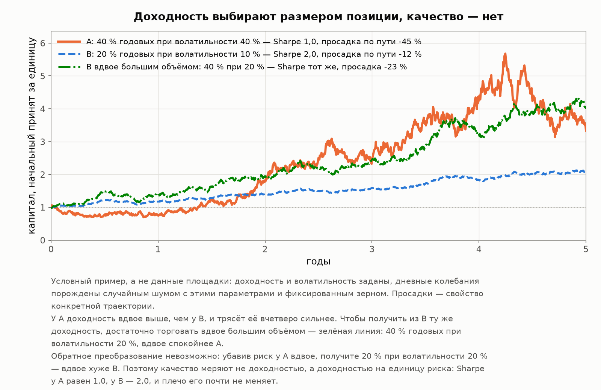

# Автоследование: введение к исследованию

[Лицензия](comon-story-license.md) · **Введение** · [1 — Площадка и витрина](comon-story-1-market.md) · [2 — Кладбище](comon-story-2-survival.md) · [3 — Из чего сделана доходность](comon-story-3-returns.md) · [4 — Продавцы](comon-story-4-authors.md) · [Интерлюдия — вторая площадка](comon-story-4b-interlude.md) · [5 — Покупатели](comon-story-5-buyers.md) · [Заключение](comon-story-6-conclusion.md)

*Исследование построено на полной популяции одной площадки — Comon (Финам). Здесь — как устроено автоследование и что оно такое юридически, откуда взяты данные и насколько они представительны для рынка, какими методами разобраны и что означают термины, которыми пользуются все пять глав. Читателю, которому привычна статистика, можно пропустить [словарь](#словарь-почему-везде-sharpe-а-не-доходность) — остальное понадобится.*

---

## О чём эта серия

Автоследование — сервис, где частный инвестор подписывается на торговую стратегию другого человека, и сделки автора автоматически повторяются на счёте подписчика. В России такие сервисы есть почти у каждого крупного брокера, и на витрине каждого видно от десятка до нескольких тысяч стратегий с доходностью, просадкой, рейтингом и числом подписчиков.

Но под одним словом уживаются **два разных бизнеса**, и различать их придётся с первой страницы.

**Маркетплейс частных авторов.** Стратегию заводит человек со стороны — площадка его не нанимает, а только допускает. Отсюда тысячи стратегий, конкуренция за место в рейтинге и возможность для любого желающего попробовать. Таких сервисов в России **два**: Comon у Финама и автоследование в Т-Инвестициях. Различаются они высотой порога: на Comon стратегию заводит любой клиент, у Т-Инвестиций автор подаёт заявку и проходит отбор, а каталог там несопоставимо меньше — сотни стратегий против почти двадцати тысяч в нашем архиве (площадка заявляет «более 400», её публичный каталог 09.08.2026 отдал 169 — подробнее в [интерлюдии](comon-story-4b-interlude.md)).

**Витрина стратегий самого брокера.** Стратегии ведут штатные управляющие или отобранные аналитики, их обычно меньше десятка, и попасть туда с улицы нельзя. Это по существу упакованное доверительное управление, которому автоследование даёт технический способ исполнения. Так устроены Fintarget у БКС, автоследование у Альфа-Инвестиций и Риком-Траста, «Интеллект» у ВТБ, pro.invest у АЛОРа.

Собственный сервис прорабатывает и Мосбиржа — в реестре аккредитованных программ её пока нет.

Всё, что эта серия говорит о продавцах — сколько стратегий приходится на автора, сколько попыток он делает и что происходит с популяцией стратегий, — относится **только к первой модели**. У витрины брокера популяции авторов нет вообще.

Мы изучали **Comon** — не потому, что он самый массовый (по числу подписчиков брокеры с большой розницей его обгоняют: отдельная стратегия в Т-Инвестициях собирает больше подписок, чем вся площадка Финама), а по двум другим причинам. Он **старейший**: площадка запущена в 2007 году, и первые ряды доходности в наших данных начинаются тогда же — 2007 год дал 27 стратегий, 2009-й уже 140, 2011-й 723. То есть в выборке лежит почти двадцать лет непрерывной истории. И он **единственный, кто держит архив закрытых стратегий открытым**. Это редчайшее свойство: обычно закрытая стратегия просто исчезает с витрины, и измерить по ней смертность невозможно в принципе.

Мы скачали **всю популяцию целиком — 19 978 стратегий за двадцать лет, включая 18 529 закрытых**, и пересчитали каждую метрику заново из дневных рядов доходности. Витрина показывает выживших; архив показывает, что происходит на самом деле.

Пять глав отвечают на пять вопросов:

1. **как устроен рынок и насколько можно верить тому, что на витрине**;
2. **что происходит со стратегией после запуска** — сколько живут и от чего умирают;
3. **из чего сделана показанная доходность** — сколько её бывает, откуда она берётся и предсказывает ли прошлое будущее;
4. **кто пишет эти стратегии** — сколько попыток делает автор и сколько стоит право показать лучшую;
5. **кто их покупает** — по каким признакам выбирают и что достаётся подписчику после платы.

Это описательное исследование, а не инвестиционная рекомендация и не претензия к площадке. Мы не оцениваем конкретные стратегии и не выносим суждений о конкретных людях. Имена авторов — точнее, ники их витрин — названы в двух местах, в главах 4 и 5, и только там, где речь идёт о публичной продаже услуги за плату: рядом с именем в этих таблицах стоят исключительно числа с открытых страниц, без ярлыков и оценок. Все числа — по состоянию на срез: дневные ряды доведены до 4 августа 2026 года включительно, каталог выгружен 5 августа.

**Правило, которого мы держимся во всех пяти главах: честно в обе стороны.** Там, где данные показывают плохую практику, мы называем её плохой прямо и с цифрами. Но там, где площадка или авторы делают что-то хорошо, мы говорим об этом так же отчётливо — не оговоркой мелким шрифтом. Обзор, в котором всё плохо, читателя не защищает: он просто не даёт отличить настоящую проблему от общего фона.

И сразу оговорка о границах: выводы получены на данных одной площадки. Что из них переносится на автоследование у других брокеров, а что нет, разобрано ниже отдельным разделом — с полным списком существующих площадок, с цифрами по размеру рынка и с оценкой точности наших собственных чисел.

---

## Что такое автоследование механически

Схема из трёх участников.

**Автор** ведёт стратегию на своём реальном брокерском счёте. Это не бэктест и не бумажная торговля: сделки настоящие, деньги свои. Именно поэтому данные Comon так ценны — это популяция реальных торговых систем, а не результаты моделирования.

**Площадка** транслирует сделки автора на счета подписчиков в масштабе их капитала, ведёт витрину и берёт плату.

**Подписчик** заводит свой счёт, выбирает стратегию, вносит сумму не ниже порога входа и получает копии сделок. Деньги остаются на его собственном счёте — он может отписаться в любой момент.

Ключевая деталь, определяющая всю экономику: **автор в 94 % случаев получает фиксированный процент от активов подписчика, а не долю прибыли**. Стандартный тариф — 6 % годовых от стоимости чистых активов, списывается непрерывно, независимо от результата. Он же ставится по умолчанию при создании стратегии, и сменить его можно только по индивидуальному решению площадки. Плату от прибыли — целиком или в комбинации — берут 66 стратегий из 19 977, то есть 0.3 %; ещё у сотни она предложена как альтернатива на выбор. Подробнее об этом в [главе 1](comon-story-1-market.md), а во что это обходится подписчику — в главе 5.

Второе, что важно понимать сразу: **дневной ряд доходности, который показывает витрина, — это результат счёта автора до платы за следование**. Комиссии брокера и проскальзывание самого автора в нём уже сидят, а тариф автоследования — нет.

И третье, о чём знают немногие подписчики. **Автоследование в России юридически — это инвестиционное консультирование.** [Базовый стандарт инвестиционного советника](https://cbr.ru/StaticHtml/File/17579/standart_17112023.pdf) относит к индивидуальным инвестиционным рекомендациям и «информацию, автоматизированным способом преобразуемую в поручение брокеру… посредством программы автоследования». Значит, автор стратегии — инвестиционный советник, и по [закону «О рынке ценных бумаг»](https://www.consultant.ru/document/cons_doc_LAW_10148/c7375c64b45cadae15697cffbee9601fadc60975/) он обязан действовать в интересах клиента, определить его инвестиционный профиль и давать рекомендации, этому профилю соответствующие; сами программы автоследования проходят обязательную аккредитацию, а [их реестр](https://naufor.ru/tree.asp?n=16673) публикует НАУФОР. Подписчик здесь — не покупатель информационной услуги, а клиент советника с законными правами. Подробный разбор регулирования, включая то, где для автоследования сделаны послабления, — в разделе 1.7 [главы 1](comon-story-1-market.md).

## Откуда данные

Публичный каталог Comon, выгруженный целиком, включая архивный раздел: на каждую стратегию карточка (даты, автор, тариф, порог входа, класс активов, рейтинг, счётчик подписчиков) и полный дневной ряд доходности со дня запуска.

| Что выгружено | Объём |
|---|---:|
| Стратегий всего | **19 978** |
| Из них живых на дату выгрузки | 1 448 (7.2 %) |
| Закрытых (архив) | 18 529 (**92.7 %**) |
| Статус установить не удалось | 1 |
| Стратегий с дневным рядом | 18 354 |
| Дневных точек суммарно | 6.2 млн |
| Из них торговых дней (с ненулевым движением) | 3.6 млн |
| Самая ранняя дата в рядах | 2005-11-01 |
| Последняя дата в рядах (срез данных) | 2026-08-04 |
| Дата выгрузки каталога | 2026-08-05 |
| Объём выгрузки | 330 МБ (ряды 247 МБ, карточки 80 МБ, каталог 3 МБ) |

Одна строка в таблице требует пояснения. У стратегии под номером 104812 **карточка не загрузилась**: сервер площадки трижды ответил ошибкой, повторный заход в конце выгрузки дал то же самое. Дневной ряд у неё есть — восемь точек и пять торговых дней в сентябре 2021 года, — а карточки нет, поэтому неизвестны ни автор, ни даты, ни статус. Мы не относим её ни к живым, ни к закрытым: во всех разрезах по статусу она просто отсутствует. Отсюда и расхождение на единицу, которое читатель заметит, если начнёт складывать числа: закрытых 18 529, а не 18 530.

**Главное свойство этой выборки — в ней есть мёртвые.** Любой обзор, построенный по видимой витрине, автоматически описывает только тех, кто дожил до момента наблюдения. Насколько это искажает картину, мы измерили в пунктах Sharpe (глава 3) — искажение составляет 0.2–0.3 пункта, то есть примерно половину типичной разницы между хорошей и посредственной стратегией.

## Насколько это исследование — про весь российский рынок

Вопрос законный: мы изучили одну площадку. Насколько выводы переносятся на автоследование в России вообще?

**Сколько всего площадок.** Здесь редкий для нашей темы случай: полный список известен точно. Автоследование — регулируемая деятельность, и программа, превращающая решение автора в поручение брокеру, обязана пройти аккредитацию саморегулируемой организации; реестр аккредитованных программ ведёт и публикует НАУФОР. На 10 июля 2026 года в нём **23 действующие программы, из них 12 с функцией автоследования**. Больше легально работающих сервисов в стране быть не может — это весь рынок:

| Программа в реестре НАУФОР | Чей сервис | Аккредитована | Модель |
|---|---|---|---|
| Comon, версия 98.0 | **Финам** | 26.04.2019 | **маркетплейс авторов** |
| РТ-автоследование | Риком-Траст | 19.07.2019 | витрина брокера |
| «Октан.Алготрейдинг» | Октан-Брокер | 09.08.2019 | небольшая инвесткомпания |
| ФИНИС / AISFin Core, версия 9.5 | частный разработчик | 11.05.2021 | лицензируется советникам |
| ФИНИС Комплекс / AISFin Complex | ООО «ФИНИС» | 25.08.2021 | то же |
| «Т-Автослед», версия 1.0 | **Т-Инвестиции** | 29.10.2021 | **маркетплейс с отбором** |
| FinTarget, версия 2.0 | БКС | 17.12.2021 | витрина брокера |
| «Стратегия автоследования», версия 1.0 | Альфа-Банк | 24.07.2024 | витрина брокера |
| «FollowMe.app», версия 1.0 | АЛОР Брокер (сервис pro.invest) | 21.10.2024 | витрина брокера |
| «Хищник», версия 3.0 | ИК «Хамстер-Инвест» | 14.03.2025 | небольшая инвесткомпания |
| «Интеллект», версия 1.0 | ВТБ Мои Инвестиции | 17.11.2025 | витрина брокера |
| «Копитрейдинг» (системное имя FollowMe) | установить не удалось | 10.07.2026 | неизвестно |

*Колонки «правообладатель» в реестре нет: он называет только программу, функционал и дату. Принадлежность каждой строки установлена отдельно — по сообщениям НАУФОР об аккредитации и по раскрытию информации самих компаний (ссылки — в источниках). Одну программу привязать к компании не удалось: «Копитрейдинг» аккредитован 10 июля 2026 года, публичного сервиса с таким названием пока нет — рынок продолжает пополняться.*

Из таблицы видно три вещи. Во-первых, **маркетплейсов ровно два**, и наши 19 978 стратегий — одна из двух существующих популяций такого рода; всё остальное — витрины на несколько стратегий. Во-вторых, состав рынка нельзя прочитать по сайтам: прежний портал автоследования АЛОРа (`followme.alor.ru`) не открывается, а старая программа «FOLLOW ME» отозвана из реестра в мае 2025 года — но сервис не закрылся, он переехал в приложение под названием pro.invest и работает по новой программе, аккредитованной в октябре 2024-го. Судить о рынке по витринам компаний — тот же способ ошибиться, каким ошибается инвестор, глядящий на витрину стратегий. В-третьих, **сервисы моложе, чем кажется**: половина программ аккредитована после 2024 года, то есть история автоследования у большинства площадок короче трёх лет — и совпадает с растущим рынком.

Модель площадки определяет и то, как берут деньги. У витрины брокера тариф комбинированный: Альфа-Инвестиции берут 1.8–3.5 % годовых от активов **плюс** 10–20 % прибыли, причём с явным high-water mark — комиссию за успех списывают, только если счёт превысил прежний максимум. На Comon плату, привязанную к результату, имеют 66 стратегий из 19 977 — 0.3 %; остальные получают процент от активов независимо от того, заработал автор или потерял. Почему это устроено именно так и к чему приводит — [глава 1](comon-story-1-market.md) и глава 5.

**Что известно о размерах рынка.** Сводной статистики по автоследованию Банк России не публикует, поэтому картину приходится собирать из разрозненных сообщений:

| Показатель | Значение | Источник, дата |
|---|---:|---|
| Активы копи-трейдеров в России | ~24.8 млрд ₽ | РБК/НАУФОР, февраль 2021 |
| Клиентов Comon | «более 30 тыс.» | там же, май 2021 |
| Подписок на Comon сегодня (наши данные) | **13 430** | срез 05.08.2026 |
| Живых стратегий на Comon (наши данные) | **1 448** | срез 05.08.2026 |
| Активы под подписками Comon, оценка снизу | ~3.9 млрд ₽ | наш расчёт: подписки × порог входа |
| Стратегий в каталоге Т-Инвестиций | заявлено «более 400», **видно 169** | Т-Банк, 2026 / наш срез 09.08.2026 |
| Подписок на все стратегии Т-Инвестиций (наши данные) | **377 877** | срез 09.08.2026 |
| Подписчиков у **одной** стратегии Т-Инвестиций | 31 000 и 25 731 у двух крупнейших | Т-Банк, 2026 |

Из этого следует неприятная для нашего заголовка вещь: **по числу подписок Comon сегодня — далеко не главный игрок**. Две самые популярные стратегии одного конкурента собрали 56 731 подписку — вчетверо больше, чем вся площадка Финама. Более того, сопоставление с 2021 годом («более 30 тыс. клиентов») намекает, что аудитория Comon за пять лет скорее сократилась, чем выросла, — хотя единицы счёта в источниках разные (клиенты против подписок), и уверенно утверждать это нельзя.

Зато **по числу стратегий наша выборка — крупнейшая доступная**: 19 978 против сотен в каталоге ближайшего конкурента. И она единственная, где есть мёртвые.

*Про «более 400» стоит сказать точнее, потому что дальше в серии есть [интерлюдия](comon-story-4b-interlude.md), целиком построенная на каталоге Т-Инвестиций. Число «более 400» — заявление самой площадки на странице сервиса. Мы выгрузили её публичный каталог 9 августа 2026 года и получили **169 стратегий**; проверка девятью разными наборами параметров запроса — другие лимиты страницы, сортировки, фильтры по уровню риска — каждый раз давала те же 169. Разницу мы объяснить не можем и не додумываем: возможно, заявленное число включает стратегии, недоступные анонимному посетителю, возможно — оно устарело. Дальше мы работаем с тем, что видно, и оговариваем это там, где это влияет на выводы.*

**Что это значит статистически.** Наши данные — не выборка, а **перепись**: взята вся популяция площадки, а не случайная её часть. Поэтому обычная погрешность выборки здесь почти нулевая:

| Оценка | Значение | 95 % интервал |
|---|---:|---|
| Доля стратегий на тарифе 6 % | 94.0 % | ±0.33 пп |
| Доля доживших до трёх лет | 11.7 % | ±0.55 пп |
| Доля держащих Sharpe ≥ 1.5 на трёх годах | 4.0 % | ±0.95 пп |
| Доля превысивших Sharpe 2.0 на пяти годах | 0 из 697 | не выше 0.43 % |

Иначе говоря, **источник неопределённости в этой серии — не количество данных, а перенос с одной площадки на другие**. Сколько бы мы ни собрали строк, они не расскажут о правилах Т-Инвестиций.

**Что переносится и что нет.** Разделим честно.

*Переносится почти наверняка* — всё, что определяется рынком и арифметикой, а не регламентом конкретного сервиса: сколько живут торговые стратегии, какой Sharpe достижим на российском рынке, насколько прошлый результат предсказывает будущий, сколько стоит перебор вариантов, как работает регрессия к среднему и ошибка выжившего. Авторы стратегий — те же самые частные трейдеры, рынок — та же Московская биржа, издержки и налоги одинаковые.

*Не переносится* — всё, что задано правилами площадки: уровень тарифа, порядок его назначения, условия допуска к плате за результат, набор разрешённых инструментов. Такие выводы мы каждый раз помечаем как относящиеся к Comon, а в разделе 1.6 главы 1 сравниваем с другими площадками напрямую.

*Переносится только на площадку той же модели* — всё, что сказано о продавцах в главе 4: сколько стратегий заводит один человек, сколько попыток стоит за показанной лучшей, как перебор вариантов сам по себе рождает красивый результат. Это свойства **открытого маркетплейса**, где автора не нанимают, а допускают. Единственный сервис в России, к которому эти выводы применимы помимо Comon, — автоследование в Т-Инвестициях; к витрине из десяти стратегий штатных управляющих они неприменимы вовсе, там нет самого предмета — популяции авторов.

*Переносится с оговоркой* — уровни смертности и качества. Здесь есть два смещения, и они действуют в разные стороны:

- **Comon либеральнее к авторам.** Стратегию может завести любой клиент, тариф назначается автоматически, никакого отбора на входе нет — отсюда 27.7 % архива, не совершившего ни одной сделки. На площадке, где автор обязан быть квалифицированным инвестором, доля мусора будет ниже, а выживаемость выше. То есть наши оценки смертности — скорее **верхняя граница** рынка.
- **Comon старше и пережил больше.** Двадцать лет истории включают 2014, 2020 и 2022 годы; у конкурентов сервисы моложе, и их статистика собрана в основном на более спокойном отрезке. Это тянет в противоположную сторону: их благополучие может быть эффектом короткой памяти.

**Вывод.** Эта серия — исследование одной площадки, самой старой и единственной с открытым архивом. Утверждения о механике сервиса относятся к ней. Утверждения о поведении авторов — к открытым маркетплейсам, каких в России два. Утверждения о том, как ведут себя торговые стратегии сами по себе, почти наверняка описывают рынок целиком — но проверить это на данных других площадок нельзя, потому что они своих мёртвых не показывают.

## Как мы считали

Первое правило исследования: **ни одна метрика не берётся с витрины**. Всё пересчитано из дневных рядов — доходность, волатильность, Sharpe, просадка, скос. Поля карточки используются только для сверки и для того, чего в рядах нет (тариф, автор, даты, порог входа). Причины разобраны в [главе 1](comon-story-1-market.md); коротко: у закрытых стратегий расчётные поля карточки обнулены, а показатель, поданный на витрине как «прогнозируемая просадка», просадкой не является.

Дальше применялись стандартные методы, каждый под свой вопрос:

| Метод | Что отвечает | Где |
|---|---|---|
| Кривые дожития (Каплан—Мейер) | Сколько стратегий доживает до 1, 3, 5 лет. Тот же аппарат, что в медицине для выживаемости пациентов | Глава 2 |
| Конкурирующие риски (Аален—Йохансен) | Какая доля умирает **от чего именно**: разорение, деградация, уход автора | Глава 2 |
| Регрессия Кокса | Какие признаки, видимые заранее, связаны с продолжительностью жизни | Глава 2 |
| Блочный бутстрап и поиск точки разлома (CUSUM с перестановочным тестом) | Сломалась стратегия или просто просела: была ли финальная просадка выходом за пределы её собственной истории и сменился ли режим | Глава 2 |
| Квинтильный дизайн (Кархарт) | Предсказывает ли прошлый результат будущий. Классическая схема из исследований взаимных фондов | Глава 3 |
| Регрессия на индекс и метод главных компонент | Сколько в доходности стратегий — просто движение российского рынка | Главы 3 и 5, заключение |
| Естественный эксперимент на «близнецах» | Что даёт увеличение риска. Найдены 362 пары, где обе стратегии принадлежат одному автору и ходят почти синхронно — та же логика, но разная агрессивность | Глава 3 |
| Симуляция перебора | Насколько лучший результат автора лучше его среднего просто по статистике, без всякого мастерства | Глава 4 |
| t-статистика Sharpe (формула Lo) | Отличим ли результат от везения. Наивный вариант без поправки вдвое завышает счёт «достоверных» | Главы 4 и 5, заключение |
| Коэффициент Джини | Насколько неравномерно распределены подписки — между стратегиями и между авторами | Главы 4 и 5 |
| Иерархическая кластеризация (Ward) с проверкой устойчивости | Есть ли в популяции естественные группы: типы серийных авторов и группы, в которых лежат подписки. Устойчивость проверяется силуэтом и индексом Рэнда | Главы 4 и 5 |
| Эффективное число независимых наблюдений | Сколько по-настоящему разных попыток стоит за k стратегиями одного автора и сколько разных ставок — за полутора тысячами витрины | Главы 4 и 5 |
| Ранговые корреляции (Спирмен), а к ним — частные | Связаны ли между собой две величины, если сравнивать не значения, а порядок; и остаётся ли связь популярности с качеством, когда убрано влияние доходности и возраста | Ранговые — главы 3–5 и интерлюдия, частные — глава 5 |
| Ранговая регрессия с кластерно-робастными ошибками | Что решает популярность, когда все признаки учтены сразу; поправка на то, что стратегии одного автора не независимы | Глава 5 |
| Контрольный эксперимент с прореживанием рядов | Сколько стоит то, что вторая площадка отдаёт кривые не по дням: смещение измерено на рядах Comon | Интерлюдия |
| Модельный пассивный портфель с годовой ребалансировкой | С чем сравнить витрину человеку, который может обойтись без неё вовсе | Заключение |

Технические правила, вытекающие из устройства данных (аннуализация по календарю, определение даты смерти, что можно и чего нельзя брать из карточки), собраны в приложении к [главе 1](comon-story-1-market.md) — они одинаковы для всех частей серии. Ещё одно такое правило, фильтр измеримости, определено ниже, в словаре: оно задаёт выборку глав 3 и 4, а также часть расчётов главы 5 и интерлюдии.

## Словарь: почему везде Sharpe, а не доходность

Это самый важный абзац введения. Без него дальнейшие числа читаются неправильно.

**Годовая доходность (CAGR)** — темп роста капитала в год с учётом сложного процента. Не средняя арифметическая: если за год стратегия потеряла 50 %, а за следующий заработала 50 %, среднее арифметическое даст 0 %, а на счёте останется 75 % от исходной суммы. Все годовые доходности в этой серии — именно CAGR.

**Волатильность** — насколько сильно результат «трясёт» изо дня в день, в пересчёте на год. Волатильность 10 % означает, что типичное отклонение годового результата от среднего — около десяти процентных пунктов. Банковский вклад имеет волатильность ноль, отдельная акция — 30–60 %.

**Почему одной доходности недостаточно.** Любую стратегию можно сделать вдвое доходнее, не улучшив в ней ничего: достаточно торговать вдвое большим объёмом. Вместе с доходностью вырастет и риск. Поэтому «40 % годовых» само по себе не говорит ни о качестве, ни о мастерстве — только о выбранном размере позиции.

Простой пример. Две стратегии:

| | Доходность | Волатильность | Просадка |
|---|---:|---:|---:|
| A | 40 % годовых | 40 % | −45 % |
| B | 20 % годовых | 10 % | −12 % |

*(Пример условный, безрисковая ставка для наглядности не вычитается.)*

A выглядит вдвое привлекательнее. Но чтобы получить из B такую же доходность, достаточно взять двойное плечо — и получится 40 % при волатильности 20 %, то есть вдвое спокойнее, чем A. Обратное преобразование невозможно: убавив риск у A, вы получите 20 % при волатильности 20 % — вдвое хуже B. **Качество стратегии — это не доходность, а доходность в расчёте на единицу риска.**

**Коэффициент Шарпа (Sharpe)** ровно это и измеряет: доходность, делённая на волатильность (в строгой версии — доходность сверх безрисковой ставки). У стратегии A он равен 1.0, у B — 2.0. Плечо его почти не меняет — именно поэтому Sharpe и стал стандартной мерой. Ориентиры: 0 — вы ничего не заработали сверх риска; 0.5 — типичный результат широкого рынка акций на длинном горизонте; 1.0 — хороший результат; 2.0 — очень редкий. Насколько редкий, видно по нашим данным: **среди 697 стратегий с пятилетней историей планку 2.0 не перешагнул никто** (глава 3).

Оговорка, о которой обычно молчат: «плечо не меняет Sharpe» верно в теории. На реальных данных мы это измерили. В популяции нашлись 362 пары «близнецов»: две стратегии принадлежат одному человеку и повторяют друг друга почти день в день, но одна ведётся агрессивнее другой. Сравнение внутри таких пар показывает, что удвоение риска обходится примерно в **0.15 пункта Sharpe**. Немного, но не ноль (глава 3).

**Коэффициент Сортино** — та же идея, что у Шарпа, но в знаменателе только «плохая» половина колебаний: движения вниз. Логика простая — инвестору мешают не любые колебания, а убыточные, резкий рост риском не является. У одной и той же стратегии Сортино поэтому всегда выше Шарпа, а разрыв между ними тем больше, чем несимметричнее её результат: стратегия, которая растёт рывками и падает плавно, по Сортино выглядит заметно лучше. Из этого следует правило чтения: сравнивать можно только однотипные величины — Сортино с Сортино, Шарп с Шарпом; числа из разных семейств рядом не ставятся.

**Максимальная просадка** — самое глубокое падение от достигнутого пика до последующего дна. Это то, что подписчик реально переживает: −50 % означает, что в какой-то момент половина денег исчезла со счёта, и надо было не выйти. Просадка связана с волатильностью, но к ней не сводится: она зависит ещё и от того, как убытки выстроились во времени. Именно её глубина и длительность определяют, сколько нужно продержаться, чтобы дождаться восстановления.

**CVaR** — средний убыток в худших днях. Берут заранее заданную долю самых плохих дней и усредняют убыток по ним; получается ответ на вопрос «а если день выдастся совсем скверным, сколько я потеряю в среднем». От максимальной просадки эта величина отличается принципиально, и путать их нельзя: просадка **накапливается** за много дней подряд, от пика до дна, а CVaR описывает **один день**. Поэтому по масштабу CVaR в разы меньше, и подавать его как ожидаемую просадку — значит занижать риск в несколько раз. Ровно это делает витрина Comon, где поле подписано «прогнозируемая просадка»: как мера риска оно работает исправно (с настоящей просадкой связано на 0.910, то есть ранжирует стратегии по рискованности почти верно), но по величине вводит в заблуждение — −18 % против реальных −47 % (глава 1, раздел 1.3). Какое окно и какую долю худших дней берёт площадка, она не раскрывает. Полное название — conditional value at risk, «условная стоимость под риском»; в литературе та же величина встречается под именем expected shortfall.

**Время под водой** — сколько счёт стоит ниже прежнего максимума: не глубина ямы, а её длительность. Величина отдельная от просадки и не выводимая из неё: одна и та же яма в −40 % может занять четыре месяца, а может четыре года. Считается двумя способами, и оба встречаются в серии: доля дней ниже прежнего пика за всю историю и самый долгий такой отрезок подряд. На витринах не показывают ни того, ни другого.

**MAR** — годовая доходность, делённая на глубину худшей просадки. Отвечает на вопрос «какую долю своего худшего провала стратегия зарабатывает за год», и из него прямо следует то, что важно подписчику: **сколько лет ждать восстановления**. Для типичной для витрины ямы в −40 % это выглядит так: MAR 1.0 — полтора года до возврата к прежнему уровню, 0.5 — около трёх лет, 0.12 (медиана живых стратегий, глава 3) — около одиннадцати. Сроки длиннее, чем кажется по самой дроби, потому что выход из просадки нелинеен: чтобы отыграть падение на 40 %, капитал должен вырасти не на 40, а на 67 %. Название пришло из отраслевых отчётов по управляемым счетам и означает ту же дробь, что известный по западным публикациям **коэффициент Кальмара** (Calmar); разница только в окне — Кальмар традиционно считают на трёх последних годах, MAR — по всей доступной истории. В этой серии везде MAR по всей истории стратегии.

**Бета (β) и альфа (α)** — разложение результата на две части: ту, что объясняется движением рынка, и ту, что осталась сверх него. Бета — чувствительность к индексу: 1.0 означает «ходит с рынком один в один», 0.5 — «вдвое спокойнее рынка», 0 — «от рынка не зависит», отрицательная — «идёт против рынка». Альфа — то, что стратегия принесла сверх своей рыночной части, в процентах годовых. Различать их важно по денежной причине: бету можно купить за копейки индексным фондом, и платить процент от активов имеет смысл только за альфу. Альфа бывает и отрицательной — тогда подписчик получил меньше, чем дал бы простой индексный фонд с тем же уровнем риска.

**Скос и эксцесс** — две характеристики формы распределения дневных результатов. **Скос** (асимметрия) показывает, в какую сторону вытянут хвост: отрицательный означает «много мелких прибылей и редкие крупные убытки», положительный — обратное. **Эксцесс** показывает, насколько тяжелы хвосты, то есть насколько чаще случаются экстремальные дни, чем предполагает привычная колоколообразная кривая; у неё эксцесс равен нулю, а типичные для рынка значения в десятки означают, что редкие огромные движения — норма, а не аномалия. Обе величины считаются по всему ряду целиком, поэтому уже случившийся обвал портит их задним числом: на этом основана ловушка, разобранная в [главе 3](comon-story-3-returns.md).

**Медиана против среднего.** Медиана — значение «серединной» стратегии: половина хуже, половина лучше. Среднее на таких данных бесполезно: одна стратегия с итогом +2 877 000 % (есть и такая) сдвигает среднее по всей популяции. Везде, где не сказано иначе, мы приводим медианы и перцентили.

**Перцентиль** — доля популяции ниже данного значения. «90-й перцентиль» = лучше девяти из десяти. Когда популяцию делят на равные по численности группы, их называют по числу частей: пять групп — **квинтили**, десять — **децили**. Первый квинтиль — самая слабая пятая часть, пятый — самая сильная. В таблицах серии перцентили обозначены коротко: **p10** — десятый перцентиль, **p90** — девяностый.

**Коэффициент Джини** — мера неравенства, от 0 до 1. Ноль означает, что величина поделена между всеми поровну; единица — что всё досталось одному. Для ориентира: неравенство доходов между людьми измеряется в странах значениями 0.25–0.55. Значения выше 0.9, которые встретятся в главе 4, описывают распределение, где говорить о «типичном» участнике уже бессмысленно.

**Ранговая корреляция (ρ)** — мера связи двух величин от −1 до +1, устойчивая к выбросам. Калибровка для этих данных: 0.1 — почти ничего, 0.3 — заметная связь по меркам витрины, 0.5 — сильная, 0.9 и выше — практически одно и то же, измеренное дважды. **Корреляция не означает причину.**

**t-статистика** — насколько результат отличается от случайного совпадения. Правило: |t| больше 2 — вряд ли случайность, меньше 2 — считать доказательством нельзя.

**p-значение (p)** — та же мысль с другой стороны: вероятность увидеть найденную связь, если на самом деле её нет. Чем меньше, тем труднее списать результат на случай; общепринятая граница — 0.05. В серии p встречается рядом со связями, которые мы называем нулевыми: «p = 0.86» означает, что такая связь возникала бы случайно в восьми с половиной случаях из десяти, то есть не говорит ни о чём.

**Персистентность** — повторяемость результата во времени: сохраняет ли стратегия, показавшая хороший результат в прошлом периоде, своё преимущество в следующем. Вопрос практический, а не теоретический: именно на персистентности держится всякий выбор по прошлым числам. Меряется тем, что стратегии ранжируют по прошлому окну, делят на группы и смотрят, что было дальше (раздел 3.7).

**Ошибка выжившего** — систематическое завышение, возникающее, когда неудачники исчезают из выборки. Витрина автоследования — её чистый пример: закрытые стратегии из каталога уходят. Цена вопроса измерена в главе 3 и составляет 0.2–0.3 пункта Sharpe.

**Денежный рынок** — точка отсчёта. За период сравнения (октябрь 2022 — август 2026) безрисковая ставка в рублях составляла в среднем **14.7 % годовых**. Стратегия, дающая 12 % с просадками, проигрывает депозиту, даже если на витрине её доходность зелёная.

**Фильтр измеримости** — условие, при котором метрики стратегии вообще что-то значат: **не меньше 100 торговых дней истории и активность не ниже 10 %**, то есть стратегия что-то делала хотя бы каждый десятый день. На стратегии, торговавшей три недели, любая доходность и любой Sharpe — шум, и считать по ней распределения нельзя. Через фильтр проходят 6 320 стратегий; на них построена глава 3. Глава 4 применяет ту же мерку к популяции без служебного аккаунта площадки, поэтому база там своя — 5 619 стратегий. Название стоит понимать буквально: фильтр отбирает по **измеримости, а не по качеству** — убыточные стратегии остаются в выборке полностью, потому что отбор по результату испортил бы ровно то распределение, которое мы изучаем.

## Чего в данных нет

Честный список ограничений, которые нельзя обойти никакой обработкой:

- **Подписчиков как людей.** Есть только счётчик подписок на стратегию. 13 430 подписок — это не 13 430 человек: один инвестор может быть подписан на несколько стратегий. Сегментировать подписчиков принципиально невозможно.
- **Сумм на счетах.** Ни одной. Единственный денежный признак в данных — минимальный порог входа стратегии, то есть граница снизу. Поэтому все рублёвые величины серии (3.94 млрд ₽ под подписками, 236 млн ₽ платы в год) — оценки снизу, а любая доля «где лежат деньги» верна лишь при допущении, что счёт равен порогу.
- **Истории подписок.** API отдаёт только текущий срез (проверено семью эндпойнтами — все возвращают 404). Поэтому нигде в серии нет причинности вида «после просадки подписчики ушли»: мы видим состояние, а не движение.
- **Счётчика подписчиков у закрытых стратегий.** Он обнулён при архивации: у 18 517 из 18 529 архивных он равен нулю, максимум по всему архиву — 4, против 945 у живых. Проверить гипотезу «умирают те, за кем не пошли деньги» на этих данных нельзя.
- **Издержек самого подписчика.** Комиссия его брокера и проскальзывание при копировании в данных отсутствуют полностью. Поэтому все чистые доходности в главе 5 — верхняя граница того, что достаётся подписчику.
- **Состава сделок.** Мы видим дневную доходность, но не позиции. Что именно делает стратегия внутри — неизвестно, и мы нигде об этом не рассуждаем.

## Почему это не научная публикация

Дальше будет много чисел, таблиц и статистических методов с фамилиями авторов в названиях. Это не делает работу научной, и мы говорим об этом сразу, до первой главы. Научность — не свойство оформления, а институт проверки: набор процедур, через которые текст проходит прежде, чем ему начинают верить. Через них эта серия не проходила. Вот чего в ней не хватает — по пунктам, чтобы читатель мог сам взвесить, насколько сильно это его волнует.

- **Рецензирования.** Ни данные, ни расчёты, ни выводы не проверял никто посторонний. Ошибка в коде или в определении величины ловится здесь только нами самими — а автор своих пропусков не видит, и мы в этом уже убеждались по ходу работы не раз.
- **Полной открытости данных.** Здесь половина требования выполнена, а половина невыполнима. Код открыт весь: в [репозитории серии](https://github.com/Oppositus/comon-story) лежат скрипты, которыми посчитана каждая таблица и нарисован каждый график, вместе с расчётными наборами, из которых берутся числа, — прогнав их, читатель получит ровно то, что напечатано. А первичные ряды — карточки и дневная доходность всех стратегий — не выложены: каталог площадки является её базой данных, и раздавать копию мы не вправе. Их собирают заново нашим же скриптом или запрашивают у нас. И даже тогда **точного повторения не выйдет в принципе**: каталог живой, стратегии закрываются, счётчики обнуляются, и выгрузка следующего года даст другую популяцию.
- **Заранее заявленных гипотез.** Мы смотрели на данные, а потом формулировали вопросы, — а не наоборот. Это тот самый механизм, из-за которого в [главе 4](comon-story-4-authors.md) приходится уценивать лучший результат автора: чем больше вопросов задано одному набору данных, тем вероятнее, что какой-то из ответов красив случайно. Поправку на перебор мы применяем к авторам площадки. **К себе — нет**, во всяком случае не систематически: сколько всего разрезов было просмотрено по ходу работы, точно не считал никто.
- **Повторения на других данных.** Одна площадка, одна страна, один период. Сравнение со второй площадкой в [интерлюдии](comon-story-4b-interlude.md) повторением не является: там нет архива закрытых стратегий, то есть нет главного, на чём стоит эта работа.
- **Причинности.** Везде, где сказано «связано», имеется в виду совместное появление признаков в один момент времени. Ни эксперимента, ни подходящего естественного опыта, ни истории решений у нас нет — поэтому фраз вида «подписчики выбрали X, потому что Y» в серии не будет.
- **Модели.** Мы описываем, что происходит, но не строим объяснения, из которого следовали бы проверяемые предсказания на будущее. Проверить нас можно будет только временем — новой выгрузкой через год.
- **Формального раскрытия.** В научной статье полагается указать финансирование и конфликт интересов. Скажем прямо: мы не связаны ни с одной из упомянутых площадок, ничего от них не получали и данные брали с открытых страниц без какого-либо доступа изнутри.

Честность требует сказать и обратное — что сделано по правилам, принятым в исследованиях. Мы работаем не с выборкой, а с **переписью**: взяты все стратегии каталога, а не удобные. Ни одна метрика не взята с витрины — всё пересчитано из первичных рядов. Каждое число порождается скриптом и воспроизводится повторным прогоном, а не переносится в текст руками, — и этот скрипт теперь лежит в открытом доступе, так что проверять нас можно не на слово. Критерии, по которым что-то признаётся достоверным, заданы до подсчёта, а не подобраны под результат. У каждой главы ограничения вынесены первым разделом приложения — раньше таблиц, а не после них. А там, где число зависит от выбранного соглашения — порога, окна, правила отбора, — соглашение названо рядом с числом.

Правильная рамка чтения такая: **это добросовестный разбор данных, а не доказанный факт**. Величины здесь стоит принимать как порядок и направление — «смертность высокая», «потолок Sharpe около двух», «тариф забирает треть», — а не как измерения с гарантированной точностью до десятых.

---

---

# Источники

**Первичные данные — основа всех расчётов серии**

- Публичный каталог автоследования Comon, [www.comon.ru](https://www.comon.ru/strategies/): каталог живых и архивных стратегий, карточка и дневной ряд доходности по каждой. Выгрузка 5 августа 2026 года, ряды доведены до 4 августа включительно, 19 978 стратегий. Все метрики пересчитаны нами из этих рядов; поля карточки используются только там, где это оговорено явно.
- [Публичный каталог автоследования Т-Инвестиций](https://www.tbank.ru/invest/strategies/): карточка и кривая доходности по каждой стратегии, выгрузка 9 августа 2026 года, 169 живых стратегий. Вторая площадка нужна одной части серии — [интерлюдии](comon-story-4b-interlude.md), где живые стратегии двух маркетплейсов считаются одним кодом. Архива закрытых стратегий у Т-Инвестиций нет, поэтому всё остальное на этих данных построить нельзя.

**Внешние данные**

Все ряды ниже выгружены у первоисточника, а не взяты из ответов площадок: внутри карточек Comon серии бенчмарков приходят пустыми.

- **Индекс МосБиржи (IMOEX)** и **индекс полной доходности MCFTR** — дневные значения с 2005 года, [ISS MOEX](https://iss.moex.com/iss/history/engines/stock/markets/index/boards/SNDX/securities/IMOEX.json) ([MCFTR](https://iss.moex.com/iss/history/engines/stock/markets/index/boards/SNDX/securities/MCFTR.json)). Нужны там, где измеряется, сколько в доходности стратегии — просто движение рынка: бета и метод главных компонент в [главе 3](comon-story-3-returns.md), проверка «не индекс ли это под другим именем» в [заключении](comon-story-6-conclusion.md).
- **Ставка денежного рынка — индекс RUSFAR** Московской биржи, [ISS MOEX](https://iss.moex.com/iss/history/engines/stock/markets/index/boards/MMIX/securities/RUSFAR.json) (доступен с 9 января 2019). Безрисковая точка отсчёта: средняя за период сравнения 14.7 % годовых. Используется в главах 3 и 5 и в заключении.
- **Дневные цены паёв биржевых фондов EQMX, OBLG, GOLD, LQDT** — [Московская биржа](https://www.moex.com/), рублёвые режимы торгов, выгрузка 10 августа 2026 года; для сопоставимости взяты склейки с предшествующими тикерами тех же фондов. Из них собран пассивный эталон — «Портфель лежебоки» и «Лежебока плюс» — в [заключении](comon-story-6-conclusion.md). Концепция портфеля — [assetallocation.ru](https://assetallocation.ru/lezheboka/), Сергей Спирин.
- **Числа клиентских баз брокеров** — [финансовые результаты Т-Технологий за IV квартал 2025 года](https://www.tbank.ru/about/news/19032026-t-technologies-announces-ifrs-financial-results-for-4q-2025/) (9.7 млн клиентов Т-Инвестиций) и [годовые отчёты «Финама»](https://www.finam.ru/landing/annual-report-2024/) за 2024 и [2025](https://www.finam.ru/landing/annual-report-2025/) (более 540 тыс. клиентов, рост базы на 15 %). Нужны в интерлюдии, чтобы отделить разницу спроса от разницы размеров брокеров.

Публикации перечислены там, где используются: методы оценки персистентности — в источниках [главы 3](comon-story-3-returns.md), литература о переборе и поправке на него — [главы 4](comon-story-4-authors.md), регуляторные обзоры и академические работы о спекулянтах — [заключения](comon-story-6-conclusion.md).

**Ландшафт площадок автоследования**

- [Реестр аккредитованных программ](https://naufor.ru/tree.asp?n=16673) — НАУФОР, версия от 10.07.2026. Исчерпывающий перечень программ автоконсультирования и автоследования, допущенных к работе в России, вместе с листом отозванных аккредитаций (там же — отзыв программы «FOLLOW ME» 16.05.2025 по заявлению ООО «Алор +»). Отсюда взяты состав рынка и даты аккредитации.
- [Аккредитация программ автоконсультирования и автоследования](https://naufor.ru/tree.asp?n=16666) — НАУФОР: порядок аккредитации по Указанию Банка России № 4980-У.

  *Принадлежность программ компаниям (реестр её не указывает) установлена по следующим источникам:*
- [Программное обеспечение для инвестиционного консультирования](https://cdn-lpbr01.finam.ru/lpbr-content-repository/PO_dlya_invest_konsultirovaniya_01_04_2024_b8c4a8ff93.pdf) — раскрытие «Финама»: Comon, аккредитация 26.04.2019.
- [Аккредитация программы FinTarget](http://naufor.ru/tree.asp?n=17689) — НАУФОР: разработчик и правообладатель ООО «Компания БКС». [Аккредитация «Октан.Алготрейдинг»](http://naufor.ru/tree.asp?n=17497) — АО «Октан-Брокер». [Аккредитация «FOLLOW ME»](https://naufor.ru/tree.asp?n=20389) — ООО «Алор +» (программа с тех пор заменена).
- [pro.invest](https://www.alorbroker.ru/investment/pro-invest) — АЛОР Брокер: «предоставление ИИР осуществляется посредством программы „FollowMe.app“ версия 1.0, аккредитована НАУФОР 21.10.2024»; к платформе допускаются аналитики, отобранные комитетом компании.
- [Положение об определении инвестиционного профиля клиента — физического лица](https://alfabank.servicecdn.ru/site-upload/5f/24/2366/POLOJENIE_ob_opredelenii_investicionnogo_profilya_klienta_8.pdf) — АО «Альфа-Банк»: программа автоконсультирования и автоследования «Стратегия автоследования», версия 1.0, аккредитована НАУФОР.
- [Инвестиционное консультирование](https://hamster-invest.ru/investicionnoe-konsultirovanie/investment-consulting/) — ИК «Хамстер-Инвест»: рекомендации предоставляются программой «Хищник», аккредитованной НАУФОР.
- [Свидетельство о регистрации программы «ФИНИС Комплекс / AISFin Complex»](https://www1.fips.ru/registers-doc-view/fips_servlet?DB=EVM&DocNumber=2021617247&TypeFile=html) — реестр Роспатента: правообладатель ООО «Финансовые Интеллектуальные Системы».
- [Как работает автоследование в Альфа-Инвестициях](https://smart-lab.ru/company/alfa_investments/blog/1050425.php) — Альфа-Инвестиции: семь стратегий, тариф 1.8–3.5 % годовых от активов плюс 10–20 % прибыли, комиссия за успех по принципу high-water mark.
- [ВТБ запустит сервис автоследования](https://www.rbc.ru/quote/news/article/675052ff9a794710b6f06745) — РБК Инвестиции: планы по сервису на базе робота-советника, ставшему затем программой «Интеллект».
- [Мосбиржа подключает автоследование](https://www.kommersant.ru/doc/6594859) — «Коммерсантъ» от 26.03.2024: Comon как крупнейший сервис, Финам оказывает услугу больше десяти лет, планы биржи по собственному сервису.
- [Автоследование в Т-Инвестициях: как устроена система](https://www.tbank.ru/invest/help/brokerage/account/strategy/about/) и [топ стратегий по числу подписчиков](https://www.tbank.ru/invest/social/profile/T-Investments/1c37943f-0531-4aeb-8705-4fc7e66fefa6/) — Т-Банк.
- [Сравнение брокеров по автоследованию](https://allfinancelinks.com/brokers_rating/brokers-autotrading) — сводка сервисов, тарифов и порогов входа (Comon, Fintarget/БКС, Follow Me/АЛОР, Т-Инвестиции). Данные по Follow Me — исторические, сервис закрыт.
- [Что такое автоследование](https://www.alorbroker.ru/blog/chto-takoe-avtosledovanie) — АЛОР Брокер: описание механики со стороны площадки.
- [Копирование чужих сделок через сервис «Финама»](https://t-j.ru/wtf/finam-comon/) — Т—Ж: разбор устройства Comon для инвестора.

**Размеры рынка** (раздел «Насколько это исследование — про весь российский рынок»)

- [ЦБ усилит контроль за роботами-советниками для частных инвесторов](http://naufor.ru/tree.asp?n=21643) — РБК/НАУФОР от 06.05.2021: активы копи-трейдеров ~24.8 млрд ₽, «на платформе Comon более 30 тыс. клиентов», 99.5 % рекомендаций даются программами.
- [Стратегии автоследования Т-Инвестиций](https://www.tbank.ru/invest/strategies/) — каталог: заявлено более 400 стратегий, авторы — квалифицированные инвесторы. Наша выгрузка публичного каталога 09.08.2026 дала 169 стратегий (см. [интерлюдию](comon-story-4b-interlude.md)).
- [Топ стратегий автоследования по числу подписчиков](https://www.tbank.ru/invest/social/profile/T-Investments/1c37943f-0531-4aeb-8705-4fc7e66fefa6/) — Т-Банк: 31 000 и 25 731 подписчик у двух крупнейших стратегий.

---

**Дальше:** [глава 1 — Площадка и витрина: как устроен рынок и чему на нём можно верить](comon-story-1-market.md)

---

*Условия использования: текст и графики — CC BY-NC-SA 4.0, код расчётов — BSD 3-Clause; [подробнее](comon-story-license.md).*
