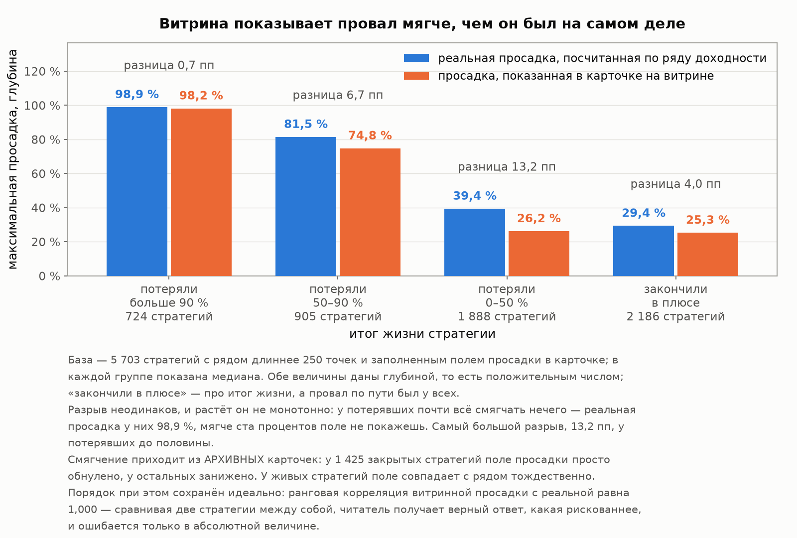

# Глава 1. Площадка и витрина: как устроен рынок и чему на нём можно верить

[Лицензия](comon-story-license.md) · [Введение](comon-story-0-intro.md) · **Глава 1 из 5** · [2 — Кладбище](comon-story-2-survival.md) · [3 — Из чего сделана доходность](comon-story-3-returns.md) · [4 — Продавцы](comon-story-4-authors.md) · [Интерлюдия — вторая площадка](comon-story-4b-interlude.md) · [5 — Покупатели](comon-story-5-buyers.md) · [Заключение](comon-story-6-conclusion.md)

*Данные, методы и словарь терминов — во [введении](comon-story-0-intro.md). Здесь и дальше все метрики пересчитаны нами из дневных рядов 19 978 стратегий Comon, включая 18 529 закрытых.*

---

## 1.1 Масштаб: двадцать тысяч попыток, из которых живы семь процентов

Первое число, задающее тон всему остальному: **из 19 978 стратегий, когда-либо опубликованных на площадке, работают 1 448**. Остальные 18 529 закрыты (у одной стратегии не загрузилась карточка, поэтому её статус неизвестен — см. таблицу «Что выгружено» во [введении](comon-story-0-intro.md)).

Но само по себе «92.7 % мертвы» — некорректный вывод, и это важно оговорить сразу, до [главы 2](comon-story-2-survival.md). Значительная часть архива — вообще не проигравшие стратегии:

| Категория | Стратегий | Доля архива |
|---|---:|---:|
| **Не совершили ни одной сделки за всю жизнь** | **5 134** | **27.7 %** |
| — из них не завели даже ряда (пустая заготовка) | 1 621 | 8.7 % |
| — из них ряд есть, но состоит из одних нулей | 3 513 | 19.0 % |

Больше четверти архива — это не «система торговала и проиграла», а «человек зарегистрировал стратегию и не начал». Считать их погибшими нельзя: они описывают поведение авторов при регистрации, а не выживаемость торговых систем. В [главе 2](comon-story-2-survival.md) они вынесены в отдельный класс и исключены из знаменателя.

Второе, что бросается в глаза, — **насколько короткие эти истории**:

| Показатель | Значение |
|---|---:|
| Медиана длины ряда | 138 дней |
| **Медиана торговых дней за всю жизнь** | **36** |

Половина всех стратегий площадки за всю свою жизнь торговала 36 дней или меньше. На такой истории невозможно отличить умение от везения — и это не наша придирка, а измеримый факт: в [главе 3](comon-story-3-returns.md) показано, сколько лет наблюдения нужно, чтобы результат стал информативным.

## 1.2 Кто здесь продавец: плата берётся с активов, а не с прибыли

Тариф разобран у всех 19 977 стратегий с карточкой. Считать можно двумя способами, и разница между ними содержательна: у части стратегий тарифных **предложений** несколько (всего 20 097 на 19 977 стратегий) — подписчику дают выбор. Ниже — по тарифу, который стратегии **назначен**.

| Тип назначенного тарифа | Стратегий | Доля |
|---|---:|---:|
| От СЧА (стоимости чистых активов) — фиксированный процент от активов подписчика | 19 911 | **99.7 %** |
| Комбинированный (процент от активов + процент от дохода) | 59 | 0.30 % |
| Только от инвестиционного дохода | 7 | 0.04 % |

Внутри этого — почти полная унификация:

| Назначенный тариф | Стратегий | Доля |
|---|---:|---:|
| **6 % годовых от СЧА** («Автоследование F») | **18 773** | **94.0 %** |
| 3 % годовых от СЧА | 745 | 3.7 % |
| 4 % годовых от СЧА | 71 | 0.4 % |
| 1 % годовых от СЧА | 66 | 0.3 % |
| 0.01 % годовых от СЧА | 53 | 0.3 % |
| 2 % годовых от СЧА | 50 | 0.3 % |
| Прочие, включая все схемы с долей от прибыли и варианты «или» | 219 | 1.1 % |

Если считать не стратегии, а тарифные предложения, картина смещается лишь чуть-чуть: схемы с долей от прибыли встречаются в 178 предложениях из 20 097 (0.9 %), тогда как назначены они лишь 66 стратегиям (59 комбинированных плюс 7 только от инвестиционного дохода) — то есть часть авторов держит такую схему как **альтернативу** на выбор подписчику, не делая её основной.

Медианная ставка от активов — 6.00 % годовых, максимальная — 15 %. Там, где плата от прибыли всё же есть, её медиана — 20 % от дохода.

**Что это означает на практике.** Автор получает деньги за то, что подписчик держит у него капитал, а не за то, что этот капитал вырос. Стратегия, потерявшая за год 20 %, всё равно берёт свои проценты — и берёт их с уменьшившейся, но всё ещё значительной суммы. Мы посчитали это прямо: убыточные стратегии периода сравнения (медианный результат −20.7 % годовых) взяли с подписчиков дополнительно 4.3 процентных пункта в год. Полный расчёт — в [главе 5](comon-story-5-buyers.md).

### Тариф не выбирают — его назначают

Глядя на таблицу выше, легко решить, что 94 % авторов **предпочли** фиксированную плату. Это не так, и правила площадки говорят об этом прямо.

**При создании стратегии тариф ставится автоматически — «Автоследование F», те самые 6 % годовых от активов.** Сменить его в первый месяц нельзя вообще. Дальше — только заявка в поддержку, и решение принимается индивидуально: «Администрация оставляет за собой право отказать в смене тарифа без объяснения причин».

**Плата от результата на публичной стратегии недоступна в принципе.** Чистый тариф от инвестиционного дохода разрешён только скрытым стратегиям, которых нет на витрине. Публичной доступен максимум комбинированный вариант — и то при условии: **не меньше 10 подписчиков, большинство из которых в плюсе**.

**Комбинирование идёт по фиксированной формуле:** ставка от активов уменьшается вдвое (±0.5 %) и к ней добавляется доля от дохода, размер которой привязан к риск-профилю: консервативный — 5 или 10 %, умеренный — 10 или 15 %, агрессивный — 15 или 20 %. Отсюда и наблюдаемые в данных комбинации: 3 % + 20 %, 3 % + 15 %, 2 % + 20 %.

Данные показывают этот механизм с полной ясностью. Доля стратегий, оставшихся на дефолтном тарифе, монотонно падает с ростом аудитории:

| Подписчиков у живой стратегии | Стратегий | На дефолтном тарифе 6 % | На другом тарифе |
|---|---:|---:|---:|
| Ни одного | 957 | **93.3 %** | 6.7 % |
| 1–9 | 324 | 61.7 % | 38.3 % |
| 10–49 | 116 | 45.7 % | 54.3 % |
| 50 и больше | 51 | **27.5 %** | **72.5 %** |

Иными словами, **дешёвый или связанный с результатом тариф — не выбор бизнес-модели, а привилегия, которую выдают тем, кто уже собрал аудиторию**. Нестандартный тариф есть у 19.9 % живых стратегий (6.0 % всей популяции), но на них приходится **71 % всех подписок**.

Гейт «10 подписчиков, большинство в плюсе» для подавляющего большинства авторов непроходим по арифметике: **66.1 % живых стратегий не имеют ни одного подписчика**. Чтобы получить право брать плату за результат, нужно сначала набрать аудиторию под фиксированную плату — и сделать это успешно.

Это меняет прочтение всей главы. «94 % берут 6 % от активов» — характеристика не жадности авторов, а **устройства допуска**: так выглядит популяция, большая часть которой никогда не проходила индивидуального одобрения. И отдельная деталь, которую стоит заметить: разрешённая доля от дохода растёт с агрессивностью стратегии — 20 % достаются только агрессивному профилю, консервативному максимум 10 %.

Спрос при этом смотрит в другую сторону: **125 живых стратегий (8.6 %) дают подписчику выбор, включающий плату от результата, и на них приходится 48.6 % всех подписок**. Схема, при которой интересы сторон совпадают, на витрине редка, а подписки в ней густы: доля подписок вшестеро выше доли самих таких стратегий.

Порог входа — вторая структурная характеристика. Медианный минимум для стратегий с тарифом от СЧА — 30 000 ₽, для комбинированных — 218 000 ₽. Забегая вперёд: порог входа окажется **сильнейшим из заранее видимых признаков витрины, связанных с качеством** ([глава 5](comon-story-5-buyers.md)). Не единственным — частота сделок связана с качеством тоже, — но самым сильным.

## 1.3 Числа на витрине честные — врут ярлыки

Здесь нужно быть точным, потому что вывод двойной и его легко упростить неправильно.

**Числа, которые показывает витрина живой стратегии, соответствуют её реальному ряду.** Мы сверили ранги по всем 1 437 живым стратегиям, которые хотя бы раз совершили сделку:

| Пара «витрина ↔ пересчёт из ряда» | ρ |
|---|---:|
| Годовая доходность ↔ реальный CAGR | **+0.954** |
| Максимальная просадка ↔ реальная просадка | **+1.000** |

Просадка совпадает тождественно, доходность — почти. Плохой выбор публики ([глава 5](comon-story-5-buyers.md)) нельзя списать на дезинформацию в цифрах: цифры на месте.

**Врут не числа, а ярлыки, которыми площадка эти числа резюмирует.**

| Ярлык витрины | Связь с реальностью (ρ) |
|---|---:|
| Категория риска (1–3, «консервативная / умеренная / агрессивная») ↔ реальная просадка | **+0.184** |
| Та же категория риска ↔ реальная волатильность | +0.430 |
| Рейтинг площадки ↔ реальный Sharpe | **+0.115** |
| Рейтинг площадки ↔ число подписчиков | **+0.442** |

Категория риска кое-как отражает «трясучесть» (0.43), но почти не различает стратегию с просадкой −15 % и стратегию с просадкой −60 % (0.18) — а решение принимается именно по просадке. Рейтинг площадки вчетверо сильнее связан с популярностью, чем с качеством: это мера известности, а не оценка.

Отдельный случай — **подмена понятия просадки**. В карточке есть поле, подаваемое как «прогнозируемая просадка». Фактически это CVaR — средний убыток в худших днях ([словарь введения](comon-story-0-intro.md#словарь-почему-везде-sharpe-а-не-доходность)), величина совсем другого масштаба: просадка накапливается за много дней подряд, CVaR описывает один день.

| Величина | Медиана по популяции |
|---|---:|
| «Прогнозируемая просадка» (CVaR) на витрине | −18.0 % |
| **Реальная максимальная просадка** | **−47.0 %** |

Разница в **2.6 раза**. Реальный пример из данных: стратегия с «прогнозируемой просадкой −11 %» на витрине имела в своей истории просадку −37.5 %. Инвестор, увидевший это, не столкнулся с редким событием — он прочитал показатель, который никогда и не обещал того, что он думал.

Само поле максимальной просадки на витрине тоже систематически мягче реального:

| Итог жизни стратегии | Стратегий | Просадка по ряду | Просадка на витрине | Разница |
|---|---:|---:|---:|---:|
| Потеряли больше 90 % | 724 | −98.9 % | −98.2 % | 0.7 пп |
| Потеряли 50–90 % | 905 | −81.5 % | −74.8 % | 6.7 пп |
| Потеряли 0–50 % | 1 888 | −39.4 % | −26.2 % | **13.2 пп** |
| Закончили в плюсе | 2 186 | −29.4 % | −25.3 % | 4.1 пп |

Разрыв неодинаков и растёт не монотонно: у потерявших почти всё смягчать нечего — реальная просадка у них 98.9 %, мягче ста процентов поле не покажешь. Самый большой разрыв — **13.2 процентных пункта у потерявших до половины**, то есть ровно там, где решение подписчика ещё имело цену.

И сразу справедливости ради — то, что площадка делает **правильно**, и это важнее, чем кажется. Уровень просадки на витрине смягчён, но **порядок сохранён идеально**: ранговая корреляция витринной просадки с реальной равна 1.000. Тот, кто сравнивает две стратегии между собой, получает верный ответ, какая из них рискованнее, — ошибётся он только в абсолютной величине. То же и с полем CVaR: как «прогнозируемая просадка» оно вводит в заблуждение, но как **мера риска** работает — с реальной просадкой оно связано на 0.910. Проблема здесь в названии, а не в расчёте.

## 1.4 У закрытых стратегий витрина показывает нули

Это самая серьёзная находка о качестве данных, и именно из-за неё всё исследование считает метрики из дневных рядов, а не из полей карточки.

**У архивной стратегии расчётные поля карточки обнулены.**

| Итог жизни | Стратегий | Реальный CAGR (пересчёт) | Годовая доходность в карточке |
|---|---:|---:|---:|
| Потеряли больше 90 % | 724 | **−84.0 %** | **0.0 %** |
| Потеряли 50–90 % | 905 | −49.2 % | **0.0 %** |
| Потеряли 0–50 % | 1 888 | −9.8 % | **0.0 %** |
| Заработали 0–100 % | 1 653 | +9.6 % | **0.0 %** |
| Заработали больше 100 % | 533 | +35.7 % | +18.1 % |

У стратегии, потерявшей 84 % годовых, в карточке стоит «среднегодовая доходность 0». То же самое происходит со счётчиком подписчиков — он обнуляется при архивации.

Разрез по статусу показывает, что дело именно в архивации, а не в качестве расчёта вообще (сверка возможна на 5 703 стратегиях, у которых есть и заполненное поле карточки, и пересчёт из ряда):

| Группа | Стратегий | Медианное расхождение по CAGR | Расхождений больше 5 пп |
|---|---:|---:|---:|
| Живые | 1 096 | 0.00 пп | 2.6 % |
| Мёртвые | 4 607 | −0.16 пп | **61.0 %** |

У живых витрина считает верно (мы отдельно проверили: `annualAverageProfit` — это действительно CAGR, поштучное совпадение до 0.02 пп). У мёртвых расчётные поля превращаются в нули.

Мы не считаем это намеренным искажением: у закрытой стратегии, вероятно, просто перестаёт работать пересчёт агрегатов. Но практическое следствие от намерения не зависит: **любой анализ архива по полям карточки покажет, что закрытые стратегии имели нулевую доходность и нулевую популярность**. Единственный корректный путь — считать самому из дневных рядов, что мы и делаем во всех пяти главах.

**И тут же — то, за что площадке следует отдать должное.** Обнулены только производные поля. **Сам дневной ряд закрытой стратегии сохранён полностью и отдаётся целиком**, вплоть до последнего дня, со всеми убытками. История не подчищается и не удаляется — регламент прямо фиксирует, что архивные данные остаются. Это редчайшая практика: обычно провалившаяся стратегия просто исчезает из каталога вместе со своей историей. Ровно поэтому исследование, которое вы читаете, оказалось возможным именно здесь — и невозможно ни на одной из площадок, которые в разделе 1.6 выглядят выгоднее по тарифам.

## 1.5 Дата закрытия — не дата смерти

Последняя структурная деталь, без которой [глава 2](comon-story-2-survival.md) была бы неверной.

Стратегия может перестать торговать задолго до того, как автор нажмёт «архивировать». Ряд при этом продолжает тянуться нулями. Если считать датой смерти дату архивации, получится завышенный срок жизни.

Сколько времени проходит между последней **сделкой** и архивацией — по 13 395 закрытым стратегиям, которые вообще успели совершить хотя бы одну сделку:

| Разрыв | Стратегий | Доля |
|---|---:|---:|
| Торговала до самой архивации (≤ 1 дня) | 7 338 | 54.8 % |
| 1–30 дней без сделок | 3 182 | 23.8 % |
| 30–90 дней | 807 | 6.0 % |
| 90–365 дней | 1 155 | 8.6 % |
| Больше года | 913 | 6.8 % |

**У 15 % стратегий между остановкой торговли и закрытием прошло больше трёх месяцев.** Поэтому во всей серии дата смерти — это **последний торговый день**, а архивация учитывается отдельно, как административное событие. Разница принципиальна: она превращает «стратегия прожила два года» в «стратегия торговала восемь месяцев, а потом полтора года числилась на витрине».

## 1.6 Кому выгодна такая тарифная политика

Дальше — оценочный раздел, и мы обозначаем это прямо. Всё, на чём он строится, — опубликованные правила площадки, её же тарифная сетка и наши расчёты по её данным. Мы не приписываем никому намерений; мы смотрим, **как устроены стимулы**, и что из этого следует для человека, который заводит деньги.

### Что площадка получает и чего не получает подписчик

Устройство платы простое: **6 % годовых от активов, непрерывно, независимо от результата**. Автор и площадка получают одинаковую сумму со стратегии, заработавшей 40 %, и со стратегии, потерявшей 20 %. Единственное, что влияет на их доход, — сколько денег и сколько времени лежит на подписке.

Есть и второй источник, о котором на витрине не пишут: **подписчик платит своему брокеру за каждую сделку копирования**. Чем активнее торгует автор, тем больше комиссионный оборот. И именно здесь данные дают неудобное совпадение: среди стратегий с историей не меньше трёх лет 61.6 % подписок (6 396 из 10 384) приходится на ежедневно торгующие — худший класс по всем метрикам качества (Sharpe 0.49 против 0.91 у редко торгующих, подробности в [главе 5](comon-story-5-buyers.md)).

Итого доход площадки зависит от: (1) объёма привлечённых денег, (2) срока, который они лежат, (3) торгового оборота. **От того, заработал ли клиент, он не зависит никак.**

### Где дизайн работает против подписчика

**Первое. Плата не связана с результатом у 94 % стратегий.** Убыточные стратегии периода сравнения — медианный результат −20.7 % годовых — взяли с подписчиков сверх убытка ещё 4.3 процентных пункта в год. Это не сбой, это работа тарифа по назначению.

**Второе. Инструмент, выравнивающий интересы, закрыт гейтом.** Плата от результата — единственная схема, при которой автор зарабатывает, только если заработал клиент. На публичной стратегии она разрешена лишь в комбинированном виде, лишь при 10 подписчиках, большинство которых в плюсе, и лишь по индивидуальному решению с правом отказа без объяснения причин. То есть автору, который хочет привязать свой заработок к результату клиента, площадка отвечает: сначала соберите клиентов на фиксированной ставке.

**Третье. Уровень ставки.** 6 % годовых от активов — это не «немного за удобство». При медианном валовом результате живых стратегий 10.6 % годовых плата съедает **треть заработанного**, а у 29.2 % прибыльных стратегий — больше половины ([глава 5](comon-story-5-buyers.md)). Ставка не зависит ни от волатильности, ни от дохода, поэтому она тем разрушительнее, чем спокойнее стратегия: заработавший 46 % при высоком риске отдаёт седьмую часть, заработавший 15 % при низком — почти всё преимущество над вкладом.

**Четвёртое. Разрешённая доля от прибыли растёт с агрессивностью.** По правилам консервативному профилю согласуют 5–10 % от дохода, умеренному 10–15 %, агрессивному 15–20 %. Стимул направлен ровно не туда: чем рискованнее вы работаете с чужими деньгами, тем большую долю прибыли вам позволено оставить себе.

**Пятое. High-water mark нигде не обещан.** В публичном описании тарифов Comon принцип «плата только с новых максимумов» не упомянут — там сказано лишь «20 % от инвестиционного дохода, списывается раз в месяц». А цена этого умолчания трёхкратная: по нашим расчётам плата с HWM составляет 4.0 п.п. годовых против 11.7 п.п. без него ([глава 5](comon-story-5-buyers.md)). Для сравнения, у ближайшего российского конкурента принцип HWM описан явно, вместе с оговоркой, что при убытке комиссия не берётся.

### Где правила защищают подписчика — и это надо признать

Было бы нечестно перечислить только претензии. В регламенте есть механизмы, которые работают против интересов самой площадки:

- **Ограничение новых подключений при ИТА выше 12** (больше двенадцати сделок в день). Это прямой барьер против оборота ради оборота — то есть против собственного комиссионного дохода брокера.
- **Временное ограничение подключений** при значительном расхождении доходности стратегии и подписчиков и при критических значениях точности следования. Площадка следит, что подписчик получает то же, что показано на витрине, — а раздел 1.3 показал, что витринные числа действительно честны.
- **Запрет клонов** (совпадение портфеля и действий больше чем на 75 %) и блокировка за многократное создание краткосрочных стратегий — это прямо против «фабрик», которые в [главе 4](comon-story-4-authors.md) окажутся заметной частью популяции.
- **Принудительная архивация** при доходности ниже −95 %, при остановке торговли на три месяца и при падении счёта ниже 30 000 ₽ — витрина чистится от мёртвого.
- **Архивные данные не удаляются.** Именно поэтому это исследование вообще возможно. Ни одна другая площадка такой возможности не даёт.

### Сравнение первое: российские площадки

| Площадка | Модель | Плата от активов | Плата от результата | High-water mark | Особенности |
|---|---|---|---|---|---|
| **Comon (Финам)** | маркетплейс авторов | **6 % годовых — по умолчанию**, диапазон 0.01–15 % | у 0.7 % стратегий; публичным — только в комбинации, при 10+ подписчиках и по индивидуальному решению | в описании тарифов не упомянут | смена тарифа не раньше месяца, отказ без объяснения причин |
| **Т-Инвестиции** | маркетплейс авторов | **до 2 % годовых**, у части стратегий нет вовсе | до 20 % от прибыли | **описан явно**; при убытке комиссия не берётся, после убытка — только с превышения прежнего максимума | обе комиссии видны подписчику до подключения |
| **Fintarget (БКС)** | витрина брокера | до 4 %, у части стратегий 0 % | по стратегии | — | на время подключения подписчик освобождён от биржевых комиссий за сделки |
| **Альфа-Инвестиции** | витрина брокера | 1.8–3.5 % годовых | 10–20 % прибыли | **описан явно**: комиссия за успех берётся, только если счёт превысил прежний максимум | семь стратегий, авторы — не сторонние трейдеры |
| **pro.invest (АЛОР)** | витрина брокера | 4.5 % активов | 25 % прибыли | — | тарифы по данным агрегатора и для прежней версии сервиса (Follow Me); действующие условия раскрыты только в приложении |

*Колонка «модель» существенна: маркетплейс пускает автора со стороны, витрина брокера показывает стратегии своих управляющих. Прямой конкурент Comon по устройству — только Т-Инвестиции; остальные строки в таблице — это, по сути, цена упакованного доверительного управления, и сравнивать с ними надо с этой поправкой. Полный состав рынка и его источник — [во введении](comon-story-0-intro.md).*

Вывод сравнения: **у прямого конкурента — сервиса той же модели — плата от активов втрое ниже, а Comon остаётся единственным, у кого плата за результат не опция, а привилегия.** И Т-Инвестиции, и Альфа-Инвестиции показывают, что на том же рынке, с той же розницей и тем же регулированием возможна конструкция «доля от прибыли с явным high-water mark»: комиссию за успех берут только с превышения прежнего максимума счёта. Витрины брокеров берут с активов больше Т-Инвестиций — но ни одна из них не берёт **только** с активов: процент от прибыли там есть всегда, а на Comon его нет у 99.7 % стратегий.

### Сравнение второе: мировая практика

| Площадка | Что платит копирующий | Что получает автор | Модель |
|---|---|---|---|
| **eToro** | **ничего сверх спреда** | 1.5–2.5 % годовых от скопированных активов | платит **площадка из своей выручки**, не подписчик |
| **Darwinex** | 20 % от прибыли, с HWM, поквартально | 15 % (5 % площадке) | **только за результат**, платы от активов нет |
| **ZuluTrade** | копирование бесплатно; отдельные провайдеры берут фиксированную абонплату $30–500 | из абонплаты | подписка, не процент от капитала |
| **Collective2** | цену назначает автор, площадка называет типичной $49–199 в месяц за стратегию | половина подписки (вторая половина площадке); автор ещё и сам платит площадке $19–99 в месяц | **фиксированная сумма, не зависящая от размера счёта** |

Мировая практика сходится к трём схемам: **платит площадка**, **платит прибыль** или **платят фиксированной подпиской**. Схема «фиксированный процент от активов как безальтернативный вариант» среди крупных копи-трейдинговых сервисов встречается редко.

**И сразу — честный контраргумент.** Плата от активов не является порочной сама по себе; в ряде юрисдикций она навязана регулятором. В США закон об инвестиционных советниках прямо запрещает брать плату за результат с розничного клиента — исключение сделано только для «квалифицированных клиентов» с активами от 500 тыс. долларов или состоянием свыше миллиона. Причина запрета ровно та, что мы отметили выше: доля в прибыли толкает управляющего к избыточному риску, ведь убыток он не разделяет. Так что фиксированная ставка — это законный и по-своему защитный формат.

Претензия не к модели, а к трём вещам, которые от модели не зависят: **к уровню ставки** (6 % против 2 % у конкурента и 0 % у мирового лидера), **к тому, что альтернатива выдаётся как привилегия** тем, кто уже собрал аудиторию, и **к тому, что разрешённая доля прибыли растёт с агрессивностью стратегии** — то есть ровно тот стимул к риску, из-за которого плату за результат и ограничивают в других странах, здесь встроен в правила.

### Итог: чьи интересы совпадают

Интересы площадки и подписчика совпадают **частично и не там, где важно**.

- Они совпадают в том, чтобы подписчик **пришёл и остался**: отсюда контроль точности следования, ограничение сверхактивной торговли, запрет клонов, чистка витрины от мёртвых стратегий. Всё это реальные и работающие механизмы.
- Они расходятся в том, чтобы подписчик **заработал**. Ни один рубль дохода площадки и автора не зависит от результата клиента — у 94 % стратегий буквально, по конструкции тарифа. Убыточная стратегия приносит своему автору столько же, сколько прибыльная с тем же капиталом.

Для человека, который выбирает стратегию, из этого следует одна практическая вещь, и её стоит сказать прямо: **смотреть на тариф надо раньше, чем на доходность**. При валовом результате ниже примерно 20 % годовых фиксированные 6 % не оставляют от преимущества над обычным вкладом ничего (расчёт — в [главе 5](comon-story-5-buyers.md)). Наличие платы за результат с high-water mark — единственный видимый на витрине признак того, что автор согласился зарабатывать вместе с вами, а не вместо вас.

## 1.7 Что говорит регулятор

Предыдущий раздел был про стимулы. Этот — про то, что об этих стимулах думает закон. Здесь важно, что автоследование в России **не является нерегулируемой серой зоной**, и подписчик, который об этом не знает, недооценивает свои права.

### Автоследование юридически — это инвестиционное консультирование

[Базовый стандарт совершения инвестиционным советником операций на финансовом рынке](https://cbr.ru/StaticHtml/File/17579/standart_17112023.pdf) (в редакции от 17.11.2023) прямо включает автоследование в определение индивидуальной инвестиционной рекомендации:

> «информация, автоматизированным способом преобразуемая в поручение брокеру на совершение сделки с финансовым инструментом, **посредством программы автоследования**»

и определяет саму программу (п. 3.2):

> «программа автоследования, позволяющая автоматизированным способом преобразовывать предоставленную индивидуальную инвестиционную рекомендацию в поручение брокеру… **без непосредственного участия клиента** инвестиционного советника»

Из этого следует главное: **автор стратегии — инвестиционный советник**, а не блогер с сигналами. А подписчик — не покупатель информационной услуги, а клиент советника, со всеми правами, которые даёт [закон «О рынке ценных бумаг»](https://www.consultant.ru/document/cons_doc_LAW_10148/c7375c64b45cadae15697cffbee9601fadc60975/) (39-ФЗ, ст. 6.1–6.2):

- советник обязан работать **добросовестно, разумно и в интересах клиента** (ст. 6.1);
- до первой рекомендации обязан определить **инвестиционный профиль** — ожидаемую доходность, период вложения и **допустимый для клиента риск убытков** ([ст. 6.2, п. 2](https://www.consultant.ru/document/cons_doc_LAW_10148/b0f0f1e253c950b933830988e85dbbc0ae025edb/));
- рекомендация обязана **соответствовать этому профилю**;
- закон прямо оговаривает только **освобождение** от ответственности: советник «не несёт ответственности за убытки, причинённые вследствие индивидуальной инвестиционной рекомендации, основанной на представленной клиентом недостоверной информации» (ст. 6.2, п. 4). Из этой конструкции и следует обратное: если клиент сообщил о себе правду, а рекомендация его профилю не соответствовала, ответственность за убытки остаётся на советнике.

### Аккредитация проверяет программу, а не стратегию

Отдельно стоит разобрать требование, которое легко принять за знак качества. **Программы автоследования подлежат обязательной аккредитации**: с 2019 года их проверяют Банк России или уполномоченная им саморегулируемая организация — [реестр аккредитованных программ ведёт НАУФОР](https://naufor.ru/tree.asp?n=16673), решение принимается за 20 дней, порядок установлен [Указанием Банка России № 4980-У](https://base.garant.ru/72179746/).

**Речь идёт о торговом программном обеспечении, а не о стратегиях.** «Программа автоследования» — это тот самый механизм, который превращает сделку автора в поручение брокеру на счёте подписчика. Одна такая программа обслуживает **все** стратегии площадки; аккредитуется она один раз и стратегии между собой не различает вообще.

Что проверяют при аккредитации: описание алгоритма, корректность его работы, соблюдение требований к определению инвестиционного профиля клиента, порядок хранения и защиты данных. Чего **не** проверяют: доходность, риск и осмысленность самих торговых стратегий. Никто не оценивает, разумна ли логика конкретного автора.

**Что это даёт подписчику.** Аккредитация — гарантия механики, а не результата:

- сделки будут воспроизводиться на его счёте так, как заявлено, а не «как получится»;
- программа обязана учитывать инвестиционный профиль клиента, а не подключать кого угодно к чему угодно;
- данные клиента защищены по установленным требованиям.

И чего она **не** даёт: ни малейшего свидетельства, что стратегия хорошая. Строка «программа аккредитована» относится к трубе, по которой едут сделки, а не к тому, что по ней едет. Читать её как отметку регулятора о качестве стратегии — ошибка.

### Где для автоследования сделано послабление

И тут же — оговорка, которую стоит знать. Тот же стандарт (пп. 5.1–5.2) для автоследования смягчает два требования:

> «к сообщению для преобразования индивидуальной инвестиционной рекомендации в поручение брокеру… требования п. 3.1 не применяются»

> «описание рисков… декларация об общих рисках операций на рынке ценных бумаг, а также **указание на наличие конфликта интересов** у инвестиционного советника… **могут быть предоставлены клиенту в виде отдельного документа/документов, в том числе путём включения соответствующих положений в договор**»

Логика понятна: невозможно показывать декларацию о рисках перед каждой автоматической сделкой. Но практический итог тот, что **конфликт интересов раскрывается один раз, при подписании договора**, — а именно конфликт интересов и есть содержание раздела 1.6. Человек, подписавший договор год назад, о нём уже не вспомнит.

### Две стыковки с нашими измерениями

**Первая.** Закон требует, чтобы рекомендация соответствовала инвестиционному профилю клиента, а профиль включает «допустимый риск убытков». На витрине это сопоставление опирается на категорию риска — «консервативная / умеренная / агрессивная». Но, как показано в разделе 1.3, **эта категория связана с фактической максимальной просадкой всего на 0.184**. Требование закона осмысленно; метка, через которую оно исполняется, риск отражает слабо.

**Вторая.** Ещё в 2021 году, [разбирая рынок копирования сделок](http://naufor.ru/tree.asp?n=21643), регулятор называл конкретный риск: управляющие могут намеренно совершать много сделок, чтобы получить больше комиссий с операций клиента. Наши данные показывают, чем это кончилось на стороне спроса: **среди стратегий с трёхлетней историей 61.6 % подписок сидят в ежедневно торгующих — худшем классе по всем метрикам** (Sharpe 0.49 против 0.91 у редко торгующих, [глава 5](comon-story-5-buyers.md)).

### Статистики по автоследованию регулятор не публикует

Отдельная находка, объясняющая, почему размеры рынка во [введении](comon-story-0-intro.md) собраны по газетным сообщениям: в [«Обзоре ключевых показателей брокеров»](https://www.cbr.ru/collection/collection/file/54866/review_broker_q3_2024.pdf) Банка России слово «автоследование» не встречается ни разу — мы проверили полнотекстовым поиском. Сводных цифр — сколько людей подписано, на какие суммы, с каким результатом — в открытом доступе нет ни у одного регулятора или СРО.

Это и есть причина, по которой такое исследование приходится делать выгрузкой чужой витрины.

---

## Выводы главы

1. **Рынок построен на фиксированной плате, и это заложено в правилах, а не выбрано авторами.** 94.0 % стратегий берут ровно 6 % годовых от активов независимо от результата — это тариф, который площадка ставит по умолчанию при создании. Сменить его можно не раньше чем через месяц, по индивидуальному решению, с правом отказа без объяснения причин; плата от результата на публичной стратегии разрешена только в комбинированном виде и только при 10 подписчиках, большинство которых в плюсе. Результат виден в данных: на дефолтном тарифе остаются 93.3 % стратегий без подписчиков и лишь 27.5 % тех, у кого подписчиков больше пятидесяти. Спрос при этом тянется к плате за результат — стратегии, предлагающие такой вариант, составляют 8.6 % витрины и держат 48.6 % подписок.

2. **Витрина показывает выживших — 7.2 % популяции.** За каждой видимой стратегией стоят почти тринадцать закрытых. Любая статистика, собранная по видимому каталогу, описывает не рынок, а результат отбора.

3. **Цифрам витрины верить можно, ярлыкам — нет.** Доходность и просадка живых стратегий ранжируют популяцию так же, как реальные ряды (ρ = 0.954 и 1.000). Зато категория риска почти не связана с фактической просадкой (0.18), рейтинг площадки связан с известностью (0.44) вчетверо сильнее, чем с качеством (0.115), а поле «прогнозируемая просадка» — это CVaR, вдвое-втрое мельче реальной просадки (−18 % против −47 %).

4. **Архив по карточкам не читается — но сам архив цел.** У закрытых стратегий расчётные поля обнулены: стратегия с реальным CAGR −84 % показывает в карточке 0 %. Зато дневной ряд сохранён полностью, со всеми убытками, и отдаётся целиком — историю здесь не подчищают. Всё исследование считает метрики из этих рядов; поля карточки используются только для дат, тарифа и автора.

5. **Половина всех попыток — очень короткие.** Медиана торговых дней за всю жизнь стратегии — 36. Больше четверти архива (27.7 %) не совершило ни одной сделки. Это меняет постановку вопроса: главный риск подписчика не в том, что стратегия проиграет, а в том, что её не станет.

6. **Доход площадки не зависит от того, заработал ли клиент.** Плата берётся с активов и с торгового оборота, а не с прибыли; убыточные стратегии окна взяли с подписчиков ещё 4.3 п.п. годовых сверх убытка. Ставка 6 % втрое выше, чем у ближайшего российского конкурента (Т-Инвестиции — до 2 % плюс до 20 % от прибыли с явным high-water mark), а мировые копи-трейдинговые сервисы либо платят авторам сами (eToro), либо берут только с прибыли (Darwinex, 20 % с HWM), либо продают фиксированную подписку (Collective2, типичная цена $49–199 в месяц). При этом в правилах есть и реальные защитные механизмы — ограничение сверхактивной торговли, контроль точности следования, запрет клонов, — но они охраняют качество сервиса, а не результат подписчика.

7. **Практический вывод для читателя.** Смотреть на тариф надо раньше, чем на доходность: при валовом результате ниже примерно 20 % годовых фиксированные 6 % не оставляют преимущества над обычным вкладом. Плата за результат с high-water mark — единственный видимый на витрине признак того, что автор согласился зарабатывать вместе с подписчиком, а не независимо от него.

8. **Это регулируемая деятельность, и у подписчика есть права.** Автоследование по закону — инвестиционное консультирование: автор стратегии является инвестиционным советником, обязан определить инвестиционный профиль клиента, давать соответствующие ему рекомендации и отвечает за убытки от рекомендаций, профилю не соответствующих; программы автоследования проходят обязательную аккредитацию. Два ослабления: раскрытие конфликта интересов допускается однократно в договоре, а сопоставление с инвестиционным профилем на практике опирается на категорию риска витрины, связанную с реальной просадкой лишь на 0.18. Официальной статистики по сегменту регулятор не публикует.

Именно этому — сколько живут стратегии и от чего умирают — посвящена [глава 2](comon-story-2-survival.md).

---

# Приложение: полная статистика

Всё, что ниже, — методологическая база, на которой стоят остальные три главы. Обычному читателю она не нужна; тому, кто хочет проверить или повторить, — необходима.

## А1. Известные ловушки этих данных

Сводка того, на чём легко ошибиться, — она же объясняет, почему некоторые естественные вопросы в серии не разобраны:

- **Аннуализация по календарю, а не по 252 дням** (см. А4).
- **Витрина подменяет понятия**: CVaR подан как «прогнозируемая просадка» (см. 1.3).
- **Счётчик подписчиков у мёртвых непригоден**: у 18 517 из 18 529 архивных он равен нулю, максимум 4 против 945 у живых. Гипотезу «умирают те, за кем не пошли деньги» проверить нельзя.
- **`archivedAt` ≠ момент смерти** (см. 1.5).
- **Больше четверти архива не торговало ни дня** (27.7 %) — это отдельный класс, а не проигравшие.
- **Экстремальные ряды**: встречаются артефакты вроде итога +2 877 000 % за 4 года. Для медиан безвредно, но там, где считаются распределения качества, применяется явный фильтр ([глава 3](comon-story-3-returns.md)).
- **β к индексу в базовую панель не входит**: площадка присылает вместе с кривой стратегии три эталонных ряда — индекс МосБиржи, индекс РТС и S&P 500, — но заполнены они **только у живых стратегий**; у закрытых пусты, как и остальные расчётные поля (см. 1.4). Панель считается по всей популяции, поэтому индекс подтягивался отдельно ([глава 3](comon-story-3-returns.md)).

---

## А2. Состав панели

Одна строка на стратегию, 56 признаков.

| Показатель | Значение |
|---|---:|
| Строк в панели | 19 978 |
| Стратегий с дневным рядом | 18 354 |
| Стратегий без единой точки ряда | 1 624 |
| Стратегий хотя бы с одним торговым днём | 14 833 |
| **Из них с установленным статусом** (живая или закрытая) | **14 832** |
| Живых / архивных | 1 448 / 18 529 |
| Статус установить не удалось (карточка не загрузилась) | 1 |
| Медиана точек ряда | 138 |
| Медиана торговых дней за жизнь | 36 |

🔴 **Почему в таблице два близких числа — 14 833 и 14 832.** Торговали хотя бы день 14 833 стратегии, но у одной из них статус неизвестен: её карточка не загрузилась при выгрузке (стратегия 104812, подробности во [введении](comon-story-0-intro.md)). Везде, где стратегии делятся на живые и закрытые, она отсутствовать обязана — поэтому [глава 2](comon-story-2-survival.md), которая целиком построена на таком делении, работает с 14 832 стратегиями: 13 395 смертей плюс 1 437 живых. Единственная разница между числами — эта одна строка.

## А3. Семантика ряда: `value` против `rValue`

Ряд отдаётся в обратном хронологическом порядке. `rValue` — простая дневная доходность в долях (−0.0181 = −1.81 %). `value` — накопленная доходность в процентах: `value = (∏(1 + rValue) − 1) · 100`.

| Сверка | Результат |
|---|---|
| \|value последнего дня / 100 − (∏(1+rValue) − 1)\| | медиана 0.00, p99 0.21 |
| Расхождение больше 1e−6 | 443 стратегии (2.41 %) |
| Из них с обнулённым хвостом `value` | 263 (59.4 % расхождений) |
| Длина битого хвоста | медиана 1 точка, максимум 3 |
| \|value последнего дня − `profitLifetime` карточки\| | медиана 0.00; больше 0.01 пп у 1.91 % |

У части стратегий витрина обнуляет `value` на последних 1–3 точках при целом `rValue`; даты обрыва скапливаются кучками (2020-03-31, 2020-09-07, 2020-09-17 — по 5–6 стратегий), что выглядит как разовые сбои на стороне площадки.

**Правило 1: все метрики считаются из `rValue`.** `value` и `profitLifetime` — только для сверки.

## А4. Календарность ряда

| Показатель | Медиана | p25 | p75 |
|---|---:|---:|---:|
| Точек в году (`n / лет`) | 360.7 | 343.4 | 365.6 |
| Доля дат-выходных в ряде | 0.285 | 0.278 | 0.286 |
| Доля нулевых `rValue` среди выходных | 0.971 | 0.649 | 1.000 |
| Доля нулевых `rValue` среди будней | 0.092 | 0.022 | 0.488 |
| Доля нулей во всём ряде | 0.323 | 0.223 | 0.599 |

52.9 % стратегий имеют частоту 360–370 точек в году.

**Правило 2: ряд календарный, аннуализация — по фактической частоте `n / лет` (~365), а не по 252 торговым дням.** Ошибка на этом месте однажды дала Sharpe 1.19 вместо 1.43 — то есть разницу между «неплохо» и «хорошо» на пустом месте.

## А5. Витрина против пересчёта

| Сверка | Медиана | p10 | p90 | \|Δ\| > 5 пп |
|---|---:|---:|---:|---:|
| maxDD: пересчёт − витрина, пп | 0.00 | −54.47 | 0.00 | 21.5 % |
| CAGR: пересчёт − `annualAverageProfit`, пп | −0.01 | −65.67 | +12.53 | 49.8 % |

Разрез по статусу и по итогу жизни — в разделах 1.3 и 1.4. Отвергнутая гипотеза: `annualAverageProfit` — не среднее арифметическое годовых доходностей, а именно CAGR (поштучная сверка на живых совпадает до 0.02 пп).

**Правило 3: из карточки архивной стратегии берутся только даты, тариф, автор, описание.** В панели это зафиксировано флагом `card_metrics_valid`, истинным только для живых.

**Правило 4: `maxDrawDown` витрины систематически мельче реального** (до 13 пп), а `conditionalValueAtRisk` — не просадка вовсе (мельче в 2.6 раза).

## А6. Backfill: нет ли ряда раньше рождения стратегии

`createdAt` − первая дата ряда, дней (положительное — ряд начался позже рождения): медиана 1, p1 = 0, p99 = 377.

| Порог | Стратегий | Доля |
|---|---:|---:|
| Ряд начался раньше рождения более чем на 7 дней | 5 | 0.027 % |
| То же, более чем на 30 дней | 5 | 0.027 % |
| То же, более чем на год | 5 | 0.027 % |

Все пять поимённо: id 11848 и 11245 (ряды с 2005-11 при создании в 2017-10), id 462 (ряд с 2010-11, создана 2019-10), id 129645 (634 дня), id 15489 (366 дней).

**Массового подрисовывания истории задним числом нет.** Это критично: если бы бэктестовые хвосты были массовыми, вся [глава 2](comon-story-2-survival.md) была бы фикцией.

## А7. Тарифы и порог входа

| Тип тарифа | Стратегий | Живых | Подписок | Медиана порога входа |
|---|---:|---:|---:|---:|
| От СЧА | 19 911 | 1 401 | 12 638 | 30 000 ₽ |
| Комбинированный | 59 | 44 | 810 | 218 000 ₽ |
| От инвестиционного дохода | 7 | 3 | 1 | 100 000 ₽ |

Подписок в этой таблице 13 449 — это все ненулевые счётчики каталога, включая 19 штук у стратегий, уже ушедших в архив. Везде дальше в серии используется срез живых: **13 430 подписок в 1 448 стратегиях**.

| Параметр ставки | Медиана | Среднее | p90 | Максимум |
|---|---:|---:|---:|---:|
| От СЧА, % годовых | 6.00 | 5.81 | 6.00 | 15.00 |
| От инвестиционного дохода, % (где есть) | 20.00 | 16.73 | 20.00 | 30.00 |

Дневной ряд стратегии — это счёт автора **до** платы за следование. Полный расчёт «сколько остаётся подписчику» — в [главе 5](comon-story-5-buyers.md).

## А8. Обрыв ряда и дата смерти

По **последней точке ряда** (нули выходных считаются точками):

| Разрыв `archivedAt` − последняя точка | Стратегий | Доля |
|---|---:|---:|
| Ряд идёт до самой архивации (≤ 1 дня) | 14 775 | 87.4 % |
| 1–30 дней | 1 713 | 10.1 % |
| 30–90 дней | 90 | 0.5 % |
| 90–365 дней | 255 | 1.5 % |
| Больше года | 75 | 0.4 % |

По **последнему торговому дню** (`rValue ≠ 0`) — таблица в разделе 1.5; её база — 13 395 закрытых стратегий, у которых был хотя бы один торговый день. Остальные 5 134 закрытых (27.7 % архива) не торговали никогда: у 3 513 ряд есть, но состоит из нулей, у 1 621 ряда нет вовсе.

**Правило 5: дата смерти — последний торговый день, а не дата архивации.**

## А9. Дыры: чем заполнены периоды без сделок

Та же подвыборка, что в А5 (5 703 стратегии с обеими версиями метрик):

| Группа | Стратегий | Доля нулей | Макс. дыра, дней | Sharpe по всем точкам | Sharpe по торговым | Смещение |
|---|---:|---:|---:|---:|---:|---:|
| Живые | 1 096 | 0.185 | 4 | 0.20 | 0.20 | 0.00 |
| Мёртвые | 4 607 | 0.373 | 30 | −0.36 | −0.36 | −0.00 |

По всей популяции разница двух Sharpe: медиана −0.000012, доля \|Δ\| > 0.01 — 6.6 %.

Разница тождественно нулевая, и это следствие метода, а не свойство данных: когда дыры заполнены строго нулями, `σ(все точки)·√(n/год)` равно `σ(торговые)·√(n_торг/год)`. **Правило 6: правильная аннуализация сама снимает смещение от мёртвых периодов, отдельная чистка ряда не нужна.** Хвост в 6.6 % — стратегии с большим средним, где приближение «среднее ≈ 0» перестаёт работать; для них в панели есть обе колонки.

# Источники

**Первичные данные**

- Публичный каталог автоследования Comon, [www.comon.ru](https://www.comon.ru/strategies/) — выгрузка 5 августа 2026 года (ряды доведены до 4 августа включительно), 19 978 стратегий с карточками и дневными рядами. Состав выборки, порядок выгрузки и правила пересчёта — во [введении](comon-story-0-intro.md) и в приложении выше. Безрисковая ставка (RUSFAR, ISS Московской биржи) — там же.

**Правила площадки** (разделы 1.2 и 1.6)

- [Ограничения и требования к стратегиям](https://docs.comon.ru/trader-information/restrictions-and-requirements/) — регламент Comon: тариф по умолчанию при создании, порядок смены тарифа, условия допуска к плате от инвестиционного дохода, формула комбинированного тарифа, ограничение подключений при высокой торговой активности, основания для принудительной архивации, неудаление архивных данных.
- [Популярные тарифы](https://docs.comon.ru/general-information/tariffs/) — перечень тарифных планов (от СЧА: B, C, D, E, F; от инвестиционного дохода: SF5…SF20 с месячным, квартальным и годовым списанием, в рублях и долларах).

**Нормы и регулирование** (раздел 1.7)

- [Базовый стандарт совершения инвестиционным советником операций на финансовом рынке](https://cbr.ru/StaticHtml/File/17579/standart_17112023.pdf), редакция от 17.11.2023 — определение индивидуальной инвестиционной рекомендации (включая автоследование), определение программы автоследования (п. 3.2), особенности предоставления рекомендаций через автоследование и раскрытия конфликта интересов (пп. 5.1–5.2).
- Федеральный закон «О рынке ценных бумаг» (39-ФЗ), [ст. 6.1 «Деятельность по инвестиционному консультированию»](https://www.consultant.ru/document/cons_doc_LAW_10148/c7375c64b45cadae15697cffbee9601fadc60975/) и [ст. 6.2 «Предоставление индивидуальных инвестиционных рекомендаций»](https://www.consultant.ru/document/cons_doc_LAW_10148/b0f0f1e253c950b933830988e85dbbc0ae025edb/) — обязанность действовать в интересах клиента, инвестиционный профиль, соответствие рекомендации профилю, ответственность за убытки.
- [Инвестиционные советники](https://www.cbr.ru/explan/invest/) — раздел Банка России: реестр, условия допуска, требования к программам.
- [Указание Банка России от 27.11.2018 № 4980-У](https://base.garant.ru/72179746/) «О порядке аккредитации программ для ЭВМ, посредством которых осуществляется предоставление индивидуальных инвестиционных рекомендаций» — состав подаваемых документов (описание алгоритма, сведения о разработчиках, система защиты информации) и предмет проверки (корректность работы алгоритма, требования к инвестиционному профилю, хранение и защита данных); оценки доходности и качества стратегий порядок не предусматривает.
- [Аккредитация программ автоконсультирования и автоследования](https://naufor.ru/tree.asp?n=16666) и [реестр аккредитованных программ](https://naufor.ru/tree.asp?n=16673) — НАУФОР; [ЦБ ввёл аккредитацию программ по инвестиционному консультированию](https://pravo.ru/news/209358/) — Право.ру, 2019.
- [ЦБ усилит контроль за роботами-советниками для частных инвесторов](http://naufor.ru/tree.asp?n=21643) — РБК/НАУФОР от 06.05.2021: анализ рынка копирования сделок, риск избыточных сделок ради комиссии, активы копи-трейдеров ~24.8 млрд ₽.
- [ЦБ задумался о стандартах на рынке автоследования](https://www.vedomosti.ru/finance/articles/2017/09/14/733719-standartah-avtosledovaniya) — «Ведомости», 14.09.2017: начало регуляторного внимания к сегменту.
- [Обзор ключевых показателей брокеров за III квартал 2024 года](https://www.cbr.ru/collection/collection/file/54866/review_broker_q3_2024.pdf) — Банк России; проверено полнотекстовым поиском: упоминаний автоследования нет, отдельной статистики по сегменту регулятор не публикует.

**Тарифы других площадок** (раздел 1.6 — сравнение практик)

- [Комиссии автоследования в Т-Инвестициях](https://www.tbank.ru/invest/help/brokerage/account/strategy/commissions/) — комиссия за следование до 2 % годовых, за результат до 20 % с явным принципом high-water mark и без списания при убытке.
- [Автоследование Fintarget](https://fintarget.ru/) и [обзор сервиса БКС](https://bcs-express.ru/novosti-i-analitika/avtosledovanie-fintarget-investiruite-s-professionalami) — комиссия за управление до 4 %, у части стратегий 0 %, освобождение от биржевых комиссий на время подключения.
- [Как работает автоследование в Альфа-Инвестициях](https://smart-lab.ru/company/alfa_investments/blog/1050425.php) — семь стратегий, 1.8–3.5 % годовых от активов плюс 10–20 % прибыли, комиссия за успех по принципу high-water mark, с разобранным числовым примером.
- [Сравнение брокеров по автоследованию](https://allfinancelinks.com/brokers_rating/brokers-autotrading) — тарифы Follow Me (АЛОР) и сводка по российским сервисам. Данные относятся к прежней версии сервиса: [реестр НАУФОР](https://naufor.ru/tree.asp?n=16673) фиксирует отзыв программы «FOLLOW ME» 16.05.2025, а сам сервис работает как [pro.invest](https://www.alorbroker.ru/investment/pro-invest) по программе «FollowMe.app», аккредитованной 21.10.2024.
- [eToro: Popular Investor Program](https://socialtradingvlog.com/popular-investor.html) и [обзор копи-трейдинга eToro](https://www.wallstreetzen.com/blog/etoro-copy-trading-review/) — копирующий не платит сверх спреда, автор получает 1.5–2.5 % от скопированных активов от самой площадки.
- [Darwinex: performance fees](https://help.darwinex.com/performance-fees) — 20 % от прибыли инвестора с high-water mark, поквартально; 15 % автору, 5 % площадке; платы от активов нет.
- [Collective2: тарифные планы для авторов стратегий](https://collective2.eu/billboard/choose-plan) — подписчик платит за стратегию фиксированную сумму в месяц, цену назначает сам автор («типичная — между $49 и $199»), и площадка удерживает половину этой платы. Отдельно автор платит площадке за право публиковать стратегию: $19, $39 или $99 в месяц (годовые планы $390 и $990, скидка 15 %). Страница `trade.collective2.com/pricing` показывает её же во встроенном окне и роботам недоступна.

**Публикации** (раздел 1.6 — контраргумент: почему плата от активов не порочна сама по себе)

- [Investment Advisers Act, § 205(a)(1)](https://www.law.cornell.edu/uscode/text/15/80b-5) — общий запрет платы, привязанной к прибыли клиента, и [правило 205-3](https://www.ecfr.gov/current/title-17/chapter-II/part-275/section-275.205-3) — исключение из него для «квалифицированного клиента» с порогами по активам и состоянию. Почему плата за результат для розницы ограничена регулированием в США: доля в прибыли поощряет избыточный риск, поэтому её разрешают только состоятельным клиентам.

---

**Дальше:** [глава 2 — Кладбище: что происходит со стратегией после запуска](comon-story-2-survival.md)

---

*Условия использования: текст и графики — CC BY-NC-SA 4.0, код расчётов — BSD 3-Clause; [подробнее](comon-story-license.md).*
