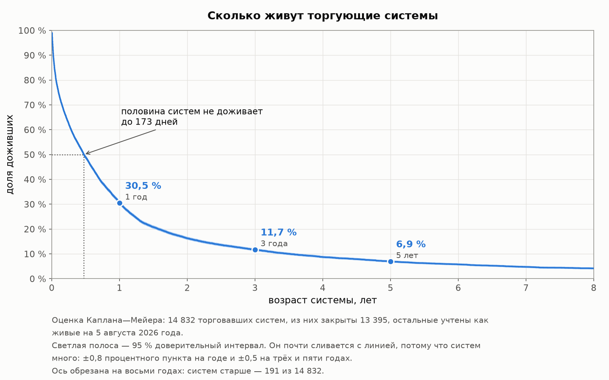
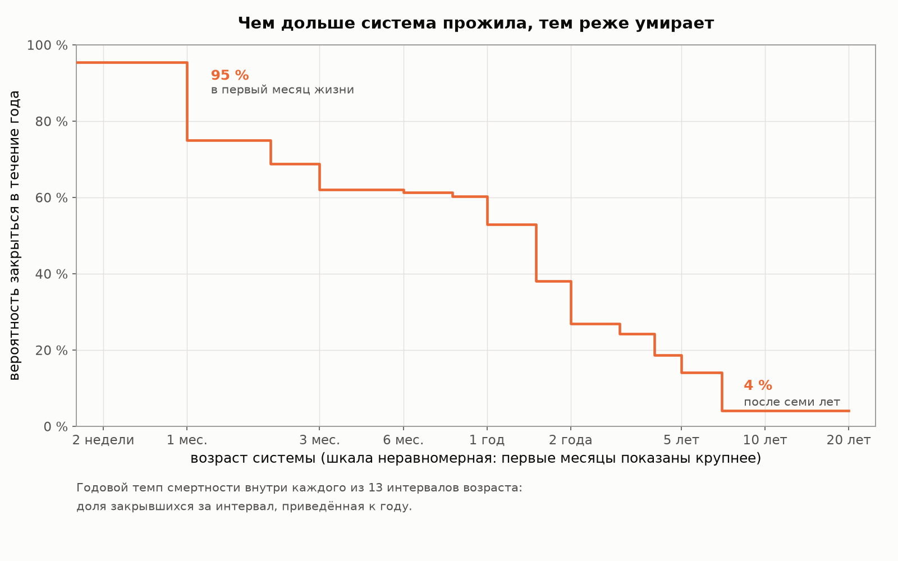
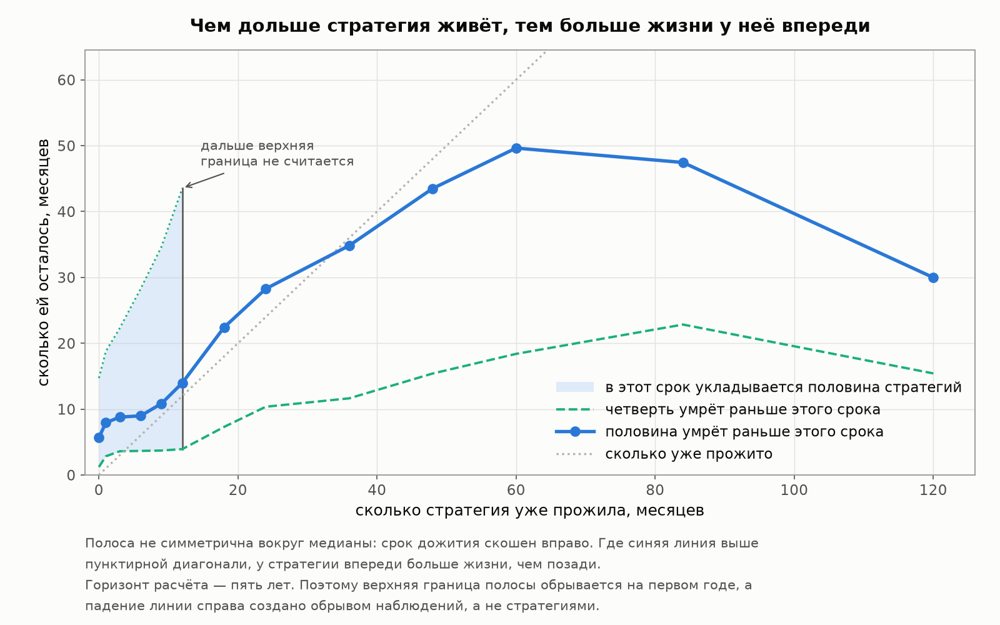
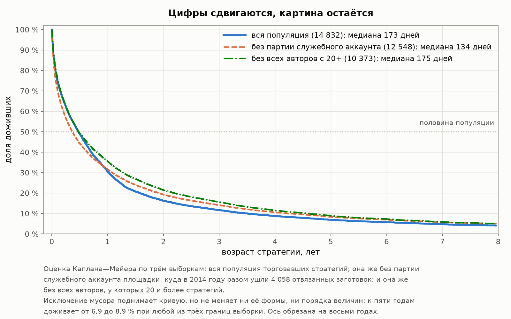
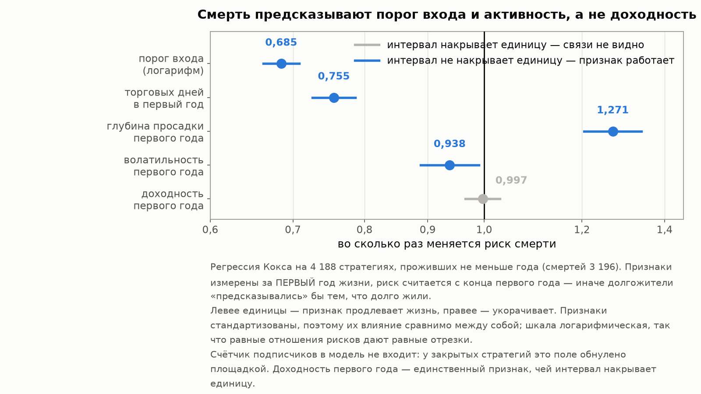

# Глава 2. Кладбище: что происходит со стратегией после запуска

[Лицензия](comon-story-license.md) · [Введение](comon-story-0-intro.md) · [1 — Площадка и витрина](comon-story-1-market.md) · **Глава 2 из 5** · [3 — Из чего сделана доходность](comon-story-3-returns.md) · [4 — Продавцы](comon-story-4-authors.md) · [Интерлюдия — вторая площадка](comon-story-4b-interlude.md) · [5 — Покупатели](comon-story-5-buyers.md) · [Заключение](comon-story-6-conclusion.md)

*Данные, методы и словарь терминов — во [введении](comon-story-0-intro.md). Все метрики пересчитаны из дневных рядов 19 978 стратегий Comon, включая 18 529 закрытых.*

---

Витрина сортирует стратегии по доходности, и разговор о выборе обычно начинается с неё. Данные говорят, что начинать надо с другого.

Главный риск подписчика — не в том, что стратегия проиграет. Он в том, что **стратегии не станет**. Это происходит быстрее и чаще, чем можно предположить, глядя на витрину, где все стратегии по определению живы.

## 2.1 Сколько живёт стратегия: медиана — 173 дня

В расчёт берутся 14 832 стратегии, которые **хотя бы раз совершили сделку**. Пустые заготовки — 5 145 штук, из них 5 134 закрытые, то есть больше четверти всего архива, — исключены: они описывают поведение людей при регистрации, а не выживаемость торговых систем. Смертей — 13 395; 1 437 стратегий живы на день среза, и это тоже данные, просто незавершённые.

Здесь нужна короткая методическая ремарка, иначе число будет неверным. Если посчитать срок жизни только по умершим, получится **106 дней**. Но так считать нельзя: живые стратегии, среди которых есть десятилетние, в такой расчёт просто не попадут, и картина выйдет мрачнее реальности. Правильный способ — тот же, каким в медицине считают выживаемость пациентов: живые учитываются как «дожили как минимум до сегодня». Он даёт:

**Медианный срок жизни торгующей стратегии — 173 дня.** Меньше полугода.

| Дожили до | Доля | 95 % интервал | Из 1000 стратегий останется |
|---|---:|---|---:|
| Полугода | 48.9 % | 48.1–49.7 % | 489 |
| 1 года | 30.5 % | 29.7–31.2 % | 305 |
| 2 лет | 16.3 % | 15.7–16.9 % | 163 |
| **3 лет** | **11.7 %** | 11.2–12.3 % | **117** |
| **5 лет** | **6.9 %** | 6.5–7.4 % | **69** |
| 7 лет | 4.8 % | 4.3–5.2 % | 48 |
| 10 лет | 2.8 % | 2.3–3.2 % | 28 |

Читается это так: **из тысячи запущенных стратегий через год работают триста, через три года — сто семнадцать, через пять лет — шестьдесят девять**.

Отсюда прямое следствие для того, кто выбирает по витрине. Стратегия с трёхлетней историей — не «одна из многих», а одна из девяти. Это не значит, что она хорошая; это значит, что она редкая по другому признаку — она дожила.

## 2.2 Когда умирают: риск падает с возрастом

Смертность распределена по жизни крайне неравномерно.

| Месяц жизни | Стратегий под риском | Умерло | Риск за интервал | В годовом темпе |
|---|---:|---:|---:|---:|
| 0–1 | 14 832 | 3 369 | **22.7 %** | 95.5 % |
| 1–2 | 11 403 | 1 246 | 10.9 % | 75.1 % |
| 2–3 | 10 120 | 938 | 9.3 % | 68.9 % |
| 3–6 | 9 148 | 1 966 | 21.5 % | 62.0 % |
| 6–9 | 7 067 | 1 494 | 21.1 % | 61.3 % |
| 9–12 | 5 451 | 1 124 | 20.6 % | 60.3 % |
| 12–18 | 4 251 | 1 334 | 31.4 % | 52.9 % |
| 18–24 | 2 806 | 597 | 21.3 % | 38.0 % |
| 24–36 | 2 105 | 565 | 26.8 % | 26.8 % |
| 36–48 | 1 366 | 332 | 24.3 % | 24.3 % |
| 48–60 | 896 | 167 | 18.6 % | **18.6 %** |
| 60–84 | 589 | 154 | 26.1 % | **14.1 %** |
| 84 и дальше | 261 | 109 | 41.8 % | **4.1 %** |

*«Риск за интервал» — доля тех, кто умер за этот отрезок, от числа доживших до его начала. «В годовом темпе» — тот же риск, пересчитанный на год, чтобы отрезки разной длины были сравнимы между собой.*

**Почти четверть стратегий умирает в первый же месяц.** Годовой темп смертности падает с 95 % на старте до 14–19 % после четвёртого года — то есть **чем дольше стратегия живёт, тем ниже её текущий риск умереть**. Это классическая картина отсева слабых на входе: сначала отваливаются те, кто попробовал и бросил, дальше остаются те, кто работает всерьёз.

Практический смысл: **возраст стратегии — это реальная информация**, и притом одна из немногих, доступных на витрине бесплатно. Пережившая три года стратегия умирает примерно вчетверо реже свежезапущенной.

С одной оговоркой, важной настолько, что мы вернёмся к ней в [главе 3](comon-story-3-returns.md): возраст говорит именно о **живучести**. О доходности он тоже кое-что говорит — но совсем не то, чего ожидаешь, и разбирать это лучше вместе с остальными цифрами о доходности.

### Сколько ей осталось: таблица дожития

Раз риск смерти зависит от возраста, полезнее не общая медиана, а тот же вопрос, что задают демографы: **если стратегия дожила до возраста N, сколько ей осталось?**

| Дожила до | Таких осталось от старта | **Медиана остатка** | Четверть умрёт за | Три четверти умрут за | Ожидаемая длина жизни целиком |
|---:|---:|---:|---:|---:|---:|
| Старт | 100 % | **5.7 мес** | 1.2 мес | 14.7 мес | 15.4 мес |
| 1 месяц | 77.3 % | 7.9 мес | 2.8 мес | 18.8 мес | 19.8 мес |
| 3 месяца | 62.4 % | 8.8 мес | 3.6 мес | 22.3 мес | 24.2 мес |
| 6 месяцев | 48.9 % | 9.0 мес | 3.7 мес | 28.3 мес | 29.8 мес |
| **1 год** | 30.5 % | **14.0 мес** | 3.9 мес | 43.6 мес | 43.0 мес |
| 1.5 года | 20.8 % | 22.4 мес | 7.3 мес | 60.8 мес | 56.9 мес |
| **2 года** | 16.3 % | **28.3 мес** | 10.4 мес | 74.6 мес | 67.6 мес |
| 3 года | 11.7 % | 34.8 мес | 11.6 мес | 80.4 мес | 84.0 мес |
| 4 года | 8.7 % | 43.5 мес | 15.4 мес | 87.0 мес | 99.6 мес |
| **5 лет** | 6.9 % | **49.6 мес** | 18.4 мес | 83.2 мес | 111.6 мес |

*«Медиана остатка» — срок, за который доживших до этого возраста станет вдвое меньше. «Четверть умрёт за» и «три четверти умрут за» — то же для потери четверти и трёх четвертей группы. Последняя колонка — прожитый возраст плюс средний остаток; средний остаток ограничен горизонтом десяти лет, потому что неограниченного среднего здесь не существует (см. приложение Б5).*

**Ожидаемый остаток растёт с возрастом, и растёт сильно.** Только что запущенной стратегии остаётся меньше полугода. Прожившей год — четырнадцать месяцев. Прожившей два года — двадцать восемь. Пятилетней — почти пятьдесят месяцев, то есть **впереди у неё вдвое больше, чем весь ожидаемый срок жизни новорождённой**.

Демографу такая картина знакома: так выглядят таблицы дожития общества с высокой детской смертностью. Средняя продолжительность жизни там низкая не потому, что взрослые живут мало, а потому, что многие не переживают первых лет; кто пережил — живёт долго. С торговыми стратегиями ровно то же: медиана в 173 дня создана массовым отсевом на входе, а не тем, что «стратегии в принципе живут полгода».

Разброс при этом остаётся огромным на любом возрасте. У годовалой стратегии четверть сверстниц исчезнет в ближайшие четыре месяца, а три четверти — только через три с половиной года. **Ожидаемый остаток — характеристика группы, а не прогноз для конкретной стратегии.**

## 2.3 От чего умирают

«Умерла» — слишком грубое слово для того, что происходит с этими стратегиями на самом деле. Мы разобрали каждую закрытую стратегию по **механизму смерти**: что именно случилось в конце.

| Что произошло | Стратегий | Доля архива | Медиана срока жизни | Медиана итога |
|---|---:|---:|---:|---:|
| **Не стартовала** — ни одной сделки за всю жизнь | 5 134 | 27.7 % | — | — |
| Недостаточно истории, чтобы судить | 7 506 | 40.5 % | 139 дней | −18.9 % |
| **Смерть у собственного пика** — от лучшей точки своей кривой упала не больше чем на 5 % | 3 189 | 17.2 % | 32 дня | **+1.6 %** |
| **Заброшена** — 90+ дней без сделок до закрытия | 2 081 | 11.2 % | 256 дней | −18.1 % |
| Слом не подтверждён — признаки есть, доказательства нет | 283 | 1.5 % | 954 дня | −2.2 % |
| Обычная просадка в пределах своей истории | 241 | 1.3 % | 1 063 дня | +32.6 % |
| **Деградация** — механизм сломался | **95** | **0.5 %** | 1 039 дней | −5.1 % |

*База — **все 18 529 закрытых стратегий**: механизм смерти разобран у каждой. Живых здесь нет по определению: смерти у них ещё не было. 🔴 **«Медиана итога» здесь и всюду в главе — результат подписчика, который вошёл в первый день жизни стратегии и не выходил.** Тот, кто подписался позже — а подписываются всегда позже, — получил бы другое; насколько другое, посчитано в конце раздела. Медиана срока жизни и медиана итога у класса «не стартовала» не существуют — стратегия не торговала ни дня, поэтому в этих клетках прочерк, а не ноль. Три последних класса разделены проверкой на слом — она устроена из двух независимых тестов и разбирается в разделе 2.5: «деградация» означает, что сработали оба теста, «слом не подтверждён» — что сработал только один и этого мало для вердикта, «обычная просадка» — что не сработал ни один и стратегия закрылась в пределах привычного для себя риска.*

Первое, что бросается в глаза: **больше четверти архива никогда не торговало**, а ещё 17 % закрылись, стоя на максимуме собственной кривой. Смерть здесь чаще всего не катастрофа, а тишина. Оговорки здесь две, и обе важные. Первая: максимум собственной кривой — не то же самое, что прибыль. У стратегии, которая с самого начала ушла в минус и больше не возвращалась, лучшая точка тоже ниже вложенной суммы, и закрытие «у пика» означает лишь, что напоследок она не обвалилась. Вторая: **треть этого класса — стратегии с очень коротким рядом**, у 507 из 3 189 торговый день вообще один. Когда точек мало, «умерла у пика» получается почти автоматически: падать от единственной точки некуда. Само определение (упала от максимума не больше чем на 5 %) от этого не портится и порог задан заранее, но читать 17 % как «каждая шестая стратегия закрылась на своём лучшем результате» не стоит — заметная их часть просто не успела ничего показать.

Особенно показательна связка механизма с финансовым итогом:

| Механизм \ Итог | Разорение | Убыток | Прибыль | Итого |
|---|---:|---:|---:|---:|
| Заброшена | 359 | 1 182 | 540 | 2 081 |
| **Смерть у пика** | 3 | 1 173 | **2 013** | 3 189 |
| Обычная просадка | 1 | 33 | 207 | 241 |
| **Деградация** | 31 | 18 | **46** | 95 |
| Слом не подтверждён | 33 | 115 | 135 | 283 |
| Недостаточно истории | 806 | 5 449 | 1 251 | 7 506 |
| **Итого** | **1 233** | **7 970** | **4 192** | **13 395** |

*Оси таблицы независимы, и это стоит держать в голове, потому что иначе несколько клеток выглядят противоречиво. Механизм отвечает на вопрос «как выглядел конец», итог — «сколько денег осталось у подписчика по сравнению с вложенной суммой». Ниже разобраны три клетки, которые чаще всего вызывают вопрос.*

**Как можно умереть у пика и остаться в убытке — 1 173 случая.** «Пик» здесь — лучшая точка **собственной кривой стратегии**, а не уровень изначального капитала. У двух третей этих стратегий (799 из 1 173) кривая вообще ни разу не поднималась выше вложенной суммы: их лучшая точка тоже ниже старта, и умереть «у пика» означает лишь, что напоследок они не обвалились. Мы проверили эти случаи поштучно, и главное в них оказалось не в механизме, а в масштабе: **медианный убыток здесь — 2.6 %, а больше половины стратегий торговали не дольше четырёх дней**. Это не драма отыгрыша и потери, а несколько сделок, мелкий минус и закрытие. Класс говорит только о том, что финального обвала не было: стратегия не рухнула напоследок, она просто перестала торговать.

**Как разорившаяся стратегия попадает в «смерть у пика» — 3 случая.** Мы посмотрели все три. У каждой из них **один-единственный торговый день**, и на нём потеряно от 91 до 99.5 % капитала: одна сделка 15 августа 2011 года, одна 14 февраля 2019-го, одна 25 июня 2024-го. Разорение здесь очевидно, а «смерть у пика» присвоена вырожденно: когда в ряду одна точка, она же и максимум, поэтому падения от пика формально нет. Три случая на 3 189 — не картина, а край, где определение упирается в слишком короткий ряд.

**Как разорение может оказаться «обычной просадкой» — 1 случай.** Этот случай стоит разобрать полностью, потому что он показывает границу самого слова «разорение». Стратегия прожила 430 торговых дней, вырастала почти втрое, потом падала до восемнадцати копеек с рубля — просадка 94 %, отсюда и класс «разорение», который присваивается по **худшей точке за всю жизнь**. Но закончила она **с прибылью 26 %**: после провала кривая восстановилась, и последнее падение — 56 % от максимума — для стратегии с таким размахом оказалось рядовым. Проверка на слом (раздел 2.5) сравнивает финальное падение не с абсолютным порогом, а с собственной историей: для спокойной кривой провал в 30 % — событие, для этой и 56 % — обычный день. Ломаться ей было нечему, она такой и была с самого начала. Ровно поэтому абсолютных порогов мы не используем — и ровно поэтому «разорение» в наших таблицах означает «в какой-то момент теряла почти всё», а не «оставила подписчика ни с чем».

**2 013 стратегий закрылись у своего пика и в плюсе.** Машина была цела, деньги на месте — и всё равно стратегия исчезла. Почему именно, данные не говорят: причины закрытия нам не видны, видно только, что торговля прекратилась в лучшей точке. Для подписчика это в любом случае одинаково — надо искать новую стратегию.

И обратная, более редкая, но более неприятная ячейка: **46 стратегий деградировали, оставаясь в прибыли**. Механизм уже сломался, а итоговая цифра ещё зелёная. Без разделения на две оси такие случаи выглядели бы как благополучные закрытия.

Теперь о худшем исходе. **Разорение — 1 233 стратегии, 6.7 % архива**: просадка глубже 90 % или от капитала осталась десятая часть. Стратегий, потерявших 95 % и больше, — 730. Накопленным итогом вероятность разорения выглядит так:

| Через сколько лет | Вероятность разориться |
|---|---:|
| 1 год | 4.0 % |
| 3 года | 7.3 % |
| 5 лет | 8.8 % |
| 10 лет | 9.9 % |

**Примерно одна из четырнадцати торгующих стратегий за три года теряет почти всё.** Это не хвост распределения, это регулярное событие.

### Итог стратегии — это не итог подписчика

Во всех таблицах выше «итог» означает одно: **что получил бы человек, подписавшийся в первый день жизни стратегии и не отписавшийся ни разу**. Таких подписчиков не бывает. На витрину смотрят, когда там уже есть что показать, — а к этому моменту часть кривой, в том числе самая приятная её часть, уже пройдена.

Посчитаем два других входа на тех же 13 393 умерших стратегиях, у которых была хотя бы одна сделка. **Вход на пике**: человек увидел хорошую историю и подписался на максимуме кривой; его результат — это ровно та просадка от вершины, которой стратегия закончила жизнь. **Случайный вход**: подписка в произвольный день, медиана по всем возможным дням.

| Когда подписался | p10 | p25 | Медиана | p75 | p90 | Доля в минусе |
|---|---:|---:|---:|---:|---:|---:|
| В первый день (это и есть «итог» таблиц выше) | −80.8 % | −37.1 % | **−8.5 %** | +2.3 % | +21.2 % | 68.6 % |
| В случайный день жизни стратегии | −57.9 % | −20.5 % | **−3.5 %** | 0.0 % | +7.4 % | 64.0 % |
| На пике кривой | −85.7 % | −48.5 % | **−19.1 %** | −5.2 % | −0.7 % | **94.5 %** |

*База — 13 393 закрытые стратегии, торговавшие хотя бы день (у двух из 13 395 ряд непригоден для расчёта). Все числа валовые: плата за следование и комиссии брокера подписчика не вычтены. Пик определён задним числом по всей кривой.*

🔴 **Как это читать.** Вход на пике — не портрет типичного подписчика, а **верхняя граница пессимизма**: в момент подписки никто не знает, что стоит на вершине. Случайный вход — нейтральная середина. Реальный опыт лежит между этими двумя строками, и обе они хуже той, что публикуется как результат стратегии. Заодно видно неочевидное: случайный вход **лучше** входа в первый день (−3.5 % против −8.5 %) — поздний подписчик пропускает часть падения тех стратегий, которые пошли вниз сразу.

Самое неприятное — там, где витрина выглядит хорошо. Возьмём стратегии, у которых **до пика было не меньше 100 торговых дней и накопленный рост не меньше +50 %**: именно такую историю человек и разглядывает, прежде чем подписаться. Таких 1 126 — 8.4 % умерших с торгами, медианный рост к пику +117 %, медианная история до пика 310 торговых дней.

| Сценарий (медианы по 1 126 стратегиям) | Результат |
|---|---:|
| Итог стратегии (подписка в первый день) | **+40.4 %** |
| Подписка в случайный день | 0.0 % |
| Подписка на пике | **−34.3 %** |
| Доля стратегий, где вход на пике дал минус | 95.8 % |
| Медианный срок, который подписчик держал бы после пика | 225 дней |

**Стратегия, показавшая за жизнь +40 %, вошедшему на её максимуме отдала бы −34 %.** И это не редкая клетка: из 4 200 стратегий, закончивших жизнь в плюсе, **82.5 % оставили бы подписавшегося на пике в минусе**. Причём чем ярче витрина, тем сильнее расхождение: у стратегий с итогом больше +500 % медианный итог 1 003 %, а вход на пике даёт −13.3 %.

Отсюда правило чтения всей главы: числа в её таблицах описывают **судьбу стратегий**, а не опыт клиентов. Полная разбивка по механизмам смерти — в приложении Б13.

## 2.4 Кто закрывает стратегию — и почему это не всегда автор

Читая «стратегия закрыта», естественно вообразить человека, который решил всё бросить. Правила площадки говорят, что это часто не так.

Регламент содержит закрытый список причин, по которым **администрация сама** переносит стратегию в архив — отключая всех подписчиков и блокируя учётную запись автора:

| Критерий по правилам | Можно ли измерить в наших данных |
|---|---|
| Полный вывод денег со счёта стратегии | Косвенно — проявляется как обрыв сделок |
| Оценка счёта в течение месяца не превышает 30 000 ₽ | Оценка сверху |
| Доходность не меняется 3 месяца и более | **Прямо** |
| Доходность составляет менее −95 % | **Прямо** |
| Нет никаких операций 3 месяца и более | **Прямо** |

Мы посчитали, сколько стратегий подпадает под эти критерии:

| Оценка | Стратегий | Доля архива |
|---|---:|---:|
| **Нижняя** — только прямо наблюдаемые критерии | **4 681** | **25.3 %** |
| **Верхняя** — плюс оценка по размеру счёта | 10 036 | 54.2 % |
| Не подпадают ни под один наблюдаемый критерий | 8 493 | 45.8 % |

Верхняя оценка слабая, и мы это подчёркиваем: медианный порог входа по популяции — ровно 30 000 ₽, то есть половина стратегий стартует прямо на границе, и любой убыток формально переводит их в этот класс. Надёжная цифра — нижняя: **администрацией закрыта как минимум четверть архива**.

🔴 **Самое существенное здесь — судьба класса «заброшена».** Все 2 081 стратегия в нём подпадают под критерий принудительного закрытия «нет операций три месяца». То есть это **не** «автор потерял интерес и закрыл» — это площадка закрыла за бездействие. Разница принципиальна для того, кто пытается понять причины смертности.

С этой поправкой картина причин выглядит уже не двусторонней, а трёхсторонней:

| Кто «убил» стратегию | Стратегий | Доля архива | Медиана итога |
|---|---:|---:|---:|
| **Администрация** (наблюдаемо) | 4 681 | **25.3 %** | 0.0 % |
| Рынок: убыток | 6 770 | 36.5 % | −16.4 % |
| Рынок: разорение | 389 | 2.1 % | −89.6 % |
| Рынок: деградация | 64 | 0.3 % | +26.1 % |
| Автор: ушёл в прибыли | 3 606 | 19.5 % | +8.4 % |
| Автор: прочее | 3 019 | 16.3 % | 0.0 % |

**Итого: администрация 25.3 %, рынок 39.0 %, автор 35.8 %.**

И здесь стоит сказать то, что редко говорят про площадку в таком тексте: **эта уборка сделана в интересах подписчика**. Стратегия, которая три месяца не торгует, счёт которой опустел, или которая потеряла 95 % капитала, не должна оставаться на витрине как живой вариант для подписки. Правила заставляют её убрать, и правила работают.

У той же уборки есть побочный эффект, о котором мы предупреждали во [введении](comon-story-0-intro.md): именно она превращает витрину в галерею выживших. Все убранные стратегии продолжают существовать в архиве — но их никто не видит, кроме тех, кто специально пойдёт искать. Это ровно то, что мы и сделали.

## 2.5 Сломалась или просто просела: как отличить

Из всех причин смерти одна интересует нас особенно, потому что она единственная бьёт по подписчику напрямую: **стратегия перестала работать**. Не «неудачный месяц», а «механизм сломался».

Отличить одно от другого сложнее, чем кажется. Абсолютные пороги здесь бесполезны: для спокойной стратегии просадка 30 % — катастрофа, для агрессивной — рядовое событие. Поэтому эталоном служит **собственная история каждой стратегии**, а вердикт выносится только при согласии двух независимых тестов:

**Тест первый — «бывало ли с ней такое раньше».** Берётся вся история до начала финальной просадки, из неё многократно (2 000 раз) пересобираются искусственные варианты того, как эта стратегия могла бы идти дальше, и смотрится, насколько глубокие просадки для неё вообще типичны. Если финальная просадка попадает в худшие 5 % — своим обычным риском она не объясняется.

**Тест второй — «был ли перелом».** По дневному ряду ищется момент, после которого поведение стратегии изменилось: средняя доходность ушла вниз и продержалась в новом состоянии не меньше 60 торговых дней. Одна плохая неделя переломом не считается.

| Класс | Стратегий | Медиана финальной просадки | Медиана «своего» порога |
|---|---:|---:|---:|
| Обычная просадка | 241 | −16.4 % | −33.8 % |
| Слом не подтверждён (сработал один тест из двух) | 283 | −43.6 % | −25.2 % |
| **Деградация** (сработали оба) | **95** | **−56.2 %** | −26.7 % |

Деградировавшие стратегии проседали на 56 % при том, что их собственная история предсказывала не глубже 27 %. И это был не эпизод: **медиана жизни в сломанном состоянии — 218 торговых дней**, почти год работы уже неисправной машины.

🔴 **А теперь честное ограничение, без которого предыдущий абзац читался бы неверно.** Чтобы вынести вердикт, нужна история: не меньше 250 торговых дней **до** начала финальной просадки. Такую историю имеют лишь **1 098 стратегий — 5.9 % архива** (если же считать не от всего архива, а только от закрытых стратегий, у которых была хотя бы одна сделка, — 8.2 %); после отсева заброшенных и умерших у пика в тесты попали 619. Медиана истории до пика по всему архиву — **12 торговых дней**.

Поэтому вывод «деградация встречается редко» (0.5 % архива, 0.6 % за десять лет) относится **только к тем стратегиям, у которых хватило истории на вердикт**. Про остальные мы честно не знаем — и предпочитаем это сказать, а не назначить им причину смерти.

Правильное чтение такое: **среди стратегий, доживших до статистической зрелости, поломка механизма — не главная причина смерти. Чаще стратегия закрывается в спокойном состоянии — нередко прямо на своём максимуме — или просто в убытке, без всякого перелома.**

## 2.6 Насколько эта популяция вообще «нормальная»

Прежде чем принимать цифры выживаемости всерьёз, нужно проверить, не искажены ли они мусором. Две находки говорят, что засорённость реальна.

**Первая: разовая чистка 2014 года.** В данных виден резкий всплеск — 4 231 стратегия начала свой ряд в 2014 году, вчетверо больше, чем в соседние годы. Объяснение находится сразу: **3 712 из них (87.7 %) числятся за служебным аккаунтом площадки**. Всего за этим аккаунтом 4 058 стратегий — 21.9 % архива, живых среди них нет. Правила разрешают переносить стратегию в архив «путём отключения счёта стратегии от аккаунта», и отвязанные стратегии оказываются именно там.

| Год архивации | Служебный аккаунт | Остальные | Доля служебного |
|---|---:|---:|---:|
| 2013 | 0 | 307 | 0.0 % |
| **2014** | **3 862** | 928 | **80.6 %** |
| 2015 | 184 | 915 | 16.7 % |
| 2016 | 12 | 757 | 1.6 % |
| 2017 и позже | 0 | ~10 700 | 0.0 % |

Это не текущая практика наказаний, а единовременное событие: у этой партии половина не торговала ни дня, подписчиков — ноль, доля разорившихся не выше, чем у остальных. Похоже на разовую уборку старого пласта пустых заготовок.

**Вторая: фабрики стратегий.** Правила площадки грозят блокировкой за «многократные попытки создания стратегий с короткими сроками существования». В данных это видно прямо:

| Стратегий у автора | Авторов | Стратегий | Из них не торговали ни дня | Медиана срока жизни торговавших |
|---|---:|---:|---:|---:|
| 1 | 3 107 | 3 107 | 20.0 % | **289 дней** |
| 2–3 | 1 517 | 3 510 | 21.2 % | 171 день |
| 4–9 | 747 | 4 098 | 19.2 % | 134 дня |
| 10–19 | 170 | 2 206 | 18.1 % | 86 дней |
| **20 и больше** | **65** | **2 998** | **27.5 %** | **25 дней** |

*Служебный аккаунт площадки из таблицы исключён: за ним числятся 4 058 отвязанных стратегий, но это не автор. Срок жизни — от создания до последнего торгового дня, как и везде в главе; считается по стратегиям, которые хотя бы раз торговали, поэтому рядом стоит доля тех, кто не торговал вовсе.*

**Шестьдесят пять авторов держат 2 998 стратегий — 15 % всего каталога в 19 978 записей, а медианная жизнь такой системы — двадцать пять дней** против 289 дней у авторов единственной стратегии. Связь монотонная: чем больше стратегий у автора, тем короче их жизнь — ровно то поведение, против которого написано правило. У фабрик выше и доля пустых заготовок: 27.5 % против 18–21 % в остальных группах. Подробнее об этих людях — в [главе 4](comon-story-4-authors.md); там та же группа берётся с отсечкой «больше 20» и считается от популяции без служебного аккаунта, поэтому числа выглядят иначе — 62 автора, 2 938 стратегий и доля 18.5 %.

Главный вопрос: не держится ли вся картина смертности на этом мусоре? Проверяем, убирая подозрительные группы:

| Выборка | Стратегий | Медиана жизни | Дожили 1 год | 3 года | 5 лет |
|---|---:|---:|---:|---:|---:|
| Вся популяция | 14 832 | 173 дня | 30.5 % | 11.7 % | 6.9 % |
| Без партии служебного аккаунта | 12 548 | 134 дня | 31.6 % | 14.1 % | 8.4 % |
| Без всех авторов с 20 и более стратегиями | 10 373 | 175 дней | 35.5 % | 15.7 % | 8.9 % |

*Третья строка убирает и фабрики, и служебный аккаунт разом — он тоже попадает под условие «20 и более».*

**Выводы устойчивы.** Доля доживших до трёх лет сдвигается с 11.7 % к 14–16 %, до пяти лет — с 6.9 % к 8.4–8.9 %. Порядок величин и форма кривой те же, медиана жизни остаётся в диапазоне 130–175 дней. То есть даже если считать только «серьёзные» стратегии, до трёх лет доживает примерно каждая седьмая, а до пяти — каждая двенадцатая.

## 2.7 Что предсказывает выживание — и что не предсказывает ничего

Последний вопрос главы самый практичный: можно ли, глядя на стратегию, угадать, доживёт ли она?

Мы взяли 4 188 стратегий, проживших хотя бы год, измерили их характеристики **за первый год** и посмотрели, как это связано со смертностью в дальнейшем. Такой порядок важен: иначе получилось бы, что долгожители «предсказываются» тем, что они долго жили.

| Характеристика первого года | Во сколько раз меняется риск смерти | Значимость |
|---|---:|---|
| **Порог входа** (минимальная сумма подписки) | **0.685** — выше порог, реже умирают | очень высокая |
| **Регулярность торговли** (число торговых дней) | **0.755** — торгует чаще, живёт дольше | очень высокая |
| **Глубина просадки в первый год** | **1.271** — глубже просадка, чаще умирают | очень высокая |
| Волатильность первого года | 0.938 | слабая |
| **Доходность за первый год** | **0.997** | **нет вообще** (p = 0.86) |

Числа означают изменение риска при росте признака на одно стандартное отклонение: 0.685 — риск падает почти на треть, 1.271 — растёт на 27 %.

Три вывода, и третий — главный.

**Порог входа предсказывает живучесть лучше всего.** Высокий минимум для подписчика — это косвенный признак серьёзности намерений автора: такую стратегию не заводят на пробу. Забегая вперёд, в [главе 5](comon-story-5-buyers.md) выяснится, что порог входа — сильнейший из заранее видимых на витрине признаков, связанных с качеством (частота сделок связана тоже, но слабее).

**Регулярность торговли работает, глубокая ранняя просадка вредит.** Обе связи интуитивны и обе сильны.

🔴 **Доходность первого года не предсказывает выживание вообще.** Не «слабо предсказывает» — не предсказывает: стратегии, заработавшие в первый год, умирают ровно так же часто, как убыточные. Ранний хороший результат — не свидетельство прочности.

Сразу оговорим, чего этот вывод не означает. Он не о том, как распределяются подписки: в данных подписки связаны со свежим результатом заметно слабее, чем с доходностью за всю историю стратегии и с её возрастом ([глава 5](comon-story-5-buyers.md)). Возраст, как мы видели в разделе 2.2, с живучестью действительно связан. Речь именно о раннем результате: первые двенадцать месяцев прибыли не говорят о том, что стратегия проживёт дольше.

Обычная оговорка: всё перечисленное — связи, а не причины. Высокий порог входа не делает стратегию живучей; он лишь встречается там же, где живучесть. Поднять минимальную сумму, чтобы стратегия зажила дольше, невозможно.

---

## Выводы главы

1. **Медианная стратегия живёт 173 дня.** До года доживает 30.5 %, до трёх лет — 11.7 %, до пяти — 6.9 %. Из тысячи запущенных стратегий через пять лет работают шестьдесят девять.

2. **Смертность падает с возрастом.** 22.7 % умирают в первый месяц, годовой темп снижается с 95 % на старте до 14–19 % после четвёртого года. Возраст стратегии — реальная информация о её живучести, доступная на витрине бесплатно. О будущей доходности он говорит отдельный и неожиданный разговор — в [главе 3](comon-story-3-returns.md).

3. **Ожидаемый остаток жизни растёт с возрастом.** Новорождённой стратегии остаётся в среднем меньше полугода, прожившей год — 14 месяцев, двухлетней — 28, пятилетней — почти 50 месяцев. Медиана в 173 дня создана массовым отсевом на входе, а не тем, что «стратегии в принципе живут полгода» — это та же арифметика, что в таблицах дожития общества с высокой детской смертностью.

4. **Смерть чаще всего не катастрофа, а тишина.** Больше четверти архива не совершило ни одной сделки; 17.2 % закрылись, стоя на собственном пике, и 2 013 из них — в плюсе. Для подписчика такая смерть означает потерю стратегии, но не денег.

5. **Разорение — регулярное событие, а не хвост.** 6.7 % архива потеряли почти всё; вероятность разориться составляет 4.0 % за первый год и 7.3 % за три года. Примерно одна торгующая стратегия из четырнадцати за три года теряет почти весь капитал.

6. **Четверть архива закрыла администрация, а не автор.** Все 2 081 «заброшенная» стратегия подпадают под критерий принудительного закрытия за три месяца бездействия. Итоговое разделение причин: администрация 25.3 %, рынок 39.0 %, автор 35.8 %. Эта уборка сделана в интересах подписчика — и она же превращает витрину в галерею выживших.

7. **Доказанная деградация редка — 0.5 % архива, — но это нижняя граница.** Вердикт требует 250 торговых дней истории, которые есть лишь у 5.9 % архива — или у 8.2 %, если считать только те закрытые стратегии, что совершили хотя бы одну сделку. Среди доживших до статистической зрелости стратегия чаще закрывается в спокойном состоянии или в обычном убытке, чем ломается.

8. **Популяция засорена, но выводы устойчивы.** 21.9 % архива — разовая чистка 2014 года; ещё 15 % популяции держат 65 авторов-фабрик, у которых медиана жизни стратегии 25 дней против 289 у авторов единственной стратегии. Если убрать и тех и других, до трёх лет доживает 14–16 % вместо 11.7 %: цифры сдвигаются, картина остаётся.

9. 🔴 **Доходность первого года не предсказывает выживание** (p = 0.86). Предсказывают порог входа (риск ниже на треть), регулярность торговли и отсутствие глубокой ранней просадки. Ранний хороший результат — не признак прочности; оценивать по нему шансы стратегии дожить бессмысленно.

10. 🔴 **Итог стратегии — не итог подписчика.** Все числа главы описывают того, кто вошёл в первый день и не выходил; таких не бывает. Подписавшийся на пике кривой оказывается в минусе в **94.5 %** случаев при медиане −19.1 %, случайный вход даёт −3.5 %. На стратегиях с привлекательной витриной — не меньше 100 торговых дней истории и рост от +50 % до пика — расхождение максимально: итог **+40.4 %**, вход на пике **−34.3 %**. Из 4 200 стратегий, закончивших жизнь в плюсе, **82.5 % оставили бы вошедшего на пике в минусе**.

Стратегии, которая доживёт, недостаточно: она должна ещё и зарабатывать. О том, сколько доходности бывает на самом деле и из чего она сделана, — [глава 3](comon-story-3-returns.md).

---

# Приложение: полная статистика

## Б1. Известные ограничения этой главы

- **Мощность теста деградации.** Через оба теста прошли 619 стратегий из 18 529. Для 40.5 % архива вердикт невозможен в принципе — слишком короткая история.
- **Границы классов условны.** Пороги «заброшена» (90 дней) и «смерть у пика» (5 %) заданы заранее — это правильно с точки зрения защиты от подгонки, но стратегия с просадкой 6 % попадёт в другой класс, чем с 4 %.
- **Разорение определяется по ряду доходности**, а не по факту принудительного закрытия позиций брокером: просадка ≥ 90 % от пика либо от капитала осталось ≤ 10 %.
- **Причина смерти неизвестна для живых.** 1 437 живых стратегий цензурированы — то есть учтены как «дожили как минимум до дня среза», а чем закончится их жизнь, неизвестно. Для кривых дожития это корректно, но в структуру причин они вклада не вносят.
- **Верхняя оценка доли принудительных закрытий (54.2 %) слабая** и приведена только как граница: она опирается на порог входа как прокси размера счёта, а это не тождество.

---

## Б2. Выборка и определения

- В анализ выживаемости входят **14 832 стратегии**, совершившие хотя бы одну сделку. Исключены 5 145 не стартовавших.
- Событий (смертей) — 13 395; цензурировано 1 437 живых на 2026-08-04 (последний день, за который есть данные во всех рядах).
- **Дата смерти — последний торговый день**, а не дата архивации (обоснование — приложение А8 [главы 1](comon-story-1-market.md)).
- Кривая дожития — оценка Каплана—Мейера, доверительные интервалы 95 %.
- Классы механизма смерти заданы заранее и не подбирались под результат: «заброшена» — 90 дней без сделок, «смерть у пика» — просадка не глубже 5 %.

## Б3. Кривая дожития (Каплан—Мейер)

| Дожили до | Доля | 95 % ДИ | Из 1000 |
|---|---:|---|---:|
| 0.5 года | 48.9 % | 48.1–49.7 % | 489 |
| 1 год | 30.5 % | 29.7–31.2 % | 305 |
| 2 года | 16.3 % | 15.7–16.9 % | 163 |
| 3 года | 11.7 % | 11.2–12.3 % | 117 |
| 5 лет | 6.9 % | 6.5–7.4 % | 69 |
| 7 лет | 4.8 % | 4.3–5.2 % | 48 |
| 10 лет | 2.8 % | 2.3–3.2 % | 28 |

Медиана — 173 дня (0.47 года). Для сравнения: медиана срока жизни, посчитанная только по умершим, без учёта живых, даёт 106 дней — именно поэтому используется метод с цензурированием.

## Б4. Функция риска по месяцам жизни

| Месяц жизни | Под риском | Умерло | Риск за интервал | Годовой темп |
|---|---:|---:|---:|---:|
| 0–1 | 14 832 | 3 369 | 22.7 % | 95.5 % |
| 1–2 | 11 403 | 1 246 | 10.9 % | 75.1 % |
| 2–3 | 10 120 | 938 | 9.3 % | 68.9 % |
| 3–6 | 9 148 | 1 966 | 21.5 % | 62.0 % |
| 6–9 | 7 067 | 1 494 | 21.1 % | 61.3 % |
| 9–12 | 5 451 | 1 124 | 20.6 % | 60.3 % |
| 12–18 | 4 251 | 1 334 | 31.4 % | 52.9 % |
| 18–24 | 2 806 | 597 | 21.3 % | 38.0 % |
| 24–36 | 2 105 | 565 | 26.8 % | 26.8 % |
| 36–48 | 1 366 | 332 | 24.3 % | 24.3 % |
| 48–60 | 896 | 167 | 18.6 % | 18.6 % |
| 60–84 | 589 | 154 | 26.1 % | 14.1 % |
| 84+ | 261 | 109 | 41.8 % | 4.1 % |

## Б5. Таблица дожития: ожидаемый остаток жизни

Считается от той же кривой Каплана—Мейера. Контроль корректности: медиана срока жизни при рождении воспроизводится как 173 дня.

Сколько стратегий ещё наблюдается на каждом возрасте (от этого зависит надёжность строки):

| Возраст | Под риском | Возраст | Под риском |
|---:|---:|---:|---:|
| старт | 14 832 | 2 года | 2 105 |
| 1 мес | 11 403 | 3 года | 1 366 |
| 3 мес | 9 148 | 4 года | 898 |
| 6 мес | 7 067 | 5 лет | 589 |
| 1 год | 4 251 | 7 лет | 261 |
| 1.5 года | 2 806 | 10 лет | 63 |

**Горизонт 10 лет** (используется в разделе 2.2):

| Дожила до, мес | S(N), % | Медиана остатка, мес | 25 % умрут через, мес | 75 % умрут через, мес | Средний остаток, мес | Ожид. длина жизни, мес |
|---:|---:|---:|---:|---:|---:|---:|
| 0 | 100.0 | 5.7 | 1.2 | 14.7 | 15.4 | 15.4 |
| 1 | 77.3 | 7.9 | 2.8 | 18.8 | 18.8 | 19.8 |
| 3 | 62.4 | 8.8 | 3.6 | 22.3 | 21.2 | 24.2 |
| 6 | 48.9 | 9.0 | 3.7 | 28.3 | 23.8 | 29.8 |
| 9 | 38.5 | 10.8 | 3.7 | 34.7 | 27.1 | 36.1 |
| 12 | 30.5 | 14.0 | 3.9 | 43.6 | 31.0 | 43.0 |
| 18 | 20.8 | 22.4 | 7.3 | 60.8 | 38.9 | 56.9 |
| 24 | 16.3 | 28.3 | 10.4 | 74.6 | 43.6 | 67.6 |
| 36 | 11.7 | 34.8 | 11.6 | 80.4 | 48.0 | 84.0 |
| 48 | 8.7 | 43.5 | 15.4 | 87.0 | 51.6 | 99.6 |
| 60 | 6.9 | 49.6 | 18.4 | 83.2 | 51.6 | 111.6 |
| 84* | 4.8 | 47.4 | 22.8 | 68.3 | 47.0 | 131.0 |
| 120* | 2.8 | 30.0 | 15.4 | 44.6 | 33.2 | 153.2 |

**Горизонт 5 лет** (тот же расчёт с более коротким ограничением — видно, насколько величина зависит от горизонта):

| Дожила до, мес | Медиана остатка, мес | Средний остаток, мес | Ожид. длина жизни, мес |
|---:|---:|---:|---:|
| 0 | 5.7 | 12.6 | 12.6 |
| 6 | 9.0 | 18.7 | 24.7 |
| 12 | 14.0 | 23.5 | 35.5 |
| 24 | 28.3 | 31.9 | 55.9 |
| 36 | 34.8 | 34.7 | 70.7 |
| 60 | 49.6 | 39.7 | 99.7 |

**Как это считается и чего здесь нельзя делать.**

- **Медиана остатка** — время, за которое доля доживших падает вдвое от уровня на возрасте N. Она не зависит от того, где оборвано наблюдение, пока сама точка попадает в наблюдаемый диапазон, поэтому в тексте главы используется именно она.
- **Средний остаток обязательно ограничен горизонтом.** Неограниченного среднего для этих данных не существует: кривая дожития не доходит до нуля (на десяти годах ещё 2.8 %), а хвост оборван цензурированием. Число читается как «в среднем за ближайшие 10 лет», не как «в среднем вообще». Сравнение двух горизонтов выше показывает масштаб этой условности: для новорождённой стратегии 12.6 против 15.4 месяца.
- 🔴 **Строки, помеченные звёздочкой (7 и 10 лет), ненадёжны.** Под риском там 261 и 63 стратегии, и средний остаток начинает снижаться (51.6 → 47.0 → 33.2 мес). Это артефакт обрыва наблюдения — «остаток» просто не помещается в оставшееся окно данных, — а не реальное ухудшение перспектив у долгожителей. В основной текст главы эти строки не вынесены.
- Максимальный наблюдаемый срок жизни в выборке — 5 148 дней (14.1 года).

## Б6. Когорты рождения

| Когорта | Стратегий | Медиана жизни, дней | Дожили 1 год | Дожили 3 года |
|---|---:|---:|---:|---:|
| 2008 | 45 | 832 | 73.3 % | 33.3 % |
| 2009 | 133 | 668 | 77.4 % | 25.6 % |
| 2010 | 283 | 272 | 39.2 % | 13.1 % |
| 2011 | 574 | 81 | 20.0 % | 7.3 % |
| 2013 | 1 503 | 337 | 38.1 % | 0.9 % |
| 2014 | 1 336 | 160 | 9.0 % | 3.7 % |
| 2016 | 752 | 89 | 27.3 % | 13.3 % |
| 2018 | 1 128 | 87 | 24.6 % | 8.4 % |
| 2020 | 1 243 | 167 | 35.2 % | 13.4 % |
| 2022 | 837 | 163 | 38.2 % | 21.0 % |
| 2023 | 710 | 223 | 39.3 % | 21.6 % |
| 2024 | 573 | 247 | 42.9 % | 30.0 %* |
| 2025 | 750 | 214 | 38.9 % | 30.7 %* |

\* когорта не наблюдалась столько времени — оценка неполная.

Ранние когорты (2008–2009, всего 178 стратегий) жили заметно дольше; провал приходится на 2011–2015, с 2016 картина медленно улучшается. Рост живучести поздних когорт частично реален — площадка ужесточала требования, — частично артефакт: у молодых когорт было меньше времени умереть. 🔴 **Когорта 2013 (0.9 % доживших до трёх лет при 1 503 стратегиях) искажена чисткой 2014 года** — см. раздел 2.6.

## Б7. Конкурирующие риски (Аален—Йохансен)

Накопленная вероятность умереть **именно от этой причины** к сроку X, с учётом того, что другая причина могла забрать стратегию раньше.

🔴 **База здесь другая, чем в разделе 2.3, и это надо держать в голове при сравнении.** Метод конкурирующих рисков работает на всей популяции выживаемости — **14 832 стратегии, торговавшие хотя бы день, включая 1 437 живых**, которые учитываются как цензурированные (дожили как минимум до дня среза). В разделе 2.3 база иная: только архив, 18 529 закрытых стратегий, из которых 5 134 не совершили ни одной сделки. Отсюда и видимое расхождение в классе «недостаточно истории»: здесь 8 943, там 7 506. Разница — ровно 1 437, то есть живые: вердикта о причине смерти у них быть не может, и в этой таблице они собраны в тот же класс.

| Причина | 1 год | 3 года | 5 лет | 10 лет | Стратегий |
|---|---:|---:|---:|---:|---:|
| Недостаточно истории для вердикта | 41.3 % | 51.1 % | 52.3 % | 53.1 % | 8 943 |
| Смерть у пика | 19.4 % | 21.5 % | 21.9 % | 22.2 % | 3 189 |
| Заброшена | 8.8 % | 13.1 % | 14.7 % | 15.7 % | 2 081 |
| Слом не подтверждён | 0.0 % | 1.3 % | 1.8 % | 2.8 % | 283 |
| Обычная просадка | 0.0 % | 1.0 % | 1.7 % | 2.4 % | 241 |
| Деградация | 0.0 % | 0.4 % | 0.7 % | 0.9 % | 95 |

Половина смертей падает на «недостаточно истории» — это не причина, а признание нехватки мощности. Поэтому та же декомпозиция, где таким стратегиям причина назначается по финансовому исходу (он известен всегда):

| Причина | 1 год | 3 года | 5 лет | 10 лет | Стратегий |
|---|---:|---:|---:|---:|---:|
| Убыток без вердикта | 38.9 % | 45.9 % | 46.8 % | 47.5 % | 8 207 |
| Ушла в прибыли | 18.8 % | 23.6 % | 24.9 % | 26.5 % | 3 606 |
| Заброшена | 7.8 % | 11.2 % | 12.1 % | 12.8 % | 1 722 |
| **Разорение** | **4.0 %** | **7.3 %** | **8.8 %** | **9.9 %** | 1 233 |
| Деградация | 0.0 % | 0.3 % | 0.5 % | 0.6 % | 64 |

Сводно по типу причины:

| К сроку | Рыночная причина | Решение автора | В т. ч. разорение | В т. ч. доказанная деградация |
|---|---:|---:|---:|---:|
| 1 год | 43.0 % | 26.6 % | 4.0 % | 0.0 % |
| 3 года | 53.6 % | 34.7 % | 7.3 % | 0.3 % |
| 5 лет | 56.1 % | 37.0 % | 8.8 % | 0.5 % |
| 10 лет | 57.9 % | 39.3 % | 9.9 % | 0.6 % |

С поправкой на правила площадки (раздел 2.4) это разделение читается как «рынок / автор / **администрация**»: 39.0 % / 35.8 % / 25.3 %.

## Б8. Финансовый исход

| Класс | Стратегий | Доля | Медиана итога | Медиана максимальной просадки |
|---|---:|---:|---:|---:|
| Разорение (просадка ≥ 90 % или от капитала осталось ≤ 10 %) | 1 233 | 6.7 % | −96.4 % | −97.8 % |
| Убыток | 7 970 | 43.0 % | −17.4 % | −27.8 % |
| Прибыль | 4 192 | 22.6 % | +9.2 % | −12.0 % |
| Нет данных (не стартовала) | 5 134 | 27.7 % | — | — |

## Б9. Тесты на деградацию

**Тест 1 — блочный бутстрап.** История до последнего пика → циклический блочный бутстрап (блок 10 дней, 2 000 траекторий) → распределение **максимальной** просадки на отрезке той же длины, что финальный. Сравнение именно с максимумом, а не с типичной просадкой: финальную просадку мы разглядываем потому, что она последняя, — без этой поправки в вывод протащилась бы ошибка отбора.

**Тест 2 — точка разлома.** CUSUM с перестановочным тестом (500 перестановок, с поправкой на то, что точку разлома мы искали по тем же данным) плюс требование, чтобы новый режим прожил ≥ 60 торговых дней с дрейфом вниз.

| Тест | Сработал |
|---|---|
| Бутстрап отверг «это её обычный риск» (p < 0.05) | 348 из 619 (56.2 %) |
| Разлом подтверждён (p < 0.05, режим ≥ 60 дней, дрейф вниз) | 125 из 619 (20.2 %) |
| **Согласие обоих = деградация** | **95** |

Медиана длины нового режима у деградировавших — 218 торговых дней.

**Мощность теста:**

| Порог истории до пика | Допущено стратегий |
|---|---:|
| 50 дней | 3 578 |
| 100 дней | 2 350 |
| **250 дней (принят)** | **1 098** |
| 500 дней | 501 |

Медиана истории до пика по всему архиву — 12 торговых дней. После отсева заброшенных и умерших у пика в тесты попали 619 стратегий.

## Б10. Регрессия Кокса: что предсказывает смерть

Ковариаты измеряются за первый год жизни, риск считается с конца первого года — иначе возник бы immortal time bias (долгожители «предсказывались» бы тем, что они долго жили). Выборка — 4 188 стратегий, проживших ≥ 1 года; событий 3 196. Счётчик подписчиков исключён: у мёртвых стратегий поле обнулено (приложение А1 [главы 1](comon-story-1-market.md)). Признаки стандартизованы, поэтому коэффициенты сравнимы между собой.

| Признак первого года | β | HR на 1 σ | z | p |
|---|---:|---:|---:|---:|
| log10(порог входа) | −0.379 | **0.685** | −22.02 | <1e−16 |
| Торговых дней в первый год | −0.281 | **0.755** | −13.68 | <1e−16 |
| Глубина просадки первого года | +0.240 | **1.271** | 8.77 | <1e−16 |
| Волатильность первого года | −0.065 | 0.938 | −2.32 | 0.020 |
| **Доходность за первый год** | −0.003 | 0.997 | −0.18 | **0.86** |

**HR на 1 σ** — во сколько раз меняется мгновенный риск смерти при росте признака на одно стандартное отклонение; больше 1 — умирают чаще, меньше 1 — реже.

## Б11. Критерии принудительного закрытия: пересечения

| Критерий | Стратегий | Доля архива |
|---|---:|---:|
| Нет сделок ≥ 3 месяцев до архивации (из торговавших) | 2 081 | 11.2 % |
| Ни одной операции за всю жизнь при сроке ≥ 3 месяцев | 2 115 | 11.4 % |
| Итог ≤ −95 % | 730 | 3.9 % |
| Оценка счёта < 30 000 ₽ (оценка сверху) | 7 145 | 38.6 % |

Пересечения прямых критериев: только тишина — 3 951, только итог ≤ −95 % — 485, оба сразу — 245.

Доля каждого класса механизма, подпадающая под наблюдаемые критерии:

| Класс механизма | Всего | Под прямые критерии | Доля |
|---|---:|---:|---:|
| Не стартовала | 5 134 | 2 115 | 41.2 % |
| **Заброшена** | 2 081 | 2 081 | **100 %** |
| Смерть у пика | 3 189 | 2 | 0.1 % |
| Обычная просадка | 241 | 0 | 0.0 % |
| Деградация | 95 | 16 | 16.8 % |
| Слом не подтверждён | 283 | 10 | 3.5 % |
| Недостаточно истории | 7 506 | 457 | 6.1 % |

При разнесении причин приоритет такой: принудительное закрытие → рыночная причина → решение автора. Поэтому в таблице раздела 2.4 «разорение» составляет 389 стратегий, а не 1 233: остальные 844 разорившиеся одновременно подпадают под критерии принудительного закрытия и учтены там.

## Б12. Служебный аккаунт площадки

| Признак | Служебный аккаунт | Прочие архивные |
|---|---:|---:|
| Без единой сделки | 43.7 % | 23.2 % |
| Медиана торговых дней | 12 | 37 |
| Медиана итога | 0.0 % | −4.2 % |
| Итог ≤ −95 % | 3.5 % | 4.1 % |
| Медиана порога входа | 10 000 ₽ | 50 000 ₽ |
| Подписок всего | **0** | 19 |
| Тишина ≥ 90 дней | 7.5 % | 12.3 % |

4 058 стратегий, 21.9 % архива, живых среди них нет. Вся партия создана в 2012–2014 годах (2 567 стратегий — в одном 2013-м) и закрыта в 2014–2016; после 2016 года — ни одной архивации.

## Б13. Вход не в первый день: разбивка по механизму смерти

Медианы по каждому классу. «Итог» — подписка в первый день, «на пике» — подписка на максимуме кривой, «случайный» — медиана по всем возможным дням входа. «Дней после пика» — сколько подписчик, вошедший на вершине, держал бы стратегию до её закрытия.

| Механизм смерти | Систем | Итог | На пике | Случайный | Доля в минусе при входе на пике | Дней после пика |
|---|---:|---:|---:|---:|---:|---:|
| Смерть у пика | 3 187 | +1.6 % | −1.6 % | +0.7 % | 78.9 % | 6 |
| Обычная просадка | 241 | +32.6 % | −16.4 % | +11.7 % | 100.0 % | 250 |
| Деградация | 95 | −5.1 % | **−56.2 %** | −30.8 % | 100.0 % | 322 |
| Слом не подтверждён | 283 | −2.2 % | −43.6 % | −12.3 % | 100.0 % | 240 |
| Заброшена | 2 081 | −18.1 % | −31.1 % | 0.0 % | 97.0 % | 373 |
| Недостаточно истории | 7 506 | −18.9 % | −29.1 % | −11.8 % | 100.0 % | 72 |
| **Все** | **13 393** | **−8.5 %** | **−19.1 %** | **−3.5 %** | **94.5 %** | **67** |

То же на «витринном» подвыборе — стратегии, у которых до пика было не меньше 100 торговых дней и рост не меньше +50 %:

| Механизм смерти | Систем | Итог | На пике | Случайный | Дней после пика |
|---|---:|---:|---:|---:|---:|
| Смерть у пика | 149 | +94.3 % | −1.2 % | +56.4 % | 19 |
| Обычная просадка | 145 | +74.8 % | −18.2 % | +22.7 % | 276 |
| Деградация | 76 | +6.8 % | **−57.3 %** | −29.4 % | 322 |
| Слом не подтверждён | 196 | +22.3 % | −46.5 % | −11.0 % | 276 |
| Заброшена | 249 | +36.4 % | −37.2 % | 0.0 % | 497 |
| Недостаточно истории | 311 | −1.5 % | −50.9 % | −18.3 % | 164 |
| **Все** | **1 126** | **+40.4 %** | **−34.3 %** | **0.0 %** | **225** |

И разрез по яркости витрины — только среди 4 200 стратегий, закончивших жизнь в плюсе:

| Итог стратегии | Систем | Медиана итога | На пике | Случайный | Доля в минусе при входе на пике |
|---|---:|---:|---:|---:|---:|
| 0…+25 % | 3 008 | +5.5 % | −3.0 % | +0.8 % | 81.1 % |
| +25…+100 % | 843 | +44.0 % | −8.6 % | +11.4 % | 86.1 % |
| +100…+500 % | 271 | +172.4 % | −9.8 % | +47.6 % | 83.8 % |
| Больше +500 % | 78 | **+1 003.0 %** | **−13.3 %** | +154.6 % | 92.3 % |

**Что здесь важно и чего здесь нет.** Класс «деградация» — единственный, где вход на пике теряет больше половины капитала (−56 %): механизм ломается после вершины, и подписчик держит стратегию в среднем 322 дня уже сломанной. Класс «смерть у пика» выглядит безобидно (−1.6 %) ровно по определению: эти стратегии закрылись, не отойдя от максимума. Пик определён задним числом и подписчику в момент входа не виден, поэтому строки «на пике» — граница пессимизма, а не оценка среднего опыта; строки «случайный» — середина. Плата за следование и комиссии брокера ни в одном столбце не вычтены.

# Источники

**Первичные данные**

- Публичный каталог автоследования Comon, [www.comon.ru](https://www.comon.ru/strategies/) — выгрузка 5 августа 2026 года (ряды доведены до 4 августа включительно), 19 978 стратегий с карточками и дневными рядами. Состав выборки и правила пересчёта — во [введении](comon-story-0-intro.md) и в приложении [главы 1](comon-story-1-market.md).

**Правила площадки**

- [Ограничения и требования к стратегиям](https://docs.comon.ru/trader-information/restrictions-and-requirements/) — регламент Comon: закрытый список оснований для принудительного переноса стратегии в архив (полный вывод средств, счёт менее 30 000 ₽ в течение месяца, неизменная доходность 3 месяца, доходность ниже −95 %, отсутствие операций 3 месяца), перенос «в том числе путём отключения счёта стратегии от аккаунта», а также запрет на многократное создание краткоживущих стратегий.

---

**Дальше:** [глава 3 — Из чего сделана доходность](comon-story-3-returns.md)

---

*Условия использования: текст и графики — CC BY-NC-SA 4.0, код расчётов — BSD 3-Clause; [подробнее](comon-story-license.md).*
