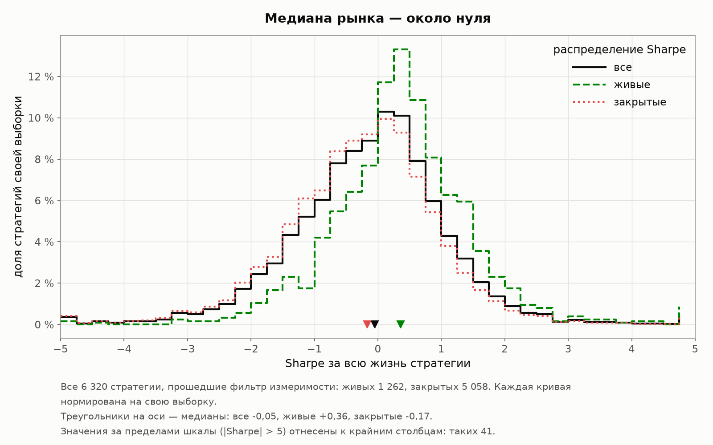
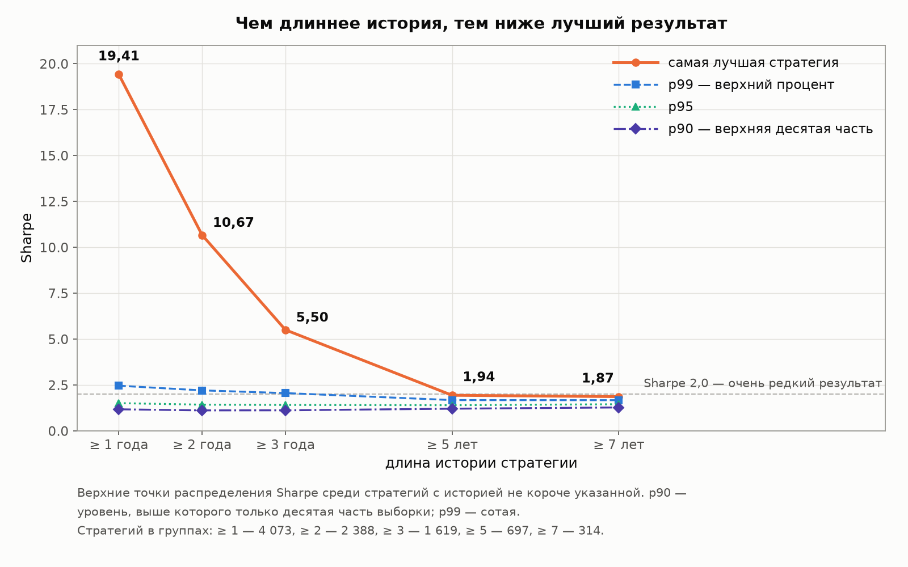
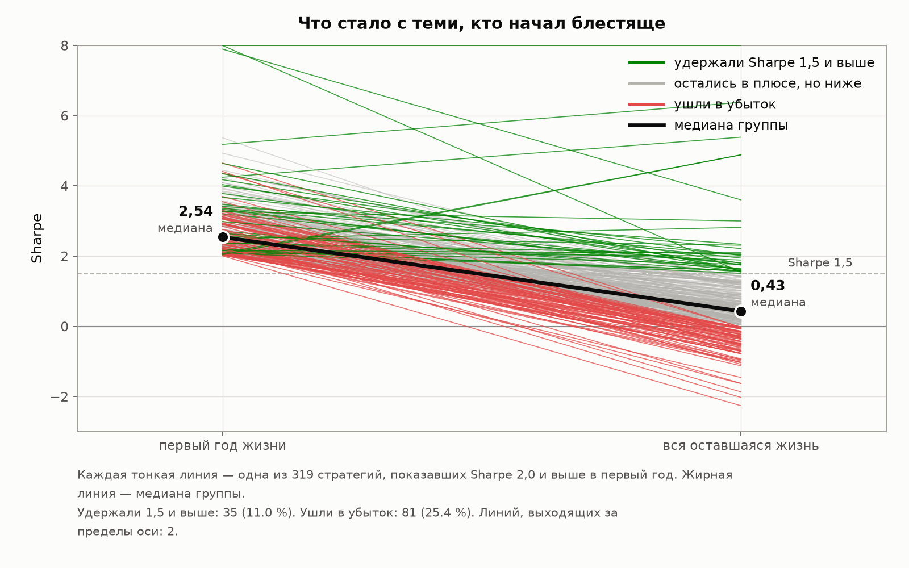
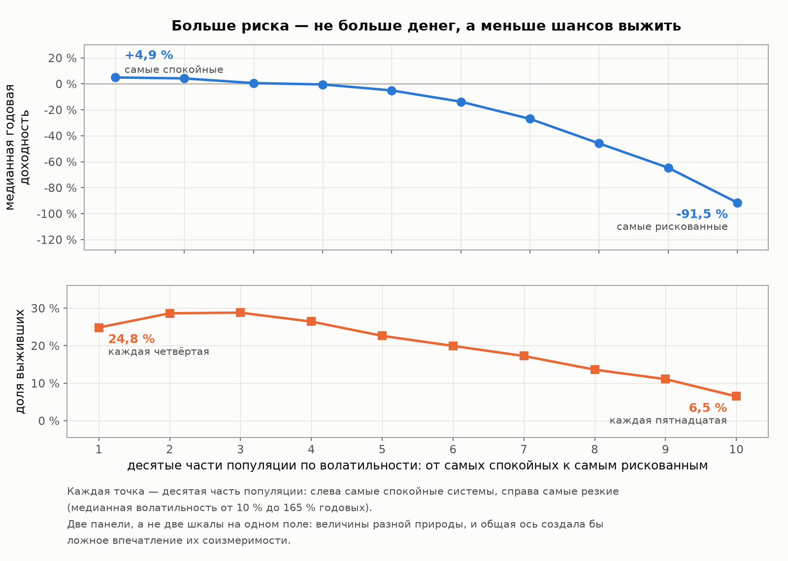
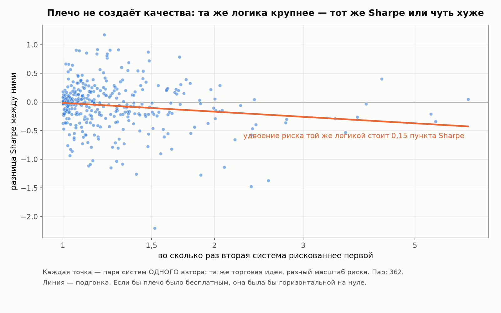
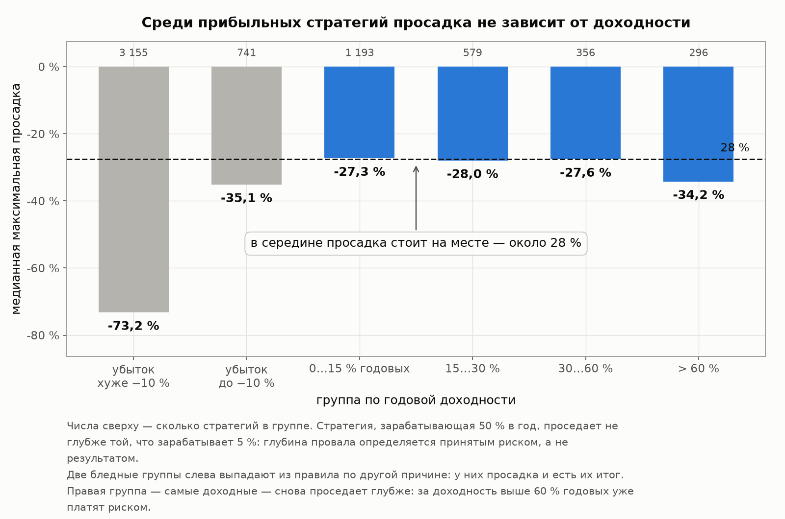
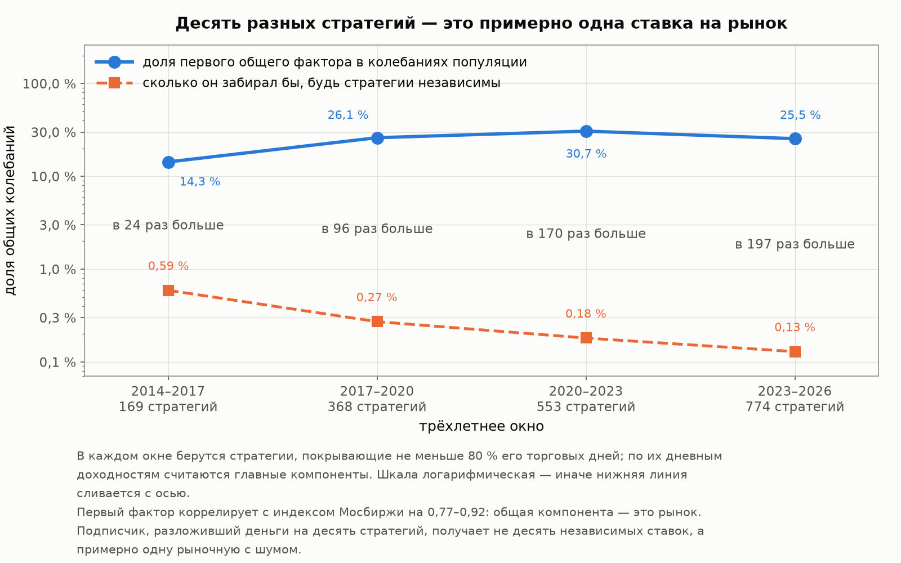
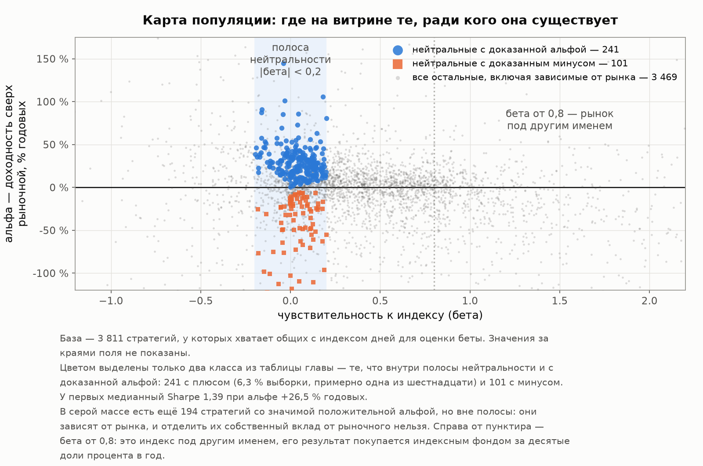
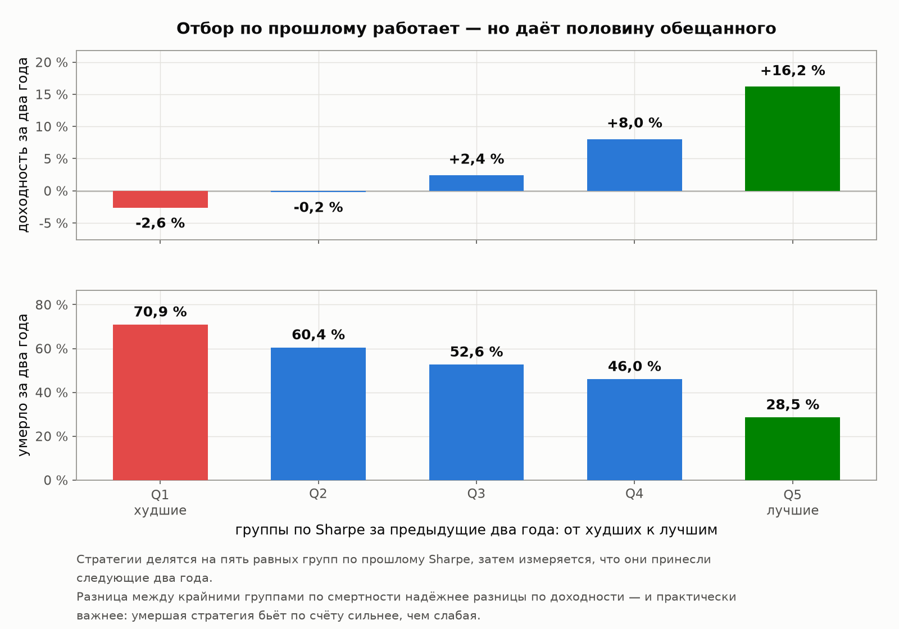
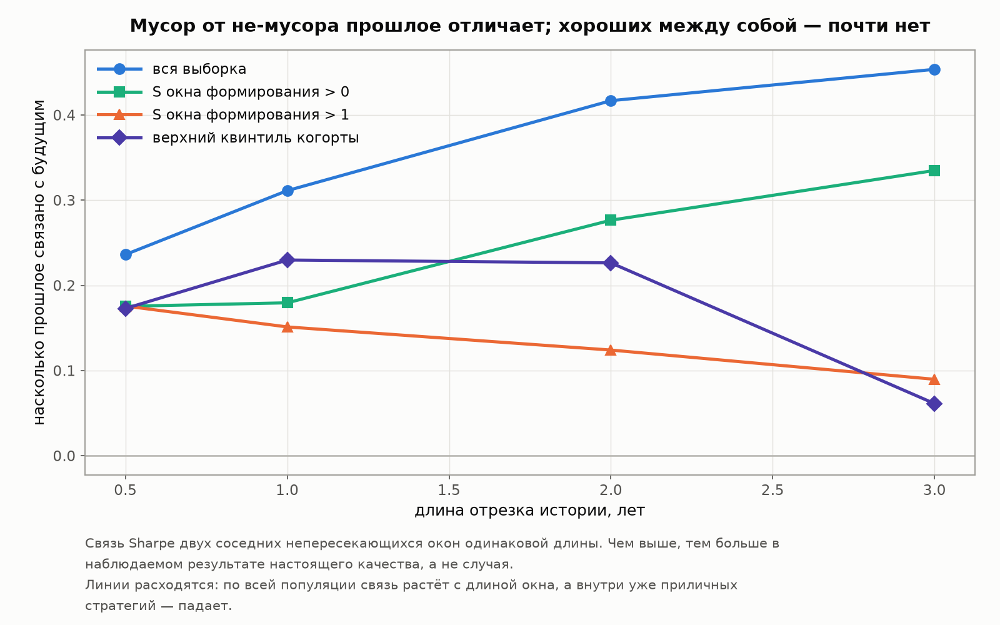

# Глава 3. Из чего сделана доходность

[Лицензия](comon-story-license.md) · [Введение](comon-story-0-intro.md) · [1 — Площадка и витрина](comon-story-1-market.md) · [2 — Кладбище](comon-story-2-survival.md) · **Глава 3 из 5** · [4 — Продавцы](comon-story-4-authors.md) · [Интерлюдия — вторая площадка](comon-story-4b-interlude.md) · [5 — Покупатели](comon-story-5-buyers.md) · [Заключение](comon-story-6-conclusion.md)

*Данные, методы и словарь терминов — во [введении](comon-story-0-intro.md). Все метрики пересчитаны из дневных рядов 19 978 стратегий Comon, включая 18 529 закрытых.*

---

Глава 2 была о том, что стратегия скорее всего исчезнет. Эта — о тех, кто дожил: сколько они на самом деле зарабатывают, из чего сделан их результат и можно ли по прошлому судить о будущем.

**Сначала о выборке.** Дальше в главе работают не все 19 978 стратегий, а 6 320 — те, у которых достаточно данных, чтобы метрики имели смысл: не меньше 100 торговых дней и активность не ниже 10 % (стратегия хотя бы каждый десятый день что-то делала). Это 54.2 % от тех, чей ряд насчитывает хотя бы тридцать точек, — и 34.4 % от всех 18 354 стратегий, у которых ряд есть вообще. Фильтр поставлен **по измеримости, а не по результату**: отбирать по доходности значило бы испортить само распределение, которое мы изучаем. Убыточные стратегии остаются в выборке полностью.

## 3.1 Сколько Sharpe бывает на самом деле

Напомним ориентир из [введения](comon-story-0-intro.md): Sharpe — доходность на единицу риска, 1.0 считается хорошим результатом, 2.0 — очень редким.

| Выборка | Стратегий | p5 | p25 | **Медиана** | p75 | p90 | p95 | p99 |
|---|---:|---:|---:|---:|---:|---:|---:|---:|
| Все с достаточной историей | 6 320 | −2.10 | −0.82 | **−0.05** | 0.57 | 1.23 | 1.68 | 3.06 |
| Живые | 1 262 | −1.39 | −0.22 | **0.36** | 0.96 | 1.62 | 2.11 | 4.21 |
| Закрытые | 5 058 | −2.21 | −0.95 | **−0.17** | 0.47 | 1.11 | 1.53 | 2.71 |

**Медианная стратегия автоследования имеет Sharpe около нуля.** Не «маленький положительный» — нулевой. Половина всей популяции не создала за свою жизнь ничего сверх принятого риска. Даже среди выживших медиана 0.36 — ниже, чем у обычного широкого рынка акций на длинном горизонте (около 0.5).

Теперь главное: сколько стратегий держат высокий Sharpe **долго**. Короткий период можно проскочить на везении, поэтому смотрим по длине истории:

| Длина истории | Стратегий | Sharpe ≥ 1.0 | Sharpe ≥ 1.5 | Sharpe ≥ 2.0 | Лучший результат |
|---|---:|---:|---:|---:|---:|
| ≥ 1 года | 4 073 | 547 (13.4 %) | 212 (5.2 %) | 81 (2.0 %) | 19.41 |
| ≥ 2 лет | 2 388 | 298 (12.5 %) | 99 (4.1 %) | 35 (1.5 %) | 10.67 |
| **≥ 3 лет** | 1 619 | 204 (12.6 %) | **64 (4.0 %)** | 19 (1.2 %) | 5.50 |
| **≥ 5 лет** | 697 | 103 (14.8 %) | 23 (3.3 %) | **0 (0.0 %)** | **1.94** |
| ≥ 7 лет | 314 | 63 (20.1 %) | 13 (4.1 %) | **0 (0.0 %)** | 1.87 |

Смотрите, что происходит с последней колонкой. На годовой истории попадаются Sharpe 19 — на такой дистанции это чистая случайность, столько же смысла, сколько в трёх выпавших подряд шестёрках. Чем длиннее история, тем сильнее сжимается хвост: 19.4 → 10.7 → 5.5 → **1.94**.

🔴 **Ни одна из 697 стратегий с пятилетней историей не показала Sharpe 2.0.** Максимум — 1.94. Это и есть потолок реальности на длинной дистанции: не 3, не 2.5, а примерно 1.9.

Порог 1.5 на трёхлетней истории держат 64 стратегии из 1 619 — **4 %**. Именно столько, если переводить на человеческий язык, стоит за словами «стабильно хорошая стратегия».

### Планка «ничего не делать» оказалась очень высокой

Всё сказанное выше — про Sharpe, то есть про качество. Но подписчику важно и другое: обогнала ли стратегия простую альтернативу — деньги на вкладе или в фонде денежного рынка.

Возьмём общее окно, где ставки сравнимы: октябрь 2022 — август 2026, средняя безрисковая ставка 14.7 % годовых. Внутри него не меньше трёх лет проторговала 701 стратегия:

| Показатель | p25 | Медиана | p75 | p90 | p95 |
|---|---:|---:|---:|---:|---:|
| Sharpe как есть | 0.03 | 0.55 | 1.02 | 1.48 | 1.87 |
| **Sharpe сверх ставки денежного рынка** | −0.65 | **−0.09** | 0.29 | 0.71 | 0.95 |
| Годовая доходность, % | −6.5 | 9.3 | 19.5 | 32.7 | 45.3 |
| Волатильность, % | 18.3 | 26.3 | 42.4 | 69.6 | 90.9 |

**Половина публичных стратегий на этом окне не обогнала денежный рынок вообще.** Медианная годовая доходность 9.3 % против безрисковых 14.7 % — и это до вычета платы за следование, о которой пойдёт речь в [главе 5](comon-story-5-buyers.md).

Отдельно стоит заметить строку волатильности: медианные 26.3 % годовых. Стратегия с такой волатильностью в плохой год легко уходит в минус на четверть — и это середина, а не край.

### Сколько стоит смотреть только на витрину

Мы можем измерить цену ошибки выжившего прямо, потому что у нас есть и мёртвые:

| Длина истории | Медиана Sharpe: живые | Медиана: все | Разница |
|---|---:|---:|---:|
| ≥ 1 года | 0.38 | 0.09 | **+0.28** |
| ≥ 2 лет | 0.40 | 0.17 | +0.23 |
| ≥ 3 лет | 0.42 | 0.19 | +0.23 |
| ≥ 5 лет | 0.47 | 0.31 | +0.16 |

**Тот, кто оценивает автоследование по видимой витрине, завышает качество рынка на 0.2–0.3 пункта Sharpe.** Немного по абсолютной величине — но это половина расстояния между «посредственно» и «хорошо».

## 3.2 Молодые стратегии врут

Самая практичная находка главы. У нас есть возможность, недоступная снаружи: сравнить **одну и ту же стратегию** в начале жизни и потом.

Берём 2 287 стратегий, у которых история не меньше двух лет и обе половины годятся для расчёта — и первый год, и всё, что после, — и считаем Sharpe отдельно по каждой:

| Величина | p25 | **Медиана** | p75 | p90 |
|---|---:|---:|---:|---:|
| Sharpe первого года | −0.47 | **0.43** | 1.38 | 2.26 |
| Sharpe оставшейся жизни | −0.52 | **0.10** | 0.61 | 1.21 |
| Насколько изменился у одной и той же стратегии | −1.37 | **−0.45** | +0.51 | +1.38 |

Третья строка — **не** разность двух верхних. Она считается иначе: у каждой стратегии берётся её собственное изменение (Sharpe остатка жизни минус Sharpe первого года), и уже из этих изменений берутся квантили. Читается так: у четверти стратегий Sharpe упал больше чем на 1.37 пункта, у половины — больше чем на 0.45, зато четверть, наоборот, улучшилась больше чем на 0.51, а десятая часть — больше чем на 1.38.

То есть **медианная стратегия теряет почти половину пункта Sharpe после первого года**, при этом разброс огромен и часть стратегий со временем становится лучше. Самое интересное происходит с теми, кто начал блестяще.

**Из 319 стратегий, показавших Sharpe ≥ 2.0 в первый год**, в оставшейся жизни:

| Что было дальше | Стратегий | Доля |
|---|---:|---:|
| Удержали Sharpe ≥ 1.5 | 35 | **11.0 %** |
| Остались в плюсе, но ниже 1.5 | 203 | 63.6 % |
| Ушли в минус | 81 | **25.4 %** |

Медианный Sharpe этих трёхсот девятнадцати стратегий в оставшейся жизни — **0.43**. Начинали они с 2.0 и выше.

**Девять из десяти стратегий, блестяще начавших, не удержали результат.** Каждая четвёртая ушла в убыток.

Это тот же вывод, что дала регрессия выживаемости в [главе 2](comon-story-2-survival.md) — доходность первого года не предсказывает ничего, — но полученный совершенно другим способом, на другой метрике. Два независимых теста, один ответ: **ранний блестящий результат не является свидетельством качества.** Он является свидетельством того, что стратегия молода.

Механика проста и не требует злого умысла. Тысячи стратегий стартуют одновременно; у части из них первый год складывается удачно просто по случайности. Их и видно на витрине в верхних строчках — а тех, у кого не сложилось, уже нет. Это не обман, это арифметика отбора.

## 3.3 Волатильность не покупает доходность, а уничтожает её

Естественная гипотеза: высокая доходность на витрине — просто плата за риск, кто рискует больше, тот и зарабатывает больше. Данные говорят обратное.

Разобьём все 6 320 стратегий на десять равных групп по годовой волатильности, от самых спокойных к самым буйным:

| Группа по волатильности | Волатильность, % | Годовая доходность, % | Sharpe | Макс. просадка, % | Доля живых |
|---|---:|---:|---:|---:|---:|
| 1 (самые спокойные) | 9.8 | **+4.9** | 0.61 | −10.0 | 24.8 % |
| 2 | 17.5 | +4.2 | 0.32 | −22.3 | 28.6 % |
| 3 | 23.2 | +0.6 | 0.14 | −29.0 | 28.8 % |
| 4 | 28.5 | −0.5 | 0.12 | −36.1 | 26.4 % |
| 5 | 35.4 | −5.1 | 0.02 | −44.6 | 22.6 % |
| 6 | 44.7 | −13.8 | −0.10 | −50.1 | 19.9 % |
| 7 | 57.1 | −27.0 | −0.28 | −61.0 | 17.2 % |
| 8 | 75.0 | −45.9 | −0.41 | −74.3 | 13.6 % |
| 9 | 101.3 | −64.6 | −0.48 | −85.6 | 11.1 % |
| 10 (самые буйные) | 165.5 | **−91.5** | −0.55 | −95.6 | **6.5 %** |

Картина монотонная и жёсткая. Доходность падает от +4.9 % до −91.5 %, Sharpe — от 0.61 до −0.55, доля выживших — с 25 % до 6.5 %. Ранговая связь волатильности с доходностью **−0.53**: это очень сильная связь по меркам таких данных.

**Высокая волатильность — не «агрессивный стиль», а основной механизм смерти.**

Можно возразить: мы же смотрим и на мёртвых, а они умерли как раз потому, что потеряли деньги. Справедливо — поэтому вот те же группы отдельно по живым:

| Группа по волатильности | Волатильность, % | Доходность живых, % | Доходность закрытых, % |
|---|---:|---:|---:|
| 1 (самые спокойные) | 9.8 | +9.3 | +3.4 |
| 2 | 17.5 | +8.4 | +1.6 |
| 3 | 23.2 | +4.4 | −2.1 |
| 4 | 28.5 | +7.0 | −5.4 |
| 5 | 35.4 | +7.4 | −8.5 |
| **6** | **44.7** | **+11.3** | −18.4 |
| 7 | 57.1 | −11.4 | −29.8 |
| 8 | 75.0 | −26.8 | −49.4 |
| 9 | 101.3 | −48.4 | −65.7 |
| 10 (самые буйные) | 165.5 | −90.5 | −91.5 |

**Даже среди выживших рост риска перестаёт оплачиваться примерно с волатильности 45 % годовых.** До шестой группы доходность живых держится в районе +7…+11 %, а дальше падает — при том что просадка, судя по первой таблице, углубляется без остановки. Это уже не эффект выживания: даже у тех, кто уцелел, дополнительный риск дохода не приносит.

## 3.4 Цена плеча: эксперимент на близнецах

Предыдущий раздел сравнивал разные стратегии между собой, а у них разная логика — вдруг дело в ней, а не в риске? Данные позволяют поставить эксперимент чище.

В популяции нашлись **362 пары «близнецов»**: две стратегии принадлежат одному автору и ходят почти синхронно (корреляция дневных доходностей не ниже 0.8, медиана по отобранным парам 0.90, медиана общего окна 838 дней). Одна логика, разный масштаб риска — то есть плечо в чистом виде.

Теория говорит, что плечо не должно менять Sharpe: удвоив позицию, вы удваиваете и доход, и риск. Проверяем:

| Плечо (во сколько раз рискованнее) | Пар | Sharpe спокойной | Sharpe агрессивной | Потеря Sharpe внутри пары | Доходность выросла в | Просадка выросла в |
|---|---:|---:|---:|---:|---:|---:|
| 1.0–1.2× | 208 | 0.37 | 0.33 | −0.01 | 1.04 раза | 1.03 раза |
| 1.2–1.5× | 91 | 0.53 | 0.44 | −0.06 | 0.91 | 1.23 |
| 1.5–2.0× | 38 | 0.63 | 0.56 | −0.07 | 1.11 | 1.41 |
| **2.0–3.0×** | 17 | **1.25** | **0.87** | **−0.30** | **1.72** | **1.84** |
| Больше 3× | 8 | 1.00 | 0.78 | −0.23 | 3.92 | 3.03 |

*Пятая колонка — не разность двух предыдущих. Она считается внутри каждой пары отдельно (Sharpe агрессивной минус Sharpe спокойной), и в таблицу идёт медиана этих значений; последние две колонки устроены так же — во сколько раз выросли доходность и просадка у одной и той же пары. Поэтому −0.01 в первой строке не противоречит паре медиан 0.37 и 0.33: это разные величины, и правильная — та, что считана внутри пар. В крайних строках, где пар мало (17 и 8), любые числа читаются как ориентир, а не как оценка.*

**Удвоение риска той же самой логикой стоит около 0.15 пункта Sharpe.** При небольшом плече (до 1.2×) цена теряется в шуме, но начиная с двукратного она становится заметной: −0.30 пункта.

И вторая закономерность, важнее первой: **просадка растёт быстрее доходности**. В группе с плечом 2–3× доходность выросла в 1.72 раза, а просадка — в 1.84. Плечо — плохая сделка не потому, что не добавляет дохода, а потому, что риска добавляет больше.

Оговорка о статистике: пары одного автора не независимы друг от друга — автор с тремя стратегиями даёт три пары. Поэтому смотреть надо на величину и знак эффекта, а не на формальную значимость, которая здесь завышена.

## 3.5 Чем платят за доходность: просадка

Просадка — то, что подписчик реально переживает. Вот её распределение:

| Максимальная просадка | p5 | p25 | **Медиана** | p75 | p95 |
|---|---:|---:|---:|---:|---:|
| Все стратегии | −99.3 % | −76.9 % | **−47.5 %** | −26.1 % | −8.7 % |
| Только живые | −98.4 % | −65.4 % | **−41.4 %** | −23.3 % | −7.5 % |

**Просадка −40…−50 % — это центр распределения, а не хвост.** Половина живых стратегий в какой-то момент теряла больше сорока процентов капитала подписчика. Глубже −50 % проседали 47.3 % стратегий, глубже −80 % — 22.8 %.

Теперь неожиданное. Казалось бы, глубокая просадка — плата за высокую доходность. Проверяем:

| Группа по годовой доходности | Стратегий | Медианная просадка | Глубже −50 % |
|---|---:|---:|---:|
| Убыток хуже −10 % | 3 155 | −73.2 % | 72.6 % |
| Убыток до −10 % | 741 | −35.1 % | 30.9 % |
| 0…15 % годовых | 1 193 | **−27.3 %** | 20.4 % |
| 15…30 % | 579 | **−28.0 %** | 16.6 % |
| 30…60 % | 356 | **−27.6 %** | 16.0 % |
| Больше 60 % | 296 | −34.2 % | 26.4 % |

**Просадка почти не зависит от доходности.** В диапазоне от нуля до 60 % годовых медианная просадка стоит на месте — около −28 %. Стратегия, зарабатывающая 50 % в год, проседает не глубже той, что зарабатывает 5 %.

Вывод из этого практический: глубина провала определяется не результатом, а масштабом принятого риска. Доходные и убыточные стратегии падают одинаково — просто у первых счёт потом восстанавливается, а у вторых нет.

### Одна гипотеза, которую пришлось похоронить

Есть популярное представление: у стратегий, которые «продают риск» (много мелких прибылей и редкие катастрофы), распределение доходностей скошено влево, и по этой скошенности будущую катастрофу можно предвидеть заранее.

По полной истории связь действительно выглядит убедительно: корреляция скоса с Sharpe **+0.427**. Но это ловушка. Скос считается по всему ряду, **включая день обвала** — один катастрофический день одновременно портит и скос, и Sharpe, и доходность. Связь механическая: мы измеряем не предчувствие, а уже случившееся.

Честная проверка — взять скос **первой половины** жизни стратегии и посмотреть, что было во **второй**:

| Связь | Ранговая корреляция |
|---|---:|
| Скос первой половины ↔ Sharpe **той же** половины | **+0.427** |
| Скос первой половины ↔ Sharpe **следующей** половины | **+0.025** |
| Скос первой половины ↔ просадка следующей половины | −0.019 |

**Форма распределения не предсказывает ничего.** 0.025 — это ноль. Просадка второй половины одинакова (около −35 %) во всех группах по скосу.

Зато в той же проверке обнаружилось кое-что полезное:

| Предиктор будущего Sharpe | Корреляция |
|---|---:|
| Прошлый Sharpe | +0.159 |
| **Волатильность** | **−0.184** |

**Волатильность предсказывает будущее качество лучше, чем прошлый результат.** Простейшая риск-метрика оказалась информативнее метрики результата — этот же вывод независимо подтвердится в разделе 3.7.

## 3.6 Своя ли это доходность, или просто рынок

Ключевой вопрос для подписчика: за что он платит. Рыночную доходность можно купить за копейки — индексным фондом. Платить процент от активов имеет смысл только за то, чего в индексе нет.

Мы посчитали для каждой стратегии, насколько её дневная доходность объясняется движением индекса Мосбиржи. Выборка — 3 811 стратегий, у которых достаточно общих с индексом дней.

**На индивидуальном уровне ответ отрицательный: это не переодетый индекс.**

| Величина | p25 | Медиана | p75 | p95 |
|---|---:|---:|---:|---:|
| Чувствительность к индексу (β) | 0.03 | **0.29** | 0.73 | 1.74 |
| Доля движения, объяснённая индексом (R²) | 0.01 | **0.06** | 0.26 | 0.59 |

Индекс объясняет 6 % колебаний типичной стратегии. Большинство авторов действительно делают что-то своё.

**Но на уровне популяции ответ противоположный.** Мы разложили дневные доходности всех стратегий на общие факторы и посмотрели, какую долю всех колебаний забирает самый крупный из них:

| Трёхлетнее окно | Стратегий | Доля первого фактора | Если бы стратегии были независимы | Связь фактора с индексом |
|---|---:|---:|---:|---:|
| 2014–2017 | 169 | 14.3 % | 0.59 % | **0.91** |
| 2017–2020 | 368 | 26.1 % | 0.27 % | **0.90** |
| 2020–2023 | 553 | **30.7 %** | 0.18 % | **0.92** |
| 2023–2026 | 774 | 25.5 % | 0.13 % | 0.77 |

Читается так: **один общий фактор забирает от седьмой части до трети всех колебаний популяции, тогда как у независимых стратегий он забирал бы доли процента** — в 24–200 раз меньше, и разрыв растёт с числом стратегий в окне. И этот фактор коррелирует с индексом Мосбиржи на 0.77–0.92. Нагрузка на него положительна у 92.6 % стратегий.

**Общая компонента есть, она одна, и она — рынок.**

Противоречия с предыдущей таблицей нет: у каждой стратегии по отдельности связь с индексом слабая, но направление у всех одно. Практическое следствие важное: **подписчик, разложивший деньги на десять разных стратегий, получает не десять независимых ставок, а примерно одну рыночную с шумом сверху.** Диверсификация по авторам работает намного хуже, чем кажется по индивидуальным цифрам.

### Сколько стратегий — это рынок под другим именем

| Класс | Стратегий | Доля | β | Sharpe |
|---|---:|---:|---:|---:|
| Похожи на индекс с плечом (β ≥ 0.5, корреляция > 0.5, собственного вклада не видно) | **653** | **17.1 %** | 0.87 | 0.12 |
| Все остальные | 3 158 | 82.9 % | 0.19 | 0.11 |

**Каждая шестая стратегия витрины — это рынок под другим именем.** И вот что показательно: их медианный Sharpe 0.12 против 0.11 у всех остальных. За упаковку рыночного риска в подписку подписчик не получает **ничего** — тот же результат, что по витрине в целом, при медианной просадке −54 %.

Ещё одно измерение той же темы. Индекс Мосбиржи, который мы использовали, — ценовой, без дивидендов. Если сравнивать с индексом полной доходности (с дивидендами), медианная альфа стратегий сдвигается с +1.2 % до **−1.9 % годовых**. То есть **медианная стратегия витрины не отбивает даже дивиденды**, которые подписчик получил бы, просто купив индексный фонд. А если ещё учесть, что часть капитала можно было положить под безрисковую ставку, разрыв становится больше.

### И половина популяции — слегка продавцы риска

Мы посчитали чувствительность к индексу отдельно в дни его роста и в дни падения. Если стратегия падает вместе с рынком сильнее, чем растёт вместе с ним, — это профиль «продавца риска»: спокойно в обычное время, больно в кризис.

Медианная разница невелика (+0.04), но устойчива: **у 55.7 % стратегий чувствительность к падениям выше, чем к росту**. Для подписчика это означает, что заявленная умеренная зависимость от рынка в кризис оказывается выше, чем в спокойное время — ровно тогда, когда это больнее всего.

### Хорошая новость, которую надо сказать так же громко

Всё вышесказанное не означает, что умеющих нет. Мы нашли их и посчитали.

| Класс | Стратегий | Доля | Медианный Sharpe | Альфа, % годовых | Доля живых |
|---|---:|---:|---:|---:|---:|
| **Нейтральные к рынку и с доказанной альфой** | **241** | **6.3 %** | **1.39** | **+26.5 %** | **60.2 %** |
| Нейтральные, но альфа не доказана | 923 | 24.2 % | 0.18 | +3.2 % | 25.6 % |
| Нейтральные с доказанным **минусом** | 101 | 2.7 % | −1.57 | −48.4 % | 13.9 % |
| Умеренная зависимость от рынка | 1 388 | 36.4 % | 0.15 | +1.7 % | 28.2 % |
| Сильная зависимость от рынка (β ≥ 0.8) | 801 | 21.0 % | **−0.15** | **−16.9 %** | 20.7 % |
| Играют против рынка (β ≤ −0.2) | 357 | 9.4 % | −0.04 | +5.4 % | 10.6 % |

*Шесть классов покрывают всю выборку из 3 811 стратегий целиком; доли складываются в 100 %.*

**Примерно одна стратегия из шестнадцати действительно что-то умеет** — не зависит от рынка и при этом зарабатывает. У этих 241 стратегии медианный Sharpe 1.39, альфа +26.5 % годовых, и живучесть у них вдвое выше средней: 60 % против 26 %. Это и есть то, ради чего площадка существует.

И зеркальный результат: **высокая зависимость от рынка — худший класс по всем осям сразу.** Медианный Sharpe −0.15, альфа −16.9 % годовых, выживает каждая пятая. Плечо на индексе не создаёт доходность, оно создаёт волатильность и отрицательную альфу.

Ещё два класса стоит назвать, чтобы картина была полной. Есть 101 стратегия (2.7 %), у которых нейтральность к рынку сочетается с **доказанным убытком**: медианный Sharpe −1.57, альфа −48 % годовых, выживает одна из семи. И есть 357 стратегий (9.4 %), играющих против рынка — у них худшая живучесть во всей таблице, 10.6 %: держать постоянный шорт на растущем рынке дорого.

## 3.7 Предсказывает ли прошлое будущее

Последний и самый практичный вопрос: если выбирать стратегию по прошлым результатам, это работает?

Мы применили классическую схему из исследований взаимных фондов: на каждую из 29 полугодовых дат ранжируем стратегии по Sharpe за прошедшее окно, делим на пять групп и смотрим, что было дальше. Умершие не выбрасываются — их доходность после смерти считается нулевой, потому что именно это и получает подписчик.

**Формирование 2 года → удержание 2 года:**

| Группа при отборе | Sharpe при отборе | Медианная доходность за 2 года удержания | Sharpe в удержании | Умерло за период |
|---|---:|---:|---:|---:|
| Q1 (худшие) | −1.11 | −2.6 % | −0.53 | **70.9 %** |
| Q2 | −0.27 | −0.2 % | 0.02 | 60.4 % |
| Q3 | 0.23 | +2.4 % | 0.37 | 52.6 % |
| Q4 | 0.67 | +8.0 % | 0.52 | 46.0 % |
| **Q5 (лучшие)** | **1.39** | **+16.2 %** | **0.80** | **28.5 %** |

**Персистентность есть, и она экономически значима.** Отбор по прошлому Sharpe даёт разницу в доходности **+9…+19 процентных пунктов** за период удержания, монотонно по всем группам, на разных длинах окон. Это реальный, измеримый, статистически надёжный эффект.

Но дальше начинается интересное — **из чего этот эффект сделан**.

Посмотрите на последнюю колонку. Смертность падает с 70.9 % в худшей группе до 28.5 % в лучшей. Разница по смертности статистически втрое-вчетверо надёжнее, чем разница по доходности. **Отбор по прошлому работает прежде всего не как поиск таланта, а как фильтр против стратегий, которые скоро умрут.**

И вторая отрезвляющая деталь. Верхняя группа при отборе имела Sharpe 1.39. В период удержания она показала **0.80** — и это ещё считая только по выжившим. Ни в одной раскладке лучшая пятая часть не удержала даже 1.0.

**Регрессия к среднему съедает половину результата.** Купив «лучших по прошлым данным», подписчик получает не то, что видел на витрине, а примерно половину.

### Сколько лет наблюдения нужно, чтобы понять качество

Здесь мы можем ответить количественно. Возьмём два соседних непересекающихся отрезка жизни каждой стратегии и посмотрим, насколько Sharpe первого предсказывает Sharpe второго:

| Длина отрезка | Связь прошлого с будущим | Что это значит |
|---|---:|---|
| Полгода | 0.24 | почти целиком шум |
| 1 год | 0.31 | слабый сигнал |
| 2 года | 0.42 | сигнал заметен, но шума больше |
| 3 года | 0.44 | около половины наблюдаемого — настоящее качество |

Величина связи растёт с длиной наблюдения — и это ожидаемо: чем дольше смотришь, тем меньше в результате случайности. Подгонка простой модели к этим четырём точкам даёт число, которое стоит запомнить: **сигнал сравнивается с шумом примерно на 2.8 годах наблюдения**. Полугодовой результат — шум почти целиком. Годовой — слабый намёк.

🔴 **И самое неприятное открытие раздела.** Всё сказанное относится к задаче «отличить работающую стратегию от мусора». Если взять только стратегии, которые уже прошли планку качества (Sharpe выше 1), персистентность не растёт с длиной наблюдения, а **падает**:

| Подвыборка | Полгода | 1 год | 2 года | 3 года |
|---|---:|---:|---:|---:|
| Вся выборка | 0.236 | 0.311 | 0.417 | 0.454 |
| Стратегии с Sharpe > 0 | 0.175 | 0.179 | 0.276 | 0.335 |
| **Стратегии с Sharpe > 1** | **0.176** | **0.151** | **0.124** | **0.090** |

*Внимательный читатель заметит, что на трёхлетнем окне здесь стоит 0.454, а в таблице выше — 0.44. Это одна и та же величина, посчитанная по разному числу трёхлетних периодов: 24 против 23. Таких периодов в двадцатилетней истории мало, и один лишний заметно двигает среднее — что само по себе говорит, насколько шатки оценки на длинных окнах.*

**Различать хороших между собой прошлое почти не умеет.** Отличить рабочую стратегию от мусорной по истории можно. Отличить стратегию с Sharpe 1.5 от стратегии с Sharpe 0.7 — практически нет: прошлое объясняет несколько процентов разброса будущего.

Для подписчика это переводится так: **выбор из верхушки рейтинга — во многом лотерея**, даже если сам рейтинг честный. Отсеять плохое по прошлым данным реально; выбрать лучшее — нет.

---

## Выводы главы

1. **Медианная стратегия не создаёт ничего сверх риска.** Sharpe около нуля по всей популяции, 0.36 среди живых. Порог 1.5 на трёхлетней истории держат 4 % стратегий.

2. **Потолок реальности — Sharpe около 1.9.** Ни одна из 697 стратегий с пятилетней историей не превысила 2.0. Высокие значения встречаются только на коротких историях, где они означают везение, а не качество: максимум падает с 19.4 на годовой дистанции до 1.94 на пятилетней.

3. **Половина стратегий не обогнала денежный рынок.** На окне 2022–2026 при безрисковой ставке 14.7 % медианная доходность составила 9.3 % годовых, а медианный Sharpe сверх ставки — минус 0.09. И это до вычета платы за следование.

4. **Блестящее начало ничего не значит.** Из 319 стратегий с Sharpe ≥ 2.0 в первый год удержали 1.5 только 11 %, а четверть ушла в минус; медиана их дальнейшего Sharpe — 0.43. Второе независимое подтверждение вывода [главы 2](comon-story-2-survival.md).

5. **Волатильность уничтожает доходность, а не покупает её.** От спокойной десятой части популяции к самой буйной доходность падает с +4.9 % до −91.5 % годовых, доля выживших — с 25 % до 6.5 %. Даже среди выживших рост риска перестаёт оплачиваться примерно с 45 % волатильности.

6. **Плечо стоит около 0.15 пункта Sharpe за удвоение риска.** Измерено на 362 парах: в каждой паре обе стратегии принадлежат одному человеку и ходят почти синхронно — та же логика, разный масштаб риска. При этом просадка растёт быстрее доходности.

7. **Просадка −40…−50 % — центр распределения, а не хвост**, и она почти не зависит от доходности: в диапазоне 0–60 % годовых медианная просадка стоит на −28 %.

8. **По отдельности стратегии не индекс, но все вместе — да.** Медианная связь с рынком слабая (индекс объясняет 6 % колебаний), однако один общий фактор забирает 25–31 % всех колебаний популяции при эталоне независимости в доли процента, и этот фактор — рынок. Диверсификация по авторам даёт куда меньше, чем кажется.

9. **Каждая шестая стратегия — рынок под другим именем.** Подписка на неё стоит ровно столько же, сколько на любую другую (тариф берётся с активов и от содержимого не зависит), а результат тот же, что по витрине в целом: медианный Sharpe 0.12 против 0.11. Медианная стратегия витрины не отбивает даже дивиденды индексного фонда.

10. **Но умеющие есть: 6.3 %.** Двести сорок одна стратегия нейтральна к рынку и имеет доказанную альфу: Sharpe 1.39, альфа +26.5 % годовых, выживаемость вдвое выше средней. Примерно один шанс из шестнадцати.

11. **Отбор по прошлым результатам работает — но в основном как защита от смерти.** Разница между лучшей и худшей пятой частью составляет +9…+19 пп доходности, при этом смертность различается в 2.2–2.5 раза (28.5 % против 70.9 % на двухлетнем горизонте) и различается статистически надёжнее, чем доходность. Верхняя группа с Sharpe 1.39 в удержании даёт 0.80: регрессия к среднему съедает половину.

12. 🔴 **Отличить рабочую стратегию от мусора по истории можно; выбрать лучшую из хороших — почти нет.** Сигнал сравнивается с шумом примерно на 2.8 годах, а среди стратегий с Sharpe выше 1 предсказуемость не растёт с наблюдением, а падает до 0.09.

Кто пишет эти стратегии — [глава 4](comon-story-4-authors.md); кто их покупает и что в итоге достаётся подписчику — [глава 5](comon-story-5-buyers.md).

---

# Приложение: полная статистика

## В1. Ограничения главы

- **Фильтр измеримости меняет состав выборки.** Из 11 657 стратегий, чей ряд насчитывает не меньше тридцати точек, прошли 6 320 — то есть примерно треть от всех 18 354 стратегий с рядом. Отсеиваются короткие и малоактивные — то есть картина главы описывает «стратегии, которые реально работали», а не всю популяцию.
- **Отбор по длине истории — это отбор по выживанию.** Разделы про долгую историю смотрят на выживших по построению; поправка — раздел 3.2, где сравнение идёт внутри одних и тех же стратегий.
- **Sharpe без вычета безрисковой ставки** для стратегий на акциях завышен относительно стратегий на срочном рынке, где контанго уже съедает ставку. Сравнение «сверх ставки» дано отдельно.
- **Классификация по составу портфеля приблизительна:** поле состава — снимок на момент выгрузки, а не средний состав за жизнь стратегии.
- **Пары близнецов не независимы**, формальная значимость завышена.
- **Разложение на общие факторы считается на подвыборке долгоживущих** (774 стратегии из 3 811 в последнем окне), у которых связь с рынком плотнее, чем у популяции в целом.
- **Все доходности здесь — за полную жизнь стратегии**, то есть достаются тому, кто вошёл в первый день и не выходил. Подписываются позже, и цена этого измерена в [главе 2](comon-story-2-survival.md): вход на пике кривой оставляет в минусе 94.5 % случаев (приложение Б13 той же главы).

---

## В2. Выборка и фильтр измеримости

Фильтр: не менее 100 торговых дней и активность (доля дней с ненулевым движением) не ниже 10 %. Прошли **6 320 стратегий из 11 657**, чей ряд насчитывает не меньше тридцати точек (54.2 %); от всех 18 354 стратегий с рядом это 34.4 %. Из прошедших живых 1 262, закрытых 5 058.

Фильтр задан по измеримости, а не по результату: отбор по доходности исказил бы изучаемое распределение. Обоснование необходимости — в [главе 2](comon-story-2-survival.md): 15 % популяции держат авторы-фабрики с медианой жизни 25 дней, 21.9 % архива — разовая чистка 2014 года.

**Конвенция Sharpe.** Считается по среднему дневному результату, приведённому к году, без вычета безрисковой ставки, — кроме раздела, где явно указано «сверх ставки денежного рынка». Аннуализация по фактической частоте наблюдений (правило 2 приложения [главы 1](comon-story-1-market.md)).

## В3. Распределение Sharpe

| Выборка | Стратегий | p5 | p25 | Медиана | p75 | p90 | p95 | p99 |
|---|---:|---:|---:|---:|---:|---:|---:|---:|
| Все | 6 320 | −2.10 | −0.82 | −0.05 | 0.57 | 1.23 | 1.68 | 3.06 |
| Живые | 1 262 | −1.39 | −0.22 | 0.36 | 0.96 | 1.62 | 2.11 | 4.21 |
| Закрытые | 5 058 | −2.21 | −0.95 | −0.17 | 0.47 | 1.11 | 1.53 | 2.71 |

Геометрическая версия (доходность с учётом сложного процента, делённая на волатильность) систематически ниже: медиана по всем −0.29, по живым +0.18.

| Длина истории | Стратегий | S ≥ 1.0 | S ≥ 1.5 | S ≥ 2.0 | S ≥ 2.5 | Максимум |
|---|---:|---:|---:|---:|---:|---:|
| ≥ 1 года | 4 073 | 547 (13.4 %) | 212 (5.2 %) | 81 (2.0 %) | 39 (1.0 %) | 19.41 |
| ≥ 2 лет | 2 388 | 298 (12.5 %) | 99 (4.1 %) | 35 (1.5 %) | 17 (0.7 %) | 10.67 |
| ≥ 3 лет | 1 619 | 204 (12.6 %) | 64 (4.0 %) | 19 (1.2 %) | 9 (0.6 %) | 5.50 |
| ≥ 5 лет | 697 | 103 (14.8 %) | 23 (3.3 %) | 0 | 0 | 1.94 |
| ≥ 7 лет | 314 | 63 (20.1 %) | 13 (4.1 %) | 0 | 0 | 1.87 |

Из 64 стратегий с Sharpe ≥ 1.5 на трёхлетней истории статистически значим результат у 59; медиана t-статистики у прошедших — 2.36.

Квантили среди 697 стратегий с историей ≥ 5 лет: медиана 0.31, p75 0.72, p90 1.21, p95 1.40, p99 1.68, максимум 1.94.

## В4. Sharpe и длина истории

| Длина истории | Стратегий | Медиана S | p90 | p99 | Доля S ≥ 1.5 | Медиана волатильности |
|---|---:|---:|---:|---:|---:|---:|
| < 1 года | 2 247 | −0.42 | 1.38 | 3.81 | 8.9 % | 48.0 % |
| 1–1.5 года | 1 049 | −0.16 | 1.23 | 2.61 | 6.9 % | 43.0 % |
| 1.5–3 года | 1 405 | +0.09 | 1.21 | 2.45 | 5.4 % | 36.5 % |
| 3–5 лет | 922 | +0.09 | 1.05 | 2.40 | 4.4 % | 35.3 % |
| 5–7 лет | 383 | +0.23 | 1.05 | 1.67 | 2.6 % | 34.8 % |
| ≥ 7 лет | 314 | +0.44 | 1.28 | 1.67 | 4.1 % | 29.3 % |

🔴 Медиана здесь растёт с длиной истории, но это **не** доказательство, что стратегии улучшаются: в длинные группы попадают только выжившие. Чистая проверка — раздел 3.2, где сравнение идёт внутри одних и тех же стратегий.

## В5. Первый год против остальной жизни

Выборка — 2 287 стратегий с историей ≥ 2 лет, у которых считаются обе оценки: и по первому году, и по остальной жизни. Измеримых с двухлетней историей 2 388; сто одна отпадает потому, что одна из половин слишком коротка или неподвижна.

| Величина | p25 | Медиана | p75 | p90 |
|---|---:|---:|---:|---:|
| Sharpe первого года | −0.47 | 0.43 | 1.38 | 2.26 |
| Sharpe оставшейся жизни | −0.52 | 0.10 | 0.61 | 1.21 |
| Изменение у одной и той же стратегии | −1.37 | −0.45 | +0.51 | +1.38 |

Третья строка — квантили **распределения изменений**, а не разность квантилей двух первых строк: у каждой стратегии считается её собственная величина «Sharpe остатка минус Sharpe первого года», и квантили берутся уже по ним.

Из 319 стратегий с Sharpe ≥ 2.0 в первый год: медиана дальнейшего Sharpe 0.43; удержали ≥ 1.5 — 35 (11.0 %); ушли в минус — 81 (25.4 %).

## В6. Волатильность, доходность, выживание

Децили по годовой волатильности, по 632 стратегии в каждом:

| Дециль | Волатильность, % | CAGR, % | Sharpe | maxDD, % | Живых | CAGR живых, % | CAGR закрытых, % |
|---|---:|---:|---:|---:|---:|---:|---:|
| 1 | 9.8 | +4.9 | 0.61 | −10.0 | 24.8 % | +9.3 | +3.4 |
| 2 | 17.5 | +4.2 | 0.32 | −22.3 | 28.6 % | +8.4 | +1.6 |
| 3 | 23.2 | +0.6 | 0.14 | −29.0 | 28.8 % | +4.4 | −2.1 |
| 4 | 28.5 | −0.5 | 0.12 | −36.1 | 26.4 % | +7.0 | −5.4 |
| 5 | 35.4 | −5.1 | 0.02 | −44.6 | 22.6 % | +7.4 | −8.5 |
| 6 | 44.7 | −13.8 | −0.10 | −50.1 | 19.9 % | +11.3 | −18.4 |
| 7 | 57.1 | −27.0 | −0.28 | −61.0 | 17.2 % | −11.4 | −29.8 |
| 8 | 75.0 | −45.9 | −0.41 | −74.3 | 13.6 % | −26.8 | −49.4 |
| 9 | 101.3 | −64.6 | −0.48 | −85.6 | 11.1 % | −48.4 | −65.7 |
| 10 | 165.5 | −91.5 | −0.55 | −95.6 | 6.5 % | −90.5 | −91.5 |

| Выборка | ρ(волатильность, доходность) | ρ(волатильность, Sharpe) | Стратегий |
|---|---:|---:|---:|
| Все | **−0.529** | −0.298 | 6 320 |
| Живые | −0.304 | −0.318 | 1 262 |
| Закрытые | −0.556 | −0.260 | 5 058 |

🔴 **Кажущееся противоречие, которое стоит объяснить.** Обычная регрессия доходности на волатильность даёт **положительный** и формально значимый коэффициент (+6.99, t = 5.68) — но с R² = 0.005. Её тянут несколько экстремальных выбросов (в популяции есть стратегия с итогом +2 877 000 %). Ранговая корреляция описывает типичную стратегию и даёт −0.53. Правильный вывод — ранговый.

## В7. Близнецы: цена плеча

Критерий пары: обе стратегии принадлежат одному автору, корреляция дневных доходностей ≥ 0.80, общее окно ≥ 250 дней. Из 965 авторов с двумя и более измеримыми стратегиями (4 155 стратегий) найдено **362 пары у 163 авторов**; медиана общего окна 838 дней, медиана корреляции 0.90.

Колонки S — медианы по группе; ΔS, CAGR_B/CAGR_A и DD_B/DD_A считаются **внутри каждой пары** и затем медианятся, поэтому ΔS не равен разности двух колонок слева.

| Плечо | Пар | S спокойной (A) | S агрессивной (B) | ΔS внутри пары | CAGR_B/CAGR_A | DD_B/DD_A |
|---|---:|---:|---:|---:|---:|---:|
| 1.0–1.2 | 208 | 0.37 | 0.33 | −0.01 | 1.04 | 1.03 |
| 1.2–1.5 | 91 | 0.53 | 0.44 | −0.06 | 0.91 | 1.23 |
| 1.5–2.0 | 38 | 0.63 | 0.56 | −0.07 | 1.11 | 1.41 |
| 2.0–3.0 | 17 | 1.25 | 0.87 | −0.30 | 1.72 | 1.84 |
| > 3 | 8 | 1.00 | 0.78 | −0.23 | 3.92 | 3.03 |

ΔS по всем парам: медиана −0.028, среднее −0.067. Регрессия ΔS на логарифм плеча: коэффициент **−0.222** (SE 0.077, t = −2.89), R² = 0.023. Отсюда цена удвоения риска: −0.222 × ln 2 ≈ **−0.15 пункта Sharpe**.

⚠️ Формальная значимость завышена: пары одного автора не независимы (автор с тремя стратегиями даёт три пары из двух степеней свободы). Содержательны знак и величина, а не уровень значимости.

## В8. Просадка и её связь с доходностью

| Величина | p5 | p25 | Медиана | p75 | p95 |
|---|---:|---:|---:|---:|---:|
| maxDD, все | −99.3 % | −76.9 % | −47.5 % | −26.1 % | −8.7 % |
| maxDD, живые | −98.4 % | −65.4 % | −41.4 % | −23.3 % | −7.5 % |
| maxDD, закрытые | −99.4 % | −79.4 % | −49.2 % | −26.9 % | −9.0 % |
| MAR, все | −1.22 | −0.79 | −0.25 | 0.35 | 3.25 |
| MAR, живые | −0.96 | −0.29 | 0.12 | 0.85 | 4.59 |

**MAR** — величина из [словаря введения](comon-story-0-intro.md#словарь-почему-везде-sharpe-а-не-доходность): годовая доходность, отнесённая к глубине худшей просадки, то есть «какую долю своего худшего провала стратегия зарабатывает за год». Здесь она нужна ровно затем, что переводится в срок ожидания.

Медианный MAR живых стратегий — **0.12**. Это значит, что за год такая стратегия зарабатывает лишь восьмую часть того, что теряла в худший момент. Чтобы почувствовать масштаб, возьмём стратегию с типичными для витрины числами: просадка −40 %, доходность 4.8 % годовых (как раз MAR 0.12). Капитал подписчика упал со 100 до 60. Чтобы вернуться к 100, нужно вырасти в 1.67 раза, а при 4.8 % годовых на это уйдёт **почти одиннадцать лет**.

У всей популяции медианный MAR отрицателен (−0.25) — там доходность сама по себе ниже нуля, и говорить о возврате просадки бессмысленно.

⚠️ Пример именно иллюстративный: 0.12 — это медиана отношения, посчитанного внутри каждой стратегии, а не отношение медианной доходности к медианной просадке. Числа 40 % и 4.8 % взяты как удобная пара с нужным соотношением, а не как «средняя стратегия».

Просадка глубже −50 % — у 47.3 % стратегий (среди живых 40.4 %), глубже −80 % — у 22.8 % (живых 16.0 %).

| Группа по CAGR | Стратегий | Медиана maxDD | Глубже −50 % | Глубже −80 % | Медиана MAR |
|---|---:|---:|---:|---:|---:|
| Хуже −10 % | 3 155 | −73.2 % | 72.6 % | 42.7 % | −0.78 |
| −10…0 % | 741 | −35.1 % | 30.9 % | 5.5 % | −0.13 |
| 0…15 % | 1 193 | −27.3 % | 20.4 % | 2.2 % | 0.23 |
| 15…30 % | 579 | −28.0 % | 16.6 % | 1.7 % | 0.76 |
| 30…60 % | 356 | −27.6 % | 16.0 % | 1.4 % | 1.51 |
| > 60 % | 296 | −34.2 % | 26.4 % | 3.7 % | 3.94 |

## В9. Форма распределения как предиктор

По полной истории: положительный скос у 51.9 % стратегий, медианный скос +0.06, медианный эксцесс 15.6.

Проверка «скос первой половины жизни → результат второй», 4 956 стратегий с двумя полноценными половинами:

| Скос первой половины | Стратегий | S первой | S второй | CAGR второй, % | maxDD второй, % | Живых |
|---|---:|---:|---:|---:|---:|---:|
| < −1 | 1 040 | −0.60 | −0.10 | −7.6 | −34.8 | 19.6 % |
| −1…−0.3 | 657 | −0.28 | −0.34 | −15.4 | −36.3 | 16.6 % |
| −0.3…+0.3 | 991 | +0.26 | −0.17 | −11.6 | −35.9 | 19.3 % |
| +0.3…+1 | 961 | +0.68 | −0.11 | −10.4 | −34.7 | 27.4 % |
| > +1 | 1 307 | +0.85 | −0.01 | −6.7 | −35.1 | 28.8 % |

| Связь | ρ |
|---|---:|
| Скос 1-й половины ↔ Sharpe **той же** половины | +0.427 |
| Скос 1-й половины ↔ Sharpe 2-й половины | **+0.025** |
| Скос 1-й половины ↔ просадка 2-й половины | −0.019 |
| Эксцесс 1-й половины ↔ Sharpe 2-й половины | +0.106 |
| Sharpe 1-й половины ↔ Sharpe 2-й половины | +0.159 |
| **Волатильность 1-й половины ↔ Sharpe 2-й половины** | **−0.184** |

Гипотеза «отрицательный скос выдаёт скрытую продажу риска и предвещает крах» на этих данных не подтверждается — но и не опровергается: скос по полному ряду измеряет уже случившийся обвал, а не стиль торговли. Для проверки гипотезы как задумано нужен состав портфеля, а не форма ряда.

## В10. Связь с рынком

**Метод.** Для каждой стратегии — регрессия её дневной доходности на дневную доходность индекса. Индекс — IMOEX с ISS Московской биржи (в ответах площадки серия бенчмарка пустая); контроль — MCFTR, индекс полной доходности с дивидендами. Дни, которых нет у индекса (выходные сессии, праздники), выбрасываются вместе с доходностью стратегии за них.

Выборка: 3 811 стратегий, у которых не меньше 250 общих с индексом дней и не меньше 30 дней с ненулевой доходностью. 🔴 Фильтр 250 дней сам по себе отбирает более долгоживущих — все выводы этого раздела относятся к стратегиям, продержавшимся хотя бы год.

| Величина | p5 | p25 | Медиана | p75 | p95 |
|---|---:|---:|---:|---:|---:|
| β к IMOEX (все общие дни) | −0.45 | 0.03 | **0.29** | 0.73 | 1.74 |
| β к IMOEX (только активные дни) | −0.68 | 0.04 | 0.39 | 0.84 | 2.08 |
| R² регрессии | 0.00 | 0.01 | **0.06** | 0.26 | 0.59 |
| Корреляция с индексом | −0.16 | 0.03 | 0.21 | 0.50 | 0.77 |
| α к IMOEX, % годовых | −117.2 | −22.6 | **+1.2** | +16.5 | +54.2 |
| α к MCFTR, % годовых | −121.5 | −26.0 | **−1.9** | +13.7 | +53.4 |

Разница между двумя строками β поучительна: 0.29 по всем дням против 0.39 по дням, когда стратегия реально несла риск. **Примерно четверть видимой «рыночной нейтральности» — это не хедж, а простое отсутствие в рынке.**

| Класс | Стратегий | Доля | Медиана β | Медиана S | α, % годовых | Живых |
|---|---:|---:|---:|---:|---:|---:|
| Нейтральные (\|β\| < 0.2) | 1 265 | 33.2 % | +0.04 | 0.29 | +5.8 | 31.2 % |
| — из них α значима и положительна | **241** | **6.3 %** | +0.04 | **1.39** | **+26.5** | **60.2 %** |
| — из них α значима и отрицательна | 101 | 2.7 % | +0.03 | −1.57 | −48.4 | 13.9 % |
| — из них α не значима | 923 | 24.2 % | +0.04 | 0.18 | +3.2 | 25.6 % |
| Умеренная бета (0.2 ≤ β < 0.8) | 1 388 | 36.4 % | +0.46 | 0.15 | +1.7 | 28.2 % |
| Высокая бета (β ≥ 0.8) | 801 | 21.0 % | **+1.21** | −0.15 | −16.9 | 20.7 % |
| Отрицательная бета (β ≤ −0.2) | 357 | 9.4 % | −0.50 | −0.04 | +5.4 | 10.6 % |

**Бета в росте и в падении:** медиана β в дни роста индекса 0.28, в дни падения 0.27, медиана разности +0.04; доля стратегий с большей чувствительностью к падениям — 55.7 % (знаковый тест, p = 2 · 10⁻⁷).

**Разложение популяции на общие факторы** (в каждом трёхлетнем окне берутся стратегии, покрывающие ≥ 80 % его дней):

Колонки PC1, PC2, PC3 — первая, вторая и третья главные компоненты: доля всех колебаний популяции, которую забирает каждая из них. PC1–5 — сумма первых пяти. Последняя колонка `1/N` — сколько забирала бы одна компонента, если бы стратегии двигались независимо друг от друга.

| Окно | Стратегий | Дней | PC1 | PC2 | PC3 | PC1–5 | corr(PC1, IMOEX) | 1/N |
|---|---:|---:|---:|---:|---:|---:|---:|---:|
| 2014-08 … 2017-08 | 169 | 753 | 14.3 % | 9.2 % | 4.1 % | 33.7 % | 0.91 | 0.59 % |
| 2017-08 … 2020-08 | 368 | 757 | 26.1 % | 7.0 % | 3.8 % | 42.6 % | 0.90 | 0.27 % |
| 2020-08 … 2023-08 | 553 | 742 | 30.7 % | 6.8 % | 4.5 % | 48.2 % | 0.92 | 0.18 % |
| 2023-08 … 2026-08 | 774 | 765 | 25.5 % | 6.4 % | 5.5 % | 41.2 % | 0.77 | 0.13 % |

В последнем окне: доля стратегий с положительной нагрузкой на первый фактор — 92.6 %; корреляция нагрузки с β к индексу — +0.739.

**Скрытый buy & hold, по ступеням строгости:**

| Критерий | Стратегий | Доля | β | α, % годовых | Медиана S |
|---|---:|---:|---:|---:|---:|
| β ≥ 0.8 и corr > 0.9 | 7 | 0.2 % | 0.98 | +1.8 | −0.62 |
| β ≥ 0.8 и corr > 0.8 | 61 | 1.6 % | 1.04 | +2.1 | 0.18 |
| β ≥ 0.8 и corr > 0.7 | 170 | 4.5 % | 1.11 | −1.5 | 0.15 |
| β ≥ 0.5 и corr > 0.5 | 788 | 20.7 % | 0.88 | −1.8 | 0.11 |
| **β ≥ 0.5, corr > 0.5, α не значима** | **653** | **17.1 %** | 0.87 | −1.2 | 0.12 |

Строгий критерий почти никого не ловит по техническим причинам: дневная доходность на счёте подписчика — это индекс плюс шум исполнения, и корреляция падает даже у чистой бета-стратегии. Поэтому за рабочее определение взята самая широкая честная версия.

**Отражает ли витрина рыночный риск:**

| Связь | ρ |
|---|---:|
| β ↔ категория риска из карточки | **−0.083** |
| β ↔ частота сделок из карточки | −0.128 |
| β ↔ волатильность стратегии | +0.156 |
| β ↔ доля активных дней | +0.232 |

🔴 Заявленная категория риска не имеет отношения к рыночному риску, и знак связи даже обратный: помеченные как более рискованные имеют чуть меньшую бету. Единственная осмысленная связь — с долей активных дней, и это та же механика «нейтральности через простой».

**Три ограничения раздела.** (1) IMOEX — ценовой индекс, без дивидендов (~7–9 % годовых); стратегия, держащая акции, дивиденды получает, поэтому её альфа против IMOEX завышена — контроль по MCFTR в таблице выше. (2) Безрисковая ставка в регрессии не вычитается; при средней ставке и медианной β это добавляет к показанной альфе около +7.7 п.п. годовых сверх настоящей избыточной. (3) t-статистики альфы завышены из-за автокорреляции дневных доходностей автоследования, поэтому порог значимости применён как мягкий, а доля «со значимой альфой» — верхняя граница.

## В11. Персистентность

**Дизайн.** Схема Кархарта: окно формирования (ранжируем) → окно удержания (смотрим результат). Полугодовая сетка дат формирования, 2012-01-01 … 2026-07-01, окна формирования и удержания по 0.5 / 1 / 2 / 3 года. Всего **57 168 наблюдений** по 5 574 стратегиям.

Три поправки под специфику данных:
- **смерть — исход, а не выбывание:** исключить умерших в периоде удержания значило бы вернуть ошибку выжившего; доходность после смерти считается нулевой — это ровно то, что получает подписчик;
- **окна перекрываются**, поэтому статистика считается внутри каждой когорты отдельно, а затем усредняются когортные оценки (процедура Фамы—Макбета), t-статистика берётся по разбросу между когортами;
- **витринные поля не имеют истории** — рейтинг и число подписчиков известны только на момент выгрузки, поэтому проверить «предсказывал ли рейтинг будущее» нельзя в принципе.

**Квинтили, формирование 1 год → удержание 1 год** (28 когорт, медиана 518 стратегий в срезе):

| Квинтиль | S формирования | Медиана доходности | Усечённое среднее | S удержания | Умерло |
|---|---:|---:|---:|---:|---:|
| Q1 | −1.45 | −3.9 % | −12.7 % | −0.58 | 51.0 % |
| Q2 | −0.39 | −1.4 % | −2.2 % | 0.10 | 42.2 % |
| Q3 | +0.24 | +0.3 % | +2.4 % | 0.32 | 34.2 % |
| Q4 | +0.84 | +3.7 % | +6.8 % | 0.51 | 29.7 % |
| Q5 | +1.76 | +5.2 % | +11.2 % | 0.74 | 23.4 % |

Спред Q5−Q1: доходность +9.1 пп (t = +4.92), смертность −27.5 пп (t = −12.57).

**Формирование 2 года → удержание 2 года** (26 когорт, медиана 235 стратегий):

| Квинтиль | S формирования | Медиана доходности | Усечённое среднее | S удержания | Умерло |
|---|---:|---:|---:|---:|---:|
| Q1 | −1.11 | −2.6 % | −14.3 % | −0.53 | 70.9 % |
| Q2 | −0.27 | −0.2 % | +7.5 % | 0.02 | 60.4 % |
| Q3 | +0.23 | +2.4 % | +17.6 % | 0.37 | 52.6 % |
| Q4 | +0.67 | +8.0 % | +20.4 % | 0.52 | 46.0 % |
| Q5 | +1.39 | +16.2 % | +41.5 % | 0.80 | 28.5 % |

Спред Q5−Q1: доходность +18.8 пп (t = +6.63), смертность −42.4 пп (t = −16.63).

**Формирование 3 года → удержание 1 год** (28 когорт, медиана 177 стратегий): спред по доходности +10.7 пп (t = +6.85), по смертности −39.3 пп (t = −13.56); Q5 в удержании даёт Sharpe 0.90 при 1.31 в формировании.

**Сколько лет наблюдения информативны.** Корреляция Sharpe двух смежных непересекающихся окон одинаковой длины:

| Длина окна | Когорт | Стратегий (медиана) | ρ | t |
|---|---:|---:|---:|---:|
| 0.5 года | 29 | 591 | 0.236 | 8.04 |
| 1 год | 28 | 352 | 0.311 | 9.90 |
| 2 года | 26 | 117 | 0.417 | 15.92 |
| 3 года | 23 | 55 | 0.440 | 12.77 |

Подгонка ρ(T) = T/(T + c) даёт c = **2.78 года**.

⚠️ Оценка условна на выживание: Sharpe второго окна существует только у доживших, а умирают преимущественно плохие — их отсев сужает разброс истинного качества и скорее **занижает** ρ. Значения читаются как нижняя оценка.

**Та же величина по подвыборкам** (в скобках — число когорт, по которым усреднено):

| Подвыборка | T = 0.5 г | T = 1 г | T = 2 г | T = 3 г |
|---|---:|---:|---:|---:|
| Вся выборка | +0.236 (29) | +0.311 (28) | +0.417 (26) | +0.454 (24) |
| S формирования > 0 | +0.175 (29) | +0.179 (28) | +0.276 (26) | +0.335 (24) |
| S формирования > 1 | +0.176 (29) | +0.151 (23) | +0.124 (18) | +0.090 (12) |
| Верхний квинтиль когорты | +0.173 (29) | +0.230 (28) | +0.226 (23) | +0.061 (11) |

Часть падения в нижних строках объясняется сужением диапазона и малым числом наблюдений (верхняя подвыборка на трёх годах держится всего на 11–12 когортах). Но направление однозначно и противоположно тому, что даёт полная выборка.

**Ранговые связи предикторов с будущим** (процедура Фамы—Макбета по 29 когортам, все значения значимы):

| Предиктор | Окно формирования | H = 0.5 г | H = 1 г | H = 2 г | H = 3 г |
|---|---|---:|---:|---:|---:|
| Sharpe | 1 год | +0.205 | +0.233 | +0.255 | +0.272 |
| Доходность | 1 год | +0.210 | +0.240 | +0.266 | +0.297 |
| **Волатильность** | 1 год | **−0.182** | **−0.218** | **−0.245** | **−0.259** |
| Максимальная просадка | 1 год | +0.225 | +0.269 | +0.307 | +0.323 |
| Sharpe | 3 года | +0.240 | +0.290 | +0.341 | +0.368 |
| Доходность | 3 года | +0.247 | +0.299 | +0.348 | +0.385 |
| Волатильность | 3 года | −0.137 | −0.172 | −0.203 | −0.212 |

Цель здесь — доходность окна удержания. При цели «Sharpe окна удержания» лидером снова становится прошлый Sharpe (+0.28…+0.44), а просадка отходит на второе место: значит её лидерство в таблице выше частично механическое. Механика такая: при одинаковой средней доходности более волатильная стратегия сама по себе показывает худший накопленный результат — эффект, известный как volatility drag. Волатильность при этом остаётся значимо отрицательным предиктором и по Sharpe (−0.16…−0.25), то есть её роль не сводится к этой механике.

# Источники

**Первичные данные**

- Публичный каталог автоследования Comon, [www.comon.ru](https://www.comon.ru/strategies/) — выгрузка 5 августа 2026 года (ряды доведены до 4 августа включительно), 19 978 стратегий с карточками и дневными рядами. Состав выборки и правила пересчёта — во [введении](comon-story-0-intro.md) и в приложении [главы 1](comon-story-1-market.md).

**Внешние данные**

- **[Индекс Мосбиржи (IMOEX)](https://www.moex.com/ru/index/IMOEX)** и **индекс полной доходности MCFTR** — дневные значения 2005-01-11 … 2026-08-05 (5 407 и 5 403 торговых дня), выгружены напрямую у биржи через её открытый интерфейс: [IMOEX](https://iss.moex.com/iss/history/engines/stock/markets/index/boards/SNDX/securities/IMOEX.json), [MCFTR](https://iss.moex.com/iss/history/engines/stock/markets/index/boards/SNDX/securities/MCFTR.json). Серии бенчмарков внутри ответов площадки пустые, поэтому индексы брались у первоисточника.
- **Ставка денежного рынка RUSFAR** — [ISS MOEX](https://iss.moex.com/iss/history/engines/stock/markets/index/boards/MMIX/securities/RUSFAR.json), доступна с 9 января 2019. Средняя за окно сравнения 14.7 % годовых.

**Методы**

- Схема оценки персистентности — классический дизайн из исследований взаимных фондов: Mark M. Carhart, [«On Persistence in Mutual Fund Performance»](https://ideas.repec.org/a/bla/jfinan/v52y1997i1p57-82.html), The Journal of Finance, 1997 (DOI 10.1111/j.1540-6261.1997.tb03808.x).
- Процедура усреднения кросс-секционных оценок с t-статистикой по разбросу между когортами: Eugene F. Fama, James D. MacBeth, [«Risk, Return, and Equilibrium: Empirical Tests»](https://ideas.repec.org/a/ucp/jpolec/v81y1973i3p607-36.html), Journal of Political Economy, 1973 (DOI 10.1086/260061; [полный текст](https://people.hec.edu/rosu/wp-content/uploads/sites/43/2023/09/Fama-MacBeth-Risk-return-and-equilibrium-Empirical-tests-1973.pdf)).

---

**Дальше:** [глава 4 — Продавцы: кто пишет стратегии](comon-story-4-authors.md)

---

*Условия использования: текст и графики — CC BY-NC-SA 4.0, код расчётов — BSD 3-Clause; [подробнее](comon-story-license.md).*
