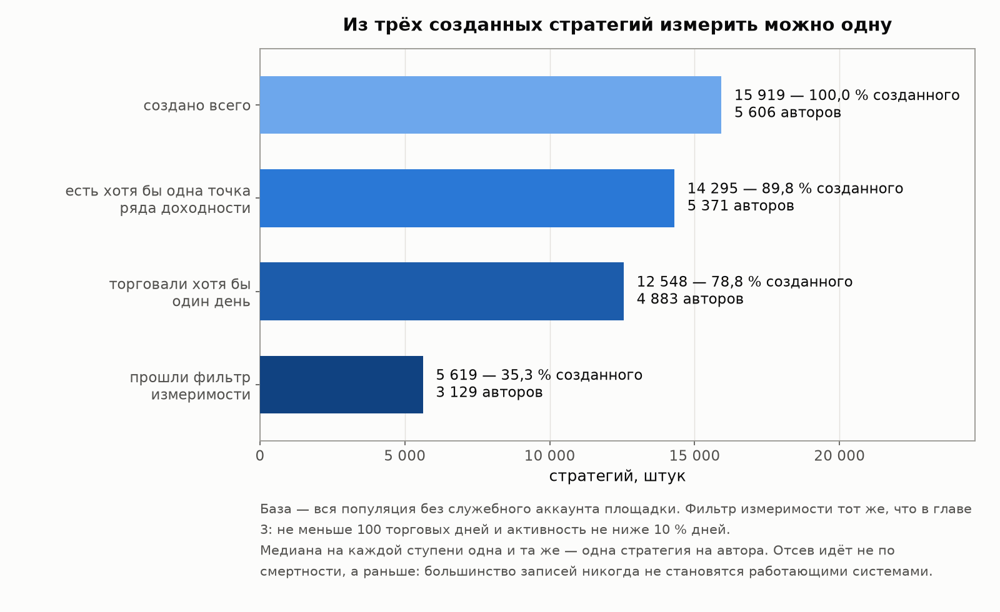
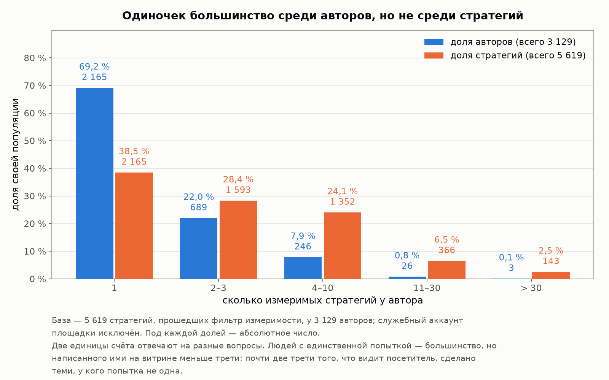
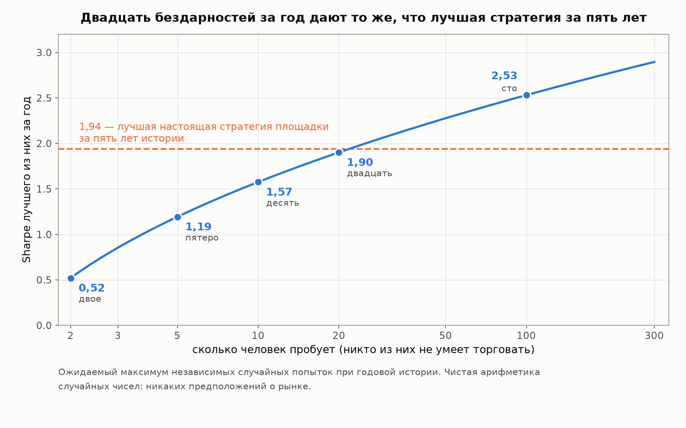
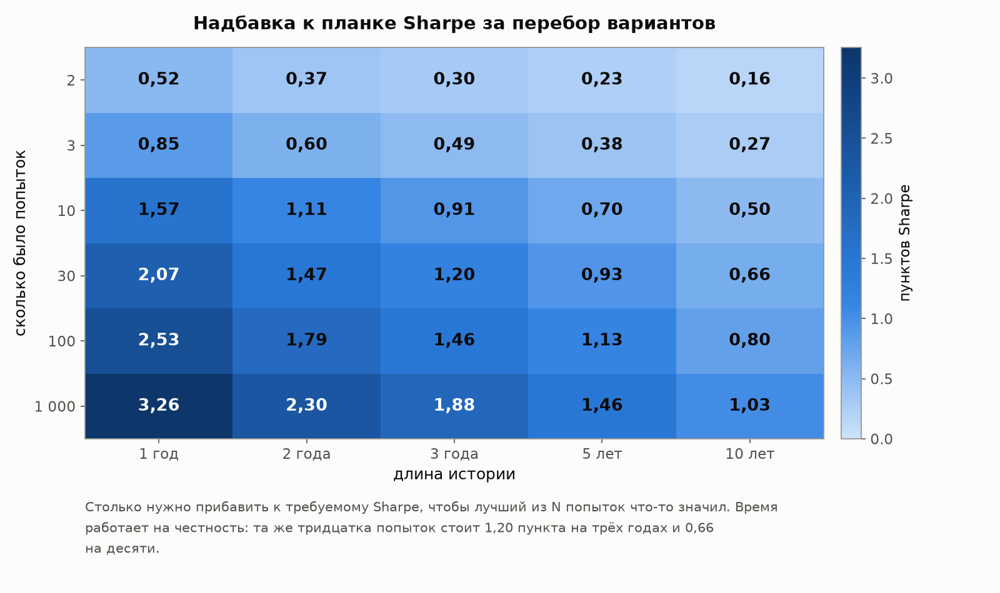
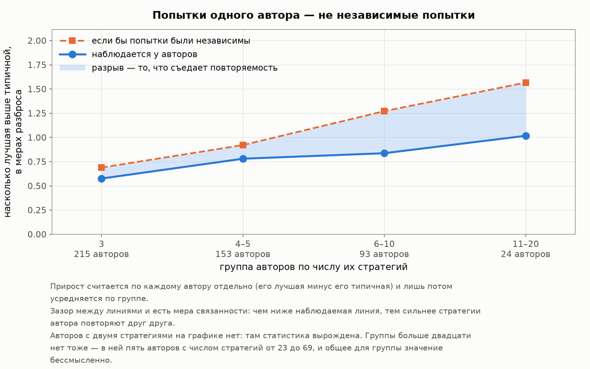
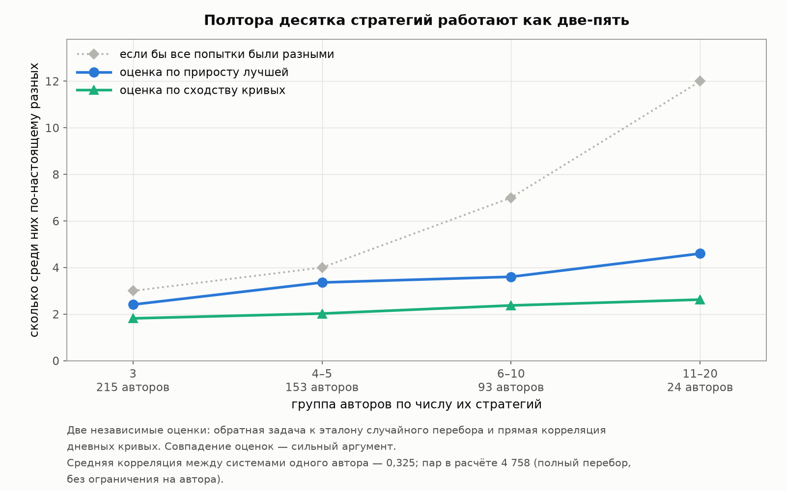
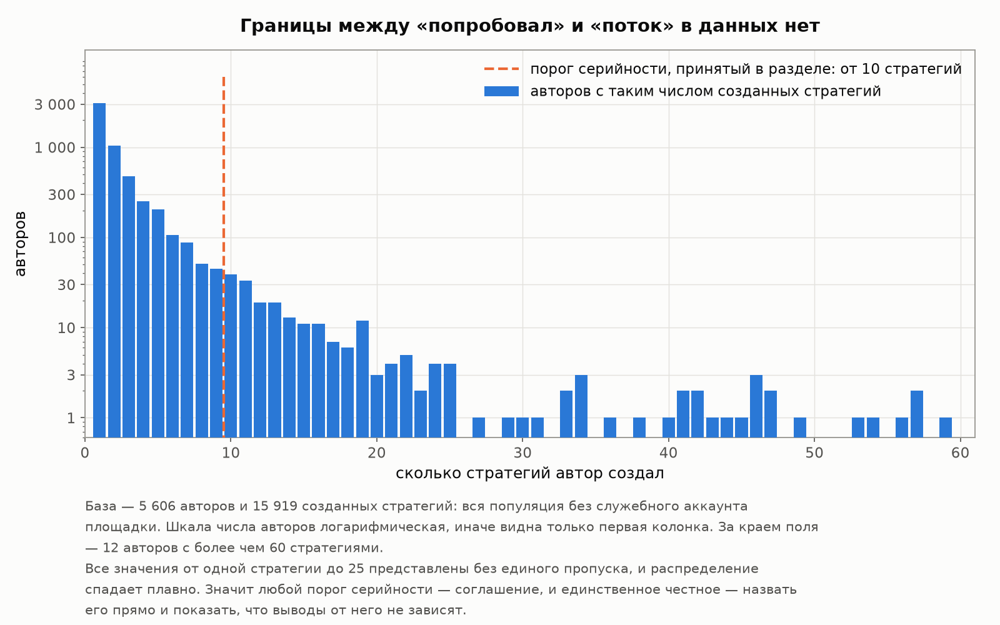
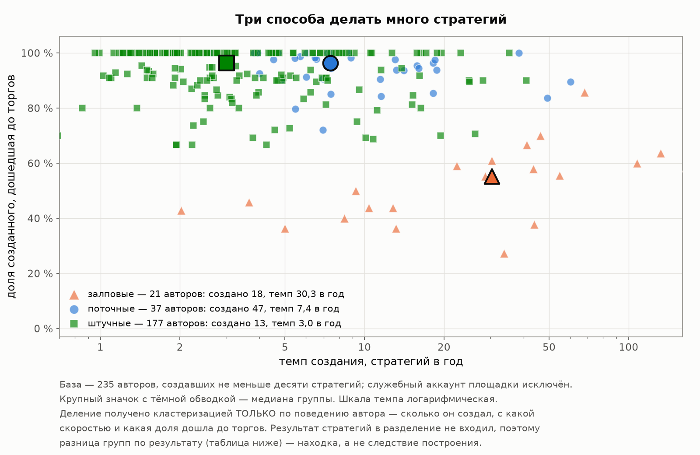
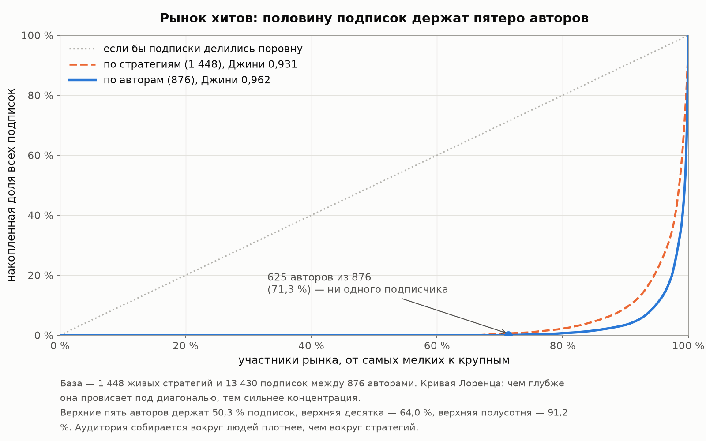

# Глава 4. Продавцы: кто пишет стратегии

[Лицензия](comon-story-license.md) · [Введение](comon-story-0-intro.md) · [1 — Площадка и витрина](comon-story-1-market.md) · [2 — Кладбище](comon-story-2-survival.md) · [3 — Из чего сделана доходность](comon-story-3-returns.md) · **Глава 4 из 5** · [Интерлюдия — вторая площадка](comon-story-4b-interlude.md) · [5 — Покупатели](comon-story-5-buyers.md) · [Заключение](comon-story-6-conclusion.md)

*Данные, методы и словарь терминов — во [введении](comon-story-0-intro.md). Все метрики пересчитаны из дневных рядов 19 978 стратегий Comon, включая 18 529 закрытых.*

---

Три предыдущие главы смотрели на стратегию как на объект: сколько она живёт, что зарабатывает, из чего сделан её результат. Но стратегию кто-то написал, и у этого человека почти никогда не одна попытка. Автор с пятнадцатью стратегиями на витрине — это пятнадцать проб, из которых вы видите ту, что получилась.

Эта глава — про них. Главный её вопрос практический: **сколько добавляет к результату само право показать лучшее из нескольких**. Он важен не только для читателя витрины. Ровно ту же операцию делает любой, кто перебирает варианты и оставляет удачный, — и обычно оценивает удачу так, будто вариант был один.

Вопрос этот разбирается в науке о финансах давно и имеет готовый аппарат, о котором обычный инвестор не слышал. Поэтому раздел 4.2 — объяснительное отступление: что такое поправка на перебор, почему она бывает огромной и как её принято считать. Кто с дефлированным Sharpe знаком, может сразу перейти к [разделу 4.3](#43-плата-за-перебор-сколько-добавляет-право-показать-лучшее), где начинаются измерения.

**Сразу оговорим, чего мы не знаем.** Автор публикует не все попытки: неудачный тест до витрины просто не доходит. Значит видимое число стратегий — **нижняя** граница реального перебора, а всё измеренное ниже — нижняя граница настоящей платы. Это делает выводы консервативными в нужную сторону: если даже видимая часть перебора стоит столько-то, полная стоит больше.

**И ещё одно, техническое, но важное.** Из авторской статистики исключён служебный аккаунт площадки — на него при единовременной чистке 2014 года переписали 4 058 чужих стратегий (глава 2, раздел 2.6). Это не автор, и считать эти системы чьими-то «попытками» нельзя: без исключения он один давал бы три четверти самой многопопыточной группы и ломал бы все измерения главы.

## 4.1 Медианный автор делает одну попытку

Начнём с воронки. Создать стратегию на площадке ничего не стоит, поэтому между «завёл» и «есть что мерить» — несколько ступеней, и на каждой отсеивается заметная часть.

| Ступень | Стратегий | Авторов | Медиана стратегий на автора | Максимум у одного |
|---|---:|---:|---:|---:|
| Создано всего | 15 919 | 5 606 | 1 | 167 |
| Есть хотя бы одна точка ряда доходности | 14 295 | 5 371 | 1 | 159 |
| Торговали хотя бы один день | 12 548 | 4 883 | 1 | 144 |
| **Прошли фильтр измеримости** | **5 619** | **3 129** | **1** | **69** |

*База — вся популяция без служебного аккаунта площадки. Фильтр измеримости — тот же, что в главе 3: не меньше 100 торговых дней и активность не ниже 10 %. Медиана равна единице на всех четырёх ступенях.*

Первое наблюдение простое и его стоит запомнить: **из каждых трёх созданных стратегий до состояния «есть что измерять» доходит одна**. Не из-за смертности — про неё была глава 2, — а потому, что большинство записей никогда не становятся работающими системами.

Второе: **медианный автор делает ровно одну попытку**, и так на каждой ступени воронки. Массовый автор здесь — не переборщик, а человек, который завёл одну стратегию.

Но популяция стратегий устроена иначе, чем популяция авторов, и это расхождение — суть раздела:

| Стратегий у автора (k) | Авторов | Стратегий | Доля стратегий |
|---|---:|---:|---:|
| 1 | 2 165 | 2 165 | 38.5 % |
| 2–3 | 689 | 1 593 | 28.4 % |
| 4–10 | 246 | 1 352 | 24.1 % |
| 11–30 | 26 | 366 | 6.5 % |
| Больше 30 | **3** | 143 | 2.5 % |

*База — 5 619 стратегий, прошедших фильтр измеримости, у 3 129 авторов.*

**Одиночек — 69 % авторов, но на них приходится лишь 38.5 % стратегий.** Почти две трети того, что вы видите на витрине, написано людьми, у которых попытка не одна. Верхний процент авторов держит 9.6 % измеримых стратегий — а если считать по всем созданным записям, то 17.8 %.

Распределение тяжёлое, но не безумное: p90 — три измеримые стратегии на автора, p99 — десять.

**Два рекорда популяции принадлежат разным людям, и путать их нельзя.** Больше всего записей создал автор под ником «Пользователь 6O2cn» — 167 штук, из которых фильтр измеримости прошли **две**. Больше всего работающих систем у Finam InvestLAB — 69 измеримых из 77 созданных. Первый рекорд говорит об активности, второй о результате, и это разные величины.

### Фабрики стратегий

В главе 2 мы уже видели этих авторов с другой стороны: чем больше стратегий у человека, тем короче они живут, а у самой многопопыточной группы медиана жизни — двадцать пять дней. Правила площадки прямо грозят блокировкой за «многократные попытки создания стратегий с короткими сроками существования».

Теперь посмотрим на ту же группу через воронку измеримости. Авторов, создавших больше двадцати стратегий, — **62 человека**:

| Показатель | Значение | Доля от созданного ими |
|---|---:|---:|
| Создано стратегий | 2 938 | — |
| Из них с хотя бы одной точкой ряда | 2 533 | 86 % |
| Прошли фильтр измеримости | **477** | **16 %** |
| Живы на дату выгрузки | **118** | **4 %** |

*База — 62 автора, у каждого больше 20 созданных стратегий; служебный аккаунт исключён. Эти 2 938 стратегий составляют 18.5 % популяции этой главы — 15 919 стратегий, у которых есть настоящий автор. В [главе 2](comon-story-2-survival.md) та же группа бралась с отсечкой «20 и больше» и считалась от полного каталога в 19 978 стратегий, включая 4 058 у служебного аккаунта, — отсюда другая доля, 15 %.*

**Публиковать стратегии и торговать ими — разные занятия.** Шестьдесят два человека завели почти каждую пятую стратегию из тех, за которыми стоит настоящий автор, но работающими стали шестнадцать процентов из них, а живыми к моменту выгрузки остались четыре.

Крайний случай: **у одиннадцати авторов из шестидесяти двух нет ни одной измеримой стратегии вообще** — при том что создали они от 21 до 126 штук каждый. Больше сотни записей, и ни одна не доработала до ста торговых дней при минимальной активности.

Создание идёт волнами: у большинства весь список укладывается в один–три года. Но не у всех: один автор растянул 165 стратегий на девять лет, с июня 2017-го по июль 2026-го; другой уложил 154 в восемь с половиной лет, с ноября 2012-го по март 2021-го; третий выпустил 126 всего за три года, с сентября 2018-го по август 2021-го, — и у последнего измеримых ноль.

*Сверка с главой 2.* Там та же группа считалась по отсечке «20 и больше» и дала 65 авторов с 2 998 стратегиями; здесь отсечка «больше 20» и, соответственно, 62 автора с 2 938. Разница — три автора ровно с двадцатью стратегиями. Полный поимённый список — в приложении Г5.

## 4.2 Отступление: почему лучший результат нужно уценивать

Следующие два раздела измеряют вещь, о которой читатель витрины обычно не подозревает, а профессионалы спорят о ней тридцать лет. Без объяснения таблицы дальше выглядят технической экзотикой — а речь идёт о самом житейском обмане, и стоит потратить пять минут, чтобы увидеть его целиком.

### Задача о лучшем из двадцати

Представьте двадцать человек, ни один из которых не умеет торговать. Каждому дали счёт и год времени, сделки они совершают наугад. Через год мы смотрим результаты и выбираем лучший.

Каким он окажется? Не нулевым. Кому-то повезёт, и чем больше участников, тем сильнее повезёт лучшему из них. Величину везения можно посчитать точно — это чистая арифметика случайных чисел, никаких предположений о рынке:

| Участников, все без всякого умения | Sharpe лучшего из них через год |
|---|---:|
| 2 | 0.52 |
| 5 | 1.19 |
| 10 | 1.57 |
| **20** | **1.90** |
| 100 | 2.53 |

А теперь сопоставьте с главой 3: **лучшая из 697 стратегий Comon с пятилетней историей показала 1.94**, и планку 2.0 на такой дистанции не взял никто. То есть **лучший из двадцати бездарностей за один год выглядит ровно как лучшая настоящая стратегия площадки за пять лет.**

Ничего мистического тут нет. Год — это около 250 наблюдений, на такой короткой дистанции случайность свободно даёт разброс в пункт-полтора Sharpe. Отбор лучшего из многих превращает этот разброс в «результат», а зритель видит только победителя и не видит девятнадцати проигравших.

### Что лечит болезнь: длина истории

Второе лекарство после «знать число попыток» — время. Чем длиннее ряд, тем труднее случайности изображать умение: разброс Sharpe убывает примерно как единица, делённая на корень из числа лет.

Отсюда таблица, которая и есть практический смысл всего раздела. В ней — **сколько пунктов Sharpe нужно добавить к планке**, чтобы результат, отобранный как лучший из N попыток, ещё что-то значил:

| Попыток (N) | История 1 год | 2 года | 3 года | 5 лет | 10 лет |
|---|---:|---:|---:|---:|---:|
| 2 | 0.52 | 0.37 | 0.30 | 0.23 | 0.16 |
| 3 | 0.85 | 0.60 | 0.49 | 0.38 | 0.27 |
| 10 | 1.57 | 1.11 | 0.91 | 0.70 | 0.50 |
| 30 | 2.07 | 1.47 | 1.20 | 0.93 | 0.66 |
| 100 | 2.53 | 1.79 | 1.46 | 1.13 | 0.80 |
| 1 000 | 3.26 | 2.30 | 1.88 | 1.46 | 1.03 |

Читается так: если человек перебрал тридцать вариантов и показывает лучший на трёхлетней истории, то от его Sharpe нужно мысленно отнять **1.20** — столько дал бы чистый перебор без всякого умения. При десятилетней истории та же тридцатка стоит уже 0.66: время работает на честность.

*Мелким шрифтом, для желающих проверить.* Величина в клетке — ожидаемый максимум N независимых случайных попыток, помноженный на разброс оценки Sharpe. Разброс взят как единица на корень из числа лет — стандартное приближение, которое считает доходности примерно нормальными; при сильно скошенных или тяжелохвостых рядах поправка нужна больше, а не меньше.

### Как это называется у профессионалов

У описанной поправки есть имя и опубликованный метод — **Deflated Sharpe Ratio**, «дефлированный Sharpe» (Бейли и Лопес де Прадо, 2014). Идея ровно та, что выше, доведённая до готовой процедуры.

Обычная проверка результата спрашивает: «отличается ли этот Sharpe от нуля?» Дефлированный Sharpe спрашивает другое и куда более честное: **«отличается ли этот Sharpe от того, что показал бы лучший из N случайных попыток?»** Ответом служит не сам Sharpe, а вероятность — насколько правдоподобно, что перед нами умение, а не победитель лотереи. Вероятность 0.95 означает «на удачу это списать трудно»; 0.5 означает «с тем же успехом это могло быть везение».

Отсюда же берётся требование, которое иначе кажется занудством: **вместе с результатом нужно сообщать, из скольких попыток он выбран**. Sharpe 2.0 после трёх проб и Sharpe 2.0 после тысячи — это два совершенно разных утверждения, и без числа попыток второе неотличимо от первого.

### Где вся трудность: что считать за одну попытку

Здесь метод упирается в вопрос, на который нет механического ответа. Что подставлять вместо N?

Наивно — число стратегий. Но пятнадцать стратегий одного человека почти никогда не пятнадцать разных идей: это чаще одна идея в пятнадцати настройках, на тех же инструментах и том же рынке. Такие попытки ходят вместе, и максимум из них растёт медленнее, чем максимум из пятнадцати по-настоящему разных ставок.

Поэтому в формулу идёт не число попыток, а **эффективное число независимых попыток** — сколько по-настоящему разных ставок содержится в k связанных. Считают его двумя способами, и оба встретятся в разделе 4.4: через корреляцию между рядами (чем сильнее системы ходят вместе, тем меньше в них независимости) и обратной задачей — при каком числе независимых попыток наблюдаемый разброс был бы таким, как есть.

Разница между N и эффективным N — не мелочь: как мы увидим, полтора-два десятка попыток одного автора работают как две-пять независимых. Ошибиться здесь означает уценить чужой результат либо втрое сильнее, чем нужно, либо втрое слабее.

### Три величины, которые встретятся дальше

| Величина | Что означает |
|---|---|
| **Плата за перебор** | Наблюдаемая разница «лучшая минус типичная» у одного автора, в пунктах Sharpe. Столько добавляет само право показать лучшее |
| **Эталон независимости** | Сколько составила бы та же разница, будь все k попыток независимыми и чисто случайными. Мера для сравнения: наблюдаемое выше или ниже? |
| **Эффективное число попыток** | Во сколько по-настоящему независимых ставок превращаются k связанных попыток одного человека |

### Чем следующие разделы отличаются от теории

Всё сказанное выше — теория: она говорит, какой должна быть плата за перебор. Дальше мы делаем то, что обычно сделать не удаётся, — **измеряем эту плату напрямую**.

Возможность редкая, и держится она на устройстве наших данных. Обычно исследователь видит одну систему и вынужден гадать, из скольких попыток её выбрали. Здесь у нас три тысячи авторов, и у каждого видны все его попытки разом — и лучшая, и все остальные. Значит, можно не оценивать поправку по формуле, а просто посмотреть, чему она равна в жизни.

Поэтому дефлированный Sharpe в этой главе нигде не вычисляется: он тут не инструмент, а объяснение того, зачем мы вообще меряем. Раздел 4.3 показывает, сколько плата за перебор составляет на самом деле, раздел 4.4 — сколько попыток автора оказываются независимыми. Теория при этом остаётся мерой для сверки: наблюдаемое сравнивается с эталоном, и расхождение между ними само по себе оказывается содержательным.

## 4.3 Плата за перебор: сколько добавляет право показать лучшее

Теперь главное измерение главы. Если у автора k стратегий, то на витрине его представляет лучшая, а типичный его результат — медианная. Разница между ними и есть **плата за перебор**, наблюдаемая напрямую: столько добавляет само право выбрать лучшее из k, безотносительно к тому, умеет ли автор что-нибудь.

| Попыток у автора (k) | Авторов | Sharpe лучшей | Sharpe медианной | Прирост | Разброс σ | Прирост в σ | Эталон независимости |
|---|---:|---:|---:|---:|---:|---:|---:|
| 2 | 474 | 0.32 | −0.11 | 0.36 | 1.07 | 0.34 | 0.48 |
| 3 | 215 | 0.75 | 0.01 | **0.58** | 1.01 | 0.58 | 0.69 |
| 4–5 | 153 | 0.87 | 0.00 | **0.79** | 1.01 | 0.78 | 0.92 |
| 6–10 | 93 | 1.29 | 0.24 | **1.10** | 1.31 | 0.84 | 1.27 |
| 11–20 | 24 | 1.91 | 0.41 | **1.47** | 1.45 | 1.02 | 1.57 |
| Больше 20 | 5 | 2.64 | 0.72 | 2.67 | 1.00 | 2.68 | 2.03 |

*База — 5 619 измеримых стратегий у 3 129 авторов; авторы сгруппированы по числу своих измеримых стратегий. Все величины — медианы по авторам группы. «Прирост» считается **по каждому автору отдельно** (его лучшая минус его медианная), и лишь потом берётся медиана: это не разность двух столбцов слева, и совпадать с ней не обязано. «Разброс σ» — пулированный разброс Sharpe внутри автора по всей группе, взвешенный по числу стратегий. «Прирост в σ» — прирост, делённый на этот разброс. «Эталон независимости» объясняется ниже.*

**Читать таблицу надо построчно, слева направо.** Возьмём строку 6–10 попыток. Автор этой группы показывает на витрине систему с Sharpe **1.29**. Типичная его система имеет **0.24**. Наблюдатель, который смотрит на витрину, видит 1.29 — и совершенно естественно принимает это за характеристику автора. Правильная характеристика — 0.24, а разница в **1.10 пункта Sharpe** создана не мастерством, а правом показывать лучшее.

Масштаб этой разницы стоит осознать. Пункт Sharpe — это очень много: в главе 3 мы видели, что вся популяция имеет медианный Sharpe около нуля, порог 1.5 на трёхлетней истории держат 4 % стратегий, а потолок реальности — около 1.9. То есть плата за перебор при десятке попыток сопоставима со всем расстоянием от медианной стратегии до хорошей.

И плата растёт с числом попыток монотонно: 0.36 при двух, 0.58 при трёх, 0.79 при четырёх-пяти, 1.10 при шести-десяти, 1.47 при одиннадцати-двадцати.

### Правило для читателя витрины

Отсюда следует прямое практическое правило. **Если вы знаете, что у автора десяток стратегий, вычтите из показанного примерно один пункт Sharpe** — и получите его типичный результат. Если стратегия у автора единственная, вычитать нечего.

Проверить число стратегий автора на витрине можно: они перечислены в его профиле. Это, пожалуй, самая дешёвая поправка из всех, что доступны подписчику до подключения.

### Эталон независимости: почему последний столбец важнее, чем кажется

Раздел 4.2 объяснил, откуда эталон берётся; здесь он делает работу. Напомним смысл: это та же величина «лучшая минус медианная», посчитанная на k **независимых** попытках чистой удачи. Она отвечает на вопрос «а сколько получилось бы, если бы автор делал k совершенно разных, ничем не связанных ставок и не умел ничего».

И вот что видно: **наблюдаемое ниже эталона в каждой строке, где сравнение осмысленно.** 0.58 против 0.69 при трёх попытках; 0.78 против 0.92; 0.84 против 1.27; 1.02 против 1.57. Разрыв растёт с числом попыток.

Смысл этого — не в том, что авторы слабее случайности. Смысл в том, что **их попытки не независимы**, — ровно та трудность, о которой предупреждал раздел 4.2. Максимум из пятнадцати вариантов одной идеи растёт медленнее, чем максимум из пятнадцати разных ставок, и разрыв с эталоном показывает, насколько сильно. Здесь это качественный вывод; в число он превращается в следующем разделе.

*Две технические оговорки.* Строка k = 2 о переборе не сообщает ничего: медиана двух чисел равна их среднему, и статистика там вырождается в тождество. И строка «больше 20» — единственная, где знак обратный (2.68 против эталона 2.03); это группа из пяти человек, и разбирается она в приложении Г12: дело там в двух конкретных авторах, а не в независимости попыток.

## 4.4 Сколько попыток на самом деле независимы

Предыдущий раздел показал, что попытки автора связаны между собой. Теперь измерим связь двумя разными способами и посмотрим, сойдутся ли они.

**Способ прямой** — взять дневные ряды доходности систем одного автора и посчитать, насколько они ходят вместе.

| Показатель корреляции между двумя системами одного автора | Значение |
|---|---:|
| 5-й перцентиль | −0.05 |
| 25-й перцентиль | 0.07 |
| **Медиана** | **0.25** |
| 75-й перцентиль | 0.56 |
| 95-й перцентиль | 0.89 |
| Средняя корреляция | **0.325** |
| Доля пар с корреляцией выше 0.8 | 9.5 % |

*База — 4 758 пар систем у 508 авторов; в паре обе системы одного человека, окно пересечения не меньше 250 торговых дней (на более коротком корреляция — шум).*

Медианная пара систем одного автора связана на 0.25, но распределение широкое: четверть пар практически независимы (ниже 0.07), а каждая десятая ходит почти синхронно (выше 0.8).

Теперь переведём это в число независимых попыток. Двумя способами: обращением эталона из предыдущего раздела и напрямую из корреляции.

| Попыток (k) | Прирост в σ | Независимых попыток: через эталон | Через корреляцию | Доля независимых: через эталон | Через корреляцию |
|---|---:|---:|---:|---:|---:|
| 3 | 0.58 | 2.4 | 1.8 | 0.80 | 0.61 |
| 4–5 | 0.78 | 3.4 | 2.0 | 0.84 | 0.51 |
| 6–10 | 0.84 | 3.6 | 2.4 | 0.51 | 0.34 |
| 11–20 | 1.02 | **4.6** | **2.6** | **0.38** | **0.22** |

*«Через эталон» — при каком числе независимых попыток симуляция даёт наблюдаемый прирост. «Через корреляцию» — формула эффективного размера выборки при средней корреляции 0.325. «Доля независимых» — это число, делённое на медианное k группы. Строка «больше 20» отброшена: там пять авторов с k от 23 до 69, и медиана группы ничего не представляет.*

**Два независимых способа дают один ответ.** Доля попыток, работающих как независимые, падает с ростом их числа: с 0.80 до 0.38 по первому способу, с 0.61 до 0.22 по второму. Первый способ систематически выше — он замечает и различия в идеях, которых корреляция дневных рядов не видит (разные инструменты, разные периоды активности); второй чувствителен только к совпадению движений.

Главный вывод в одной фразе: **перебор из одиннадцати–двадцати вариантов стоит примерно как две–пять по-настоящему независимых попыток**. Десятки схлопываются в единицы.

### А не одна ли это система под разным плечом?

Возражение, которое обязано возникнуть: если у автора стоят «система А», «та же система с удвоенным размером позиции» и «система Б», то попыток здесь не три, а две, — и высокие корреляции выше только из-за таких пар. Мы это проверили прямо.

Плечо на корреляцию не влияет: удвоение размера позиции меняет масштаб дневных доходностей, но не их форму, поэтому ρ у клона с исходником остаётся почти единицей. Значит клоны ловятся порогом по ρ. Считаем три порога и внутри каждого автора схлопываем связанные системы в одну — остаётся та, у которой длиннее история.

| Порог ρ | Пар-клонов | Доля всех пар | Систем схлопнуто | Доля всех систем | Авторов задето |
|---|---:|---:|---:|---:|---:|
| 0.90 | 222 | 4.7 % | 173 | 3.1 % | 103 |
| **0.95** | **137** | **2.9 %** | **109** | **1.9 %** | **72** |
| 0.99 | 31 | 0.7 % | 31 | 0.6 % | 25 |

*База — 4 758 пар и 5 619 измеримых систем. У 44.5 % пар-клонов (порог 0.95) наклон регрессии одной системы на другую отличается от единицы больше чем на десятую — это и есть варианты с разным плечом; у остальных наклон около 1.0, то есть копии один в один.*

**Клоны есть, но их мало, и на выводы они не влияют.** При пороге 0.95 схлопывается 109 систем из 5 619 — меньше двух процентов. После схлопывания:

| Величина | До | После |
|---|---:|---:|
| Средняя корреляция пар | 0.325 | 0.296 |
| Доля пар выше 0.8 | 9.5 % | 6.2 % |
| Независимых попыток при k = 11–20: через эталон | 4.6 | 4.9 |
| То же через корреляцию | 2.6 | 2.9 |
| Прирост в σ при k = 11–20 | 1.02 | 1.06 |

Главный вывод раздела — «одиннадцать–двадцать попыток работают как две–пять независимых» — держится при любом из трёх порогов. Причина, по которой удаление клонов почти ничего не меняет, видна из первой таблицы: **связь попыток создаётся не парами-двойниками, а общей серединой распределения**. Убрать четверть пар с ρ выше 0.8 было бы существенно; но таких пар, где системы действительно неразличимы, всего 2.9 %, а типичная пара связана на 0.25 — это один стиль и один рынок, а не одна система в двух экземплярах.

### Гипотеза, которая не подтвердилась

Мы ожидали продолжения: если лучшая система автора — результат отбора из многих, то в её результате больше везения, а значит дальше она должна жить хуже. Проверили. Получилось наоборот.

| Попыток (k) | Авторов | Sharpe лучшей | Лучшая система жива | Жива хоть одна |
|---|---:|---:|---:|---:|
| 2 | 474 | 0.32 | 19.4 % | 27.6 % |
| 3 | 215 | 0.75 | 22.3 % | 40.0 % |
| 4–5 | 153 | 0.87 | 26.8 % | 49.0 % |
| 6–10 | 93 | 1.29 | 28.0 % | 55.9 % |
| 11–20 | 24 | 1.91 | **50.0 %** | 70.8 % |
| Больше 20 | 5 | 2.64 | 40.0 % | **100.0 %** |

*База — та же измеримая выборка. Контроль: авторы с единственной стратегией — 2 165 систем, медианный Sharpe **−0.18**, живы 18.0 %.*

**Чем больше попыток сделал автор, тем лучше живёт его лучшая система**, а не хуже: 19.4 % против 50 %. Связь числа попыток с качеством лучшей — плюс 0.42 по рангу.

Это честный отрицательный результат, и объяснение у него, скорее всего, скучное: **число попыток на таких данных неотделимо от вовлечённости**. Тот, кто ведёт пятнадцать систем, занимается этим всерьёз; автор единственной стратегии часто попробовал и бросил — его медианный Sharpe минус 0.18, то есть хуже нуля. Эффект отбора, который мы искали, перекрыт эффектом качества автора, и на этих данных они не разделяются.

🔴 **И вывод «многопопыточные авторы живучее» из таблицы всё равно не следует** — по причине, которая важнее предыдущей. Группы здесь определены через число стратегий, **доживших до измеримого ряда**. Чтобы попасть в строку «11–20», автор обязан иметь одиннадцать систем, протянувших сто торговых дней. Признак попадания в группу и измеряемая величина — это одно и то же свойство. Таблица показывает не открытие, а собственный критерий отбора.

Именно поэтому измерение платы за перебор из раздела 4.3 остаётся в силе, а этот сюжет закрывается ничем: разница в том, что там сравниваются системы **внутри** одного автора, а здесь — авторы между собой.

### Доводка или перебор: что многопопыточный автор делает на самом деле

Предыдущий вопрос был про исход. Этот — про поведение: **много попыток — это упорное улучшение одной конструкции или перебор до первого приемлемого результата?** Разница принципиальная. Улучшение означает, что автор чему-то учится, и тогда его свежая стратегия должна быть лучше ранней. Перебор означает, что автор просто ждёт удачного броска, и тогда порядок не значит ничего.

Проверяется это прямо. Возьмём каждого автора, у которого хотя бы пять измеримых стратегий, выстроим их по дате создания и посмотрим, растёт ли Sharpe вдоль этого ряда.

| Что измеряем | Значение |
|---|---:|
| Авторов в проверке (≥ 5 измеримых стратегий) | 171 |
| Медианная связь «порядок создания ↔ Sharpe» | **+0.07** |
| Средняя связь | +0.004 |
| Доля авторов с положительной связью | **53 %** |
| Вероятность увидеть такое при полном отсутствии эффекта | 0.54 |

**Улучшения нет.** Пятьдесят три процента против пятидесяти — это подбрасывание монеты, и статистика его от монеты не отличает. Разброс при этом огромный: у четверти авторов связь ниже −0.30, у четверти выше +0.33, то есть кто-то заметно улучшается, кто-то так же заметно деградирует, а в сумме — ноль. Опыт ведения полутора десятков стратегий, судя по этим данным, не превращается в умение делать следующую лучше.

Второй вопрос — чем перебор заканчивается. Если автор ищет пока не найдёт хорошее, то живой у него должна остаться лучшая стратегия. Посмотрим, какое место занимают живые стратегии в собственном распределении автора:

| Что измеряем | Значение |
|---|---:|
| Авторов с живыми стратегиями (≥ 5 измеримых) | 104 |
| Медианный перцентиль живой стратегии среди своих же | **60** |
| Средний перцентиль | 64 |
| Вероятность такого при случайном выборе (перцентиль 50) | < 0.0001 |
| Доля авторов, у которых живой осталась именно лучшая | **8 %** |

Вот и ответ на вопрос, вынесенный в начало. **Автор действительно останавливается не на лучшем, а на «и так сойдёт».** Выбор не случаен — шестидесятый перцентиль надёжно выше пятидесятого, то есть совсем плохое всё-таки закрывают. Но до лучшего своего результата доходят восемь процентов авторов: типичная живая стратегия — чуть выше средней по автору, и не более того.

Третий вопрос — про сами попытки: это варианты одной идеи или разные идеи? Здесь работает та же корреляция, что и выше: если автор доводит одну конструкцию, его стратегии ходят вместе; если пробует разное — расходятся.

| Тип автора (по средней корреляции своих стратегий) | Авторов | Доля |
|---|---:|---:|
| Доводит одну идею (корреляция выше 0.5) | 40 | **32 %** |
| Промежуточный случай (0.2–0.5) | 57 | 45 % |
| Пробует разные идеи (корреляция ниже 0.2) | 29 | **23 %** |

*База — 126 авторов с не менее чем пятью измеримыми стратегиями, у которых нашлось хотя бы три пары с общим окном от 250 дней.*

Картина смешанная и без явного перевеса: треть доводит, четверть ищет разное, остальные посередине. Важнее другое — **число попыток на это не влияет вовсе**: связь корреляции с количеством стратегий равна −0.07 при вероятности случайности 0.46. Автор с полусотней стратегий не более склонен крутить одну идею, чем автор с пятью.

Собрав три ответа вместе, получаем довольно ясный портрет. Многопопыточный автор со временем **не улучшается**, идею **не обязательно доводит**, а останавливается на результате **чуть выше собственной середины**. Перебор здесь — не метод разработки, а способ дождаться приемлемого броска; и именно поэтому плата за перебор из раздела 4.3 не компенсируется никаким «зато он набил руку».

Как это выглядит поштучно — в приложении Г6, где собраны 23 многопопыточных автора, у которых на дату выгрузки осталась хотя бы одна живая стратегия. Одна деталь оттуда стоит основного текста: **у двенадцати из двадцати двух, чьи метрики вообще считаются, медианная годовая доходность отрицательна** (по медианному Sharpe таких десять; расхождение не противоречие — медиана Sharpe и медиана доходности берутся по разным упорядочениям и не обязаны указывать на одну и ту же стратегию). То есть больше чем у половины тех, кто на площадке удержался, типичный продукт теряет деньги, а на витрине при этом стоит лучший из десятков. Крайний случай — автор со 165 созданными стратегиями: его лучшая показывает +730 % годовых, а типичная теряет 84 % в год.

## 4.5 Серийные авторы: три способа делать много стратегий

Почти везде в этом исследовании единица наблюдения — стратегия. Об авторе говорить статистически трудно: у большинства одна попытка, и отличить человека от его единственного результата невозможно.

Но есть меньшинство, у которого попыток достаточно, чтобы разговор об авторе имел смысл. Этот раздел — про них: кто они, чем отличаются друг от друга и есть ли среди них те, кто действительно умеет торговать.

### Где кончается «попробовал» и начинается «поток»

Первый вопрос — где провести границу. Хотелось бы найти её в самих данных: если авторы делятся на «случайных» и «серийных», в распределении числа созданных стратегий должен быть провал.

Провала нет. Все значения от одной стратегии до двадцати пяти представлены без единого пропуска, и распределение спадает плавно:

| Создано стратегий | Авторов | Доля авторов | Систем | Доля систем |
|---|---:|---:|---:|---:|
| 1 | 3 107 | 55.4 % | 3 107 | 19.5 % |
| 2–3 | 1 517 | 27.1 % | 3 510 | 22.0 % |
| 4–9 | 747 | 13.3 % | 4 098 | 25.7 % |
| 10–19 | 170 | 3.0 % | 2 206 | 13.9 % |
| 20–49 | 47 | 0.8 % | 1 474 | 9.3 % |
| 50 и больше | 18 | 0.3 % | 1 524 | 9.6 % |

*База — 5 606 авторов и 15 919 стратегий: вся популяция без служебного аккаунта площадки.*

**Границы не существует, и это первый результат раздела.** Значит любой порог — соглашение, и единственное честное, что можно сделать, — назвать его прямо и показать, что выводы от него не зависят.

Мы берём **десять созданных стратегий и больше**. Это 235 авторов — верхние 4 % — и 5 204 стратегии, то есть треть всей популяции. Порог выбран не красотой, а пригодностью: при отсечке «больше двадцати» остаётся 62 автора, и на таком числе любые группировки рассыпаются в шум (мы это проверили, см. приложение Г15). Все выводы ниже перепроверены при пороге пятнадцать и держатся.

### Три способа делать много стратегий

Теперь вопрос содержательный: серийные авторы — однородная масса или среди них есть разные типы?

Чтобы ответить честно, нужно соблюсти одно правило: **делить авторов по тому, что они делают, а описывать тем, что у них получилось**. Если делить по результату, а потом обнаружить, что группы различаются результатом, — это не открытие, а тавтология.

Признаков поведения три: сколько стратегий автор создал, с какой скоростью (штук в год) и какая доля созданного дошла хотя бы до одного торгового дня. Ни один из них не говорит, заработала стратегия или нет.

Получается устойчивое деление на три группы:

| Группа | Авторов | Создано (медиана) | Темп, стратегий в год | Доля дошедших до торгов |
|---|---:|---:|---:|---:|
| **Залповые** | 21 | 18 | **30.3** | **0.55** |
| **Поточные** | 37 | **47** | 7.4 | 0.96 |
| **Штучные** | 177 | 13 | 3.0 | 0.96 |

*База — 235 авторов с десятью и более созданными стратегиями. Все три признака — действия автора; результат в них не входит.*

🔴 **«Поточные» здесь — не то же самое, что «фабрики» из раздела 4.1.** Фабриками мы называли 62 автора с двадцатью и более стратегиями — это отсечка по количеству, общая с главой 2. Поточные — группа из 37 человек, выделенная кластеризацией по трём признакам сразу, и попасть в неё можно и с меньшим числом стратегий. Группы пересекаются, но это разные множества.

Залповые выпускают по тридцать стратегий в год, и почти половина этих записей никогда не совершает ни одной сделки. Поточные создают втрое больше штучных авторов — сорок семь против тринадцати, — но доводят созданное до запуска. Штучные работают медленно: три стратегии в год.

### Что из этого выходит

Теперь — результат, который в разделение не входил:

| Группа | Систем | Измеримых | Живых | Sharpe лучшей | Sharpe медианной | CAGR медианный | Просадка медианная | Подписок |
|---|---:|---:|---:|---:|---:|---:|---:|---:|
| Залповые | 643 | 7 | 13 | 0.84 | 0.84 | +17.4 % | −25.3 % | **4** |
| Поточные | 2 077 | 385 | 104 | **1.33** | 0.28 | −0.6 % | −42.0 % | 2 601 |
| Штучные | 2 484 | 810 | 247 | 1.07 | **0.32** | +2.4 % | −43.2 % | **6 352** |

*«Sharpe лучшей» — медиана по авторам группы от их лучшей системы; «Sharpe медианной» — медиана по всем измеримым системам группы. Подписки считаются только по живым системам: у архивных счётчик обнулён площадкой. Счётчик стратегии — это её подписчики, но сумма по нескольким стратегиям — уже подписки: один человек может подписаться на несколько.*

**Главное здесь — сравнение поточных со штучными.** У поточных лучшая система выглядит заметно сильнее: медианный Sharpe лучшей 1.33 против 1.07. А типичная система — слабее: 0.28 против 0.32, медианный CAGR −0.6 % против +2.4 %.

Это плата за перебор из раздела 4.3, увиденная в разрезе людей, а не систем. Больше попыток — красивее верхняя карточка на витрине и хуже средняя. Витрина показывает первое.

Залповые — вырожденный случай, и их числа читать как статистику нельзя: у двадцати одного автора на всех семь измеримых систем. Четыре подписки на всю группу — вот всё, что рынок им дал.

### Кто из них действительно умеет торговать

Все предыдущие сравнения — про средние по группам. Остаётся вопрос, ради которого раздел и существует: есть ли среди серийных авторов те, у кого результат нельзя объяснить ни удачей, ни числом попыток?

Критерий задан заранее, до просмотра ответа, и составлен так, чтобы не отбирать по живучести:

1. **достоверность** — t-статистика Sharpe по модулю не меньше двух, то есть результат отличим от нуля;
2. **уровень** — Sharpe не ниже 1.0 на той же истории;
3. **поправка на перебор** (раздел 4.2) — Sharpe лучшей системы должен превышать ожидаемый максимум из стольких независимых попыток, сколько автор сделал;
4. **длина истории** — не меньше трёх лет;
5. и условие на автора, а не на систему: **медианный Sharpe его измеримых систем не ниже нуля** — иначе это один удачный выстрел на фоне мусора.

| Ступень отбора | Систем |
|---|---:|
| измеримых систем у 235 серийных авторов | 1 202 |
| прошли по достоверности | 107 |
| и по уровню | **83** |
| и по поправке на перебор | 83 |
| и по длине истории | 83 |

🔴 **Два условия из пяти не отсекли ничего, и об этом надо сказать прямо.** Причина в том, как считается t-статистика: она делится на поправку, растущую вместе с самим Sharpe, поэтому величина 15.31 на коротком ряде большого t не даёт. Требование достоверности уже само выбросило короткие истории — у прошедших систем медианная длина 6.2 года. Отдельные условия на длину и на перебор оказались избыточны; мы оставили их как страховку, но работу сделали первые два.

**Итог: 23 автора из 235 — 9.8 %.** И вот как они распределены по группам:

| Группа | Умеющих | Из скольких авторов | Доля |
|---|---:|---:|---:|
| Залповые | **0** | 21 | 0 % |
| Поточные | 4 | 37 | **10.8 %** |
| Штучные | 19 | 177 | **10.7 %** |

**Доля умеющих у поточных и штучных одинакова — 10.8 % против 10.7 %.** Поточный автор создаёт сорок семь стратегий, штучный автор тринадцать, втрое меньше, — и вероятность того, что перед вами человек с проверяемым результатом, у них не отличается.

Это, пожалуй, главный вывод раздела. **Перебор увеличивает витрину, но не увеличивает умение.** Он даёт более впечатляющую лучшую карточку — и ровно ту же вероятность, что за ней стоит мастерство.

Списка с пометкой «умеет торговать» мы не приводим. Ниже, в разборе двадцати девяти авторов, имена названы — и это не противоречие, а ровно та граница, которой мы держимся: **рядом с именем стоят только числа, ярлыка не стоит**. «Медианный Sharpe 1.26 на пяти годах» читатель проверит и истолкует сам; «умеет торговать» — уже наша оценка конкретного человека, часть из них подписана настоящими именами, и раздавать такие оценки мы не вправе. Сводные характеристики группы — в приложении Г16.

### Чего этот раздел показать не смог

Честный список того, что не получилось, — часть результата.

**Естественной границы серийности нет.** Порог в десять стратегий — соглашение. Мы показали, что при пятнадцати выводы те же, но это устойчивость, а не обоснование.

**Типология далась не сразу и не полностью.** Первая попытка делила авторов по пяти признакам, включая долю систем, доживших до измеримости. Этот признак — наполовину результат, и разбиение на нём разваливалось: без него получалось совсем другое деление (совпадение с исходным — 0.215 по индексу Рэнда). Пришлось убрать и его, и «сколько лет прошло с последней созданной стратегии»: последний признак делил авторов на ушедших и работающих, что верно, но бессодержательно — ушёл десять лет назад, значит живых стратегий нет, значит и подписчиков нет.

**Границы между группами размыты.** Мера обособленности кластеров — 0.515 при максимуме 1.0; это «различимо», но далеко от «очевидно». Мы называем группы типами для удобства чтения; в данных это скорее сгущения, чем отдельные острова.

**Внутри самой большой группы структуры нет.** Попытка разделить 177 штучных авторов дальше даёт лишь отщепление горстки выбросов, а не новые типы.

**И отдельно: качество результата не объясняется ни одним признаком поведения.** Мы проверяли долю дошедших до торгов как возможную главную ось — по ней у авторов с худшей конверсией оказался лучший медианный Sharpe, а не худший. Связь есть только с числом подписок, и она тривиальна: у кого больше работающих стратегий, у того больше подписок.

### Двадцать девять авторов вблизи

Всё сказанное выше — про группы и средние. Теперь посмотрим на конкретных людей.

Возьмём авторов, у которых **больше десяти стратегий прошли фильтр измеримости**. Таких на всей площадке двадцать девять. Именно у них достаточно собственных результатов, чтобы говорить не о единственной удаче, а о том, что человек делает раз за разом.

🔴 **Оговорка, без которой подраздел вводит в заблуждение.** Этот отбор идёт по числу стратегий, доживших до измеримости, — то есть частично по живучести. Сравнивать выживаемость этих двадцати девяти с площадкой нельзя: они отобраны ровно по ней. Но сравнивать их **между собой** законно — все прошли один и тот же фильтр, и дальше речь пойдёт только о различиях внутри группы.

Порог в десять выбран потому, что двадцать девять — минимальное число, на котором вообще можно что-то разглядеть, и потому что более строгие отсечки хрупки. При «больше двадцати измеримых» остаётся пять человек, при «больше девятнадцати» — шесть: шестой, GPMTrade, имеет ровно двадцать и выпадает из-за одного слова в определении. Как мы сейчас увидим, он при этом попадает в лучшую половину.

**Отсюда следует, что залповых авторов мы вблизи не рассматриваем — и причина не в экономии места.** У всей их группы, двадцати одного человека, на всех **семь измеримых стратегий**: у шестнадцати из двадцати одного нет ни одной. Автор, создавший 167 стратегий, довёл до измеримого состояния две; автор со 126 созданными — ни одной. Судить о таком человеке нечем: медиана по нулю стратегий не существует, а по двум — не медиана. Всё, что о залповых можно сказать честно, уже сказано выше их групповыми числами. Разбирать же поимённо тех, у кого нечего мерить, значило бы удлинить и без того длинную главу разговором ни о чём.

Поэтому дальше — только двадцать девять авторов с больше чем десятью измеримыми стратегиями, то есть те, у кого набралось достаточно собственных результатов.

#### Две группы: медленные и живучие против быстрых и короткоживущих

Разделим этих двадцать девять **по результату** — по медианному Sharpe, доходности и доле прибыльных стратегий. Заметьте, что здесь всё наоборот по сравнению с типологией выше: там мы делили по поведению и смотрели, разойдётся ли результат, — здесь делим по результату и смотрим, разойдётся ли поведение.

Деление получается предельно чётким: **на всех проверочных подвыборках оно воспроизводится без единого расхождения**.

| Группа | Авторов | Sharpe медианный | CAGR медианный | Доля прибыльных | Волатильность | Просадка |
|---|---:|---:|---:|---:|---:|---:|
| **Первая** | 18 | **+0.60** | **+12.6 %** | **72.6 %** | 29.6 % | −38.4 % |
| **Вторая** | 11 | −0.04 | **−27.7 %** | 31.2 % | **74.8 %** | **−59.0 %** |

А вот то, что в разделение **не входило** и разошлось само:

| Группа | Создано всего | Измеримых | Живых | Темп, стратегий в год | Медианная длина истории | Подписок |
|---|---:|---:|---:|---:|---:|---:|
| Первая | 455 | 355 | **154** | **2.3** | **3.1 года** | **5 597** |
| Вторая | **475** | 154 | 29 | **6.6** | **0.9 года** | **63** |

**Вторая группа создала больше первой — 475 стратегий против 455 — и собрала 63 подписки против 5 597.** В восемьдесят девять раз меньше при большем объёме работы.

Три различия, которых мы не задавали:

**Скорость.** 2.3 стратегии в год против 6.6. Те, у кого результат хуже, делают их втрое быстрее.

**Длина жизни стратегии.** Медианная история 3.1 года против 0.9. У второй группы типичная стратегия не доживает до года — и отсюда же их волатильность 74.8 % и просадка −59 %: короткие ряды ловят один рыночный эпизод целиком.

**Выживаемость.** 154 живые стратегии против 29 — при том что вторая группа создала больше. Из созданного у первой группы жива каждая третья, у второй — каждая шестнадцатая.

Спрос ведёт себя так же: 5 597 подписок против 63. Почему — данные не говорят: увидеть будущую выживаемость подписчик не мог, он видел только витрину. Факт же в том, что подписки сосредоточены в той самой группе, у которой лучше и результат, и выживаемость. Это верно **между** группами; внутри первой группы спрос с качеством уже не связан — три четверти её подписок держат двое, и медианный Sharpe одного из них ниже среднего по группе (разбор ниже).

#### Кто в первой группе

| Автор | Создано | Измеримых | Живых | Sharpe лучшей | **Sharpe медианной** | CAGR | Просадка | Прибыльных | Лет истории | Подписок |
|---|---:|---:|---:|---:|---:|---:|---:|---:|---:|---:|
| UltimaAlgotrade | 16 | 15 | 15 | 3.21 | **1.27** | +31.9 % | −15.0 % | 80 % | 1.0 | 169 |
| howtotrade | 33 | 33 | 20 | 2.21 | **1.26** | +17.5 % | −25.1 % | **97 %** | 5.3 | 88 |
| voldemort | 25 | 18 | 11 | 2.14 | **1.25** | +31.8 % | −23.8 % | 78 % | 2.6 | **2 257** |
| TradeCenter | 23 | 23 | 2 | 5.50 | 1.04 | +21.8 % | −32.6 % | 96 % | **10.6** | 25 |
| Дмитрий Т | 15 | 11 | 9 | 2.09 | 0.75 | +19.1 % | −39.8 % | 91 % | 4.7 | 20 |
| Finam InvestLAB | **77** | **69** | **37** | 5.01 | 0.72 | +15.5 % | −32.0 % | 72 % | 3.6 | **1 856** |
| Bulaev Sergey | 19 | 11 | 5 | 1.82 | 0.69 | +13.6 % | −43.1 % | 82 % | 9.4 | 6 |
| Максим Отавин | 19 | 13 | 7 | 2.72 | 0.63 | +18.1 % | −32.8 % | 69 % | 1.9 | 45 |
| Krasnoyarskinvest | 19 | 15 | 4 | 1.32 | 0.62 | +9.5 % | −56.1 % | 67 % | 3.2 | 370 |
| Top300Shuld | 13 | 12 | 7 | 2.40 | 0.59 | +9.9 % | −25.2 % | 75 % | 2.8 | 5 |
| Глобальные Фонды | 15 | 15 | 3 | 2.12 | 0.55 | +11.6 % | −53.2 % | 93 % | 4.9 | 55 |
| Robotic InvestManagement | 11 | 11 | 11 | 1.92 | 0.54 | +15.9 % | −52.1 % | 64 % | 2.0 | 25 |
| Investprofitmarket | 14 | 11 | 2 | 1.14 | 0.52 | +9.2 % | −47.2 % | 73 % | 3.0 | 27 |
| Capital | 15 | 11 | 0 | 1.64 | 0.49 | +5.5 % | −62.1 % | 64 % | 3.4 | 0 |
| r1977 | 25 | 12 | 0 | 2.39 | 0.45 | +5.1 % | −48.4 % | 50 % | 0.8 | 0 |
| camry759 | 54 | 41 | 16 | 1.65 | 0.44 | +5.7 % | −46.7 % | 54 % | 1.9 | 590 |
| Generator2014 | 17 | 14 | 4 | 0.82 | 0.36 | +5.6 % | −34.3 % | 71 % | 4.2 | 59 |
| GPMTrade | 45 | 20 | 1 | 2.02 | 0.26 | +2.8 % | −37.0 % | 55 % | 1.3 | 0 |

*Все величины — медианы по измеримым стратегиям автора, кроме «Sharpe лучшей». «Лет истории» — медианная длина ряда его стратегий. Подписчики считаются только по живым стратегиям.*

Внутри группы разброс велик. **Трое держат медианный Sharpe выше 1.25** — то есть у них не одна удачная система, а типичная система хороша. Но и здесь надо смотреть на длину: у UltimaAlgotrade медианная история **один год**, и его 1.27 ещё ничем не проверен, тогда как у howtotrade те же 1.26 стоят на пяти годах, а у TradeCenter 1.04 — на десяти с половиной.

**Спрос распределён не по качеству.** Из 5 597 подписок группы 4 113 — то есть три четверти — приходятся на двоих: voldemort (2 257) и Finam InvestLAB (1 856). С voldemort всё сходится: его медианный Sharpe 1.25 — третий результат из восемнадцати. А дальше связь рассыпается. Finam InvestLAB с 0.72 стоит шестым — в верхней трети, но не на вершине, — и держит подписок **в семь раз больше, чем два лучших автора группы вместе взятых**: у UltimaAlgotrade с его 1.27 их 169, у howtotrade с 1.26 — 88. Обратный пример здесь же: camry759 занимает по качеству шестнадцатое место из восемнадцати (0.44), а подписок у него 590 — вдвое с лишним больше, чем у тех же двух лучших.

#### Кто во второй группе

| Автор | Создано | Измеримых | Живых | Sharpe лучшей | **Sharpe медианной** | CAGR | Волатильность | Просадка | Прибыльных | Лет истории | Подписок |
|---|---:|---:|---:|---:|---:|---:|---:|---:|---:|---:|---:|
| Росток | 34 | 12 | 3 | 1.30 | 0.31 | −17.9 % | 98.2 % | −73.5 % | 33 % | 1.0 | 54 |
| YaKabakov | 15 | 12 | 0 | **5.12** | 0.16 | −17.2 % | 74.8 % | −55.0 % | 33 % | 0.9 | 0 |
| Shtirlic01 | **154** | 13 | 0 | 2.02 | 0.10 | −18.5 % | 75.1 % | −55.6 % | 38 % | 0.7 | 0 |
| Sivak87 | 33 | 14 | 0 | 0.92 | 0.02 | −29.2 % | 54.2 % | −59.7 % | 21 % | 0.9 | 0 |
| Максим Соколов | 42 | 16 | 1 | **17.12** | −0.03 | −27.7 % | 56.4 % | −52.2 % | 31 % | 0.6 | 0 |
| Moex15 | 61 | 29 | 6 | 2.64 | −0.04 | −29.5 % | 76.2 % | −59.0 % | 31 % | 0.9 | 7 |
| Адамович Алексей | 20 | 12 | 2 | 1.90 | −0.16 | −6.9 % | 34.4 % | −40.5 % | 33 % | 0.8 | 0 |
| ManCapital | 46 | 11 | 0 | 1.57 | −0.36 | **−55.2 %** | 74.9 % | −65.0 % | **9 %** | 0.6 | 0 |
| Виталий Смотрин | 12 | 11 | 3 | 0.73 | −0.40 | −40.3 % | **129.1 %** | **−78.9 %** | 27 % | 0.9 | 2 |
| TakeProfit | 16 | 12 | **12** | 0.94 | −0.41 | −22.8 % | 35.3 % | −74.4 % | 42 % | 2.7 | 0 |
| GlobalTrade | 42 | 12 | 2 | 0.87 | **−1.90** | −52.2 % | 32.1 % | −46.0 % | **8 %** | 0.7 | 0 |

**Здесь плата за перебор видна в чистом виде.** У Максима Соколова лучшая стратегия показывает Sharpe **17.12** — при медианном по его же стратегиям **−0.03** и медианной доходности −27.7 %. У YaKabakova лучшая 5.12 при медиане 0.16. Витрина обоих может выглядеть блестяще: посетитель видит верхнюю карточку, а не шестнадцать остальных.

**Shtirlic01 создал 154 стратегии** — больше всех среди этих двадцати девяти, по восемнадцать с половиной в год (ноябрь 2012 — март 2021). На площадке это лишь третий результат: 167 записей у «Пользователя 6O2cn» и 165 у sergik7878, но у обоих измеримых слишком мало, чтобы попасть в разбор. До измеримости дожили тринадцать, живых нет ни одной, медианная доходность −18.5 %, подписок ноль.

**У девяти из одиннадцати ноль или одна-две подписки.** Исключение — Росток (54) и Moex15 (7). Витрина этих авторов рынку известна, и рынок за неё не платит.

**TakeProfit — отдельный случай**, показывающий, что «много живых» само по себе ничего не значит: у него двенадцать живых стратегий из шестнадцати, больше всех во второй группе, при медианном Sharpe −0.41 и просадке −74.4 %. Живая стратегия — это не работающая стратегия, а просто неархивированная.

#### Что видно только вблизи

**Медианный Sharpe важнее лучшего, и разница между ними — самая дешёвая проверка.** У всех одиннадцати авторов второй группы есть стратегия с положительным, а у некоторых и с выдающимся Sharpe. Разрыв между лучшей и типичной — вот что отличает группы: в первой он в среднем меньше, во второй достигает семнадцати пунктов.

**Возраст стратегии решает больше, чем кажется.** Медианная длина истории 3.1 года против 0.9 — и все остальные различия идут следом. Быстрый выпуск коротких стратегий даёт ровно то, что описано в разделе 4.2: много попыток, одна из которых обязательно выстрелит на своём коротком отрезке.

**Рынок в целом различает эти группы, но внутри группы платит не за качество.** Восемьдесят девять к одному между группами — различает. Три четверти подписок первой группы у двух авторов, не лучших по качеству, — не различает.

## 4.6 Что получает автор

Осталось посчитать деньги. Как устроен тариф, подробно разобрано в главе 1: у 94 % стратегий это фиксированные 6 % годовых от активов подписчика, независимо от результата. Здесь — сколько это в сумме и кому достаётся.

**Нижняя оценка рынка.** Перемножив число подписчиков каждой живой стратегии на её минимальный порог входа и сложив, получаем **3.94 млрд ₽** под подписками. Оценка именно нижняя: меньше порога на счёте быть не может, а насколько типичный счёт его превышает, в данных не видно.

| Ставка тарифа | Плата в год со всего рынка |
|---|---:|
| 6 % (базовая, у 94 % стратегий) | **236 млн ₽** |
| 3 % (льготная) | 118 млн ₽ |

*База — 13 430 подписок на 1 448 живых стратегиях. Числа отражают только плату за автоследование; комиссии брокера за сделки копирования сюда не входят и в данных не видны.*

Это выручка, которую делят автор и площадка. Что из неё достаётся подписчику — вопрос главы 5, и ответ там неутешительный.

**Подписка подписке не равна, и для автора это решает всё.** За подпиской на стратегию с порогом входа 30 тыс. ₽ стоит счёт минимум в тридцать тысяч, за подпиской с порогом 3 млн — минимум три миллиона, а плата берётся с активов. Поэтому список авторов по числу подписок и список по деньгам под ними — разные списки:

| Автор | Живых стратегий | Подписок | Доля подписок | Денег, млн ₽ | Доля денег | Медианный порог, тыс. ₽ | Место по подпискам | Место по деньгам |
|---|---:|---:|---:|---:|---:|---:|---:|---:|
| voldemort | 11 | 2 257 | 16.8 % | 300 | 7.6 % | 200 | **1** | 4 |
| Finam InvestLAB | 37 | 1 856 | 13.8 % | 516 | 13.1 % | 235 | 2 | 2 |
| Alenka Capital | 7 | 1 181 | 8.8 % | 606 | **15.4 %** | 500 | 3 | **1** |
| Космос Капитал | 6 | 877 | 6.5 % | 82 | 2.1 % | 62 | 4 | 12 |
| camry759 | 16 | 590 | 4.4 % | 117 | 3.0 % | 350 | 5 | 8 |
| Krasnoyarskinvest | 4 | 370 | 2.8 % | 361 | 9.2 % | 1 000 | 8 | **3** |
| Динамичный Инвестор | 2 | 346 | 2.6 % | 10 | 0.3 % | 30 | 9 | 40 |
| m707 | 8 | 181 | 1.3 % | 219 | 5.6 % | 1 050 | 15 | **5** |
| Сергей Трофимов | 4 | 76 | 0.6 % | 215 | 5.5 % | 2 990 | 28 | **6** |
| PrimeConsult | 7 | 40 | 0.3 % | 89 | 2.3 % | 3 000 | 45 | **10** |

*База — 1 448 живых стратегий и 13 430 подписок между 876 авторами. «Денег» = подписки × минимальный порог входа стратегии; это нижняя оценка суммы, а доли верны при допущении, что счёт каждого подписчика равен порогу. Показаны авторы верхних десяток обоих списков.*

**Половину рынка держат пятеро — но это две разные пятёрки.** Верхняя пятёрка по подпискам собрала 50.3 % подписок, верхняя пятёрка по деньгам — 50.9 % денег, и общих в них только трое. Самый популярный автор площадки по деньгам лишь четвёртый: у voldemort больше всех подписок, но порог входа его стратегий 200 тыс. ₽. А **Сергей Трофимов с 76 подписками стоит по деньгам шестым** — при пороге почти в три миллиона; PrimeConsult с сорока подписками и порогом три миллиона входит в первую десятку по деньгам, находясь на сорок пятом месте по популярности.

Отсюда практический вывод об экономике автора: **аудиторию можно набирать двумя разными способами**, и второй в данных встречается заметно реже первого. Массовый автор берёт числом подписок при низком пороге; автор с высоким порогом получает ту же выручку с горстки клиентов. Что из этого лучше для подписчика — вопрос отдельный, и в главе 5 он получает неожиданный ответ: порог входа оказывается сильнейшим из заранее видимых признаков качества.

**Но главное в авторской экономике — не размер, а распределение.** Рынок продавца устроен как рынок хитов:

| Показатель концентрации | Значение |
|---|---:|
| Авторов с живыми стратегиями | 876 |
| Джини по подпискам между авторами | **0.962** |
| Доля топ-5 авторов в подписках | **50.3 %** |
| Доля топ-10 авторов | 64.0 % |
| Доля топ-50 авторов | 91.2 % |
| Авторов без единого подписчика | **625 (71.3 %)** |

*База — 876 авторов, у которых есть хотя бы одна живая стратегия, и 13 430 подписок между ними. Концентрация от границы базы почти не зависит: если считать только по авторам живых торгующих стратегий (866), Джини и доли топ-N те же, без подписчиков 615 — 71.0 %.*

**Пять человек держат половину всех подписок. Семь авторов из десяти не имеют ни одного подписчика.** Джини 0.962 — это распределение, при котором говорить о «типичном авторе» бессмысленно: типичный автор зарабатывает ноль.

Для сравнения, между отдельными стратегиями концентрация чуть мягче (Джини 0.931). То есть **аудитория собирается вокруг людей плотнее, чем вокруг стратегий**, — и это прямая подсказка к тому, чем на самом деле определяется популярность. Разбор механизма — в главе 5.

Концентрация при этом не является следствием единицы счёта: в рублях она не мягче, а чуть жёстче — Джини по авторам **0.969** против 0.962 по подпискам, верхняя десятка держит 67.4 % денег против 64.0 % подписок. Разбор обоих весов — в приложении Д18 [главы 5](comon-story-5-buyers.md).

Соединив это с разделом 4.1, получаем полную картину предложения. Пять с половиной тысяч человек завели шестнадцать тысяч стратегий. Треть дошла до состояния, где есть что измерять. Из тех, кто дошёл, подписчиков получили меньше трети авторов, а половину всех подписок — пятеро.

## Выводы главы

1. **Медианный автор делает одну попытку, но большинство стратегий написано теми, у кого попытка не одна.** Одиночки составляют 69 % авторов и лишь 38.5 % измеримых стратегий. Верхний процент авторов держит почти каждую десятую.

2. **Из трёх созданных стратегий до состояния «есть что измерять» доходит одна.** 15 919 записей → 12 548 торговавших хотя бы день → 5 619 прошедших фильтр измеримости.

3. **Шестьдесят два автора завели каждую пятую стратегию из тех, за которыми стоит настоящий автор** (2 938 из 15 919), **и работающими стали 16 % из этих 2 938.** Живыми к дате выгрузки остались 4 % от них же — 118 стратегий. У одиннадцати из этих шестидесяти двух нет ни одной измеримой стратегии при 21–126 созданных.

4. **Лучший из двадцати случайных за один год выглядит как лучшая настоящая стратегия за пять лет.** Отбор лучшего из нескольких попыток поднимает Sharpe сам по себе: у двадцати участников без всякого умения максимум составит около 1.90 — при том что потолок реальных стратегий Comon на пятилетней истории 1.94. Поэтому результат, о котором не сказано, из скольких попыток он выбран, утверждением не является.

5. 🔴 **Плата за перебор измерена прямо и велика: 1.10 пункта Sharpe при 6–10 попытках.** Автор такой группы показывает на витрине 1.29 при типичном собственном результате 0.24. Плата растёт монотонно с числом попыток — от 0.36 при двух до 1.47 при одиннадцати-двадцати.

6. **Практическое правило: зная, что у автора десяток стратегий, вычитайте из показанного Sharpe около единицы.** Число стратегий автора видно в его профиле — это самая дешёвая поправка, доступная до подключения.

7. **Попытки автора не независимы, и это измерено двумя способами с одинаковым ответом.** Медианная корреляция между двумя системами одного человека 0.25, средняя 0.325. Перебор из 11–20 вариантов работает как 2–5 по-настоящему независимых попыток: десятки схлопываются в единицы. Объяснить это «одной системой под разным плечом» нельзя: таких клонов всего 1.9 % систем, и после их удаления вывод не меняется.

8. **Гипотеза «отобранная лучшая система живёт хуже» не подтвердилась** — она живёт лучше (50 % живых при 11–20 попытках против 19.4 % при двух). Но вывод отсюда не следует ни в какую сторону: группы определены через число доживших стратегий, то есть через ту самую живучесть, которую в них измеряют.

9. **Упорство не превращается в умение.** У 171 автора с пятью и более измеримыми стратегиями связь порядка создания с Sharpe неотличима от нуля (медиана +0.07, положительна у 53 %, вероятность случайности 0.54): свежая стратегия автора не лучше ранней. И останавливается он не на лучшем своём результате, а на шестидесятом перцентиле собственного распределения — лучшую держат живой лишь 8 % авторов. Перебор здесь не метод разработки, а ожидание приемлемого броска.

10. **Границы между «попробовал» и «работает потоком» не существует.** Распределение числа созданных стратегий гладкое, без провала: значения от одной до двадцати пяти представлены подряд. Любой порог серийности — соглашение; мы берём десять и больше, это 235 авторов (верхние 4 %) и треть всех стратегий площадки.

11. **Серийные авторы делятся на три группы, и делятся по тому, как работают, а не по тому, что получилось.** Залповые (21 автор) выпускают по тридцать стратегий в год, и половина не доходит до первой сделки. Поточные (37) создают по сорок семь, но доводят до запуска. Штучные (177) делают три стратегии в год. Разбиение получено только после того, как из признаков убрали два, тянувших за собой результат, — и это само по себе часть результата.

12. 🔴 **Перебор увеличивает витрину, но не увеличивает умение.** У поточных лучшая система выглядит сильнее, чем у штучных авторов (медианный Sharpe лучшей 1.33 против 1.07), а типичная — слабее (0.28 против 0.32, доходность −0.6 % против +2.4 %). При этом доля авторов с проверяемым результатом у них одинакова: 10.8 % против 10.7 %. Больше попыток — красивее верхняя карточка и ровно та же вероятность, что за ней стоит мастерство.

13. **Авторов с результатом, который нельзя списать на случайность и на число попыток, — 23 из 235 серийных, то есть каждый десятый.** Критерий требовал достоверности (t-статистика Sharpe не ниже двух), уровня (Sharpe от 1.0), поправки на перебор и длины истории; у прошедших систем медианная история — 6.2 года. Среди залповых авторов не прошёл никто.

14. **Но и про этих двадцать трёх нельзя сказать «умеют» в смысле прогноза.** Критерий проверяет, что результат достоверен, а не что он повторится: глава 3 показала, что персистентность слаба. Отделить мастерство от устойчиво удачного стиля на этих данных нельзя: даже тридцать три стратегии одного автора, по расчёту раздела 4.4, эквивалентны четырём-пяти независимым наблюдениям.

15. 🔴 **Разрыв между лучшей и типичной стратегией автора — самая дешёвая проверка, доступная на витрине.** У одного из авторов лучшая стратегия показывает Sharpe 17.12 при медианном по его же стратегиям −0.03 и медианной доходности −27.7 %; у другого 5.12 против 0.16. Именно этот разрыв, а не сама лучшая карточка, отличает две группы авторов, разобранных вблизи.

16. **Рынок продавца — рынок хитов.** 3.94 млрд ₽ под подписками, 236 млн ₽ платы в год при базовой ставке. Пять авторов держат половину подписок, 71 % авторов не имеют ни одного подписчика. Концентрация по авторам (Джини 0.962) выше, чем по стратегиям (0.931).

17. **Подписки и деньги — не одно и то же, и списки лидеров разные.** Половину рынка держат пятеро и по подпискам, и по деньгам, но общих авторов в этих пятёрках только трое (Джини по деньгам 0.969 против 0.962 по подпискам). Самый популярный автор площадки по деньгам лишь четвёртый; автор с 76 подписками при пороге входа три миллиона — шестой. Аудиторию набирают двумя способами: числом подписок при низком пороге или горсткой клиентов при высоком.

Кто эти подписчики, по каким признакам они выбирают и что им остаётся после тарифа — [глава 5](comon-story-5-buyers.md).

---

# Приложение: полная статистика

## Г1. Ограничения главы

- **Видно не всё.** Автор публикует не все попытки; неудачные тесты до витрины не доходят. Наблюдаемое k — нижняя граница реального перебора, измеренная плата — нижняя граница настоящей.
- **Двадцать девять авторов в подразделе «вблизи» отобраны по числу измеримых стратегий**, то есть частично по живучести. Их выживаемость несопоставима с площадкой; законно только сравнение внутри группы, все члены которой прошли один фильтр. Типология серийных авторов строилась иначе — по числу созданных стратегий, — именно чтобы этой ошибки избежать.
- **Порог серийности — соглашение, а не находка.** Распределение числа созданных стратегий гладкое, естественной границы в нём нет; отсечка «десять и больше» выбрана по пригодности для группировки. Выводы проверены при пороге пятнадцать и держатся, при двадцати группировка рассыпается на единичные группы.
- **Границы между тремя группами авторов размыты.** Мера обособленности 0.515 при максимуме 1.0 — это «различимо», но не «очевидно». Слово «тип» употребляется для удобства чтения; в данных это сгущения, а не отдельные острова, и авторы у границ могли попасть в соседнюю группу.
- **Типология описывает только серийных авторов** — 235 человек из 5 606. На тех, кто сделал одну–девять попыток, она не распространяется: у них поведение по трём признакам просто не определено (темп создания на одной стратегии не считается).
- **Три признака поведения — не исчерпывающий список.** Мы проверили ещё два, и оба ухудшили разбиение: доля дошедших до измеримости (она наполовину результат) и время с последней созданной стратегии (делит на ушедших и работающих, что верно, но бессодержательно). Возможно, существует признак, который мы не проверили.
- **Критерий «умеет торговать» проверяет достоверность результата, а не мастерство.** Он говорит, что результат нельзя списать на случайность и число попыток, — но не отличает мастерство от устойчиво удачного стиля, и на будущее ничего не переносит: глава 3 показала, что персистентность слаба.
- **Доля умеющих внутри групп посчитана на малых числах.** У поточных это 4 автора из 37, у залповых 0 из 21. Совпадение долей у поточных и штучных (10.8 % против 10.7 %) при таких размерах не следует читать как точное равенство — это отсутствие видимой разницы, а не доказанное её отсутствие.
- **Число попыток смешано с вовлечённостью автора** и на наблюдательных данных от неё не отделяется.
- **Разные исторические окна.** Авторы разбора «вблизи» работали в непересекающиеся периоды: TradeCenter в 2005–2017, Виталий Смотрин и GlobalTrade — с 2022 года. Часть различий между ними — различия между эпохами рынка, а не между людьми; строго сопоставимы только те, чьи окна пересекаются.
- **Счётчик подписчиков у архивных стратегий обнулён** площадкой (глава 1, раздел 1.4). Поэтому подписки отражают только живые стратегии, а концентрация по авторам в разделе 4.6 считается по живой части рынка.
- **Оценка активов под подписками — нижняя граница**: подписки умножены на минимальный порог входа, тогда как реальные счета больше.
- **Эталон независимости предполагает нормальность** распределения Sharpe внутри автора. Там, где она нарушена (сильный скос), эталон занижает ожидаемый максимум, и сравнение с ним говорит о форме распределения, а не о переборе.
- **«Улучшение со временем» измерено по дате создания стратегии**, а не по дате, когда автор её придумал. Стратегия могла обкатываться приватно и выйти на витрину уже зрелой; тогда порядок публикации не совпадает с порядком разработки, и настоящее обучение мы бы не увидели. Отрицательный результат из-за этого следует читать как «в видимой части улучшения нет», а не как «автор не учится».
- **Перцентиль живых стратегий считается только у авторов, у которых живые есть** (104 из 171). Это не случайная подвыборка: авторы, ушедшие с площадки полностью, в неё не попадают, а именно у них выбор «на чём остановиться» мог быть другим.
- **Средняя корреляция внутри автора доступна не для всех** (126 авторов из 171): паре стратегий нужно общее окно не меньше 250 торговых дней, а у коротких серий его нет. Авторы с быстро сменяющимися короткими стратегиями систематически недопредставлены — то есть как раз те, у кого перебор наиболее вероятен.
- **Деление на «доводит идею» и «пробует разное» условно.** Пороги 0.2 и 0.5 по корреляции выбраны для читаемости, а не выведены из чего-либо; распределение непрерывно, и при других порогах доли сместятся.

## Г2. Выборка и определения

**Популяция главы** — 15 919 стратегий у 5 606 авторов: вся выгрузка за вычетом служебного аккаунта площадки (4 058 стратегий, переписанных при чистке 2014 года) и записей без указанного владельца.

**Фильтр измеримости** — тот же, что в главе 3: не меньше 100 торговых дней и активность не ниже 10 % (стратегия что-то делала хотя бы каждый десятый день). Проходят 5 619 стратегий у 3 129 авторов. Фильтр поставлен по измеримости, а не по результату: убыточные стратегии остаются полностью.

**Sharpe** здесь и далее арифметический, посчитанный из дневного ряда доходности счёта автора (до платы за следование).

**Три базы, которые нельзя путать** — все три встречаются в главе:

| База | Стратегий | Авторов | Где используется |
|---|---:|---:|---|
| Вся популяция | 15 919 | 5 606 | воронка Г3, список фабрик Г5, порог серийности Г13 |
| С хотя бы одной точкой ряда | 14 295 | 5 371 | воронка Г3 |
| Серийные авторы (создано ≥ 10) | 5 204 | 235 | типология и проверки: Г14, Г15, Г16 |
| Прошли фильтр измеримости | 5 619 | 3 129 | всё остальное (Г4, Г6–Г12) |

🔴 Четвёртая база — новая и с остальными не складывается: серийные авторы отбираются по числу **созданных** стратегий, поэтому в их 5 204 записи входят и те, что никогда не торговали. Показатели результата внутри этой базы (Sharpe, доходность) считаются только по измеримой её части — 1 202 системы.

## Г3. Воронка попыток

| Ступень | Стратегий | Авторов | Медиана на автора | p90 | p99 | Максимум |
|---|---:|---:|---:|---:|---:|---:|
| Создано всего | 15 919 | 5 606 | 1 | 5 | 22 | 167 |
| Есть точка ряда | 14 295 | 5 371 | 1 | — | — | 159 |
| Торговали хотя бы день | 12 548 | 4 883 | 1 | — | — | 144 |
| Прошли фильтр измеримости | 5 619 | 3 129 | 1 | 3 | 10 | 69 |

Доля стратегий у верхнего процента авторов: 17.8 % по всей популяции, 9.6 % по измеримой выборке.

## Г4. Распределение числа попыток

| Измеримых стратегий у автора | Авторов | Стратегий | Доля стратегий |
|---|---:|---:|---:|
| 1 | 2 165 | 2 165 | 38.5 % |
| 2–3 | 689 | 1 593 | 28.4 % |
| 4–10 | 246 | 1 352 | 24.1 % |
| 11–30 | 26 | 366 | 6.5 % |
| Больше 30 | 3 | 143 | 2.5 % |
| **Итого** | **3 129** | **5 619** | **100 %** |

## Г5. Все авторы, создавшие больше 20 стратегий

Колонки: «создано» — все записи популяции; «с рядом» — есть хотя бы одна точка дневного ряда; «измеримых» — прошли фильтр; «живых» — не архивированы на дату выгрузки; Sharpe — по измеримым стратегиям автора (прочерк, если измеримых нет); «период создания» — от первой созданной стратегии до последней.

| owner | Автор | Создано | С рядом | Измеримых | Живых | Sharpe лучшей | Sharpe медианной | Период создания |
|---:|---|---:|---:|---:|---:|---:|---:|---|
| 239510 | Пользователь 6O2cn | 167 | 63 | 2 | 0 | 2.79 | 2.48 | 2012-04 … 2016-02 |
| 40479 | sergik7878 | 165 | 159 | 10 | 4 | 2.14 | −0.18 | 2017-06 … 2026-07 |
| 255049 | Shtirlic01 | 154 | 150 | 13 | 0 | 2.02 | 0.10 | 2012-11 … 2021-03 |
| 360051 | RationalityTemperament | 126 | 73 | 0 | 0 | — | — | 2018-09 … 2021-08 |
| 395448 | Hedge Fund | 91 | 86 | 3 | 0 | 1.24 | 0.11 | 2020-04 … 2025-12 |
| 109657 | Finam InvestLAB | 77 | 76 | 69 | 37 | 5.01 | 0.72 | 2013-01 … 2026-07 |
| 5657 | deal | 75 | 64 | 5 | 0 | 2.18 | −0.16 | 2014-01 … 2018-02 |
| 259732 | Сергей | 75 | 68 | 3 | 1 | 0.44 | −0.61 | 2015-04 … 2026-01 |
| 364346 | savsam | 67 | 56 | 0 | 0 | — | — | 2020-09 … 2022-02 |
| 358089 | Илон Маск | 65 | 61 | 10 | 1 | 2.58 | 0.54 | 2018-06 … 2021-12 |
| 332876 | Trader | 65 | 61 | 3 | 0 | 1.35 | 0.90 | 2018-01 … 2023-01 |
| 297246 | Moex15 | 61 | 61 | 29 | 6 | 2.64 | −0.04 | 2017-10 … 2026-03 |
| 392416 | Running bid | 59 | 58 | 7 | 2 | 0.89 | 0.45 | 2019-10 … 2026-06 |
| 285187 | SuperMaster | 57 | 51 | 0 | 0 | — | — | 2014-12 … 2015-12 |
| 289166 | Global | 57 | 48 | 8 | 0 | 2.17 | 0.10 | 2015-01 … 2019-12 |
| 331918 | BASHNYA | 56 | 55 | 7 | 1 | 1.35 | −1.11 | 2017-11 … 2026-06 |
| 178285 | camry759 | 54 | 54 | 41 | 16 | 1.65 | 0.44 | 2012-02 … 2025-10 |
| 282536 | EVOlution | 53 | 52 | 4 | 0 | 0.66 | 0.54 | 2015-08 … 2025-04 |
| 245381 | Alex | 49 | 39 | 1 | 0 | 0.39 | 0.39 | 2015-08 … 2024-07 |
| 345529 | Kolto | 47 | 40 | 2 | 1 | −0.95 | −1.08 | 2018-02 … 2024-05 |
| 388004 | Брокер Plus | 47 | 44 | 2 | 0 | −0.01 | −0.86 | 2020-02 … 2023-06 |
| 367833 | Finbc | 46 | 42 | 3 | 1 | 0.38 | 0.15 | 2018-10 … 2026-05 |
| 384223 | xsstest | 46 | 28 | 0 | 0 | — | — | 2019-11 … 2021-05 |
| 266916 | ManCapital | 46 | 45 | 11 | 0 | 1.57 | −0.36 | 2018-08 … 2025-08 |
| 12763 | GPMTrade | 45 | 45 | 20 | 1 | 2.02 | 0.26 | 2009-02 … 2026-03 |
| 329012 | TAR888 | 44 | 42 | 1 | 0 | 0.56 | 0.56 | 2019-05 … 2022-02 |
| 183501 | Archimage | 43 | 31 | 1 | 0 | −1.32 | −1.32 | 2016-01 … 2022-04 |
| 448854 | Максим Соколов | 42 | 41 | 16 | 1 | 17.12 | −0.03 | 2023-03 … 2026-06 |
| 442387 | GlobalTrade | 42 | 38 | 12 | 2 | 0.87 | −1.90 | 2022-10 … 2026-06 |
| 199925 | Artem Boroday | 41 | 41 | 5 | 0 | 2.00 | 0.85 | 2016-06 … 2017-07 |
| 330346 | Cloud | 41 | 40 | 0 | 1 | — | — | 2017-03 … 2026-04 |
| 182008 | OneTrade | 40 | 37 | 7 | 1 | 1.46 | 0.80 | 2012-04 … 2022-04 |
| 279088 | Mshakirv | 38 | 38 | 7 | 3 | 0.69 | −1.07 | 2022-01 … 2026-06 |
| 274357 | AVAKS | 36 | 34 | 9 | 0 | 0.57 | −1.11 | 2018-07 … 2023-05 |
| 236513 | esmalkov | 34 | 34 | 5 | 1 | 0.51 | −0.70 | 2016-02 … 2024-11 |
| 243981 | Росток | 34 | 34 | 12 | 3 | 1.30 | 0.31 | 2015-08 … 2024-07 |
| 388224 | Сергей | 34 | 34 | 4 | 1 | 1.61 | −0.09 | 2021-12 … 2026-07 |
| 349243 | Sivak87 | 33 | 33 | 14 | 0 | 0.92 | 0.02 | 2017-12 … 2023-06 |
| 45461 | howtotrade | 33 | 33 | 33 | 20 | 2.21 | 1.26 | 2016-12 … 2024-01 |
| 36459 | FullCup | 31 | 28 | 8 | 0 | 1.23 | −0.66 | 2018-08 … 2025-01 |
| 285373 | Sopernik | 30 | 25 | 2 | 1 | 1.30 | 0.70 | 2016-12 … 2026-07 |
| 144956 | KubanskayaBurenka | 29 | 16 | 0 | 0 | — | — | 2011-04 … 2012-05 |
| 416654 | DVGuseynov | 27 | 26 | 4 | 0 | 1.91 | 0.05 | 2021-03 … 2024-09 |
| 15848 | Funt | 25 | 18 | 2 | 0 | 0.38 | −0.16 | 2009-08 … 2015-01 |
| 292387 | voldemort | 25 | 25 | 18 | 11 | 2.14 | 1.25 | 2015-02 … 2025-12 |
| 254149 | InvestPartnership | 25 | 21 | 3 | 0 | 0.53 | −0.86 | 2012-10 … 2020-11 |
| 308212 | r1977 | 25 | 23 | 12 | 0 | 2.39 | 0.45 | 2016-01 … 2021-03 |
| 351081 | User1234 | 24 | 11 | 0 | 0 | — | — | 2018-07 … 2025-02 |
| 277572 | Пользователь 6N4HH | 24 | 22 | 1 | 0 | −0.12 | −0.12 | 2014-06 … 2015-11 |
| 478715 | Quantum Wolf | 24 | 14 | 0 | 0 | — | — | 2026-02 … 2026-04 |
| 236837 | Пользователь 2x6Jj | 24 | 19 | 0 | 0 | — | — | 2014-03 … 2016-05 |
| 248825 | Mcklure | 23 | 20 | 10 | 0 | 1.75 | 0.04 | 2013-06 … 2023-11 |
| 324225 | TradeCenter | 23 | 23 | 23 | 2 | 5.50 | 1.04 | 2005-11 … 2017-06 |
| 15840 | USD | 22 | 13 | 0 | 0 | — | — | 2012-10 … 2013-10 |
| 406470 | mik | 22 | 8 | 2 | 0 | 1.82 | 0.87 | 2018-03 … 2022-08 |
| 373682 | zaimka20 | 22 | 20 | 4 | 0 | 2.04 | 0.32 | 2020-03 … 2023-04 |
| 30133 | CMV | 22 | 21 | 5 | 0 | 0.55 | −0.37 | 2010-05 … 2025-10 |
| 303713 | SAM1 | 22 | 20 | 1 | 0 | −1.11 | −1.11 | 2016-07 … 2019-08 |
| 272846 | Smart Trading | 21 | 21 | 1 | 0 | −2.44 | −2.44 | 2020-05 … 2023-08 |
| 32550 | ADV1111 | 21 | 9 | 0 | 0 | — | — | 2010-12 … 2021-04 |
| 377701 | ABabchenko86 | 21 | 20 | 1 | 0 | −2.63 | −2.63 | 2019-03 … 2025-08 |
| 391743 | M7o2W5c7Q3g1E8l | 21 | 21 | 1 | 0 | −0.68 | −0.68 | 2021-01 … 2023-08 |
| | **Итого 62 автора** | **2 938** | **2 533** | **477** | **118** | | | |

⚠️ У автора «Максим Соколов» Sharpe лучшей 17.12 — артефакт короткого ряда, а не результат. Формальный фильтр по числу торговых дней такие случаи пропускает; в агрегатах главы они гасятся медианами, но в поштучной таблице их видно.

## Г6. Те же авторы, у кого хоть что-то живо

Подмножество предыдущей таблицы: из 62 многопопыточных авторов здесь **23**, у которых на дату выгрузки осталась хотя бы одна незакрытая стратегия. Смысл среза — посмотреть, чем кончился перебор у тех, кто с площадки не ушёл.

Колонки «лучшая» относятся к одной конкретной стратегии — той, у которой наибольший Sharpe. Колонки «медианный/медианная» — **медиана по всем измеримым стратегиям автора**, а не показатели какой-то одной; это разные величины, и совпадать они не обязаны. «Доходность к просадке» — годовая доходность, делённая на глубину максимальной просадки (медиана этого отношения по стратегиям автора). «Корреляция внутри автора» — средняя попарная корреляция дневных рядов его стратегий; прочерк там, где пар с общим окном от 250 дней меньше трёх и оценка была бы шумом.

| Автор | Создано | Измеримых | Живых | Sharpe лучшей | Sharpe медианный | CAGR лучшей, % | CAGR медианный, % | Просадка лучшей, % | Просадка медианная, % | Доходность к просадке, медиана | Корреляция внутри автора |
|---|---:|---:|---:|---:|---:|---:|---:|---:|---:|---:|---:|
| howtotrade | 33 | 33 | 20 | 2.21 | **1.26** | 59.7 | 17.5 | −19.0 | −25.1 | 0.98 | 0.23 |
| voldemort | 25 | 18 | 11 | 2.14 | **1.25** | 43.8 | 31.8 | −12.5 | −23.8 | 1.00 | 0.26 |
| TradeCenter | 23 | 23 | 2 | 5.50 | 1.04 | 19.6 | 21.8 | −10.0 | −32.6 | 0.83 | 0.11 |
| OneTrade | 40 | 7 | 1 | 1.46 | 0.80 | 115.1 | 27.9 | −36.9 | −32.3 | 0.73 | 0.63 |
| Finam InvestLAB | 77 | 69 | 37 | 5.01 | 0.72 | 191.6 | 15.5 | −5.6 | −32.0 | 0.46 | 0.26 |
| Sopernik | 30 | 2 | 1 | 1.30 | 0.70 | 118.9 | 12.3 | −56.9 | −78.3 | 0.57 | — |
| Илон Маск | 65 | 10 | 1 | 2.58 | 0.54 | 119.7 | 4.7 | −14.2 | −26.4 | 0.38 | 0.17 |
| Running bid | 59 | 7 | 2 | 0.89 | 0.45 | 25.5 | 10.1 | −32.6 | −32.6 | 0.24 | — |
| camry759 | 54 | 41 | 16 | 1.65 | 0.44 | 70.5 | 5.7 | −14.9 | −46.7 | 0.18 | 0.27 |
| Росток | 34 | 12 | 3 | 1.30 | 0.31 | 134.3 | −17.9 | −79.3 | −73.5 | −0.36 | 0.34 |
| GPMTrade | 45 | 20 | 1 | 2.02 | 0.26 | 27.7 | 2.8 | −3.1 | −37.0 | 0.20 | 0.18 |
| Finbc | 46 | 3 | 1 | 0.38 | 0.15 | −59.7 | −72.2 | −70.4 | −72.8 | −0.99 | — |
| Максим Соколов | 42 | 16 | 1 | 17.12 | −0.03 | 15.2 | −27.7 | −0.0 | −52.2 | −0.76 | 0.31 |
| Moex15 | 61 | 29 | 6 | 2.64 | −0.04 | 384.4 | −29.5 | −24.9 | −59.0 | −0.49 | 0.51 |
| Сергей (34) | 34 | 4 | 1 | 1.61 | −0.09 | 36.0 | −37.5 | −7.4 | −39.5 | −0.78 | — |
| sergik7878 | 165 | 10 | 4 | 2.14 | −0.18 | 730.5 | −83.8 | −76.5 | −81.4 | −1.02 | — |
| Сергей (75) | 75 | 3 | 1 | 0.44 | −0.61 | 4.6 | −62.1 | −40.0 | −49.1 | −0.99 | — |
| esmalkov | 34 | 5 | 1 | 0.51 | −0.70 | 14.5 | −35.2 | −44.3 | −44.3 | −0.56 | — |
| Mshakirv | 38 | 7 | 3 | 0.69 | −1.07 | 27.3 | −40.6 | −40.3 | −59.6 | −0.56 | 0.19 |
| Kolto | 47 | 2 | 1 | −0.95 | −1.08 | −25.9 | −52.6 | −25.2 | −61.2 | −0.92 | — |
| BASHNYA | 56 | 7 | 1 | 1.35 | −1.11 | 170.1 | −94.9 | −50.5 | −93.8 | −1.00 | — |
| GlobalTrade | 42 | 12 | 2 | 0.87 | −1.90 | 21.1 | −52.2 | −39.6 | −46.0 | −1.18 | — |
| Cloud | 41 | 0 | 1 | — | — | — | — | — | — | — | — |

*Два автора носят одинаковое имя «Сергей» — это разные люди; в скобках указано число созданных ими стратегий, чтобы строки различались. У «Cloud» из 41 созданной стратегии ни одна не прошла фильтр измеримости, поэтому метрик нет, хотя одна стратегия числится живой.*

Строки отсортированы по медианному Sharpe — то есть по типичному результату автора, а не по его витрине.

🔴 **Медианы в соседних колонках не описывают одну и ту же стратегию.** Медианный Sharpe и медианная доходность считаются каждый по своему упорядочению, поэтому автор может иметь неотрицательный медианный Sharpe при отрицательной медианной доходности — это не противоречие, а свойство медианы. Считать по этой таблице «типичную стратегию автора» как единый объект нельзя: убыточных по медианной доходности здесь 12 из 22, по медианному Sharpe — 10.

## Г7. Плата за перебор

| k | Диапазон k | Авторов | Sharpe лучшей | Sharpe медианной | Прирост | Разброс σ | Прирост в σ | Эталон независимости |
|---|---|---:|---:|---:|---:|---:|---:|---:|
| 2 | 2 | 474 | 0.32 | −0.11 | 0.36 | 1.07 | 0.34 | 0.48 |
| 3 | 3 | 215 | 0.75 | 0.01 | 0.58 | 1.01 | 0.58 | 0.69 |
| 4–5 | 4–5 | 153 | 0.87 | 0.00 | 0.79 | 1.01 | 0.78 | 0.92 |
| 6–10 | 6–10 | 93 | 1.29 | 0.24 | 1.10 | 1.31 | 0.84 | 1.27 |
| 11–20 | 11–20 | 24 | 1.91 | 0.41 | 1.47 | 1.45 | 1.02 | 1.57 |
| Больше 20 | 23–69 | 5 | 2.64 | 0.72 | 2.67 | 1.00 | 2.68 | 2.03 |

Пулированный разброс Sharpe **внутри** автора при k ≥ 3 — 1.18. Разброс **между** всеми стратегиями — 1.37. То есть системы одного автора разбросаны почти так же широко, как случайные системы разных авторов: «почерк» слабее, чем можно было ожидать.

🔴 Нормировка идёт на разброс внутри своей группы k, а не на общий: у авторов с десятками систем собственный разброс больше, и общий знаменатель дал бы им фиктивно огромный прирост в сигмах.

## Г8. Как считан эталон независимости

Эталон — та же статистика (лучшая минус медианная, делённая на пулированный разброс), полученная симуляцией на k **независимых** нормальных попытках: 60 000 повторов на каждое k, статистика собирается ровно так же, как наблюдаемая (сначала медиана прироста по авторам, потом деление на пулированный разброс группы).

**Контроль корректности.** При k = 2 величина имеет точное аналитическое значение: медиана модуля разности двух стандартных нормальных, делённая пополам, равна 0.6745 · √2 / 2 = **0.477**. Симуляция даёт 0.48.

🔴 **Почему эталон симуляционный, а не формула ожидаемого максимума.** Формула описывает ожидание максимума при **известном** разбросе, а наша статистика — разность лучшей и медианной, причём разброс оценивается по той же выборке. При малых k выборочные максимум и разброс связаны жёстким неравенством: при k = 3 отношение упирается в потолок 1.155 независимо от данных. Симуляция воспроизводит и смещение медианы, и этот потолок; аналитическая формула — нет.

## Г9. Корреляция между системами одного автора

| p5 | p25 | Медиана | p75 | p95 | Средняя | Доля пар выше 0.8 |
|---:|---:|---:|---:|---:|---:|---:|
| −0.05 | 0.07 | 0.25 | 0.56 | 0.89 | **0.325** | 9.5 % |

*База — 4 758 пар дневных рядов у 508 авторов, окно пересечения не меньше 250 торговых дней. Считаются все пары каждого автора без ограничения их числа.*

## Г10. Эффективное число независимых попыток

| k | Авторов | Прирост в σ | Через эталон | Через корреляцию | Доля: эталон | Доля: корреляция |
|---|---:|---:|---:|---:|---:|---:|
| 2 | 474 | 0.34 | — | 1.5 | — | 0.76 |
| 3 | 215 | 0.58 | 2.4 | 1.8 | 0.80 | 0.61 |
| 4–5 | 153 | 0.78 | 3.4 | 2.0 | 0.84 | 0.51 |
| 6–10 | 93 | 0.84 | 3.6 | 2.4 | 0.51 | 0.34 |
| 11–20 | 24 | 1.02 | 4.6 | 2.6 | 0.38 | 0.22 |

«Через эталон» — обращение симуляции из Г8: при каком числе независимых попыток она даёт наблюдаемое значение. «Через корреляцию» — эффективный размер выборки по формуле Kish при средней корреляции 0.325: k / (1 + (k − 1) · 0.325).

⚠️ Строка «больше 20» отброшена: пять авторов, k от 23 до 69, медиана группы не соответствует медиане прироста, и обращение эталона даёт бессмысленные значения (порядка двухсот).

⚠️ При k = 2 обращение эталона невозможно: статистика вырождена (медиана двух чисел равна их среднему).

## Г11. Выживание по числу попыток

| k | Авторов | Sharpe лучшей | Лучшая жива | Жива хоть одна |
|---|---:|---:|---:|---:|
| 2 | 474 | 0.32 | 19.4 % | 27.6 % |
| 3 | 215 | 0.75 | 22.3 % | 40.0 % |
| 4–5 | 153 | 0.87 | 26.8 % | 49.0 % |
| 6–10 | 93 | 1.29 | 28.0 % | 55.9 % |
| 11–20 | 24 | 1.91 | 50.0 % | 70.8 % |
| Больше 20 | 5 | 2.64 | 40.0 % | 100.0 % |

Контроль — авторы с единственной измеримой стратегией: 2 165 систем, медианный Sharpe −0.18, живы 18.0 %.

Ранговая связь числа попыток с Sharpe лучшей системы: **+0.41** (по 964 авторам, имеющим не меньше двух измеримых стратегий; если добавить в базу и одиночек, связь чуть выше — +0.42).

🔴 Таблицу нельзя читать как «многопопыточные авторы живучее». Группы определены через число стратегий, доживших до измеримого ряда, то есть через ту же живучесть, которая в них измеряется. Плюс число попыток на наблюдательных данных неотделимо от вовлечённости автора. Ни один из двух эффектов на этих данных не выделяется.

## Г12. Двадцать девять авторов с более чем 10 измеримыми стратегиями

Полные таблицы по обеим группам — в тексте раздела 4.5. Здесь — как получено само деление и сколько оно стоит.

**Метод.** Иерархическая кластеризация методом Уорда по трём показателям результата: медианный Sharpe, медианный CAGR и доля прибыльных стратегий автора. Число групп выбрано по мере обособленности.

| Групп | Силуэт | Размеры |
|---|---:|---|
| **2** | **0.607** | 18 · 11 |
| 3 | 0.587 | 18 · 10 · 1 |
| 4 | 0.473 | 11 · 7 · 10 · 1 |
| 5 | 0.444 | 11 · 7 · 2 · 8 · 1 |

Устойчивость деления надвое — **1.000** по индексу Рэнда: на трёхстах подвыборках по 80 % авторов разбиение воспроизвелось без единого расхождения. При трёх и более группах откалывается одиночка, то есть выброс, а не тип.

Для сравнения проверялись и другие наборы показателей — все дали хуже: качество с риском (Sharpe, волатильность, просадка) — 0.429; те же плюс зрелость (длина истории, доля живых) — 0.327.

**Отсечка по измеримым стратегиям и её хрупкость:**

| Порог | Авторов |
|---|---:|
| больше 10 | **29** |
| больше 15 | 8 |
| больше 19 | 6 |
| больше 20 | 5 |
| больше 25 | 4 |

При отсечке «больше двадцати» остаются пятеро; шестой, GPMTrade, имеет ровно двадцать измеримых стратегий и отсекается одной формулировкой, хотя в делении по результату попадает в первую группу. На восьми авторах (порог 15) кластеризация формально даёт силуэт 0.577, но на таком числе точек эта величина не значит ничего. Поэтому взят порог десять.

**Разбор аномалии группы «больше 20» из Г7** — поштучно по пяти авторам, у которых больше двадцати измеримых стратегий:

| Автор | k | Прирост в собственных σ | Эталон при его k | Скос Sharpe внутри автора | Торговых дней у лучшей |
|---|---:|---:|---:|---:|---:|
| TradeCenter | 23 | **4.19** | 1.88 | **+2.85** | 974 |
| Moex15 | 29 | 2.10 | 1.98 | +0.08 | **108** |
| howtotrade | 33 | 1.55 | 2.04 | −0.36 | 1 307 |
| camry759 | 41 | 1.28 | 2.12 | −0.63 | 133 |
| Finam InvestLAB | 69 | **4.19** | 2.33 | +0.73 | **270** |

🔴 **Колонка считается не так, как одноимённая в Г7, и это важно.** В Г7 прирост делится на пулированный разброс **всей группы**, здесь — на собственный разброс Sharpe **этого автора**. Для разбора отдельного человека верен именно второй способ: эталон выражен в единицах его собственного распределения. Совпадение 4.19 у первого и последнего — случайное: приросты у них разные (4.47 и 4.28), но и разбросы разные тоже.

Ниже эталона оказываются **двое из пяти** — howtotrade и camry759. У Moex15 наблюдаемое практически совпадает с эталоном (2.10 против 1.98). И у двоих — TradeCenter и Finam InvestLAB — оно **вдвое выше**; именно они и переворачивают знак у строки «больше 20» в Г7. Причины в обоих случаях — свойства этих конкретных авторов, а не независимость их попыток: сильный правый скос распределения Sharpe (симуляция-эталон предполагает нормальность) и максимум, поставленный на коротком ряде.

## Г13. Порог серийности: почему он соглашение

Число созданных стратегий на автора, вся популяция без служебного аккаунта: 5 606 авторов, 15 919 стратегий.

| Перцентиль | Создано |
|---|---:|
| медиана | 1 |
| 75 % | 3 |
| 90 % | 5 |
| 95 % | 8 |
| 97 % | 11 |
| 98 % | 14 |
| 99 % | 22 |
| 99.5 % | 42 |
| 99.9 % | 76 |
| максимум | 167 |

**Естественного разрыва нет.** Значения от 1 до 25 представлены без единого пропуска; пропуски начинаются выше, где хвост становится разрежённым, и означают малочисленность, а не границу между типами.

Пороги-кандидаты (отсечка «строго больше»):

| Порог | Авторов | Верхних % авторов | Систем | Доля систем | Медиана созданных | Добавится при сдвиге на 1 вниз |
|---|---:|---:|---:|---:|---:|---:|
| 5 | 525 | 9.36 % | 7 269 | 45.7 % | 9 | **+205** |
| 8 | 280 | 4.99 % | 5 609 | 35.2 % | 13 | +51 |
| 10 | 196 | 3.50 % | 4 814 | 30.2 % | 16 | +39 |
| 11 | 163 | 2.91 % | 4 451 | 28.0 % | 18 | +33 |
| 15 | 101 | 1.80 % | 3 629 | 22.8 % | 24 | +11 |
| 20 | 62 | 1.11 % | 2 938 | 18.5 % | 40 | +3 |
| 25 | 43 | 0.77 % | 2 502 | 15.7 % | 46 | +4 |
| 30 | 40 | 0.71 % | 2 416 | 15.2 % | 47 | +1 |

Последняя колонка показывает хрупкость: у низких порогов один шаг меняет состав группы на сотни человек, у высоких — на единицы. В разделе принят порог «десять и больше» — это 235 авторов и 5 204 стратегии, 32.7 % популяции.

## Г14. Как получена типология и что пришлось выбросить

Кластеризация методом Уорда на стандартизованных признаках; число групп выбиралось по мере обособленности (силуэт), устойчивость проверялась пересэмплированием (индекс Рэнда на 200 подвыборках по 80 % авторов).

| Набор признаков | Лучшее число групп | Силуэт | Устойчивость | Вердикт |
|---|---:|---:|---:|---|
| 5 признаков, включая долю дошедших до измеримости | 4 | 0.315 | 0.641 | **отвергнут**: признак наполовину результат |
| 4 признака: масштаб, темп, доля дошедших до торгов, простой | 2 | 0.456 | 0.503 | отвергнут: делит по «когда работал» |
| **3 признака: масштаб, темп, доля дошедших до торгов** | **3** | **0.515** | **0.802** | **принят** |

Совпадение первого разбиения со вторым — **0.215** по индексу Рэнда, то есть без признака-полурезультата получается практически другое деление. Это и есть довод против первого варианта.

Третий признак — «простой», число лет с последней созданной стратегии, — убран потому, что делил авторов на ушедших и работающих. Деление верное, но пустое: если автор ушёл десять лет назад, у него нет живых стратегий и, следовательно, нет подписчиков.

Разброс принятых признаков по 235 авторам:

| Признак | Медиана | 10 % | 90 % | Минимум | Максимум |
|---|---:|---:|---:|---:|---:|
| создано стратегий (логарифм) | 2.64 | 2.30 | 3.82 | 2.30 | 5.12 |
| темп создания, штук в год | 4.33 | 1.47 | 19.50 | 0.67 | 165.40 |
| доля дошедших до торгов | 0.94 | 0.69 | 1.00 | 0.27 | 1.00 |

## Г15. Проверки устойчивости типологии

**При другом пороге серийности** (те же три признака):

| Порог | Авторов | Лучшее число групп | Силуэт | Устойчивость | Размеры групп |
|---|---:|---:|---:|---:|---|
| 10 | 235 | 3 | 0.515 | 0.802 | 21 · 37 · 177 |
| 15 | 112 | 3 | 0.452 | 0.793 | 15 · 61 · 36 |
| 20 | 65 | 4 | 0.393 | 0.607 | 43 · 8 · 13 · **1** |

При пороге двадцать в разбиение попадает группа из одного автора — это шум, и именно поэтому отсечка «больше двадцати» для типологии не годится.

**Делится ли самая большая группа дальше.** Внутри неё формально находится разбиение с высокой мерой обособленности (0.634), но содержательно это отщепление семи авторов с темпом 44 стратегии в год: на всех у них три измеримые системы и четыре подписки. Метод отделяет выбросы, а не находит типы, и в главу такое деление не выносится.

**Объясняет ли исход отдельно взятый признак.** Проверялась доля дошедших до торгов как возможная главная ось:

| Доля дошедших до торгов | Авторов | Измеримых | Живых | Sharpe медианный | CAGR медианный | Подписок |
|---|---:|---:|---:|---:|---:|---:|
| < 0.70 | 26 | 15 | 4 | **0.81** | **+17.4 %** | 14 |
| 0.70–0.90 | 44 | 110 | 32 | 0.30 | −0.9 % | 733 |
| 0.90–0.99 | 67 | 367 | 90 | 0.23 | −3.7 % | 2 197 |
| 1.00 | 98 | 710 | 238 | 0.35 | +3.4 % | 6 013 |

Связь **не монотонна**: у авторов с худшей доводкой до торгов медианный Sharpe выше всех (правда, на пятнадцати системах). С подписками связь монотонна, но тривиальна — она отражает число работающих стратегий, а не их качество.

## Г16. Критерий «умеет торговать» и что он дал

Условия, заданные до просмотра результата:

| № | Условие | Смысл |
|---|---|---|
| 1 | t-статистика Sharpe по модулю ≥ 2 | результат отличим от нуля |
| 2 | Sharpe ≥ 1.0 | уровень на той же истории |
| 3 | Sharpe лучшей > ожидаемого максимума из k попыток | не объясняется перебором (раздел 4.2) |
| 4 | длина истории ≥ 3 лет | не короткий ряд |
| 5 | медианный Sharpe автора ≥ 0 | не единственный удачный выстрел |

| Ступень | Систем | Авторов |
|---|---:|---:|
| измеримых систем у 235 серийных авторов | 1 202 | 235 |
| условие 1 | 107 | — |
| условия 1–2 | **83** | 25 |
| условия 1–3 | 83 | 25 |
| условия 1–4 | 83 | 25 |
| условия 1–5 | 83 | **23** |

Условия 3 и 4 не отсекли ничего. Причина в формуле t-статистики: она содержит поправку, растущую вместе с Sharpe, поэтому высокая величина на коротком ряде большого t не даёт. У прошедших систем медианная длина истории **6.2 года**, минимальная 2.3.

Сводные характеристики двадцати трёх «умеющих» (без имён — см. пояснение в тексте раздела):

| Показатель | Медиана | Минимум | Максимум |
|---|---:|---:|---:|
| создано стратегий | 14 | 10 | 77 |
| измеримых стратегий | 10 | 1 | 69 |
| систем, прошедших критерий | 2 | 1 | 15 |
| Sharpe прошедшей системы | 1.56 | 1.02 | 5.50 |
| длина её истории, лет | 6.0 | 3.1 | 12.1 |
| медианный Sharpe автора | 0.72 | 0.06 | 1.42 |

Распределение по группам типологии — в тексте раздела: залповые 0 из 21, поточные 4 из 37 (10.8 %), штучные 19 из 177 (10.7 %).

## Г17. Клоны по плечу и полнота перебора пар

**Как определяется клон.** Две системы одного автора считаются одной попыткой, если их дневные ряды на общем окне (не меньше 250 торговых дней) движутся практически одинаково: ρ не ниже порога. Размер позиции на корреляцию не влияет — он меняет масштаб, но не форму, — поэтому порог по ρ ловит и точные копии, и варианты с другим плечом. Внутри автора клоны образуют связные группы; в каждой остаётся одна система, с самой длинной историей (отбор по длине ряда, а не по результату).

| Порог ρ | Пар-клонов | Доля пар | Систем схлопнуто | Доля систем | Авторов задето | Медиана наклона λ | Доля λ вне 0.9–1.1 |
|---|---:|---:|---:|---:|---:|---:|---:|
| 0.90 | 222 | 4.7 % | 173 | 3.1 % | 103 | 0.97 | 51.4 % |
| **0.95** | **137** | **2.9 %** | **109** | **1.9 %** | **72** | 0.99 | 44.5 % |
| 0.99 | 31 | 0.7 % | 31 | 0.6 % | 25 | 1.00 | 29.0 % |

λ — наклон регрессии одной системы на другую через ноль: 1.0 — копия один в один, 2.0 — та же система с удвоенным размером позиции. Почти половина клонов имеет λ вне узкого коридора вокруг единицы, то есть плечевые версии среди них действительно есть.

**Что меняется после схлопывания** (порог 0.95; авторов с двумя и более измеримыми системами становится 943 вместо 964):

| Величина | До | После |
|---|---:|---:|
| Пар в расчёте корреляции | 4 758 | 4 189 |
| Медиана ρ | 0.25 | 0.23 |
| Средняя ρ | 0.325 | 0.296 |
| Доля пар выше 0.8 | 9.5 % | 6.2 % |
| Прирост в σ, k = 3 | 0.58 | 0.57 |
| Прирост в σ, k = 6–10 | 0.84 | 0.82 |
| Прирост в σ, k = 11–20 | 1.02 | 1.06 |
| Независимых попыток через эталон, k = 11–20 | 4.6 | 4.9 |
| Независимых попыток через корреляцию, k = 11–20 | 2.6 | 2.9 |

Ни один вывод раздела 4.4 не меняется: «одиннадцать–двадцать попыток работают как две–пять независимых» верно при всех трёх порогах.

🔴 **Полнота перебора пар.** У автора с полусотней систем пар получаются тысячи, поэтому перебор легко ограничить — и такое ограничение смещает оценку: первые пары приходятся на самые ранние системы плодовитых авторов, а они похожи друг на друга сильнее среднего. На первых двухстах парах каждого автора средняя корреляция выходит **0.374 против 0.325** по всем парам, а доля пар выше 0.8 — **13.7 % против 9.5 %**. Поэтому все таблицы главы считаются по полному перебору — 4 758 пар; ограничение двумястами оставило бы 2 982.

# Источники

**Первичные данные**

- Каталог и дневные ряды доходности стратегий Comon (Финам), выгрузка 2026-08-05. Состав, объём и метод выгрузки — во [введении](comon-story-0-intro.md).

**Правила площадки**

- [Ограничения и требования к стратегиям](https://docs.comon.ru/trader-information/restrictions-and-requirements/) — регламент Comon, в том числе запрет на многократное создание краткоживущих стратегий.

**Публикации**

- Отбор лучшего из множества попыток систематически завышает оценку качества, и поправка на число попыток обязательна: David H. Bailey, Marcos López de Prado, [«The Deflated Sharpe Ratio: Correcting for Selection Bias, Backtest Overfitting and Non-Normality»](https://www.davidhbailey.com/dhbpapers/deflated-sharpe.pdf), Journal of Portfolio Management, 2014.
- О том, насколько строже должен быть порог значимости, когда проверено много гипотез: Campbell R. Harvey, Yan Liu, Heqing Zhu, [«…and the Cross-Section of Expected Returns»](https://www.nber.org/papers/w20592), NBER Working Paper 20592, 2014; опубликовано в Review of Financial Studies, 2016.
- Формула эффективного размера выборки при коррелированных наблюдениях: Leslie Kish, «Survey Sampling», John Wiley & Sons, 1965.

---

**Дальше:** [интерлюдия — вторая площадка: Comon и Т-Инвестиции, посчитанные одинаково](comon-story-4b-interlude.md)

---

*Условия использования: текст и графики — CC BY-NC-SA 4.0, код расчётов — BSD 3-Clause; [подробнее](comon-story-license.md).*
