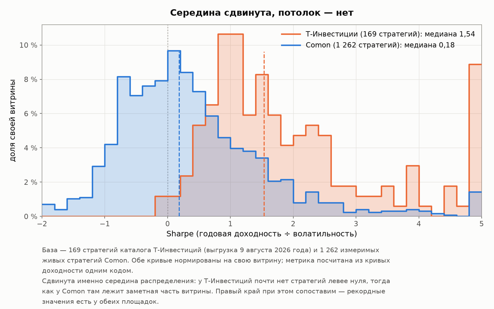
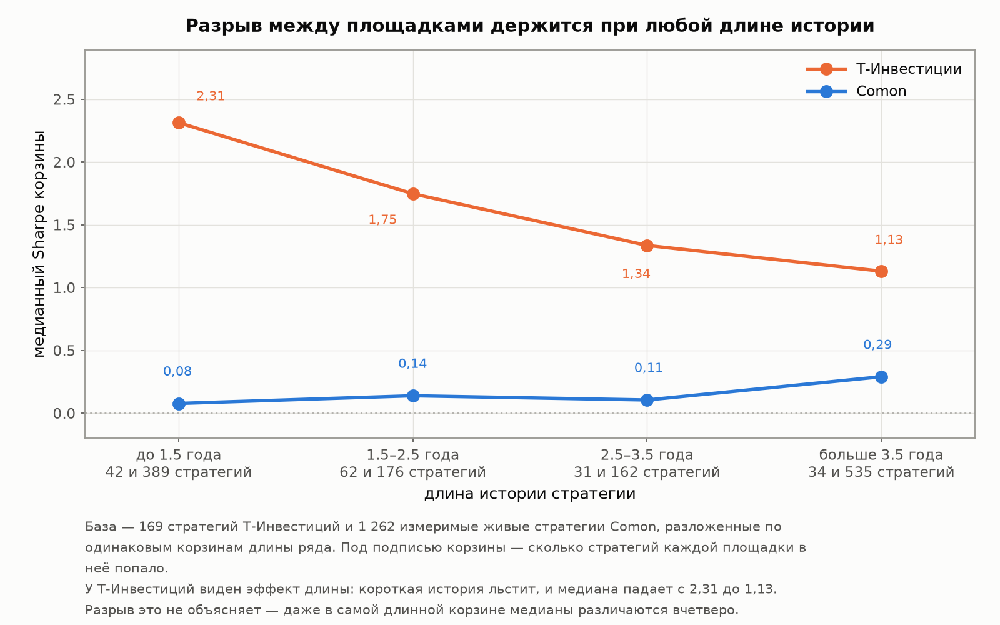

# Интерлюдия. Вторая площадка

[Лицензия](comon-story-license.md) · [Введение](comon-story-0-intro.md) · [1 — Площадка и витрина](comon-story-1-market.md) · [2 — Кладбище](comon-story-2-survival.md) · [3 — Из чего сделана доходность](comon-story-3-returns.md) · [4 — Продавцы](comon-story-4-authors.md) · **Интерлюдия** · [5 — Покупатели](comon-story-5-buyers.md) · [Заключение](comon-story-6-conclusion.md)

*Небольшая вставка между главами 4 и 5. Здесь впервые в серии появляются данные не с Comon: живые стратегии Т-Инвестиций, посчитанные тем же способом, что и всё остальное. В конце — короткий взгляд и на остальные сервисы рынка: что их витрины показывают человеку, который ещё не клиент.*

---

Четыре главы подряд мы смотрели на одну площадку. Отсюда законный вопрос читателя: всё описанное — это про автоследование или про Comon? Половина выводов серии сформулирована так, будто про рынок вообще, и во [введении](comon-story-0-intro.md) мы честно разделили, что переносится на рынок, а что задано регламентом конкретной площадки. Но разделили **рассуждением**. Проверить его можно только одним способом — взять вторую площадку и посчитать её тем же счётом.

Такая возможность есть. У Т-Инвестиций публичный интерфейс каталога отдаёт и карточку стратегии, и её кривую доходности. Значит, можно не сравнивать пересказы регламентов и не верить витринным полям, а построить по второй площадке **такую же панель**, как по Comon, и посмотреть на числа, посчитанные одинаково.

Т-Инвестиции — единственный сопоставимый сервис в стране. По [реестру НАУФОР](https://naufor.ru/tree.asp?n=16673) программ с функцией автоследования двенадцать, но открытых маркетплейсов, где автор приходит со стороны, ровно два — Comon и Т-Инвестиции. Остальные десять с улицы недоступны: пять — витрины стратегий самих брокеров, две принадлежат небольшим инвесткомпаниям, две лицензируются инвестиционным советникам, у одной правообладателя установить не удалось. Разница между ними в пороге входа: на Comon вход свободный, у Т автор подаёт заявку и проходит отбор. Это различие нам ещё понадобится.

## Чего это сравнение не может

Оговорки идут первыми, потому что от них зависит, как читать всё остальное.

**У Т-Инвестиций нет архива.** Закрытые стратегии просто исчезают с витрины — того, что составляет три четверти нашей работы, там не существует. Поэтому сравнивать можно только живых с живыми. Это уравнивает ошибку выжившего, но не устраняет её: мы не знаем, сколько стратегий Т умерло по дороге, и не можем повторить главу 2 на их данных. Всё, что ниже, — сравнение двух витрин, а не двух популяций.

**Каталог отдал меньше, чем заявлено.** На своей странице площадка говорит «более 400 стратегий»; публичный каталог 9 августа 2026 года отдал **169**. Мы проверили это девятью разными наборами параметров запроса — другие размеры страницы, сортировка по доходности и по числу подписчиков, фильтры по уровню риска — и каждый раз получали те же 169. Объяснения у нас нет, и придумывать его мы не будем. Важно другое: **направление возможной ошибки**. Если за пределами видимого каталога остались стратегии, закрытые для новых подписок или показываемые не всем, то это скорее не лучшие из них, — а значит, наши числа по Т-Инвестициям скорее завышены. Вывод интерлюдии от этого не переворачивается, но помнить об этом нужно.

**Кривые приходят прорежёнными.** Интерфейс отдаёт не больше трёхсот точек на любую длину истории, поэтому у 96 % стратегий шаг ряда больше суток (медиана 2.66 дня). Мы измерили, чего это стоит: взяли дневные ряды Comon, прорядили их так же и пересчитали метрики. Смещение — **меньше процента** по всем величинам (волатильность −0.4 %, Sharpe −1.0 %, просадка −1.0 % при шаге в пять дней). Просадка при этом занижается, потому что прореживание проскакивает внутренние минимумы, — то есть у Т-Инвестиций риск скорее недооценён, чем наоборот.

**Отбор авторов у Т — не помеха сравнению, а его предмет.** Может показаться, что сравнивать площадку с отбором и площадку без него нечестно. Но именно разница между ними и есть вопрос: что даёт подписчику наличие фильтра на входе.

## Две витрины

| Величина | Т-Инвестиции | Comon |
|---|---:|---:|
| Живых стратегий на витрине | 169 | **1 448** |
| — из них измеримых (≥ 100 торговых дней, активность ≥ 10 %) | — | 1 262 |
| Авторов | 84 | **873** |
| Максимум стратегий у одного автора (среди живых) | 9 | **37** |
| Медиана стратегий на автора | 2.0 | 1.0 |

*«Измеримых» — по [фильтру измеримости](comon-story-0-intro.md) серии; у Т-Инвестиций фильтр не применяется, потому что коротких и неактивных рядов там почти нет. Максимум 37 — среди живых стратегий; за всю историю Comon рекорд одного автора 167 (глава 4), но у Т мёртвых стратегий не видно, и сравнивать с ними нечего.*

Comon больше по всем измерениям: живых стратегий в **8.6 раза**, авторов в 10.4 раза. Витрина Финама — заметно более крупный магазин.

## Тот же счёт, приложенный к обеим

Все числа ниже посчитаны из кривых доходности одним и тем же кодом. Ни одно не взято с витрины: витринные поля у двух площадок означают разное, и складывать их нельзя.

| Величина | Т: медиана | Т: 10-й перц. | Т: 90-й перц. | Comon: медиана | C: 10-й | C: 90-й |
|---|---:|---:|---:|---:|---:|---:|
| CAGR (годовая доходность), % | **+20.5** | +11.0 | +44.7 | **+4.4** | −46.0 | +42.5 |
| Волатильность, % годовых | **14.5** | 5.1 | 31.1 | **29.4** | 12.5 | 80.3 |
| Sharpe (CAGR ÷ волатильность) | **1.54** | 0.60 | 4.50 | **0.18** | −0.81 | 1.78 |
| Сортино | 2.05 | 0.81 | 6.18 | 0.20 | −0.84 | 2.34 |
| Максимальная просадка, % | **−15.4** | −34.5 | −2.7 | **−41.4** | −91.7 | −12.4 |
| Длина истории, лет | 2.18 | 1.21 | 3.92 | 2.73 | 0.58 | 7.45 |

*База: 169 стратегий Т-Инвестиций и 1 262 измеримые живые стратегии Comon. Перцентиль показывает границу, ниже которой лежит соответствующая доля стратегий: 10-й — это уровень, хуже которого только каждая десятая.*

Разрыв не в оттенках. Медианная стратегия Т-Инвестиций даёт **почти впятеро большую доходность при вдвое меньшей тряске** и почти втрое меньшей просадке. По Sharpe — отношению одного к другому — разница восьмикратная.

**Про число 0.18 нужно объясниться сразу**, иначе оно выглядит противоречием: в главе 3 у живых стратегий Comon стоит медианный Sharpe 0.36. Обе цифры верны, и обе про одни и те же 1 262 стратегии. Разница в конвенции. Sharpe — это дробь «доходность на единицу риска», и числитель в ней можно брать двумя способами: как среднюю дневную доходность, приведённую к году (так считает глава 3), или как фактический годовой прирост капитала, CAGR (так считает эта интерлюдия). Второй способ строже — он учитывает, что убытки и прибыли перемножаются, а не складываются, и потому даёт меньшее число у волатильных стратегий. Здесь мы взяли строгий вариант, потому что он одинаково применим к обеим площадкам. **На вывод выбор не влияет:** в арифметической конвенции те же величины дают 1.44 у Т-Инвестиций против 0.36 у Comon — разрыв четырёхкратный вместо восьмикратного, но никуда не девается.

### Не короткая ли история всё объясняет

Первое подозрение очевидное: стратегии Т-Инвестиций моложе, а глава 3 показала, что **короткая история льстит** — на годовой дистанции встречаются Sharpe, которых на пятилетней не бывает. Проверяем прямо: сравниваем внутри одинаковых корзин по длине ряда.

| Длина истории | Т: стратегий | Т: медианный Sharpe | Comon: стратегий | C: медианный Sharpe |
|---|---:|---:|---:|---:|
| до 1.5 года | 42 | **2.31** | 389 | 0.08 |
| 1.5–2.5 года | 62 | **1.75** | 176 | 0.14 |
| 2.5–3.5 года | 31 | **1.34** | 162 | 0.11 |
| больше 3.5 года | 34 | **1.13** | 535 | 0.29 |

Эффект длины у Т-Инвестиций виден отчётливо и ведёт себя ровно так, как предсказывает глава 3: с 2.31 на коротких историях до 1.13 на длинных. Это лишний раз подтверждает, что закономерность рыночная, а не свойство одной площадки. **Но разрыв она не объясняет:** даже в самой длинной корзине, где обе площадки представлены сопоставимо (34 стратегии против 535), медианы различаются вчетверо.

Что именно создаёт разрыв — отбор авторов на входе, отсутствие архива, из-за которого мы не видим неудачных, или и то и другое, — по этим данным разделить нельзя. Скажем прямо: **мы знаем, что витрина Т-Инвестиций выглядит существенно лучше, и не знаем, какая часть этого — качество, а какая — невидимость неудачных.** Один намёк всё же есть: у Comon мы цену невидимости измерили — ошибка выжившего стоит 0.2–0.3 пункта Sharpe (глава 3). Разрыв между площадками больше пункта.

## Спрос: где на самом деле подписчики

| Величина | Т-Инвестиции | Comon |
|---|---:|---:|
| Подписок всего | **377 877** | 13 430 |
| Медиана подписчиков на стратегию | **330** | **0** |
| Стратегий без единого подписчика | **0 (0 %)** | **957 (66.1 %)** |

*База: те же 169 и 1 448 живых стратегий (доля нулевых — от всех живых Comon, а не только измеримых).*

Строка «ноль подписчиков» — самая содержательная в интерлюдии. На Comon **две трети живых стратегий не выбрал никто**; на Т-Инвестициях таких нет вообще ни одной. Медианная стратегия Финама не имеет подписчиков, медианная стратегия конкурента имеет 330.

Подписок у Т-Инвестиций больше в **28.1 раза** — при витрине в 8.6 раза меньшей. Первое объяснение, которое приходит в голову: у Т-Банка просто несопоставимо больше клиентов. Проверим, сколько разрыва этим закрывается.

| | Т-Инвестиции | Финам |
|---|---:|---:|
| Клиентов брокера | **9.7 млн** | **~621 тыс.** |
| Подписок на автоследование | 377 877 | 13 430 |
| Доля клиентов с подпиской | **3.90 %** | **2.16 %** |

*Клиенты Т-Инвестиций — из отчётности Т-Технологий за IV квартал 2025 года (9.7 млн клиентов сервиса Т-Инвестиции из 54.1 млн клиентов Группы). Клиенты Финама — «более 540 000» по годовому отчёту за 2024 год плюс заявленный рост базы на 15 % за 2025-й, то есть около 621 тыс.; если брать базу без роста, доля составит 2.49 %. Мосбиржа не публикует клиентскую статистику в разрезе брокеров с января 2022 года, других источников нет.*

Итог разложения: размером клиентской базы объясняется **разрыв в 15.6–18.0 раза**, остаётся необъяснённым **множитель 1.6–1.8**. То есть две трети разрыва — просто размер брокера, и это честно нужно сказать. Но **проникновение сервиса у Т-Инвестиций всё равно вдвое глубже**: из ста клиентов подписку оформляют почти четверо против двоих.

Сложим с предыдущим разделом. Comon предлагает клиенту в 8.6 раза больше живых стратегий — и получает вдвое меньшую долю подписавшихся, при том что две трети его ассортимента не выбрал никто. **Больше выбора не превратилось в больше спроса.**

### Выбирает ли толпа качество

Раз уж речь зашла о выборе, посмотрим, с чем связано число подписчиков на каждой площадке. Корреляция ранговая — распределение подписок крайне неравномерное, и обычная линейная связь на нём врёт.

| Число подписчиков связано с… | Т-Инвестиции | Comon |
|---|---:|---:|
| Sharpe | **+0.074** | **+0.398** |
| доходностью (CAGR) | +0.327 | +0.431 |
| просадкой | −0.133 | +0.117 |
| возрастом стратегии | +0.288 | +0.248 |

*Ранговая корреляция Спирмена; база — 169 и 1 262 стратегии. Значение около нуля означает отсутствие связи, +1 — полное совпадение порядка.*

Результат неожиданный, и мы приводим его как есть. **На Comon связь подписок с качеством выше, чем у конкурента** — 0.398 против 0.074. Но читать это надо с оговоркой: две трети живых стратегий Comon имеют ноль подписчиков, поэтому нижняя половина рангов там вырождена, и корреляция во многом держится на различии «есть подписчики — нет подписчиков», а не на тонком упорядочивании хороших против отличных.

Содержательное же различие в другом. У Т-Инвестиций подписки связаны с **доходностью** (+0.327) и почти не связаны с Sharpe (+0.074) — то есть подписки собраны там, где выше прибыль, а не там, где она получена с меньшим риском. Связь с просадкой отрицательная (−0.133): чем глубже была яма, тем меньше подписчиков, — слабая, но в разумную сторону. На обеих площадках заметно работает возраст (+0.288 и +0.248): подписки скапливаются на том, что дольше существует.

## Тариф: сколько остаётся подписчику

До сих пор все числа были **до платы за следование**. Теперь вычтем её — и здесь площадки устроены принципиально по-разному.

На Comon 94 % стратегий назначен тариф **6 % от активов в год**, платы от результата почти ни у кого нет (глава 1). У Т-Инвестиций схема комбинированная: до **2 % от активов плюс 20 % от результата**, причём плата от результата берётся с превышения над предыдущим максимумом счёта — то, что называется high-water mark: если стратегия ушла в минус и вернулась, за возврат к прежнему уровню платить не нужно. По нашим данным, плату от результата берут 139 стратегий Т-Инвестиций из 169.

| Площадка и её тариф | Валовая доходность, % | Чистая доходность, % | Съедено, п. п. |
|---|---:|---:|---:|
| Т-Инвестиции (до 2 % от активов + 20 % от результата) | +20.5 | **+17.2** | 3.3 |
| Comon (6 % от активов) | +4.4 | **−1.6** | 6.0 |

*Медианы. Плата Т-Инвестиций берётся построчно из карточек каждой стратегии; high-water mark мы не моделировали (в карточках этого поля нет) и потому считали плату от годовой прибыли целиком — то есть **завысили** плату Т-Инвестиций. Вывод от этого только консервативнее.*

Медианная стратегия Comon **не окупает собственную подписку**: заработав 4.4 % годовых, она отдаёт 6 % за следование и оставляет подписчику минус. Доля стратегий, оставляющих подписчику хоть что-то положительное, падает с 58.9 % до 46.5 % — фиксированная плата переводит в убыток каждую восьмую из зарабатывавших. У Т-Инвестиций эта доля не меняется вовсе (98.8 % до и после): **плата от результата по определению не может увести в минус того, кто был в плюсе.**

Дальше — самая наглядная проверка. Схемы «6 % от активов» и «2 % + 20 %» стоят одинаково при валовой доходности **22 % годовых**: выше этого уровня дешевле фиксированный процент, ниже — процент от прибыли. Ниже точки безразличия лежат **78 % стратегий Comon**. То есть на трёх четвертях собственной витрины тариф Финама дороже конкурентского.

И перекрёстный счёт, который ставит точку: **если бы к стратегиям Comon применить тариф Т-Инвестиций, медианная чистая доходность была бы +2.0 % вместо −1.6 %.** Ни одна сделка при этом не меняется — меняется только способ брать плату. Обратный перенос: стратегии Т-Инвестиций на тарифе Comon дали бы +14.5 % вместо +17.2 %.

Здесь важно не перепутать причину со следствием. Мы не утверждаем, что подписчики Comon отказываются подписываться из-за тарифа, — мотивов мы не знаем и в данных их нет. Мы утверждаем ровно то, что посчитано: **тариф Comon дороже конкурентского на трёх четвертях его собственных стратегий и уводит медианную стратегию в убыток.** К этому стоит добавить одно наблюдение из главы 1: у 8.6 % живых стратегий Comon вариант с платой от результата всё-таки предлагается, и на эти 8.6 % приходится **48.6 % всех подписок площадки**.

## Что видно на витрине

Раз уж мы сравниваем площадки, стоит сказать и о том, что каждая показывает покупателю. Здесь счёт не в одни ворота.

**У Т-Инвестиций на карточке есть то, чего у Comon нет:** комиссии по каждой стратегии отдельно, точность следования (насколько сделки подписчика совпали со сделками автора — медиана 99.96 %, поле заполнено у всех 169), ёмкость стратегии и её лимит, просадка счёта автора, число сигналов и частота торговли, возраст, идентификатор автора. Частота торговли у них распределена ровно: 63 стратегии торгуют ежемесячно, 58 ежедневно, 48 еженедельно.

**У Comon есть то, чего нет у Т-Инвестиций, и это важнее всего перечисленного:** архив закрытых стратегий с сохранёнными кривыми. Именно он сделал возможными главы 2 и 3 — и именно поэтому исследование написано на данных Comon, а не конкурента. Площадка, которая не прячет своих мертвецов, даёт покупателю то, чего не даст никакая карточка: возможность увидеть, чем всё это обычно заканчивается.

Обе витрины при этом не показывают главного — того же самого. Ни одна не публикует волатильность, Sharpe, время под водой, доходность после комиссий, бету к индексу. Всё это вычислимо из кривой, которую обе площадки и так отдают. Поле за полем эти две витрины разобраны в [заключении](comon-story-6-conclusion.md#2-честность-витрин): что показано, что оно означает на самом деле и что из недостающего площадка **могла бы** показать.

### А что показывают витрины брокеров

Двумя маркетплейсами рынок не исчерпывается: по реестру НАУФОР остальные десять программ автоследования устроены иначе, и пять из них — витрины самих брокеров, где стратегии ведут штатные управляющие или отобранные аналитики. Популяции авторов там нет, архива тоже, и всё, что серия говорит о продавцах, к ним неприменимо. Но один вопрос задать можно, и он ровно из этого раздела: **что видно постороннему до подключения?** Мы посмотрели 13 августа 2026 года четыре брокерские витрины из пяти — пятую, «Интеллект» ВТБ, не смотрели:

| Сервис | Что доступно в открытом вебе |
|---|---|
| [Fintarget (БКС)](https://fintarget.ru/strategies) | Каталог из 49 стратегий. В карточке — доходность за периоды и помесячная таблица, минимальная сумма, комиссии, ёмкость стратегии, точность следования, риск-профиль, инструменты |
| [Альфа-Инвестиции](https://alfabank.ru/make-money/investments/strategii/) | Подборки стратегий: ярлык риска, режим (автоследование или ручной), имя автора, минимальная сумма — и **«прогноз доходности» вместо результата**: 16 %, 19 %, 20 %, 33 % |
| [pro.invest (АЛОР)](https://www.alorbroker.ru/investment/pro-invest) | Витрины на сайте нет: описание сервиса и предложение скачать приложение |
| Риком-Траст | Страницы сервиса, которые до сих пор отдаёт поиск, отвечают 404; на главной сервис не упомянут |

🔴 **Из таблицы не следует, что сервисы плохи или что их нет.** Мы уже ошибались ровно так: у АЛОРа домены старого сервиса не открывались, и по ним легко было заключить, что автоследование закрылось, — а оно работало под другим именем. Состав рынка читается по реестру, а не по сайтам. Речь о другом — о том, что доступно человеку, который ещё не клиент.

И здесь разница с маркетплейсами оказывается качественной. Лучшая из брокерских витрин — Fintarget — не показывает **ни одной метрики риска**: ни просадки, ни волатильности, ни Sharpe. Есть доходность, есть цена, риск обозначен ярлыком. А в карточке стратегии, которую мы открыли, стоит оговорка, меняющая смысл кривой: **графики до 19 января 2024 года построены по подтверждённым сделкам автора**, и лишь с этой даты показывают результат самой стратегии. Часть истории — не история сервиса.

У Альфа-Инвестиций ещё интереснее. Витрина есть, но крупное число на карточке — **не результат, а прогноз**. Прошлой доходности нет вовсе; слова «просадка», «волатильность» и «Шарп» на странице не встречаются ни разу. Это та же подмена, что и «Прогноз N % в год» у Т-Инвестиций, доведённая до конца: там прогноз стоит рядом с фактической кривой, здесь фактической кривой нет.

**Отсюда ответ на вопрос, который читатель вправе задать: можно ли выбрать стратегию у брокера, глядя на его витрину? По витрине — нельзя.** Не потому, что там обман, а потому, что сравнивать нечего: у двух сервисов из четырёх до подключения не видно ничего, у третьего вместо результата стоит прогноз, а у четвёртого — единственного с настоящей кривой — нет ни одной величины риска. Единственное, что доступно постороннему повсюду, — доходность и цена; и как выяснится в [главе 5](comon-story-5-buyers.md), именно по этим двум признакам публика и выбирает, а качества они не предсказывают. Витрина маркетплейса при всех её ярлыках даёт хотя бы проверяемую кривую; здесь нет и этого.

---

## Выводы интерлюдии

1. **Витрина Т-Инвестиций существенно лучше витрины Comon по всем метрикам.** Медианный Sharpe 1.54 против 0.18, доходность +20.5 % против +4.4 %, просадка −15.4 % против −41.4 %. Разрыв не объясняется молодостью стратегий: внутри самой длинной корзины по возрасту он остаётся четырёхкратным.

2. **Насколько это качество, а насколько невидимость неудачных — по этим данным разделить нельзя.** У Т-Инвестиций нет архива, и сколько стратегий там умерло, мы не знаем. Единственный ориентир — измеренная на Comon цена ошибки выжившего, 0.2–0.3 пункта Sharpe; разрыв между площадками больше пункта.

3. **Две трети живых стратегий Comon не выбрал никто.** На Т-Инвестициях стратегий без единого подписчика нет вообще. Медиана подписчиков — 0 против 330.

4. **Больше выбора не значит больше спроса.** Comon предлагает в 8.6 раза больше живых стратегий, а доля подписавшихся клиентов у него вдвое ниже — 2.16 % против 3.90 %.

5. **Разрыв в подписках объясняется размером брокера примерно на две трети.** Из множителя 28.1 на клиентскую базу приходится 15.6–18.0, необъяснённым остаётся 1.6–1.8.

6. **Медианная стратегия Comon не окупает собственную подписку:** +4.4 % валовых против 6 % платы. Фиксированный тариф переводит в убыток каждую восьмую стратегию из зарабатывавших; у комбинированного тарифа с платой от результата этот эффект отсутствует по построению.

7. **Тариф Comon дороже конкурентского на 78 % его собственных стратегий.** Точка безразличия схем — валовая доходность 22 % годовых. Перенос стратегий Comon на тариф Т-Инвестиций даёт медианную чистую +2.0 % вместо −1.6 % без единого изменения в сделках.

8. **У Т-Инвестиций подписки идут за доходностью, а не за качеством:** связь подписок с доходностью +0.327, с Sharpe +0.074. На Comon связь с Sharpe выше (+0.398), но во многом держится на массе стратегий с нулём подписчиков.

9. **Закономерности, найденные в главах 2–4, воспроизводятся на второй площадке.** Короткая история льстит; подписки связаны с возрастом стратегии сильнее, чем с её качеством; витрина не показывает риска. Это и есть ответ на вопрос, с которого интерлюдия начиналась: рыночные механизмы переносятся, а уровни — нет.

10. **У витрин брокеров вопрос стоит грубее: показано ли хоть что-нибудь.** Из четырёх осмотренных сервисов у двух до подключения не видно ничего, у Альфа-Инвестиций вместо результата стоит прогноз доходности, а у Fintarget — единственного с настоящей кривой — нет ни просадки, ни волатильности, ни Sharpe. Выбрать стратегию у брокера по его витрине нельзя: сравнивать нечего.

---

# Приложение: полная статистика

## И1. Ограничения интерлюдии

- **Сравниваются витрины, а не популяции.** У Т-Инвестиций закрытые стратегии не публикуются, поэтому сопоставление идёт живых с живыми. Ошибка выжившего этим уравнивается, но не устраняется, и её величину у Т-Инвестиций мы не знаем.
- **Каталог, возможно, неполон.** Площадка заявляет «более 400» стратегий, публичный каталог отдал 169; девять разных наборов параметров запроса дали то же число. Если невидимая часть систематически хуже видимой, числа по Т-Инвестициям завышены.
- **Ряды прорежены.** Максимум 300 точек на историю, медианный шаг 2.66 дня, прорежены 96 % рядов. Смещение измерено на рядах Comon: меньше 1 % по всем метрикам, просадка занижается сильнее прочего.
- **Малая выборка.** 169 стратегий — это мало для тонких утверждений, и стратегии внутри площадки скоррелированы (общий рынок). Поэтому интерлюдия сравнивает только распределения целиком и не сравнивает лучших с лучшими.
- **High-water mark у Т-Инвестиций не смоделирован** — плата от результата считалась с годовой прибыли целиком. Это завышает плату Т-Инвестиций, то есть тарифный вывод консервативен.
- **Клиентские базы взяты из отчётности компаний**, а не из независимого источника: Мосбиржа не публикует статистику по брокерам с января 2022 года. Единицы счёта у двух компаний могут различаться (клиенты брокера против клиентов инвестсервиса).
- **Причинности здесь нет.** Мы измеряем, с чем связаны подписки и во что обходится тариф; почему подписчик поступает так, а не иначе, в данных не написано.

## И2. Данные и метод

Выгрузка каталога Т-Инвестиций — 9 августа 2026 года: 169 стратегий, по каждой карточка и кривая доходности. Данные Comon — тот же срез, что во всей серии (05.08.2026).

Метрики обеих площадок считаются одним кодом из кривых доходности. Аннуализация по календарю: частота наблюдений определяется как число точек, делённое на длину истории в годах, — это позволяет одинаково обращаться с дневными рядами Comon и прорежёнными рядами Т-Инвестиций. Sharpe в интерлюдии — CAGR, делённый на волатильность (в главах серии — арифметическая конвенция; расхождение объяснено в основном тексте). Безрисковая ставка не вычитается ни у одной площадки.

Выборка Comon для сравнения метрик — 1 262 живые стратегии, прошедшие [фильтр измеримости](comon-story-0-intro.md) (не меньше 100 торговых дней и активность не ниже 10 %); для подписок и долей — все 1 448 живых. У Т-Инвестиций фильтр не применялся: коротких и малоактивных рядов там практически нет.

## И3. Распределения метрик целиком

| Величина | Т: p10 | Т: медиана | Т: p90 | C: p10 | C: медиана | C: p90 |
|---|---:|---:|---:|---:|---:|---:|
| CAGR, % годовых | +11.0 | +20.5 | +44.7 | −46.0 | +4.4 | +42.5 |
| Волатильность, % годовых | 5.1 | 14.5 | 31.1 | 12.5 | 29.4 | 80.3 |
| Sharpe (CAGR ÷ вола) | 0.60 | 1.54 | 4.50 | −0.81 | 0.18 | 1.78 |
| Сортино | 0.81 | 2.05 | 6.18 | −0.84 | 0.20 | 2.34 |
| Максимальная просадка, % | −34.5 | −15.4 | −2.7 | −91.7 | −41.4 | −12.4 |
| Длина истории, лет | 1.21 | 2.18 | 3.92 | 0.58 | 2.73 | 7.45 |

Контроль конвенции: медианный арифметический Sharpe — 1.44 у Т-Инвестиций против 0.36 у Comon. Значение 0.36 совпадает со строкой «Живые» в приложении [главы 3](comon-story-3-returns.md), то есть обе конвенции посчитаны на одном и том же наборе стратегий.

## И4. Sharpe по корзинам длины истории

| Длина истории | Т: n | Т: медиана | Comon: n | C: медиана |
|---|---:|---:|---:|---:|
| до 1.5 года | 42 | 2.31 | 389 | 0.08 |
| 1.5–2.5 года | 62 | 1.75 | 176 | 0.14 |
| 2.5–3.5 года | 31 | 1.34 | 162 | 0.11 |
| больше 3.5 года | 34 | 1.13 | 535 | 0.29 |

## И5. Спрос и клиентские базы

| Величина | Т-Инвестиции | Comon |
|---|---:|---:|
| Подписок всего | 377 877 | 13 430 |
| Медиана подписчиков на стратегию | 330 | 0 |
| Стратегий без подписчиков | 0 (0 %) | 957 (66.1 %) |
| Клиентов брокера | 9.7 млн | 540 тыс. (2024) → ~621 тыс. (2025) |
| Доля клиентов с подпиской | 3.90 % | 2.16 % (при базе 621 тыс.) / 2.49 % (при базе 540 тыс.) |

Разложение разрыва подписок: 28.1 = 15.6–18.0 (размер базы) × 1.6–1.8 (глубина проникновения).

Связь подписок с характеристиками стратегии (ранговая корреляция Спирмена):

| Против чего | Т-Инвестиции | Comon |
|---|---:|---:|
| Sharpe | +0.074 | +0.398 |
| CAGR | +0.327 | +0.431 |
| Максимальная просадка | −0.133 | +0.117 |
| Длина истории | +0.288 | +0.248 |

## И6. Тарифы

| Площадка | Плата от активов | Плата от результата | Стратегий с платой от результата |
|---|---|---|---:|
| Т-Инвестиции | до 2 % в год (медиана 2.00) | до 20 %, с high-water mark | 139 из 169 (82 %) |
| Comon | 6 % в год у 94 % стратегий | почти отсутствует | 125 живых из 1 448 (8.6 %) |

| Расчёт | Т-Инвестиции | Comon |
|---|---:|---:|
| Валовая доходность (медиана), % | +20.5 | +4.4 |
| Чистая по своему тарифу, % | +17.2 | −1.6 |
| Съедено, п. п. | 3.3 | 6.0 |
| Чистая по тарифу соседа, % | +14.5 | +2.0 |
| Доля стратегий в плюсе до платы | 98.8 % | 58.9 % |
| Доля стратегий в плюсе после платы | 98.8 % | 46.5 % |

Точка безразличия схем «2 % + 20 %» и «6 % от активов» — валовая доходность 22 % годовых. Ниже неё лежат 78 % стратегий Comon и 54 % стратегий Т-Инвестиций.

## И7. Что показывает каждая витрина

| Поле | Comon | Т-Инвестиции |
|---|---|---|
| Кривая доходности | есть | есть |
| Комиссии конкретной стратегии | тариф из общей сетки | есть построчно |
| Точность следования | нет | есть (медиана 99.96 %) |
| Ёмкость стратегии и лимит | нет | есть |
| Просадка счёта автора | «прогнозируемая просадка» (не просадка — глава 1) | есть |
| Частота торговли | нет | есть (63 / 58 / 48 — месяц / день / неделя) |
| Архив закрытых стратегий | **есть** | нет |
| Волатильность, Sharpe, время под водой, доходность после комиссий, бета | нет | нет |

---

# Источники

**Первичные данные**

- Каталог и дневные ряды доходности стратегий Comon (Финам), выгрузка 2026-08-05. Состав и метод — во [введении](comon-story-0-intro.md).
- [Каталог стратегий автоследования Т-Инвестиций](https://www.tbank.ru/invest/strategies/), выгрузка публичного интерфейса 2026-08-09: 169 стратегий, карточки и кривые доходности.

**Правила площадок**

- [Автоследование в Т-Инвестициях: условия сервиса](https://www.tbank.ru/invest/help/brokerage/account/strategy/) — справка площадки, откуда ведут ссылки на тарифы.
- [Комиссии и налоги при автоследовании](https://www.tbank.ru/invest/help/brokerage/account/strategy/commissions/) — плата за следование и плата от результата, правило high-water mark: при снижении счёта плата не берётся, пока не превышен прежний максимум. Величина платы по каждой конкретной стратегии в расчётах бралась не отсюда, а из её карточки.
- [Ограничения и требования к стратегиям](https://docs.comon.ru/trader-information/restrictions-and-requirements/) — регламент Comon.
- [Реестр аккредитованных программ НАУФОР](https://naufor.ru/tree.asp?n=16673) — перечень сервисов автоследования, версия 10.07.2026.

**Витрины брокеров** (осмотр 13.08.2026; описано только то, что доступно постороннему без подключения)

- [Каталог стратегий Fintarget (БКС)](https://fintarget.ru/strategies) — 49 стратегий; состав полей карточки и оговорка о происхождении графиков взяты со страницы отдельной стратегии того же каталога.
- [Стратегии Альфа-Инвестиций](https://alfabank.ru/make-money/investments/strategii/) — подборки с ярлыком риска и прогнозом доходности.
- [pro.invest (АЛОР Брокер)](https://www.alorbroker.ru/investment/pro-invest) — описание сервиса; витрина доступна в мобильном приложении.

**Внешние данные**

- [Финансовые результаты Т-Технологий за IV квартал 2025 года](https://www.tbank.ru/about/news/19032026-t-technologies-announces-ifrs-financial-results-for-4q-2025/) — 9.7 млн клиентов сервиса Т-Инвестиции.
- [Годовой отчёт «Финама» за 2024 год](https://www.finam.ru/landing/annual-report-2024/) — более 540 000 клиентов.
- [Годовой отчёт «Финама» за 2025 год](https://www.finam.ru/landing/annual-report-2025/) — рост клиентской базы на 15 %.

---

**Дальше:** [глава 5 — Покупатели: кто и как выбирает](comon-story-5-buyers.md)

---

*Условия использования: текст и графики — CC BY-NC-SA 4.0, код расчётов — BSD 3-Clause; [подробнее](comon-story-license.md).*
