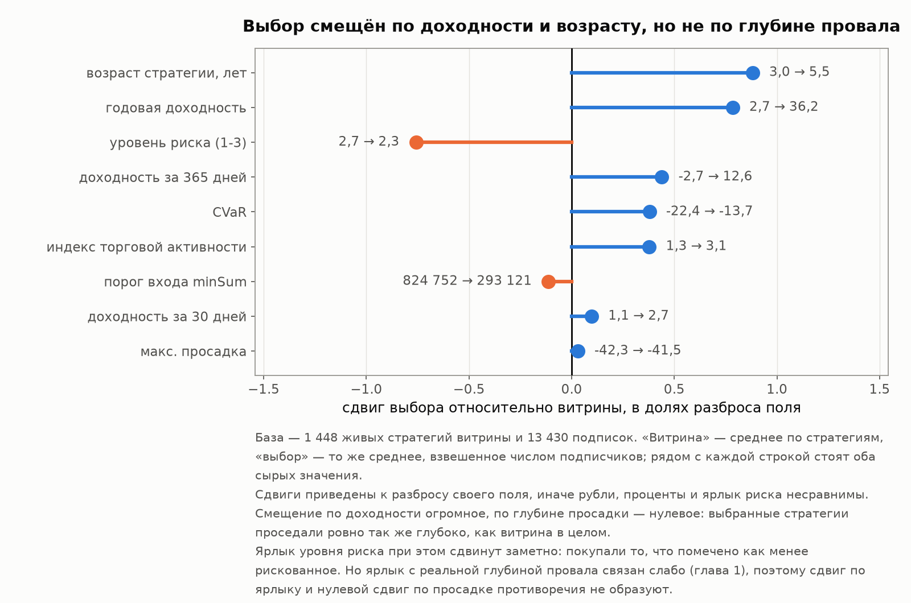
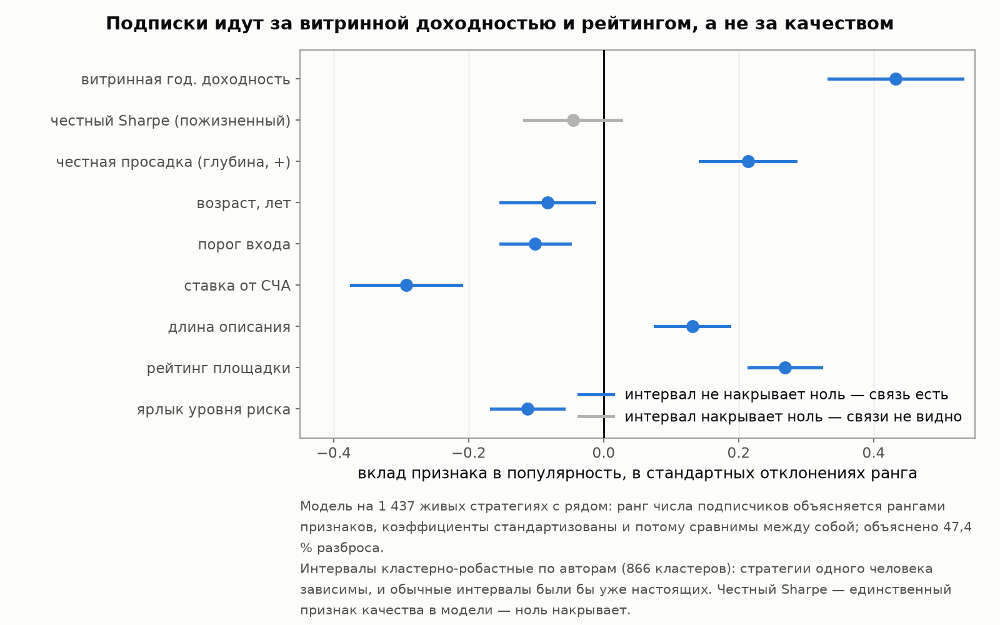
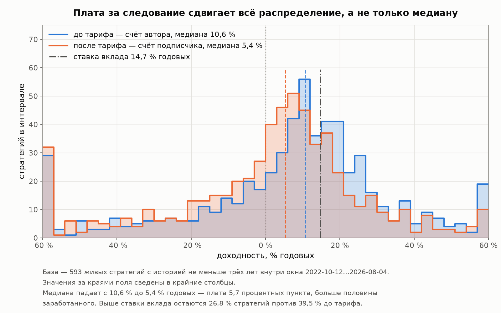
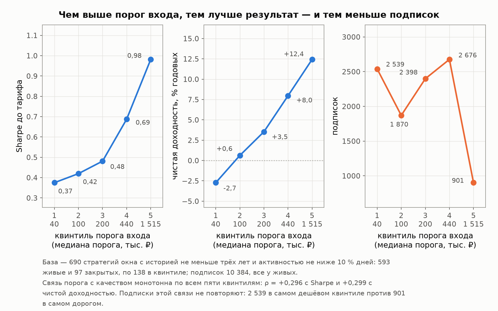

# Глава 5. Покупатели: кто и как выбирает

[Лицензия](comon-story-license.md) · [Введение](comon-story-0-intro.md) · [1 — Площадка и витрина](comon-story-1-market.md) · [2 — Кладбище](comon-story-2-survival.md) · [3 — Из чего сделана доходность](comon-story-3-returns.md) · [4 — Продавцы](comon-story-4-authors.md) · [Интерлюдия — вторая площадка](comon-story-4b-interlude.md) · **Глава 5 из 5** · [Заключение](comon-story-6-conclusion.md)

*Данные, методы и словарь терминов — во [введении](comon-story-0-intro.md). Все метрики пересчитаны из дневных рядов 19 978 стратегий Comon, включая 18 529 закрытых.*

---

Четыре главы описывали сторону предложения: что продаётся, сколько живёт, из чего сделана доходность, кто всё это пишет. Осталась вторая сторона прилавка. На живых стратегиях Comon висит **13 430 подписок** — состоявшихся решений, за которыми стоят реальные деньги.

Глава отвечает на два вопроса. Первый: **по каким признакам выбирают**. Второй: **что остаётся выбравшему после тарифа**. Между ними обнаруживается разрыв, ради которого главу и стоит читать: признаки, по которым выбирают, и признаки, которые предсказывают качество, — почти не пересекаются.

**Сразу о единице счёта, иначе вся глава будет прочитана неверно.** 13 430 — это **подписки, а не люди**. Один человек может держать несколько подписок, и численность аудитории неизвестна в принципе: площадка отдаёт одно целое число на стратегию, индивидуальных записей нет ни одной. Поэтому всё ниже — структура **спроса**, а не портрет публики. Фраза «толпа выбирает X» везде означает ровно одно: *у стратегий с бо́льшим X сейчас больше подписчиков*. Не «подписчик посмотрел на X и решил» — истории подписок в данных нет, только текущий срез, и причинность из него не следует.

**И о слове «деньги», которое дальше встретится часто.** Настоящих сумм на счетах подписчиков мы не знаем: площадка отдаёт только счётчик подписок. Поэтому везде ниже «деньги», «где лежат деньги», «доля денег» означают **подписки, взвешенные этим счётчиком**, а не рубли. Единственная денежная оценка во всей главе — нижняя граница активов в 3.94 млрд ₽, и она получена умножением подписок на минимальный порог входа, то есть заведомо занижена.

**И об ошибке выжившего, которая здесь неустранима.** У закрытых стратегий счётчик подписчиков обнулён площадкой ([глава 1](comon-story-1-market.md), раздел 1.4). Значит подписки видны только у живых, а те, кто подписался на стратегию, которая потом умерла, в данных не существуют. Всякий раз, когда ниже написано «подписчики в среднем получают столько-то», читать надо «подписчики **выживших** стратегий», и смещение вверх огромное.

---

## 5.1 Сколько их и что о них вообще известно

Первое, что видно в данных о спросе, — он собран в кучу.

| Величина | Значение |
|---|---:|
| Живых стратегий | 1 448 |
| Подписок на них | 13 430 |
| **Стратегий без единого подписчика** | **957 (66.1 %)** |
| Стратегий, у которых подписчик есть | 491 |
| Медиана подписчиков на стратегию | **0** |
| 90-й перцентиль | 13 |
| Максимум у одной стратегии | 945 |
| Доля подписок у десяти самых популярных стратегий | 31.5 % |
| Доля подписок у ста самых популярных | 85.0 % |
| Коэффициент Джини по стратегиям | 0.931 |
| Коэффициент Джини **по авторам** | **0.962** |

Две трети живых стратегий не выбрал никто. Восемьдесят пять процентов всех подписок собрали сто стратегий из полутора тысяч. По авторам концентрация ещё выше, чем по стратегиям: пятеро держат **половину всех подписок**, а из 866 авторов живых стратегий **615 (71.0 %) не имеют ни одного подписчика**. Витрина, на которой полторы тысячи товаров, работает как прилавок с десятком.

**Сколько это денег.** Точной суммы под управлением площадка не публикует, но нижнюю границу дают сами данные: подписки, умноженные на минимальный порог входа своей стратегии, — **3.94 млрд ₽**, то есть не меньше **293 тыс. ₽** на подписку. Именно нижнюю, и по устройству расчёта: сумма на счёте подписчика не может быть меньше порога, а насколько она его превышает — в данных не видно. Разумно предположить, что у части подписчиков счёт заметно больше порога, но проверить это нечем: индивидуальных записей площадка не отдаёт.

**Единственное, что известно о самом покупателе.** Порог входа характеризует не стратегию, а человека: подписавшийся на стратегию с порогом в миллион этот миллион имеет. Это жёсткий пол капитала — и единственное свойство подписчика, просачивающееся через агрегат. Взвешенные по подпискам квантили порога: p10 — 35 тыс. ₽, медиана — **180 тыс. ₽**, p90 — 550 тыс. ₽.

| Сегмент по порогу входа | Стратегий | Доля стратегий | Подписок | Доля подписок |
|---|---:|---:|---:|---:|
| менее 50 тыс. ₽ | 98 | 20.0 % | 3 149 | 23.4 % |
| 50–150 тыс. | 124 | 25.3 % | 3 174 | 23.6 % |
| 150–400 тыс. | 146 | 29.7 % | 3 840 | 28.6 % |
| 400 тыс. — 1 млн | 83 | 16.9 % | 2 902 | 21.6 % |
| **1 млн и выше** | 40 | 8.1 % | 365 | **2.7 %** |

*База — 491 живая стратегия, у которой есть хотя бы один подписчик.*

По капиталу аудитория разложена на удивление ровно: четыре нижних сегмента держат по 21–29 % подписок каждый. Обрыв один, и он резкий: **выше миллиона рынка практически нет** — 2.7 % подписок при 8.1 % таких стратегий.

🔴 **Чего с этой таблицей делать нельзя — сравнивать сегменты между собой.** Соблазн велик: посчитать, что выбирает мелкий капитал, а что крупный. Мы посчитали — и рядом посчитали, на скольких стратегиях эта медиана держится. Половину подписок любого сегмента набирают **пять–семь стратегий**, а в сегменте 150–400 тыс. четверть подписок — это одна стратегия. Эффективное число независимых наблюдений всей выборки — **57.9** при 491 стратегии с подписчиками: концентрация съедает выборку на порядок. Различия между строками были бы различиями между конкретными популярными стратегиями, случайно попавшими в тот или иной диапазон порогов, а не между группами людей. Подробности — в приложении [Д4](#д4-капитальные-сегменты-и-почему-их-нельзя-сравнивать).

### Есть ли качество среди тех, кого не выбрал никто

Две трети витрины пустуют. Естественный вопрос: это отсев или недосмотр? Может быть, там лежат прекрасные стратегии, которых просто не заметили?

Сначала общая картина — она не в пользу версии о недосмотре.

| Группа по числу подписчиков | Стратегий | Подписок | Sharpe | CAGR, % год. | Волатильность, % | Просадка, % | Лет истории | Порог, тыс. ₽ |
|---|---:|---:|---:|---:|---:|---:|---:|---:|
| **0** | 793 | 0 | **−0.08** | −2.7 | 31.2 | −46.1 | 2.49 | 135 |
| 1–5 | 249 | 525 | 0.41 | 11.0 | 28.6 | −37.6 | 2.58 | 160 |
| 6–20 | 111 | 1 170 | 0.82 | 19.8 | 25.1 | −32.9 | 4.13 | 220 |
| 21–100 | 75 | 3 141 | 0.87 | 20.2 | 27.4 | −37.9 | 5.05 | 280 |
| **101+** | 34 | 8 445 | 0.88 | 23.8 | 29.3 | **−51.7** | 6.14 | 105 |

*Медианы. База — 1 262 живые стратегии, прошедшие фильтр измеримости (не меньше 100 торговых дней и активность не ниже 10 %), из них 793 без единого подписчика. Sharpe геометрический: годовая доходность ÷ волатильность.*

Типичная невыбранная стратегия убыточна и Sharpe имеет отрицательный. Массового сокровища в пустой части витрины нет.

**Но хвост есть.** Возьмём за планку медианы самой популярной группы — Sharpe 0.88, доходность 23.8 %, просадка −51.7 % — и посчитаем, сколько невыбранных стратегий эту планку держат.

| Критерий | Без подписчиков | Доля от 793 | С подписчиками | Доля от 469 |
|---|---:|---:|---:|---:|
| Sharpe не ниже планки | 137 | 17.3 % | 187 | 39.9 % |
| Доходность не ниже планки | 88 | 11.1 % | 164 | 35.0 % |
| Просадка не глубже планки | 448 | 56.5 % | 324 | 69.1 % |
| **Все три условия сразу** | **63** | **7.9 %** | 128 | 27.3 % |
| Строгий критерий достоверности | **24** | **3.0 %** | 70 | 14.9 % |

*Строгий критерий — тот же, что в [главе 4](comon-story-4-authors.md): результат отличим от случайности (t ≥ 2), уровень не ниже Sharpe 1, история не короче трёх лет.*

Итак, прямой ответ: **да, есть.** Шестьдесят три стратегии не хуже топовых сразу по трём метрикам, из них двадцать четыре держат уровень достоверно и на длинной истории. Ни у одной из них нет ни одного подписчика.

**И сразу — почему это не значит «толпа проглядела сокровища».** Среди 793 попыток хорошие результаты появятся и случайно; вопрос в том, насколько наблюдаемое превышает случайное. Невыбранные стратегии моложе (медиана 2.49 года против 6.14 у популярных), а достоверность растёт с длиной ряда, поэтому сравнивать надо на одинаковой длине.

| Выборка | Стратегий | t ≥ 2 наблюдается | Ожидается случайно | t ≥ 3 наблюдается | Ожидается |
|---|---:|---:|---:|---:|---:|
| Без подписчиков, история ≥ 3 лет | 322 | 27 | **7.3** | **0** | 0.4 |
| С подписчиками, история ≥ 3 лет | 276 | 83 | **6.3** | **14** | 0.4 |

У невыбранных достоверных вчетверо больше, чем дала бы случайность; у выбранных — в тринадцать раз. А на верхнем уровне достоверности картина категорична: **ни одной невыбранной стратегии с t ≥ 3 против четырнадцати у выбранных**. Проглядели крепких середняков, а не звёзд: звёзд в пустой части витрины нет вовсе.

**Почему же не нашли и этих?** Ответ оказался не про внимание, а про цену.

| Признак (медианы) | Сильные без подписчиков (24) | Сильные с подписчиками (70) |
|---|---:|---:|
| **Порог входа, тыс. ₽** | **2 710** | **500** |
| Возраст ряда, лет | 6.00 | 6.96 |
| Длина описания, символов | 584 | 1 688 |
| Число тегов | 0 | 1 |
| Есть аватар автора | 62 % | 96 % |
| Автор не имеет подписчиков нигде | 33 % | 10 % |
| Sharpe | 1.60 | 1.56 |
| Доходность, % годовых | 26.0 | 36.8 |
| Максимальная просадка, % | −20.9 | −26.0 |

По качеству они не уступают выбранным: Sharpe даже чуть выше, просадка мельче. Отличий три, и первое решающее — **вход в них стоит впятеро дороже**. У 71 % этих стратегий порог не ниже миллиона, а в сегмент «миллион и выше» публика вкладывает 2.7 % своих подписок. Их **не могли купить**. Второе отличие — подача: описание вдвое короче, тегов нет, у трети нет даже аватара автора. Третье — известность: у трети автор не имеет подписчиков нигде на площадке. Плюс концентрация — девять из двадцати четырёх принадлежат одному автору.

Отсюда вывод, к которому глава будет возвращаться: **признак качества и барьер доступа — это одно и то же поле.** Порог входа лучше всех видимых признаков предсказывает качество (раздел 5.8) — и именно потому, что он отсекает публику.

---

## 5.2 На что смотрят: доходность и больше ничего

Сравним, что на витрине **есть**, с тем, что **выбрано**: первая колонка — среднее по всем 1 448 живым стратегиям, вторая — то же среднее, но взвешенное по числу подписчиков (13 430 подписок).

| Метрика (витринное поле) | На витрине | Взвешенно по подпискам | Сдвиг |
|---|---:|---:|---:|
| Среднегодовая доходность, % годовых | 2.7 | 36.2 | **+33.5** |
| Доходность за 365 дней, % | −2.7 | 12.6 | +15.3 |
| Доходность за 30 дней, % | 1.1 | 2.7 | +1.6 |
| **Максимальная просадка, %** | **−42.3** | **−41.5** | **+0.9** |
| CVaR («прогноз просадки»), % | −22.4 | −13.7 | +8.8 |
| Ярлык уровня риска (1–3) | 2.7 | 2.3 | −0.4 |
| Порог входа, ₽ | 824 752 | 293 121 | −531 631 |
| Возраст, лет | 3.0 | 5.5 | +2.5 |

Смещение по доходности огромное, по риску — нулевое. Деньги ушли к доходным, и только к доходным; глубина просадки у выбранных стратегий (−41.5 %) не отличается от средней по витрине (−42.3 %).

Ранговые связи с числом подписчиков говорят то же самое и добавляют важную деталь о **горизонте**:

| Что видно в карточке | ρ с числом подписчиков |
|---|---:|
| **Среднегодовая доходность за всю жизнь** | **+0.437** |
| Рейтинг площадки | +0.442 |
| Возраст, лет | +0.285 |
| Доходность за 365 дней | +0.152 |
| **Доходность за 30 дней** | **+0.069** |
| Максимальная просадка (глубина) | −0.040 |
| CVaR (глубина) | −0.162 |
| Ярлык уровня риска | −0.305 |

*База — 1 437 живых стратегий, по которым можно посчитать метрики, то есть торговавших хотя бы один день.*

**Подписки собраны у стратегий с долгим послужным списком, а не с недавним успехом.** Сильнее всего популярность связана с доходностью за всю жизнь стратегии и с её возрастом; результат последнего месяца не связан с ней почти никак. Это стоит отметить отдельно, потому что расходится с ожиданием: за розничным инвестором закрепилась репутация человека, гоняющегося за свежей доходностью. Здесь картина обратная — и если она отражает выбор, то выбор этот устроен разумнее, чем принято думать.

Теперь то же самое, но метриками, посчитанными нами из рядов, а не взятыми с витрины:

| Честная метрика из дневного ряда | ρ с числом подписчиков |
|---|---:|
| CAGR | +0.379 |
| **Коэффициент Шарпа** | **+0.345** |
| Коэффициент Сортино | +0.362 |
| Доля торговых дней | +0.306 |
| Возраст | +0.285 |
| Волатильность | −0.074 |
| Максимальная просадка (глубина) | −0.040 |

На первый взгляд обнадёживает: связь с Sharpe +0.345 — вроде бы подписки идут туда, где доходность получена с меньшим риском. **Это иллюзия, и она разбирается одним приёмом.** Спросим иначе: если сравнивать стратегии с *одинаковой* показанной доходностью и *одинакового* возраста — что тогда добавляет качество?

| Величина | ρ парная | ρ при равной доходности и возрасте |
|---|---:|---:|
| Честный Sharpe | +0.345 | **−0.054** |
| Честный Сортино | +0.362 | −0.051 |
| Честная просадка (глубина) | −0.040 | **+0.082** |
| CVaR (глубина) | −0.162 | +0.028 |
| Ярлык уровня риска | −0.305 | −0.132 |

**Связь популярности с качеством исчерпывается доходностью полностью.** Как только доходность и возраст учтены, от Sharpe не остаётся ничего — минус пять сотых. Насколько это ноль, стоит сказать точно: погрешность такой связи при выборке в 1 437 стратегий составляет около ±0.05, то есть измеренная величина лежит на самой границе различимости, а в полной модели раздела 5.6, где учтена ещё и зависимость стратегий одного автора, она от нуля неотличима. Знак при этом отрицательный: если качество и связано с популярностью при равной доходности, то в минус. Парные +0.345 были не самостоятельной связью, а тенью корреляции Sharpe с доходностью.

А просадка при этом **меняет знак на положительный**. Об этом — следующий раздел.

---

## 5.3 С риском популярность не связана — с ярлыком «агрессивная» связана

Соберём всё, что данные говорят о риске, в одном месте.

**Первое. Связи с фактическим риском нет.** Ранговая связь популярности с максимальной просадкой — −0.040, то есть ноль. Взвешенная по подпискам просадка (−41.5 %) не отличается от витринной (−42.3 %).

**Второе. Доли совпадают.** Если бы публика избегала риска, доля подписок в рискованных стратегиях была бы ниже доли самих таких стратегий. Она не ниже:

| Порог | Доля стратегий | Доля подписок |
|---|---:|---:|
| Просадка глубже −30 % | 59.2 % | 59.9 % |
| Просадка глубже −50 % | 36.3 % | 35.9 % |

*База — 1 437 живых стратегий с рядом, по которому считается просадка; доля подписок — от 13 430.*

Совпадение до десятых. Риск не фильтруется вообще — ни в одну сторону.

**Третье, и самое неожиданное. При равной доходности популярнее те, кто просаживался глубже.** Частичная связь просадки с популярностью +0.082 — величина небольшая и лежащая недалеко от границы различимости (погрешность около ±0.05), но она подтверждается двумя независимыми способами: в полной модели раздела 5.6 тот же эффект даёт +0.213 с надёжным запасом, а таблица долей выше показывает его же в третьей форме. То есть глубокая просадка работает не как предупреждение, а как **побочный признак «настоящей» доходности**: если стратегия много зарабатывает и сильно проваливается, провалы не отталкивают.

Это же видно в профиле по группам популярности:

| Группа | Стратегий | Подписок | Годовая доходность, % | Просадка, % | Возраст, лет |
|---|---:|---:|---:|---:|---:|
| Без подписчиков | 957 | 0 | −1.0 | −37.8 | 2 |
| 1–5 | 265 | 561 | 10.2 | −36.3 | 2 |
| 6–20 | 116 | 1 218 | 19.3 | −32.6 | 4 |
| 21–100 | 76 | 3 206 | 21.0 | −37.5 | 5 |
| **101+** | 34 | 8 445 | 23.7 | **−48.8** | 6 |

*Витринные поля, медианы внутри группы. База — все 1 448 живых стратегий.*

Чем популярнее группа, тем выше доходность — и тем **глубже** просадка. В самой популярной она −48.8 % против −37.8 % у стратегий, которых не выбрал никто.

**Четвёртое. Риском управляют, но через слово, а не через число.** У каждой стратегии на витрине есть ярлык уровня риска — консервативный, умеренный, агрессивный. Он связан с популярностью заметно (−0.305): чем агрессивнее ярлык, тем меньше на стратегии подписок. Беда в том, что сам ярлык с фактическим риском связан слабо — с реальной просадкой всего +0.184.

Сопоставим это с тем, что мы знаем из [главы 1](comon-story-1-market.md): **витринные числа честные**. Показанная доходность ранжирует стратегии так же, как пересчитанная нами (+0.954), а показанная просадка совпадает с настоящей тождественно (+1.000). CVaR, который площадка называет прогнозом просадки, ранжирует риск почти правильно (+0.910 с реальной просадкой).

Вывод получается неудобным для обеих сторон. Площадку нельзя обвинить в дезинформации: **нужные числа на витрине стоят и они верны**. Но подписки распределены так, будто решает не они, а ярлык — как раз наименее информативное поле карточки.

---

## 5.4 Что деньги всё-таки отфильтровали

Предыдущие два раздела легко прочитать как «публика ничего не понимает». Это было бы неверно, и вот доказательство обратного.

| Пожизненный Sharpe | p10 | p25 | Медиана | p75 | p90 |
|---|---:|---:|---:|---:|---:|
| Равновзвешенно (какие стратегии **есть**) | −0.88 | −0.46 | **0.18** | 1.04 | 2.28 |
| Взвешенно по подпискам (что **выбрано**) | 0.29 | 0.49 | **1.03** | 1.89 | 2.35 |

Медианная стратегия витрины имеет Sharpe 0.18. Медианная **подписка** лежит под стратегией с Sharpe 1.03 — впятеро выше. И ещё нагляднее:

| Критерий | Стратегий | Доля стратегий | Подписок | Доля подписок |
|---|---:|---:|---:|---:|
| Пожизненный Sharpe < 0 | 601 | 41.8 % | 581 | **4.3 %** |
| Пожизненный Sharpe ≥ 1 | 370 | 25.7 % | 6 890 | **51.3 %** |
| Пожизненный Sharpe ≥ 1.5 | 240 | 16.7 % | 4 824 | 35.9 % |

Убыточные по Sharpe стратегии составляют **сорок два процента витрины и четыре процента подписок**. Половина всех подписок лежит под стратегиями с Sharpe не ниже единицы. **Мусор отфильтрован, и отфильтрован уверенно.**

Тот же счёт в рублях — подписки, умноженные на порог входа своей стратегии, — картину подтверждает и чуть усиливает: на 1 262 измеримых живых стратегиях под Sharpe не ниже единицы лежит **52.5 % денег против 50.8 % подписок**, а под убыточными по Sharpe — **3.0 % денег против 4.3 % подписок**. Медианный рубль куплен под Sharpe 1.06 при 1.01 у медианной подписки и 0.18 у медианной стратегии витрины.

Как это совмещается с разделом 5.2, где качество не влияло ни на что? Совершенно непротиворечиво: отбор идёт по доходности, а доходность с качеством коррелирует. Публика попала в приличный сегмент, **двигаясь по единственной оси и не глядя на риск**. Результат достигнут, но не тем способом, каким кажется, — и потому не переносится на случаи, где доходность и качество расходятся.

**Где предел этого успеха.** Тот же Sharpe, но избыточный над ставкой денежного рынка, — то есть с поправкой на то, что деньги можно было просто положить под безрисковый процент:

| Избыточный Sharpe на общем окне | p10 | p25 | Медиана | p75 | p90 |
|---|---:|---:|---:|---:|---:|
| Равновзвешенно | −1.14 | −0.55 | **−0.05** | 0.33 | 0.73 |
| Взвешенно по подпискам | −0.15 | 0.16 | **+0.58** | 0.94 | 1.35 |

*База — 601 живая стратегия с историей не меньше трёх лет внутри окна 2022-10-12…2026-08-04, 10 384 подписки. Требования к активности здесь нет; в разделе 5.7, где считается плата, оно добавлено, и база сужается до 593 — те же подписки, потому что у восьми отсеянных подписчиков нет.*

Медианная стратегия витрины безрисковую ставку не бьёт вовсе. Медианная подписка бьёт, но на +0.58 — половина денег лежит под результатом, который **от денежного рынка отличим слабо**, и это ещё до вычета платы за следование (раздел 5.7).

**И последнее: у спроса есть структура, которой средние не видят.** Взвешенные по подпискам квантили просадки — от −74.8 % на p10 до −12.5 % на p90. Разброс **шестикратный**; медиана −36.9 % не описывает почти никого, потому что лежит между двумя разными группами, а не в центре одной.

Разделим стратегии с подписчиками по одному признаку — глубине просадки:

| Где лежат деньги | Стратегий | Подписок | Доля подписок |
|---|---:|---:|---:|
| В спокойных: просадка мельче −20 % | 127 | 2 614 | **19.5 %** |
| В рискованных: просадка глубже −50 % | 151 | 4 818 | **35.9 %** |

*База — 491 живая стратегия, у которой есть хотя бы один подписчик.*

Рискованный полюс вдвое населённее спокойного. Но интереснее не размер, а то, **чем каждый полюс отплатил**:

| Где лежат деньги | Всего подписок | Из них в стратегиях с Sharpe ≥ 1 | Доля |
|---|---:|---:|---:|
| В спокойных (просадка мельче −20 %) | 2 614 | 2 510 | **96 %** |
| В рискованных (просадка глубже −50 %) | 4 818 | 1 255 | **26 %** |

Спокойный полюс качественный почти целиком; у рискованного качеством оправдана лишь четверть денег. Остальные три четверти — 3 563 подписки — это глубокие просадки, за которые не заплатили ничем.

🔴 **Как это читать и как не читать.** Соблазн сказать «каждая пятая подписка выбрала спокойную качественную стратегию» велик, но так говорить нельзя по двум причинам. Первая: **Sharpe на витрине не показывают вовсе**, поэтому сегмент, заданный через Sharpe, описывает исход, а не выбор. Вторая: эти стратегии выделялись на витрине не спокойствием, а тем же, чем все популярные, — **показанной доходностью**. Её медиана в спокойном полюсе 27.3 % против 15.7 % по всем стратегиям с подписчиками; больше половины из них входят в верхнюю треть витрины по показанной доходности и держат 68.5 % подписок полюса. То есть спокойный полюс совместим с тем же правилом «иду на доходность» — просто эти стратегии добились её без глубоких провалов. Честная формулировка: **деньги в спокойных стратегиях есть, и они там качественные, но данные не говорят, что их туда привёл выбор по риску.**

Отсюда уточнение к разделам 5.2–5.3, а не отмена: «риск в подписках не отражается» остаётся верным про центр распределения, но пятая часть денег всё же лежит там, где риск низкий, — и, что важнее, среди высокорисковых подписок три четверти не получили за этот риск ничего.

---

## 5.5 Выбирают людей, а не стратегии

В [главе 4](comon-story-4-authors.md) мы отметили, что аудитория собирается вокруг авторов плотнее, чем вокруг стратегий: Джини по авторам 0.962 против 0.931 по стратегиям. Здесь этот механизм измеряется прямо.

Возьмём авторов, у которых живых стратегий не меньше двух, — таких 220, стратегий у них 791 — и спросим: насколько популярность стратегии предсказуема из того, **чья** она?

| Величина | Значение |
|---|---:|
| Доля разброса популярности, объяснённая личностью автора | **67.0 %** |
| ρ(подписчики стратегии, средние подписчики **других** стратегий того же автора) | **+0.636** |
| ρ(подписчики стратегии, средний Sharpe **других** стратегий автора) | +0.219 |
| Для сравнения: лучшая собственная метрика стратегии (показанная доходность) | +0.437 |

**Две трети разброса популярности объясняются тем, чья это стратегия, а не какая.** Знание того, сколько подписчиков у остальных стратегий автора, предсказывает популярность лучше, чем любая характеристика самой стратегии, — заметно лучше даже её показанной доходности.

Вот эти авторы. Мы называем их по никам витрины: это публичные продавцы услуги за плату, распоряжающиеся чужими деньгами, и данные взяты с открытой страницы. Никаких оценок, только числа.

| Автор | Живых стратегий | Подписок | Медиана Sharpe | Медиана доходности, % год. | Медиана просадки, % |
|---|---:|---:|---:|---:|---:|
| voldemort | 11 | 2 257 | 1.67 | 38.8 | −28.9 |
| Finam InvestLAB | 37 | 1 856 | 1.05 | 20.4 | −28.6 |
| Alenka Capital | 7 | 1 181 | 0.85 | 23.3 | −56.2 |
| Космос Капитал | 6 | 877 | 0.84 | 13.5 | −55.4 |
| camry759 | 16 | 590 | 1.13 | 43.3 | −49.1 |
| alexeipo | 2 | 469 | 1.27 | 32.2 | −36.9 |
| Poly Invest | 4 | 413 | 0.73 | 16.4 | −26.9 |
| Krasnoyarskinvest | 4 | 370 | 0.70 | 20.6 | −60.9 |
| Динамичный Инвестор | 2 | 346 | 2.05 | 152.8 | −49.4 |
| MaxFunt | 1 | 242 | 1.12 | 39.5 | −66.1 |

*Отбор в таблицу — только по числу подписок, десять первых. Метрики — медианы **по живым стратегиям** автора, поэтому у одного и того же человека они отличаются от [главы 4](comon-story-4-authors.md), где считались по всем измеримым, включая закрытые: у voldemort здесь 1.67 против 1.25 там. Разница не в расчёте, а в том, что закрытые стратегии обычно хуже живых, и в главе 5 их нет.*

Первая пятёрка держит 50.3 % всех подписок, первая десятка — 64.0 %, первые пятьдесят — 91.2 %.

**Что в этой таблице важнее самих строк — кого в ней нет.** Граница десятки проходит по 242 подпискам, и она условна: сразу за ней стоят PS investing (224), EcoTrade (194) и Пуховой Иван (189) — разница в десятки подписок, а не в порядок. Содержательно другое: **в таблицу не попадает ни один из авторов, которых отобрало бы качество**. howtotrade, разобранный в [главе 4](comon-story-4-authors.md) как автор с лучшим сочетанием качества и длины истории, стоит здесь **на двадцать шестом месте с 88 подписками** — при медианном Sharpe 1.41 по своим живым стратегиям, то есть выше, чем у восьми из десяти в таблице. FinVision с медианным Sharpe 2.07 — двадцать четвёртый, 90 подписок.

Наоборот тоже верно: четыре места из десяти заняты авторами с медианным Sharpe ниже единицы — 0.85, 0.84, 0.73 и 0.70. Никакого противоречия с разделом 5.4, где деньги отфильтровали мусор, здесь нет: фильтрация работает на уровне всей витрины (убыточные по Sharpe — 42 % стратегий и 4 % подписок), но **внутри верхушки популярности качество уже не упорядочивает никого**. Именно это и означает «выбирают людей, а не стратегии»: попав в верхушку, автор собирает подписки на все свои стратегии — и на хорошие, и на средние.

Здесь же смыкается вывод [главы 4](comon-story-4-authors.md): чем больше стратегий заводит автор, тем больше у него попыток попасть в верхнюю часть витрины. Строка Finam InvestLAB — ровно этот случай: 37 живых стратегий и 1 856 подписок, причём подписки достаются его витрине целиком, а не одной удачной системе.

### Оформление весит больше качества

Если популярность держится на авторе, то связана с ней должна быть и всякая деталь, которая автора представляет. Так и есть.

| Признак подачи | ρ парная | ρ при равной доходности и возрасте |
|---|---:|---:|
| Число тегов | +0.456 | **+0.334** |
| Рейтинг площадки | +0.442 | **+0.345** |
| Теги есть (да/нет) | +0.430 | +0.308 |
| Длина описания | +0.365 | +0.250 |
| Аватар автора есть | +0.358 | +0.250 |
| Число тарифных планов | +0.318 | +0.236 |
| Число заполненных опций карточки | +0.038 | +0.041 |
| Описание вообще есть (да/нет) | +0.037 | +0.043 |

Правая колонка — это то, что остаётся от связи, когда доходность и возраст уже учтены. Она и есть главное в таблице, и вот с чем её нужно сравнить: при **том же** контроле от коэффициента Шарпа остаётся **−0.054** (раздел 5.2), то есть ноль в пределах шума.

Сказанное простыми словами: возьмём две стратегии с одинаковой показанной доходностью и одинакового возраста. Если у одной из них есть теги, аватар и длинное описание — она популярнее. Если у одной из них вдвое выше коэффициент Шарпа — это не значит ничего. Дело не в том, что оформление «важнее качества во столько-то раз»: делить одно на другое здесь нельзя, потому что делить пришлось бы на ноль. Дело в том, что **одна связь есть, а другой нет**.

| Длина описания | Стратегий | Подписок | Доля с подписчиками | Sharpe | Доходность, % | Возраст, лет |
|---|---:|---:|---:|---:|---:|---:|
| Нет описания | 4 | 0 | 0.0 % | −0.32 | −12.4 | 8.5 |
| 1–200 символов | 228 | 54 | 12.7 % | −0.25 | −9.5 | 1.5 |
| 201–800 | 546 | 1 262 | 25.3 % | 0.04 | 0.8 | 2.5 |
| **Больше 800** | 659 | **12 114** | **49.2 %** | 0.45 | 11.4 | 2.7 |

Девяносто процентов подписок — в стратегиях с описанием длиннее восьмисот символов.

Честности ради: длинное описание пишут те, кто вообще вкладывается в продукт, и у таких стратегий результат действительно лучше (Sharpe 0.45 против отрицательных в коротких группах). Но правая колонка предыдущей таблицы измеряет как раз то, что остаётся **сверх** этого: при равной доходности и равном возрасте длина описания всё ещё стоит +0.250.

**Отдельно о рейтинге площадки.** С честным Sharpe он связан на +0.115, с числом подписчиков — на +0.442. Это не оценка качества, а **мера известности**; вероятнее всего, он частично и считается от популярности. Читать его как «площадка отобрала лучших» нельзя.

---

## 5.6 Всё сразу: что решает на самом деле

Парные корреляции путают эффекты: старые стратегии одновременно и доходнее, и известнее. Соберём все признаки в одну модель, где каждый коэффициент показывает вклад признака **при прочих равных**.

| Признак | Стандартизованный коэффициент | t | ρ парная |
|---|---:|---:|---:|
| **Показанная годовая доходность** | **+0.432** | +8.54 | +0.437 |
| **Ставка тарифа (% от активов)** | **−0.292** | −7.05 | −0.475 |
| Рейтинг площадки | +0.269 | +9.85 | +0.442 |
| **Фактическая просадка (глубина)** | **+0.213** | +5.87 | −0.040 |
| Длина описания | +0.131 | +4.68 | +0.365 |
| Ярлык уровня риска | −0.113 | −4.14 | −0.305 |
| Порог входа | −0.102 | −3.88 | +0.059 |
| Возраст | −0.083 | −2.34 | +0.285 |
| **Честный Sharpe** | **−0.046** | **−1.24** | +0.345 |

*База — 1 437 живых стратегий. Доля объяснённого разброса рангов популярности — 47.4 %. Все величины переведены в ранги, поэтому коэффициенты сопоставимы между собой. Столбец t — насколько коэффициент отличается от случайного совпадения; значения по модулю больше 2 считаются надёжными.*

🔴 **Почему t здесь считаются не обычным способом.** Стандартный расчёт предполагает, что стратегии независимы друг от друга. Они не независимы: 791 стратегия из 1 437 принадлежит авторам, у которых их несколько, а у одного автора их 37 — и мы только что показали, что личность автора объясняет две трети разброса популярности. Поэтому надёжность каждого коэффициента посчитана с поправкой на группировку по авторам. Поправка ощутима: у ставки тарифа надёжность падает почти вдвое (с 13.8 до 7.1) — что логично, потому что тариф на деле является свойством автора, а не стратегии. **Но ни один вывод от неё не изменился:** значимым осталось всё, что было значимым, а Sharpe как был неотличим от нуля, так и остался.

Три вещи читаются сразу.

**Качество не участвует.** Честный Sharpe — единственный признак в модели, не отличимый от нуля, при том что парно он давал +0.345. Всё, что казалось предпочтением риск-скорректированной доходности, было отражением обычной доходности.

**Риск участвует с обратным знаком.** Просадка значимо положительна: при равной доходности, цене и подаче популярнее те, кто проваливался глубже. Это ровно тот механизм, который экспериментальная работа о копировании описывает как причину избыточного риска: у копирующего нет способа отличить умение от везения, а высокая доходность часто и бывает следствием большего риска, — поэтому копирование смещает выбор в сторону рискованного.

**Цена и оформление вместе весят больше, чем всё качество.** Ставка тарифа (−0.292), рейтинг (+0.269) и длина описания (+0.131) — против нуля у Sharpe.

**Про цену — обязательная оговорка.** Спрос выглядит эластичным по цене сильнее, чем по качеству: ставка тарифа даёт −0.402 при контроле доходности и возраста, тогда как Sharpe при том же контроле −0.054. Но причинность здесь может идти в обе стороны: льготную ставку 3 % вместо 6 % площадка вполне может давать именно крупным и популярным авторам, и тогда это не «подписчик выбрал подешевле», а «у популярных дешевле». Разделить эти версии на срезе невозможно.

**Во что вложены деньги:**

| Чем торгует стратегия | Стратегий | Доля стратегий | Подписок | Доля подписок | Медиана Sharpe | Медиана просадки, % |
|---|---:|---:|---:|---:|---:|---:|
| Акции | 789 | 55.4 % | 9 371 | **69.8 %** | 0.16 | −36.0 |
| Фьючерсы | 186 | 13.1 % | 2 081 | 15.5 % | 0.50 | −39.8 |
| Облигации | 165 | 11.6 % | 1 282 | 9.5 % | 0.75 | −17.7 |
| Смешанные | 6 | 0.4 % | 8 | 0.1 % | 1.81 | −19.7 |
| **Вне рынка на день выгрузки** | 279 | 19.6 % | 687 | 5.1 % | −0.17 | −54.2 |

*База — 1 425 живых стратегий с заполненным составом портфеля. Класс определён по преобладающему рисковому активу; «вне рынка» — стратегии, у которых на день выгрузки не было ни одной рисковой позиции.*

Спрос на две трети сидит в акциях. Облигационные стратегии — самые спокойные на витрине (просадка −17.7 % против −36.0 % у акций) и при этом собирают меньше десятой части подписок.

🔴 **Что этот разрез может и чего не может — и почему за ним нужен следующий.** Состав портфеля — **снимок одного дня**, а не характеристика стратегии за её жизнь: та же система на другой неделе могла быть в другом классе. Строка «вне рынка» это показывает нагляднее всего: почти пятая часть витрины на день выгрузки просто не имела позиций, и это не тип стратегии, а состояние — среди них 303 из 447 заявляют ежедневную торговлю, медианная волатильность 45.7 %, медианная просадка −44.6 %. Никакой «денежной» или «консервативной» природы за этим нет. Кроме того, доли в карточке **не нормированы на сто процентов**: доля денег доходит до 714 %, то есть поле отражает ещё и плечо с короткими позициями. Поэтому классы здесь — приблизительные.

Но у вопроса «во что вложены деньги» есть ответ надёжнее, чем состав портфеля на один день, — **как эти стратегии себя ведут**. Им и закончим раздел.

### Из скольких вариантов на самом деле состоит выбор

До сих пор раздел разбирал, что решает выбор. Последний вопрос другой: **что из всех этих выборов сложилось**. Подписчик выбирает из полутора тысяч живых стратегий; сколько по-настоящему разных вещей он в итоге купил?

Чтобы ответить, нужно сравнить не карточки, а дневные ряды: если две стратегии ходят вверх и вниз в одни и те же дни, для держателя это одна вещь, как бы по-разному они ни назывались. Мы взяли 427 живых стратегий с подписчиками, у которых хватает общей истории, — на них 95 % всех подписок.

| Мера | Значение |
|---|---:|
| Стратегий в расчёте | 427 |
| Во скольких стратегиях лежат деньги (эффективное N по концентрации) | 54.5 |
| Медианная корреляция пары стратегий на витрине | 0.098 |
| **Сколько среди них по-настоящему разных ставок** | **6.6** |
| То же, если бы деньги лежали в стратегиях поровну | 11.9 |

**Пятьдесят четыре стратегии, в которых лежат деньги, — это примерно шесть разных вещей.** Причём винить в этом витрину нельзя: случайная пара стратегий похожа слабо, медианная корреляция 0.098 — почти ноль. Разнообразие на витрине есть, деньги собрались именно в похожей её части. Контрольная строка это подтверждает: если бы подписки были распределены по тем же стратегиям поровну, независимых направлений вышло бы 11.9, а по факту 6.6 — **популярные стратегии похожи друг на друга сильнее, чем стратегии витрины вообще**.

Что это за направления, видно, если сгруппировать стратегии по совместному движению:

| Группа | Систем | Подписок | Доля денег | Похожесть внутри | Бета к индексу | Sharpe | Просадка, % |
|---|---:|---:|---:|---:|---:|---:|---:|
| **Рынок акций** | 197 | 6 692 | **52.4 %** | 0.523 | **0.63** | **0.36** | −43.1 |
| **Не зависящие от рынка** | 65 | 1 969 | 15.4 % | 0.407 | −0.02 | **1.33** | −34.7 |
| Остальные, ни на что не похожие | 165 | 4 103 | 32.1 % | 0.053 | 0.11 | 0.74 | −38.4 |

Три группы между собой почти не связаны — корреляции 0.005…0.067.

**Половина всех подписок рынка автоследования сидит в одной ставке — на российский рынок акций.** Внутри этой группы стратегии совпадают друг с другом на 0.52, у 60 % бета выше 0.5, индексом объясняется треть их колебаний. И это худшая группа по качеству: Sharpe 0.36 при просадке −43 %. За вычетом тарифа (следующий раздел) речь идёт о дорогом способе купить то, что индексный фонд отдаёт за десятые доли процента.

Вторая группа — противоположность первой: от рынка не зависит вовсе (бета −0.02), Sharpe 1.33, доходность 41 % годовых. В ней 15 % денег. Похожесть внутри 0.41 говорит, что это не набор счастливых случайностей, а общий подход — 83 % её стратегий торгуют ежедневно.

Третья группа — не группа: похожесть внутри 0.053, то есть не отличается от случайной пары с витрины. Это корзина непохожих стратегий, и типом спроса её называть нельзя.

🔴 **Границы у этого счёта размытые.** Обособленность групп слабая — по стандартной мере 0.24 из 1.0, — хотя их состав устойчив: при пересборке на случайных 80 % выборки 88 % пар стратегий остаются вместе. И окно короткое, три года: в кризис корреляции растут, поэтому в спокойное время независимых ставок было бы больше, а в обвал — меньше шести. Полные таблицы и метод — в приложении [Д15](#д15-сколько-независимых-ставок-стоит-за-подписками).

---

## 5.7 Что остаётся выбравшему

До сих пор речь шла о выборе. Теперь — о счёте. Все доходности предыдущих разделов и всей серии — это доходность **счёта автора**. Подписчик получает её за вычетом платы за следование.

**База раздела** — 593 живые стратегии с историей не меньше трёх лет внутри окна 2022-10-12…2026-08-04 и активностью не ниже 10 % дней. Это те же стратегии, что в разделе 5.4, минус восемь простаивавших: подписок в них нет, поэтому счёт подписок не меняется — 10 384. Средняя ставка денежного рынка за это окно — 14.7 % годовых.

| Величина | p10 | p25 | Медиана | p75 | p90 |
|---|---:|---:|---:|---:|---:|
| Доходность **до** тарифа (счёт автора), % годовых | −34.20 | −4.55 | **10.62** | 21.02 | 36.80 |
| Доходность **после** тарифа (подписчик), % годовых | −38.03 | −9.90 | **5.42** | 15.62 | 29.44 |
| Плата, процентных пунктов годовых | 2.35 | 3.77 | **5.72** | 6.81 | 7.75 |
| Sharpe до тарифа | −0.47 | 0.09 | 0.58 | 1.10 | 1.54 |
| Sharpe после тарифа | −0.63 | −0.10 | 0.40 | 0.85 | 1.27 |

Медианная стратегия зарабатывает 10.6 % и отдаёт 5.7 процентных пункта — **больше половины**. Подписчику остаётся 5.4 % годовых при безрисковой ставке 14.7 %.

**Сколько стратегий сохраняют смысл:**

| Критерий | До тарифа | После тарифа | Потеряли смысл |
|---|---:|---:|---:|
| Доходность выше нуля | 418 (70.5 %) | 373 (62.9 %) | 45 |
| **Доходность выше денежного рынка** | **234 (39.5 %)** | **159 (26.8 %)** | **75** |
| Sharpe ≥ 1.0 | 170 (28.7 %) | 120 (20.2 %) | 50 |
| Sharpe ≥ 1.5 | 65 (11.0 %) | 34 (5.7 %) | 31 |
| Sharpe ≥ 2.0 | 21 (3.5 %) | 11 (1.9 %) | 10 |

Тариф уничтожает **треть** стратегий, обгонявших вклад, и **половину** тех, что держали Sharpe 1.5. После него осмысленных вариантов остаётся четверть витрины — и это среди доживших до сегодня.

**Куда уходит заработанное.** Среди 418 стратегий с положительным валовым результатом медианная доля дохода, съеденная тарифом, — **32.5 %**; у 29.2 % стратегий тариф забирает больше половины.

| Группа по валовой доходности | Стратегий | До тарифа, % | После, % | Плата, п.п. | Доля, обогнавшая вклад |
|---|---:|---:|---:|---:|---:|
| Убыточные | 175 | −20.7 | −25.3 | **4.29** | 0.0 % |
| 0…10 % | 109 | 6.2 | 0.7 | 6.03 | 0.0 % |
| 10…20 % | 144 | 14.6 | 8.9 | 6.49 | 8.3 % |
| 20…35 % | 100 | 25.5 | 18.6 | 7.12 | 82.0 % |
| Больше 35 % | 65 | 46.2 | 38.8 | 8.47 | 100.0 % |

Первая строка — главное, что нужно знать о фиксированной плате: **убыточная стратегия всё равно берёт 4.3 п.п. в год**. За потерю 20 % клиент доплачивает.

Отсюда практическое правило, обещанное ещё в [главе 1](comon-story-1-market.md): **порог окупаемости подписки в этом периоде — около 20 % валовых годовых.** Ниже него шансы обогнать обычный вклад после тарифа единичные (8.3 % в группе 10–20 %), выше — почти гарантированы. Смотреть на тариф надо раньше, чем на доходность.

**Цена одного слова.** Плату от результата берут немногие, но у тех, кто берёт, всё решает база: считается ли она с новых максимумов (high-water mark) или с каждого прироста. Разница — **4.01 п.п. годовых против 11.74 п.п.**, почти втрое. В публичном описании тарифов Comon принцип HWM не упомянут.

**Взвешенно по подпискам** картина заметно лучше:

| Величина (веса — число подписчиков) | Значение |
|---|---:|
| Подписок учтено | 10 384 в 276 стратегиях |
| Доходность до тарифа | 30.39 % |
| Доходность после тарифа | **23.86 %** |
| Ставка денежного рынка | 14.79 % |
| Доля подписок в стратегиях, чей результат после тарифа выше ставки | **61.4 %** |
| Доля подписок в стратегиях с отрицательным результатом | 4.4 % |

🔴 **Эту таблицу нельзя читать как «подписчики в среднем в плюсе».** Здесь только стратегии, дожившие до сегодня с трёхлетней историей. У закрытых счётчик подписчиков обнулён, поэтому подписки в умерших стратегиях в расчёт не попадают физически, — а умирают чаще именно плохие. Честная формулировка: **среди выживших** средний подписанный рубль после тарифа получает 23.9 % против 14.8 % у вклада.

🔴 **И общее ограничение раздела.** Из результата вычтен только тариф автоследования. Комиссия собственного брокера подписчика и проскальзывание при копировании — тем большее, чем больше у стратегии подписчиков, — в данных Comon отсутствуют полностью. Все числа «после тарифа» — **верхняя граница** того, что достаётся подписчику.

**А если взвесить не подписками, а рублями**, получится ещё лучше — и по той же причине, по которой в разделе 5.8 переворачивается картина по порогу входа: дороже вход, выше качество, а рубль считается умножением на порог.

| Величина (медиана) | По стратегиям | Взвешенно подписками | Взвешенно рублями |
|---|---:|---:|---:|
| Доходность до тарифа, % годовых | 10.62 | 27.32 | **31.08** |
| Доходность после тарифа, % годовых | 5.42 | 22.84 | **26.66** |
| Sharpe после тарифа | 0.40 | 0.92 | **1.21** |
| Просадка после тарифа, % | −46.54 | −36.10 | **−31.14** |
| Доля в стратегиях выше денежного рынка | 26.8 % | 61.4 % | **77.4 %** |
| Доля в стратегиях с убытком | 37.1 % | 4.4 % | **2.2 %** |

*База та же — 593 живые стратегии окна, из них 276 с подписками; 10 384 подписки и 3.33 млрд ₽ нижней оценки. «Рубли» = подписки × минимальный порог входа.*

Читать это надо строго так: **доля денег — не нижняя оценка, а счёт при допущении, что у каждого подписчика на счёте ровно порог**. Сколько на счетах на самом деле, неизвестно. Если у дешёвых стратегий счета в разы превышают порог, а у дорогих держатся у планки, рублёвая колонка завышена. Проверить это нечем, поэтому в серии обе колонки идут рядом.

**Масштаб.** 13 430 подписок при нижней оценке активов 3.94 млрд ₽ дают при базовой ставке 6 % около **236 млн ₽ платы в год** (при льготной 3 % — 118 млн ₽). Это выручка, которую делят автор и площадка.

---

## 5.8 Два признака работали — и в подписках не отразились

Осталось показать самое неприятное. Признаки, предсказывающие качество, на витрине **были видны заранее**. Их два, и подписки не пошли ни за одним.

### Порог входа

| Квинтиль порога | Стратегий | Медиана порога, ₽ | Sharpe до тарифа | Доходность после тарифа, % | Подписок |
|---|---:|---:|---:|---:|---:|
| 1 (низкий) | 138 | 40 000 | 0.37 | **−2.7** | **2 539** |
| 2 | 138 | 100 000 | 0.42 | 0.6 | 1 870 |
| 3 | 138 | 200 000 | 0.48 | 3.5 | 2 398 |
| 4 | 138 | 440 000 | 0.69 | 8.0 | 2 676 |
| 5 (высокий) | 138 | 1 515 000 | **0.98** | **12.4** | **901** |

*База — 690 стратегий окна с историей не меньше трёх лет и активностью не ниже 10 % дней: 593 живые из раздела 5.7 плюс 97 закрытых. Закрытые здесь нужны, чтобы связь порога с качеством не считалась по одним выжившим; подписок у них нет, поэтому подписок в таблице те же 10 384.*

Связь монотонна по всем пяти квинтилям: ρ(порог, Sharpe) = **+0.296**, ρ(порог, чистая доходность) = +0.299. Разрыв между крайними квинтилями по чистой доходности — **15 процентных пунктов годовых**. Для сравнения: рейтинг площадки связан с качеством втрое слабее (+0.115).

А подписки идут ровно в обратную сторону. Нижний квинтиль (порог 40 тыс.) собрал 2 539 подписок при чистой доходности −2.7 %; верхний (1.5 млн) — 901 подписку при +12.4 %. Связь порога с популярностью нулевая (+0.059), а при равной доходности отрицательная (−0.104).

**Но в рублях картина обратная, и это стоит показать отдельно.** Подписка подписке не равна: за подпиской на стратегию с порогом 40 тыс. стоит счёт минимум в сорок тысяч, за подпиской на стратегию с порогом полтора миллиона — минимум полтора миллиона. Умножив подписки каждой стратегии на её порог входа, получаем нижнюю оценку денег — ту самую, из которой в разделе 5.1 вышли 3.94 млрд ₽:

| Квинтиль порога входа | Стратегий | Подписок | Доля подписок | Денег, млн ₽ | Доля денег | Денег на подписку, тыс. ₽ |
|---|---:|---:|---:|---:|---:|---:|
| 1: до 55 тыс. | 103 | 3 182 | 23.7 % | 122 | **3.1 %** | 38 |
| 2: 60–115 тыс. | 95 | 2 797 | 20.8 % | 264 | 6.7 % | 94 |
| 3: 120–260 тыс. | 98 | 3 024 | 22.5 % | 583 | 14.8 % | 193 |
| 4: 265–500 тыс. | 103 | 2 438 | 18.2 % | 1 009 | 25.6 % | 414 |
| 5: от 505 тыс. | 92 | 1 989 | 14.8 % | 1 958 | **49.8 %** | 985 |

*База — 491 живая стратегия, у которой есть хотя бы один подписчик; квинтили нарезаны по этой же базе, поэтому границы не совпадают с таблицей выше (там 690 стратегий окна, живые и закрытые). «Денег» = подписки × минимальный порог входа стратегии.*

Половина всех денег площадки лежит в верхнем квинтиле по порогу — том самом, где качество лучше всего. 🔴 **Но переворот этот в основном арифметический, и подавать его как «публика всё-таки выбрала верно» нельзя:** рубли и есть подписки, умноженные на порог, поэтому дорогие стратегии не могут не весить больше. Содержательно здесь другое — **насколько спрос компенсирует разницу порогов, и ответ: почти никак**. Денег на одну подписку в крайних квинтилях различается в двадцать шесть раз (38 тыс. против 985 тыс.), а числом подписок дешёвый квинтиль отыгрывает всего в полтора раза. Обе картины верны одновременно, и они отвечают на разные вопросы: подписок больше там, где дешевле вход, а денег — там, где дороже.

🔴 **Причинность отсюда не следует.** Высокий порог может быть признаком серьёзности автора; может быть следствием крупных лотов у фьючерсных стратегий; может быть способом отсечь мелкие счета, на которых копирование неточно. Мы видим связь, а не механизм. И здесь же — объяснение из раздела 5.1: **высокий порог и отсекает публику**, поэтому «лучший видимый признак качества» и «стратегия, которую никто не купит» — это во многом одни и те же стратегии.

### Частота сделок

| Заявленная частота | Стратегий | Sharpe до тарифа | Sharpe после | Доходность после тарифа, % | Волатильность, % | Подписок |
|---|---:|---:|---:|---:|---:|---:|
| Редко | 106 | **0.91** | **0.67** | **9.8** | 18.6 | 456 |
| Раз в месяц | 130 | 0.54 | 0.34 | 3.9 | 22.7 | 1 698 |
| Раз в неделю | 138 | 0.52 | 0.37 | 4.9 | 31.5 | 1 834 |
| **Ежедневно** | **316** | **0.49** | **0.27** | **2.7** | 31.2 | **6 396** |

Sharpe падает монотонно с ростом частоты — **ещё до тарифа**. Тариф разрыв добивает: 0.67 против 0.27. Чистая доходность редко торгующих в **3.6 раза** выше, чем у ежедневных, а волатильность растёт с частотой (+0.290 по рангу).

И снова спрос устроен наоборот: **61.6 % всех подписок окна (6 396 из 10 384) — в ежедневно торгующих стратегиях**, худшем классе по всем метрикам. Активность выглядит как работа, а редкие сделки — как бездействие, хотя платят именно за второе.

Это совпадение стоит назвать прямо, потому что о нём предупреждал регулятор. Разбирая рынок копирования сделок ещё в 2021 году, Банк России называл конкретный риск: управляющий может совершать много сделок, чтобы получить больше комиссий с операций клиента. Мы не можем сказать, происходит ли это, — намерения в данных не видны. Мы можем сказать другое: **структура спроса такому поведению не мешает**. Деньги концентрируются именно там, где сделок больше всего, а результат хуже всего.

**Оговорка о базе.** Порог входа — сильнейший из заранее видимых признаков качества, но не единственный: частота тоже видна в карточке и тоже связана с результатом, просто по ранговой связи слабее (−0.159 против +0.296). В деньгах, впрочем, она разделяет сильнее.

---

## Выводы главы

1. **Спрос сконцентрирован сильнее, чем предложение.** Две трети живых стратегий (66.1 %) не выбрал никто; сто стратегий из полутора тысяч держат 85 % подписок; по авторам концентрация ещё выше (Джини 0.962), пятеро держат половину всех подписок, а 71 % авторов не имеют ни одного подписчика.

2. **Среди невыбранных качество есть, но без верхнего хвоста.** 63 стратегии не хуже топовых сразу по трём метрикам, 24 проходят строгий критерий достоверности. Однако систем с высшим уровнем достоверности среди них **ноль** против четырнадцати у выбранных: проглядели крепких середняков, а не звёзд.

3. **Не нашли их не по невнимательности, а по цене.** Медианный порог входа сильных невыбранных стратегий — 2.71 млн ₽ при 500 тыс. у сильных выбранных и взвешенной медиане рынка 180 тыс. У 71 % из них порог не ниже миллиона, а выше миллиона лежит 2.7 % подписок. Их не могли купить.

4. **Отбирают по долгой истории, а не по свежему результату.** Пожизненная доходность даёт +0.437, возраст +0.285, доходность за последние 30 дней — +0.069. Это противоположно расхожему представлению о рознице и говорит в пользу публики.

5. **Связь популярности с качеством исчерпывается доходностью.** При равной показанной доходности и равном возрасте от Sharpe остаётся −0.054, от Сортино −0.051. В полной модели Sharpe — единственный признак, не отличимый от нуля.

6. **Риск не фильтруется вообще, а при равной доходности идёт в плюс.** Доли подписок в стратегиях с просадкой глубже −30 % и −50 % совпадают с долями таких стратегий на витрине до десятых. При контроле доходности связь просадки с популярностью положительна (+0.082 частично, +0.213 в модели). Чем популярнее группа, тем глубже её просадка: −48.8 % в самой популярной против −37.8 % у невыбранных.

7. **С подписками расходится слово, а не число.** Ярлык уровня риска связан с популярностью на −0.305, будучи при этом наименее информативным полем карточки (с фактической просадкой +0.184). А показанные числа честны: доходность ранжирует стратегии как ряды (+0.954), просадка — тождественно (+1.000). Плохой выбор нельзя списать на дезинформацию.

8. **Деньги отфильтровали мусор, но не риск.** Медианная подписка лежит под Sharpe 1.03 против 0.18 по витрине; убыточные по Sharpe — 41.8 % витрины и 4.3 % подписок. Но избыточный над ставкой Sharpe под подписками всего +0.58 — половина денег лежит под результатом, слабо отличимым от денежного рынка, и это до вычета платы.

9. **Спрос неоднороден, но рискованный полюс вдвое населённее спокойного — и оплачен хуже.** Разброс просадки под подписками шестикратный. В стратегиях с просадкой мельче −20 % лежит 19.5 % подписок, глубже −50 % — 35.9 %; при этом спокойный полюс качественный на 96 %, рискованный — на 26 %. Три четверти высокорисковых подписок (3 563 штуки) не получили за риск ничего. Дальше этого спрос не режется: эффективное число независимых наблюдений всей выборки — 57.9 при 491 стратегии с подписчиками, а на сегмент приходится 3–10 стратегий, держащих половину его подписок.

10. **Главный механизм отбора — автор.** 67 % разброса популярности объясняется личностью автора; популярность других его стратегий предсказывает лучше (+0.636), чем любая собственная метрика стратегии (+0.437). Оформление при равной доходности и равном возрасте сохраняет связь +0.24…+0.35, тогда как качество при том же контроле обращается в ноль (−0.054 у Sharpe): у одного связь есть, у другого её нет.

11. **Полторы тысячи вариантов на витрине — это около шести разных ставок.** Деньги лежат примерно в 54 стратегиях по концентрации, но по совместному движению это лишь **6.6 независимых направлений**; равновзвешенно вышло бы 11.9, то есть популярные стратегии похожи друг на друга сильнее среднего, при том что медианная пара с витрины связана почти нулевым 0.098. Половина всех подписок сидит в одной группе — рынке акций (бета 0.63, Sharpe 0.36, просадка −43.1 %); группа, не зависящая от рынка и лучшая по качеству (Sharpe 1.33), держит 15 %.

12. **Тариф забирает треть заработанного и уничтожает четверть осмысленных вариантов.** Медиана: 10.6 % валовых → 5.4 % чистых при ставке 14.7 %. Денежный рынок обгоняли 39.5 % стратегий, после тарифа 26.8 %. Убыточная стратегия всё равно берёт 4.3 п.п. в год. Порог окупаемости подписки — около 20 % валовых годовых.

13. **Два признака качества были видны заранее, и подписки не пошли ни за одним.** Порог входа монотонно связан с качеством (+0.296; 15 п.п. разрыва чистой доходности между крайними квинтилями) — подписки идут в дешёвый вход. Редко торгующие лучше ежедневных по всем метрикам до и после тарифа — 61.6 % подписок сидят в ежедневных, и в рублях этот перекос даже сильнее (70.8 % денег).

14. **Считать в подписках и считать в рублях — разные счёта, и по порогу входа они дают противоположный ответ.** Дешёвый квинтиль держит 23.7 % подписок и 3.1 % денег, дорогой — 14.8 % подписок и 49.8 % денег: спрос компенсирует двадцатишестикратную разницу денег на подписку всего в полтора раза по их числу. По остальным разрезам веса согласны: в рублях качество купленного не ниже (Sharpe 1.06 против 1.01), концентрация не мягче (Джини 0.940 против 0.931 по стратегиям), доля денег у стратегий с платой от результата совпадает с долей подписок (48.0 % против 48.6 %). 🔴 Рублёвые доли — не нижняя оценка, а счёт при допущении «счёт = порог входа».

---

# Приложение: полная статистика

## Д1. Ограничения главы

- **Подписки — не люди.** `followerCount` — целое число на стратегию в текущем срезе; индивидуальных записей нет. Один человек может держать несколько подписок, численность аудитории неизвестна в принципе. Все выводы — о структуре спроса; переносить их на сегменты людей нельзя (это была бы экологическая ошибка).
- **Только срез, никакой динамики.** Истории подписок в интерфейсе площадки нет — проверено семью разными обращениями. Поэтому «уходят ли после плохого квартала», «асимметрия притока и оттока», «умные ли это деньги» на этих данных не проверяются вообще. Всё, что здесь названо связью, — сосуществование признаков в один момент времени.
- **Причинность не отделена ни в одном разделе.** Дешёвый тариф у популярных может быть следствием популярности; рейтинг площадки почти наверняка эндогенен популярности; длинное описание пишут те, кто вообще вкладывается в продвижение. Модель раздела 5.6 описывает срез, а не механизм.
- **Ошибка выжившего неустранима.** У закрытых стратегий счётчик подписчиков обнулён, поэтому подписки в умерших стратегиях не существуют в данных. Все взвешенные по подпискам величины — про выживших, смещение вверх большое.
- **Издержек подписчика в данных нет.** Комиссия его брокера и проскальзывание при копировании отсутствуют полностью. Все числа «после тарифа» — верхняя граница; для ежедневно торгующих на неликвиде реальная разница может быть сопоставима с самим тарифом.
- 🔴 **Полюса риска описывают исход, а не выбор.** Они заданы величинами, посчитанными из ряда задним числом, причём Sharpe на витрине не показывают вовсе — подписчик не мог отобрать стратегии по признаку, которого не видит. Пороги −20 % и −50 % назначены; при их сдвиге доли меняются в разы (приложение [Д11](#д11-полюса-риска-полный-разбор-и-чувствительность)). Читать эти доли следует как «где деньги оказались», а не «что публика предпочла».
- **Счёт независимых ставок зависит от окна.** Корреляции посчитаны на трёх годах (с августа 2023) по 427 стратегиям из 491 — те, у кого хватило общей истории; на них 95 % подписок. В кризис корреляции растут, в спокойный период падают, поэтому 6.6 — величина этого окна, а не константа. Мера построена на нормированных рядах и говорит о разнообразии направлений, а не о вкладе в риск.
- **Сегменты по капиталу описательны.** Эффективное N всей выборки 57.9; медиана любого сегмента держится на 5–7 стратегиях, в сегменте 150–400 тыс. четверть подписок — одна стратегия. Таблица [Д4](#д4-капитальные-сегменты-и-почему-их-нельзя-сравнивать) приведена ради оценки долей рынка, а не для сравнения сегментов.
- **Разбор невыбранных стратегий смещён отбором по измеримости.** Он ведётся на стратегиях, доживших до 100 торговых дней; более короткие невыбранные в него не входят, а их большинство. Утверждение «качество там есть» относится к измеримой части, а не ко всем 957.
- **Поправка на случайность груба.** Ожидаемое число достоверных результатов посчитано при нулевом умении и независимости стратегий; стратегии одного автора и одного рынка коррелированы, поэтому ожидание занижено, а превышение над ним — оптимистичная оценка.
- 🔴 **Класс активов — снимок одного дня, а не свойство стратегии.** Состав взят из карточки на момент выгрузки; та же система неделей раньше могла быть в другом классе. Отсюда и строка «вне рынка» на 279 стратегий: это состояние счёта, а не консервативный стиль (медианная волатильность таких систем 45.7 %, просадка −44.6 %, две трети заявляют ежедневную торговлю). Доли в карточке не нормированы на 100 %: доля денег доходит до 714 %, то есть поле отражает плечо и короткие позиции. Классы приблизительны.
- **Заявленная частота сделок — поле карточки**, а не измеренная величина. Автор указывает её сам.
- **Две базы подписок, и они не взаимозаменяемы.** В каталоге живых 13 430 подписок; все тарифные и частотные разрезы считаны на окне с историей не меньше трёх лет, где подписок 10 384. Каждая таблица подписана своей базой.
- **Ярлык риска — порядковая шкала из трёх значений**; ранговая корреляция с ней устойчива, но три градации огрубляют любую связь, и −0.305 стоит читать как «заметно», а не как точную величину.

## Д2. Выборки и базы главы

| База | Размер | Где используется |
|---|---:|---|
| Живые стратегии | 1 448 | концентрация, сегменты по капиталу, профиль по группам популярности |
| Живые, по которым считаются метрики (торговали хотя бы день) | 1 437 | все корреляции, частные корреляции, модель 5.6 |
| Живые, прошедшие фильтр измеримости | 1 262 | разбор невыбранных стратегий (5.1) |
| Живые с хотя бы одним подписчиком | 491 | сегменты по капиталу, углы риск-доходности |
| Живые с историей ≥ 3 лет внутри окна, без требования к активности | 601 | избыточный Sharpe над ставкой |
| То же плюс активность ≥ 10 % дней | 593 | раздел 5.7, тарифные расчёты |
| То же, но вместе с закрытыми окна (593 + 97) | 690 | квинтили порога входа, частота сделок |
| Живые с заполненным составом портфеля | 1 425 | классы активов |
| Живые с подписчиками и общей историей ≥ 250 дней | 427 | независимые ставки, кластеры (Д15) |
| Авторы всех живых стратегий | 876 | концентрация подписок (Д3) |
| Авторы живых торговавших стратегий (тех самых 1 437) | 866 | эффект автора в модели (Д12) |
| Подписок всего / на окне ≥ 3 лет | 13 430 / 10 384 | — |

Окно тарифных и оконных расчётов — 2022-10-12…2026-08-04. Фильтр измеримости — не меньше 100 торговых дней и активность не ниже 10 %.

**Два веса.** Везде, где в главе сказано «подписки», единица счёта — счётчик подписок стратегии. Везде, где сказано «денег, ₽», величина получена умножением этого счётчика на минимальный порог входа стратегии — единственный денежный признак, который есть в данных. Разбор обоих весов — в Д18.

## Д3. Концентрация подписок

| Величина | По стратегиям | По авторам |
|---|---:|---:|
| Единиц | 1 448 | 876 |
| Коэффициент Джини | 0.931 | **0.962** |
| Без единого подписчика | 957 (66.1 %) | 625 (71.3 %) |
| Доля топ-5 | — | 50.3 % |
| Доля топ-10 | 31.5 % | 64.0 % |
| Доля топ-50 | — | 91.2 % |
| Доля топ-100 | 85.0 % | — |
| Медиана / p90 / максимум | 0 / 13 / 945 | — |

Оценка активов снизу: 3.94 млрд ₽ (подписки × минимальный порог входа своей стратегии), не меньше 293 тыс. ₽ на подписку. При базовой ставке 6 % это около 236 млн ₽ платы в год, при льготной 3 % — 118 млн ₽.

## Д4. Капитальные сегменты и почему их нельзя сравнивать

Взвешенные по подпискам квантили порога входа: p10 — 35 тыс. ₽, p25 — 63 тыс., **медиана — 180 тыс.**, p75 — 400 тыс., p90 — 550 тыс.

| Сегмент | Подписок | Sharpe | Доходность, % | Просадка, % | Возраст, лет | Половину держат | Эфф. N | Доля топ-1 |
|---|---:|---:|---:|---:|---:|---:|---:|---:|
| менее 50 тыс. | 3 149 | 1.57 | 43.8 | −36.9 | 3.7 | **5** | 13.6 | 15.5 % |
| 50–150 тыс. | 3 174 | 0.50 | 16.2 | −46.2 | 4.0 | 7 | 18.8 | 10.6 % |
| 150–400 тыс. | 3 840 | 1.45 | 37.1 | −26.6 | 6.4 | **5** | 11.2 | **24.6 %** |
| 400 тыс. — 1 млн | 2 902 | 0.91 | 23.4 | −46.9 | 6.6 | 6 | 16.0 | 14.6 % |
| 1 млн и выше | 365 | 1.61 | 38.7 | −30.9 | 6.1 | **5** | 14.2 | 11.5 % |
| **Вся выборка** | 13 430 | | | | | 21 | **57.9** | 7.0 % |

Колонки: «половину держат» — сколько стратегий набирают 50 % подписок сегмента; «эфф. N» — обратный индекс концентрации по долям подписок внутри сегмента; «доля топ-1» — доля самой популярной стратегии сегмента. Левая часть таблицы выглядит содержательно и немонотонно, но верить ей нельзя: различия между строками суть различия между конкретными популярными стратегиями, случайно попавшими в тот или иной диапазон порогов.

## Д5. Разбор стратегий без единого подписчика

Полные таблицы — в разделе 5.1. Здесь то, что в основной текст не вошло.

**Поправка на случайность без контроля длины ряда** (для сравнения с версией с контролем):

| Выборка | Стратегий | t ≥ 2 наблюдается | Ожидается | t ≥ 3 наблюдается | Ожидается |
|---|---:|---:|---:|---:|---:|
| Без подписчиков, все измеримые | 793 | 29 | 18.0 | **0** | 1.1 |
| С подписчиками, все измеримые | 469 | 84 | 10.7 | 14 | 0.6 |

Без контроля длины превышение над случайностью у невыбранных выглядит скромным (29 против 18), с контролем — вчетверо (27 против 7.3). Разница потому, что короткие ряды дают низкие t механически.

**Доступность по капиталу:**

| Группа | Стратегий | Медиана порога | ≤ 180 тыс. | ≤ 400 тыс. | ≥ 1 млн |
|---|---:|---:|---:|---:|---:|
| Без подписчиков, не хуже топовых по трём метрикам | 63 | 500 тыс. | 27 % | 40 % | 37 % |
| **Без подписчиков, строгий критерий** | 24 | **2 710 тыс.** | 12 % | 17 % | **71 %** |
| С подписчиками, строгий критерий | 70 | 500 тыс. | 19 % | 44 % | 27 % |
| Все измеримые живые | 1 262 | 150 тыс. | 52 % | 73 % | 14 % |

Девять из 24 стратегий строгого критерия принадлежат одному автору (howtotrade), ещё две — Atos888, остальные тринадцать — тринадцати разным авторам.

## Д6. Соответствие витринных полей рядам

| Пара | ρ Спирмена |
|---|---:|
| Витринная годовая доходность ↔ честный CAGR | **+0.954** |
| Витринная просадка ↔ честная просадка | **+1.000** |
| CVaR (глубиной) ↔ честная волатильность | +0.776 |
| CVaR (глубиной) ↔ честная просадка | +0.910 |
| Ярлык риска (1–3) ↔ честная волатильность | +0.430 |
| Ярлык риска (1–3) ↔ честная просадка | +0.184 |
| Рейтинг площадки ↔ честный Sharpe | +0.115 |

*n = 1 437.*

## Д7. Полные корреляции популярности

| Величина | ρ | n |
|---|---:|---:|
| **Витринные поля** | | |
| Годовая доходность | +0.437 | 1 437 |
| Рейтинг площадки | +0.442 | 1 437 |
| Доходность за 365 дней | +0.152 | 1 437 |
| Доходность за 30 дней | +0.069 | 1 437 |
| Максимальная просадка (глубина) | −0.040 | 1 437 |
| CVaR (глубина) | −0.162 | 1 437 |
| Ярлык уровня риска | −0.305 | 1 437 |
| Точность следования, % | −0.011 | 434 |
| **Честные метрики (пожизненные)** | | |
| CAGR | +0.379 | 1 437 |
| Sharpe | +0.345 | 1 437 |
| Сортино | +0.362 | 1 416 |
| Волатильность | −0.074 | 1 437 |
| Максимальная просадка (глубина) | −0.040 | 1 437 |
| Скос | +0.071 | 1 433 |
| Эксцесс | +0.050 | 1 433 |
| Возраст | +0.285 | 1 437 |
| Доля торговых дней | +0.306 | 1 437 |
| **Честные метрики на общем окне** | | |
| CAGR | +0.452 | 601 |
| Sharpe сырой | +0.419 | 601 |
| **Sharpe избыточный над ставкой** | **+0.383** | 601 |
| Сортино | +0.438 | 599 |
| Волатильность | −0.192 | 601 |
| Просадка (глубина) | −0.264 | 601 |

## Д8. Частные корреляции при контроле доходности и возраста

| Величина | ρ парная | ρ частичная |
|---|---:|---:|
| Честный Sharpe | +0.345 | **−0.054** |
| Честный Сортино | +0.362 | −0.051 |
| Честная просадка (глубина) | −0.040 | **+0.082** |
| Витринная просадка (глубина) | −0.040 | +0.082 |
| CVaR (глубина) | −0.162 | +0.028 |
| Ярлык уровня риска | −0.305 | −0.132 |
| Порог входа | +0.059 | −0.104 |
| Ставка тарифа от активов | −0.475 | **−0.402** |
| Лимит средств | +0.443 | +0.349 |
| Есть плата от результата | +0.351 | +0.294 |

*Контроль — витринная годовая доходность и возраст: то, что видно в карточке первым.*

🔴 **С какой точностью читать эти числа.** При выборке 1 437 стратегий погрешность ранговой корреляции составляет около **±0.05** (95-процентный интервал). Отсюда правило чтения таблицы: значения по модулю меньше 0.05 — это ноль; 0.08 — «мало, но отличимо, если подтверждается другим способом»; 0.3 и выше — надёжно. Отдельно про Sharpe: −0.054 формально сидит на самой границе, но в полной модели раздела 5.6, где учтена зависимость стратегий одного автора, он от нуля неотличим (t = −1.24) — поэтому в тексте он и назван нулём.

## Д9. Распределения метрик: витрина против подписок

**Пожизненный Sharpe** (n = 1 437, подписок 13 430):

| Вес | p10 | p25 | Медиана | p75 | p90 |
|---|---:|---:|---:|---:|---:|
| Равновзвешенно | −0.88 | −0.46 | **0.18** | 1.04 | 2.28 |
| По подпискам | 0.29 | 0.49 | **1.03** | 1.89 | 2.35 |

**Sharpe на общем окне, сырой** (n = 601, подписок 10 384):

| Вес | p10 | p25 | Медиана | p75 | p90 |
|---|---:|---:|---:|---:|---:|
| Равновзвешенно | −0.48 | 0.08 | **0.58** | 1.10 | 1.54 |
| По подпискам | 0.58 | 0.81 | **1.17** | 1.49 | 2.13 |

**Sharpe на общем окне, избыточный над ставкой** (n = 601, подписок 10 384):

| Вес | p10 | p25 | Медиана | p75 | p90 |
|---|---:|---:|---:|---:|---:|
| Равновзвешенно | −1.14 | −0.55 | **−0.05** | 0.33 | 0.73 |
| По подпискам | −0.15 | 0.16 | **+0.58** | 0.94 | 1.35 |

**Взвешенные по подпискам квантили остальных метрик:**

| Величина | p10 | p25 | Медиана | p75 | p90 |
|---|---:|---:|---:|---:|---:|
| CAGR, % годовых | 6.90 | 16.24 | **26.69** | 49.86 | 85.15 |
| Максимальная просадка, % | −74.81 | −57.42 | **−36.94** | −24.93 | −12.51 |
| Волатильность, % | 17.64 | 22.25 | **27.42** | 38.45 | 50.05 |

## Д10. Пороги качества: доля стратегий против доли подписок

| Критерий | Стратегий | Доля стратегий | Подписок | Доля подписок |
|---|---:|---:|---:|---:|
| Пожизненный Sharpe < 0 | 601 | 41.8 % | 581 | 4.3 % |
| Пожизненный Sharpe ≥ 1 | 370 | 25.7 % | 6 890 | 51.3 % |
| Пожизненный Sharpe ≥ 1.5 | 240 | 16.7 % | 4 824 | 35.9 % |
| Пожизненная просадка глубже −30 % | 851 | 59.2 % | 8 040 | 59.9 % |
| Пожизненная просадка глубже −50 % | 521 | 36.3 % | 4 818 | 35.9 % |
| Избыточный Sharpe на окне < 0 | 320 | 22.3 % | 1 638 | 12.2 % |
| Избыточный Sharpe на окне ≥ 1 | 31 | 2.2 % | 2 190 | 16.3 % |

## Д11. Полюса риска: полный разбор и чувствительность

**Что считается.** Стратегии с подписчиками (491) делятся по глубине просадки; внутри каждого полюса смотрится, какая доля подписок пришлась на стратегии с Sharpe ≥ 1.

| Сегмент | Стратегий | Подписок | Доля подписок | Половину держат | Эфф. N | Доля топ-1 |
|---|---:|---:|---:|---:|---:|---:|
| Просадка мельче −20 % | 127 | 2 614 | 19.5 % | 5 | 13.4 | 18.7 % |
| …из них с Sharpe ≥ 1 | 99 | 2 510 | 18.7 % | 5 | 12.4 | 19.4 % |
| Просадка глубже −50 % | 151 | 4 818 | 35.9 % | 10 | 29.9 | 7.1 % |
| …из них с Sharpe ≥ 1 | 16 | 1 255 | 9.3 % | 3 | 6.9 | 22.5 % |
| Дешёвый вход (< 50 тыс.) и просадка глубже −50 % | 21 | 837 | 6.2 % | — | — | — |
| Sharpe < 0 | 93 | 581 | 4.3 % | — | — | — |
| Дорогой вход (≥ 1 млн) и Sharpe ≥ 1 | 27 | 242 | 1.8 % | — | — | — |

🔴 **Та же оговорка, что к [Д4](#д4-капитальные-сегменты-и-почему-их-нельзя-сравнивать):** половину подписок любого полюса держат 3–10 стратегий, эффективное число независимых наблюдений внутри полюса от 6.9 до 29.9. Доли надёжны как порядок величины и ненадёжны в десятых.

**Чувствительность к порогам.** Пороги −20 % и −50 % назначены, а не выведены из данных. При их сдвиге доли меняются сильно:

| Порог для спокойного полюса | Доля подписок | Порог для рискованного | Доля подписок |
|---|---:|---|---:|
| мельче −15 %, Sharpe ≥ 1 | 12.5 % | глубже −40 %, CAGR ≥ 30 % | 11.3 % |
| мельче −20 %, Sharpe ≥ 1 | 18.7 % | глубже −50 %, CAGR ≥ 30 % | 10.7 % |
| мельче −25 %, Sharpe ≥ 1 | 27.8 % | глубже −60 %, CAGR ≥ 30 % | 7.7 % |
| мельче −30 %, Sharpe ≥ 1 | 35.6 % | глубже −70 %, CAGR ≥ 30 % | 3.7 % |

Направление устойчиво, величины — нет: при самой узкой паре порогов полюса почти сравниваются (12.5 % против 11.3 %).

🔴 **Почему в основном тексте полюса заданы одним признаком.** В исходном расчёте они определялись по-разному: спокойный — просадкой **и Sharpe**, агрессивный — просадкой **и доходностью**. Такая пара несопоставима: слева условие на качество, справа на результат, то есть один полюс по построению хороший, другой нет. При одинаковом втором условии соотношение меняется (18.7 % против 9.3 % по Sharpe с обеих сторон; 15.1 % против 10.7 % по доходности с обеих сторон), а без второго условия вовсе — **разворачивается**: 19.5 % против 35.9 %. Поэтому в тексте полюса заданы одним признаком, риском, а качество показано отдельной колонкой как их свойство, а не как часть определения.

**Достижимость полюсов выбором** (медианы):

| Величина | Спокойный полюс | Рискованный полюс | Все с подписчиками |
|---|---:|---:|---:|
| Витринная годовая доходность, % | 27.3 | 62.0 | 15.7 |
| Витринная просадка, % | −12.1 | −60.1 | −36.3 |
| Ярлык уровня риска (1–3) | 2.0 | 3.0 | 3.0 |
| Порог входа, тыс. ₽ | 165 | 300 | 200 |
| Возраст ряда, лет | 1.7 | 6.0 | 3.5 |
| Честный Sharpe | 2.16 | 1.09 | 0.66 |

*Рискованный полюс здесь — стратегии с просадкой глубже −50 % и доходностью ≥ 30 %, то есть та его часть, что доходность всё-таки принесла.*

Обе группы населены стратегиями с показанной доходностью выше средней по витрине: в верхнюю треть по этому полю входят 54.5 % спокойных (68.5 % подписок полюса) и 100 % рискованных. Ни один полюс не является свидетельством отдельного вкуса к риску: оба совместимы с отбором по одной доходности.

## Д12. Эффект автора

| Величина | Значение |
|---|---:|
| Авторов живых торговавших стратегий (база модели) | 866 |
| Джини подписок по авторам | 0.962 |
| Доля топ-5 / топ-10 / топ-50 авторов | 50.3 % / 64.0 % / 91.2 % |
| Авторов без единого подписчика | 615 (71.0 %) |
| Авторов с двумя и более живыми стратегиями | 220 (791 стратегия) |
| **Доля разброса популярности, объяснённая личностью автора** | **67.0 %** |
| ρ(подписчики, средние подписчики других стратегий автора) | **+0.636** |
| ρ(подписчики, средний Sharpe других стратегий автора) | +0.219 |

Таблица топ-10 авторов — в разделе 5.5.

## Д13. Признаки подачи

| Признак | ρ парная | ρ при контроле доходности и возраста |
|---|---:|---:|
| Число тегов | +0.456 | +0.334 |
| Рейтинг площадки | +0.442 | +0.345 |
| Теги есть (да/нет) | +0.430 | +0.308 |
| Длина описания | +0.365 | +0.250 |
| Аватар автора есть | +0.358 | +0.250 |
| Число тарифных планов | +0.318 | +0.236 |
| Число заполненных опций карточки | +0.038 | +0.041 |
| Описание вообще есть (да/нет) | +0.037 | +0.043 |

Метки «премиум» нет ни у одной живой стратегии — признак из рассмотрения исключён.

## Д14. Модель популярности целиком

| Признак | Стандартизованный коэффициент | t обычная | **t с поправкой на автора** | ρ парная |
|---|---:|---:|---:|---:|
| Витринная годовая доходность | +0.432 | +9.97 | **+8.54** | +0.437 |
| Ставка тарифа от активов | −0.292 | −13.76 | **−7.05** | −0.475 |
| Рейтинг площадки | +0.269 | +12.36 | **+9.85** | +0.442 |
| Честная просадка (глубина) | +0.213 | +6.56 | **+5.87** | −0.040 |
| Длина описания | +0.131 | +6.23 | **+4.68** | +0.365 |
| Ярлык уровня риска | −0.113 | −4.72 | **−4.14** | −0.305 |
| Порог входа | −0.102 | −5.03 | **−3.88** | +0.059 |
| Возраст | −0.083 | −2.68 | **−2.34** | +0.285 |
| Честный Sharpe | −0.046 | −1.05 | **−1.24** | +0.345 |

*n = 1 437, доля объяснённого разброса рангов 47.4 %. Зависимая переменная и все признаки переведены в ранги.*

**Поправка на группировку по авторам.** Обычный расчёт надёжности предполагает независимые наблюдения; здесь их нет — 791 стратегия из 1 437 принадлежит авторам, у которых стратегий несколько, максимум у одного 37, а раздел 5.5 показывает, что автор объясняет 67 % разброса популярности. Надёжность пересчитана с группировкой по 866 авторам (группированная сэндвич-оценка с поправкой на конечное число групп).

Что изменилось: у **ставки тарифа** надёжность упала почти вдвое (13.76 → 7.05) — тариф в значительной мере свойство автора, а не отдельной стратегии; у остальных признаков снижение умеренное. **Ни один вывод не изменился:** все значимые признаки остались значимыми, включая пограничный возраст (−2.34), а честный Sharpe как был неотличим от нуля, так и остался (−1.24). В этом и смысл проверки — она могла отменить часть выводов и не отменила.

## Д15. Сколько независимых ставок стоит за подписками

**Как считано.** Дневные доходности живых стратегий с подписчиками, окно с 2023-08-01 по 2026-08-04, требование — не меньше 250 совместных торговых дней с остальными. В матрицу попали **427 стратегий из 491**, на них 12 764 подписки — **95.0 %** всех.

| Мера | Значение |
|---|---:|
| Стратегий в матрице | 427 |
| Эффективное N по концентрации подписок (1/HHI) | 54.5 |
| Медианная попарная корреляция | 0.098 |
| **Эффективное число независимых ставок** | **6.6** |
| То же равновзвешенно (контроль) | 11.9 |
| Доля дисперсии в первой компоненте | 34.3 % |
| В первых трёх | 54.9 % |

Эффективное число независимых ставок — participation ratio собственных чисел взвешенной по подпискам корреляционной матрицы: `(Σλ)² / Σλ²`. Оно отвечает на вопрос «сколько по-настоящему разных направлений в этой массе денег», тогда как 1/HHI отвечает на другой — «во скольких стратегиях они лежат».

**Кластеры по поведению.** Иерархическая кластеризация (Ward на расстоянии 1−ρ), затем описание исходом и признаками — порядок тот же, что в разделе 4.5 [главы 4](comon-story-4-authors.md).

| k | Силуэт | Устойчивость | Размеры | Доли подписок |
|---:|---:|---:|---|---|
| 2 | 0.242 | 0.898 | 197 / 230 | 52 % / 48 % |
| **3** | **0.244** | **0.875** | 197 / 65 / 165 | 52 % / 15 % / 32 % |
| 4 | 0.257 | 0.878 | 197 / 65 / 25 / 140 | 52 % / 15 % / 4 % / 29 % |
| 5 | 0.258 | 0.882 | 197 / 65 / 25 / 46 / 94 | 52 % / 15 % / 4 % / 17 % / 11 % |
| 6 | 0.172 | 0.881 | 149 / 48 / 65 / 25 / 46 / 94 | 46 % / 7 % / 15 % / 4 % / 17 % / 11 % |

Силуэт — насколько группы обособлены (0 — не различимы, 1 — идеально); устойчивость — доля пар стратегий, сохраняющих совместность при пересборке на 80 % выборки, 20 повторений. Обособленность слабая при любом k, устойчивость высокая: **состав групп надёжен, границы между ними размыты**. Первые два кластера не меняются от k = 2 до k = 5, поэтому взято k = 3.

| Кластер | Систем | Подписок | Доля | ρ внутри | Бета | R² | Sharpe | CAGR % | Просадка % | Вола % | Ежедневных |
|---|---:|---:|---:|---:|---:|---:|---:|---:|---:|---:|---:|
| 1 | 197 | 6 692 | 52.4 % | 0.523 | 0.63 | 0.36 | 0.36 | 7.5 | −43.1 | 23.7 | 38 % |
| 2 | 65 | 1 969 | 15.4 % | 0.407 | −0.02 | 0.01 | 1.33 | 41.4 | −34.7 | 32.3 | 83 % |
| 3 | 165 | 4 103 | 32.1 % | 0.053 | 0.11 | 0.01 | 0.74 | 19.4 | −38.4 | 29.6 | 65 % |

Межкластерные медианные корреляции: 1↔2 — 0.005, 1↔3 — 0.067, 2↔3 — 0.053. Группы практически ортогональны.

🔴 **Оговорки.** Кластер 3 кластером не является: внутренняя корреляция 0.053 не отличается от общей 0.098 — это остаток из непохожих стратегий, собранный по остаточному принципу, и типом спроса называть его нельзя. Корреляции считаются на нормированных рядах, поэтому мера говорит о разнообразии **направлений**, а не о вкладе в риск. Окно одно и оно короткое (три года): корреляции в кризис растут, и в спокойный период число независимых ставок было бы выше, а в обвал — ниже.

## Д16. Тарифная арифметика

Модель списания: плата от активов берётся непрерывно (доля годовой ставки на календарные дни между точками ряда); плата от результата — в конце периода от прироста над предыдущим максимумом, вариант без такого правила посчитан отдельно как верхняя оценка.

🔴 **О числе стратегий с платой от результата.** У 32 стратегий несколько тарифных вариантов стоят подписчику по нашей оценке ровно одинаково («6 % от активов» и «3 % от активов + 20 % от дохода» дают одну и ту же величину), поэтому любое число, посчитанное «по выбранному тарифу», зависит от произвольного правила разрешения такой ничьей — и сдвигает результат на треть подписок. Поэтому в главе используется счёт **по наличию варианта**, от соглашений не зависящий: плату от результата предлагают **125 живых стратегий из 1 448 (8.6 %)**, и на них приходится **6 528 подписок из 13 430 (48.6 %)**. Доля подписок вшестеро выше доли самих таких стратегий — то есть предложение платы от результата на витрине редкое, а подписки в нём густые.

Ставка от активов, взвешенная по подпискам, — 4.56 % годовых против 5.44 % равновзвешенно: популярные стратегии в среднем дешевле.

Полные таблицы «до и после тарифа», группы по валовой доходности и цена high-water mark — в разделе 5.7.

## Д17. Порог входа и частота сделок: ранговые связи

| Пара | ρ | n |
|---|---:|---:|
| Порог входа ↔ Sharpe до тарифа | **+0.296** | 690 |
| Порог входа ↔ доходность после тарифа | +0.299 | 690 |
| Порог входа ↔ волатильность | −0.081 | 690 |
| Порог входа ↔ число подписчиков | +0.068 | 690 |
| Частота сделок ↔ Sharpe до тарифа | **−0.159** | 690 |
| Частота сделок ↔ Sharpe после тарифа | −0.137 | 690 |
| Частота сделок ↔ доходность после тарифа | −0.096 | 690 |
| Частота сделок ↔ волатильность | +0.290 | 690 |
| Частота сделок ↔ число подписчиков | +0.124 | 690 |

## Д18. Нижняя оценка денег: подписки против рублей

**Как считано.** `деньги стратегии = число её подписок × минимальный порог входа`. Только живые стратегии: у закрытых счётчик обнулён площадкой. Сумма по всем живым — **3.94 млрд ₽** при 13 430 подписках, то есть не меньше 293 тыс. ₽ на подписку при медианном пороге живой стратегии 135 тыс. и взвешенной подписками медиане 180 тыс.

🔴 **Что здесь нижняя оценка, а что нет.** Нижняя оценка — только **сумма**: счёт подписчика не может быть меньше порога. **Доли** нижней оценкой не являются — они верны при допущении, что у каждого подписчика на счёте ровно порог. Если у дешёвых стратегий счета превышают порог сильнее, чем у дорогих, все рублёвые доли ниже завышены в пользу дорогих. Проверить это в данных нечем: индивидуальных записей нет ни одной.

| Разрез | Доля подписок | Доля денег | Расходятся ли веса |
|---|---:|---:|---|
| Верхний квинтиль по порогу входа | 14.8 % | **49.8 %** | **да, противоположно** |
| Нижний квинтиль по порогу входа | 23.7 % | **3.1 %** | **да, противоположно** |
| Ежедневно торгующие | 64.9 % | 70.8 % | нет, перекос усиливается |
| Есть вариант платы от результата | 48.6 % | 48.0 % | нет, совпали |
| Стратегии с Sharpe ≥ 1 (1 262 измеримые живые) | 50.8 % | 52.5 % | нет |
| Убыточные по Sharpe (1 262 измеримые живые) | 4.3 % | 3.0 % | нет |
| Топ-100 стратегий по популярности | 85.0 % | 87.0 % | нет |
| Топ-5 авторов | 50.3 % | 50.9 % | нет |
| Выше денежного рынка после тарифа (окно ≥ 3 лет) | 61.4 % | 77.4 % | нет, вывод усиливается |
| Убыточные после тарифа (окно ≥ 3 лет) | 4.4 % | 2.2 % | нет, вывод усиливается |

*Базы: разрезы по порогу, частоте и тарифу — живые стратегии (491 с подписками; тарифный — все 1 448); качество — 1 262 измеримые живые; последние две строки — 593 стратегии окна. Коэффициент Джини: по стратегиям 0.931 в подписках против 0.940 в рублях, по авторам 0.962 против 0.969.*

**Единственный разрез, где веса дают противоположный ответ, — порог входа**, и это ожидаемо: рубль и есть подписка, умноженная на порог. Содержательная часть — не сам переворот, а его величина: нижняя оценка на подписку различается в 26 раз (38 тыс. против 985 тыс.), а число подписок компенсирует это лишь в 1.5 раза.

---

# Источники

**Первичные данные**

- Каталог, карточки и дневные ряды стратегий Comon — [comon.ru](https://www.comon.ru/), выгрузка 5 августа 2026 года (ряды доведены до 4 августа включительно). Состав и метод — [введение](comon-story-0-intro.md).

**Правила площадки**

- Тарифы автоследования и условия подписки — [comon.ru](https://www.comon.ru/), раздел тарифов; разбор тарифной сетки — [глава 1](comon-story-1-market.md).

**Нормы и регулирование**

- Банк России о рисках копирования сделок, 2021 — [материал НАУФОР](http://naufor.ru/tree.asp?n=21643) о разборе регулятором рынка копирования сделок, включая риск избыточных операций ради комиссии.
- IOSCO, [«Online Imitative Trading Practices: Copy Trading, Mirror Trading, Social Trading»](https://www.iosco.org/library/pubdocs/pdf/IOSCOPD793.pdf), финальный доклад FR/06/2025, май 2025. Международная организация комиссий по ценным бумагам фиксирует, что квалификация и послужные списки ведущих трейдеров независимо не проверяются, а стандартизованного формата раскрытия исторического результата не существует.

**Внешние данные**

- Ставка денежного рынка RUSFAR — [Московская биржа](https://www.moex.com/ru/index/RUSFAR).

**Публикации**

- Jose Apesteguia, Jörg Oechssler, Simon Weidenholzer, [«Copy Trading»](https://jose-apesteguia.github.io/CopyTrading.pdf), Management Science, 2020, том 66, № 12, с. 5608–5622. Серия лабораторных экспериментов: сама возможность копировать чужие сделки значимо увеличивает принимаемый риск. Механизм, который авторы называют причиной, — тот же, что виден в наших данных: инвестор с высокой доходностью мог просто больше рисковать, а отличить это от умения копирующему нечем.

---

**Дальше:** [заключение](comon-story-6-conclusion.md)

---

*Условия использования: текст и графики — CC BY-NC-SA 4.0, код расчётов — BSD 3-Clause; [подробнее](comon-story-license.md).*
