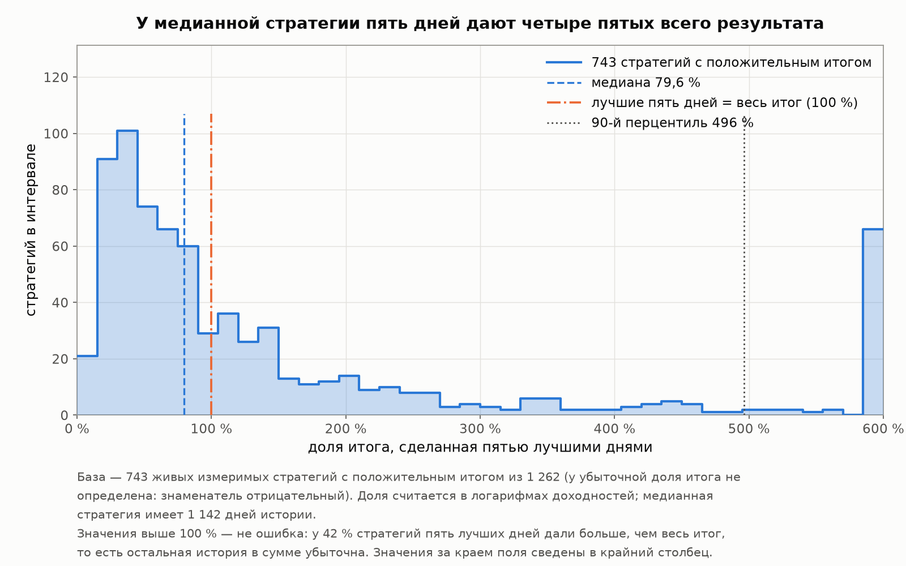
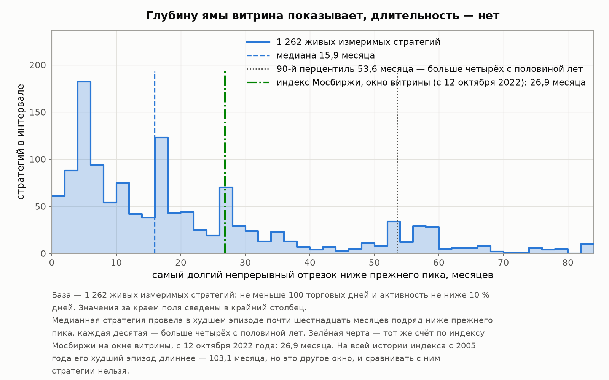
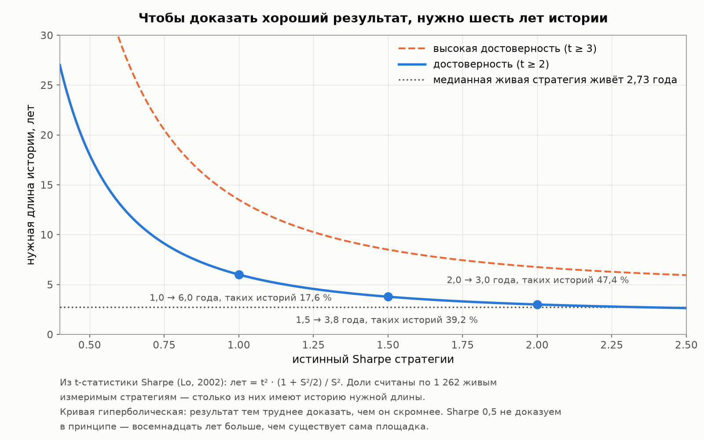
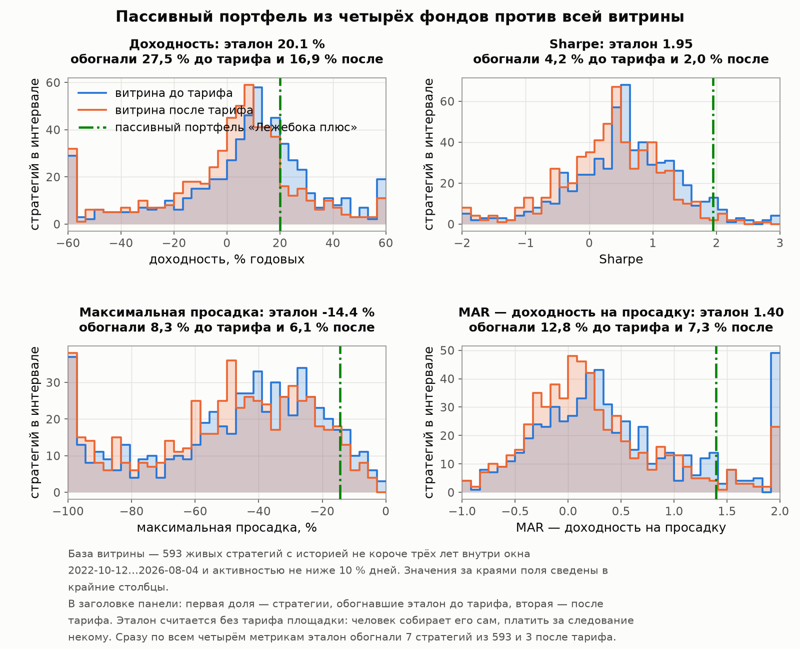
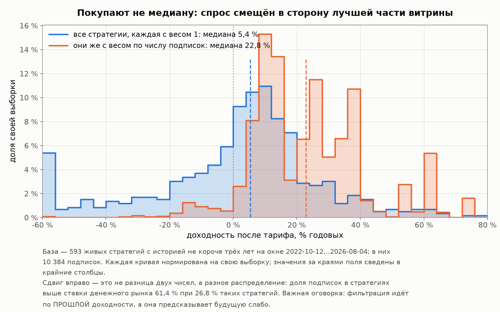
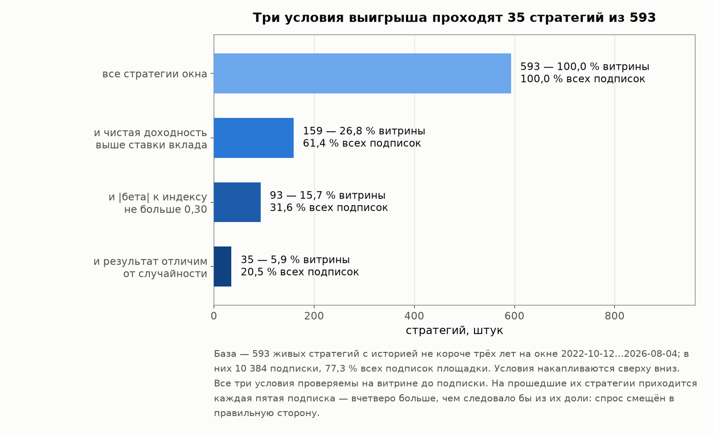

# Заключение. Стоит ли оно того

[Лицензия](comon-story-license.md) · [Введение](comon-story-0-intro.md) · [1 — Площадка и витрина](comon-story-1-market.md) · [2 — Кладбище](comon-story-2-survival.md) · [3 — Из чего сделана доходность](comon-story-3-returns.md) · [4 — Продавцы](comon-story-4-authors.md) · [Интерлюдия — вторая площадка](comon-story-4b-interlude.md) · [5 — Покупатели](comon-story-5-buyers.md) · **Заключение**

*Данные, методы и словарь терминов — во [введении](comon-story-0-intro.md). Все метрики пересчитаны из дневных рядов 19 978 стратегий Comon, включая 18 529 закрытых.*

---

Пять частей описывали рынок по слоям: что продаётся, сколько живёт, из чего сделана доходность, кто её пишет, кто покупает. Заключение отвечает на вопросы, которые ни одна из частей поодиночке закрыть не могла.

Их шесть, и они выстроены в один ход мысли: **кто стоит по ту сторону витрины** → **что она показывает** → **чего по ней не видно даже при честном показе** → **что из всего этого мы знаем достоверно** → **с чем это сравнить человеку, который может обойтись без витрины вовсе** → **и стоит ли оно того**.

Последний вопрос — тот, ради которого писалась вся серия: **выгодно ли автоследование клиенту** или при минимальной финансовой грамотности он соберёт то же самое сам, дешевле и с меньшей тряской. Ответ будет числовым и условным. Ни одной рекомендации купить или не купить в этом тексте нет — серия описывает рынок, а не советует, что с ним делать.

---

## 1. Те же ли это спекулянты

Витрина показывает выживших. За четыре года любого рынка это сильный фильтр сам по себе: то, что дошло до вашего экрана, уже прошло отбор — как минимум отбор временем. Вопрос раздела: **есть ли в автоследовании отбор помимо этого** — или по ту сторону прилавка те же люди, что и на общем спекулятивном рынке, просто показанные с лучшей стороны.

Начать приходится с расхожего числа, потому что читатель наверняка его встречал.

### Что стоит за «95 % разоряются в первый год»

Формулировка ходит в виде связки: 95 % частных спекулянтов разоряются в первый год, ещё 3 % во второй, выживают 2 %. **Связки 95 / 3 / 2 нет ни в академической литературе, ни в регуляторной статистике.** Мы искали первоисточник и нашли документ, откуда, по всей видимости, растёт корень: [отчёт Рональда Джонсона для NASAA, 1999 год](https://www.nasaa.org/wp-content/uploads/2011/08/Day_Trading_Analysis.pdf) — единственный известный нам текст, где сказано именно «потеряют всё», а не «получат убыток».

**Сначала — о том, насколько это утверждение укоренилось.** Оно живёт не как результат, на который ссылаются, а как поговорка: его знают все, кто хоть раз интересовался биржей, и приводят без источника. Верный признак фольклора — плавающее число при неизменном смысле. Достаточно посмотреть заголовки на крупнейшем русскоязычном форуме частных трейдеров:

| Заголовок | Дата |
|---|---|
| [«Почему 97 % трейдеров теряют деньги?»](https://smart-lab.ru/blog/246912.php) | 05.04.2015 |
| [«Почему 90 % трейдеров теряют деньги? Главные ошибки новичков»](https://smart-lab.ru/blog/1122674.php) | 28.02.2025 |
| [«Почему 99 % новичков сливают депозиты…»](https://smart-lab.ru/blog/1143585.php) | 18.04.2025 |
| [«Почему 95 % трейдеров теряют деньги…»](https://smart-lab.ru/blog/1152724.php) | 11.05.2025 |

**Три разных числа за два с половиной месяца одного года, на одной площадке.** Ни в одном из этих текстов число не выведено из данных — оно стоит в заголовке как общеизвестное.

Спорят о нём там же и постоянно: [«95 % трейдеров сливают? Ерунда!»](https://smart-lab.ru/blog/544710.php) (15.06.2019, 320 комментариев) и [«Про „95 % трейдеров сливает“»](https://smart-lab.ru/blog/563216.php) (23.09.2019). Показательно, чем возражают автору первого поста, собравшему список из одиннадцати знакомых ему управляющих с многолетним плюсом: **ошибкой выжившего** — тем самым, чему посвящена вся наша глава 2. Аргумент верный, и он работает в обе стороны: список успевших — не выборка, но и число без источника — не измерение.

Третий регистр — коммерческий. То же число продают наоборот: не «вы, скорее всего, проиграете», а «мы научим входить в те самые пять процентов». Как устроены такие курсы, разбирала пресса — например, [«Комсомольская правда»](https://www.kp.ru/daily/27519/4782815/) в материале о школах инвестирования. Одно и то же утверждение работает и как предостережение, и как приманка, и в обеих ролях источник не требуется.

**Нам спорить с фольклором незачем — нам нужно поставить рядом измеримое.** Поэтому дальше: сначала откуда растёт корень числа, затем что говорят добротные источники, и только потом наши собственные данные.

При пересказе из него потерялись три вещи, и каждая меняет смысл:

| Что говорят в пересказах | Что написано в отчёте |
|---|---|
| статистика отрасли | **30 счетов одной розничной дэй-трейдинговой фирмы**; после чистки — 26 счетов и 4 093 сделки, периоды торговли от 1 до 10 месяцев, средний счёт открыт 4 месяца |
| наблюдённый факт разорения | **расчёт** «риска разорения» по таблицам при допущении «10 % капитала на сделку»: у 18 счетов вероятность вышла 100 %. До нуля в данных не дошёл ни один счёт |
| категоричный вывод | условный: «*если этот анализ репрезентативен для краткосрочной публичной торговли…*» |

Оттуда же, вероятно, и «выжившие проценты»: успешными Джонсон признал 3 счёта из 26, то есть 11.5 %. Причём **лучший из них держал позиции в среднем 47 дней** и дэй-трейдингом не занимался вовсе. Ещё одна деталь того отчёта пригодится нам в разделе 3: у прибыльных счетов почти весь итог делала **одна сделка из сотен** — на неё приходилось от 43 до 70 % всей прибыли.

### Что известно достоверно

Добротные данные существуют, просто они меряют **убыток**, а не разорение — и это разные вещи. Ниже — четыре источника, и колонка «кого меряли» здесь не формальность: она объясняет весь разброс.

| Источник | Кого меряли | Результат |
|---|---|---|
| [ESMA, 2018](https://www.esma.europa.eu/press-news/esma-news/esma-agrees-prohibit-binary-options-and-restrict-cfds-protect-retail-investors) — сводка национальных регуляторов ЕС | розничные счета на контрактах на разницу (CFD) | **74–89 % счетов в убытке**; средний убыток 1 600–29 000 € на клиента |
| [SEBI, Индия, сентябрь 2024](https://www.sebi.gov.in/media-and-notifications/press-releases/sep-2024/updated-sebi-study-reveals-93-of-individual-traders-incurred-losses-in-equity-fando-between-fy22-and-fy24-aggregate-losses-exceed-1-8-lakh-crores-over-three-years_86906.html) | все физические лица на срочном рынке, 2021/22–2023/24 | **93 % в убытке**, суммарно 1.8 трлн рупий; прибыль свыше 100 тыс. рупий — у 1 % |
| [SEBI, 2024/25](https://www.sebi.gov.in/media-and-notifications/press-releases/jul-2025/comparative-study-of-growth-in-trading-in-equity-derivatives-segment-eds-vis-vis-cash-market-after-recent-measures_95106.html) | то же, следующий год | **91 % в убытке** — доля не изменилась; суммарный убыток вырос на 41 % до 1.06 трлн рупий, а число участников за год упало с 6.14 до 4.27 млн (от первого квартала к четвёртому) |
| [Банк России, июнь 2026](https://www.interfax.ru/business/1098010) | клиентские портфели российских брокеров от 10 тыс. до 10 млн ₽, 2023–2025 | **63 % клиентов в плюсе**, средняя доходность 2.9 % годовых; убыток глубже 10 % — у 5 % |

Последнюю строку мы приводим обязательно и рядом с остальными. Без неё получается подборка пугающих чисел, а картина обратная: **разница между строками задана не страной, а тем, кого считают.** У ESMA и SEBI это участники срочного рынка и рынка производных с плечом; у Банка России — все клиенты брокеров, включая тех, кто купил облигации и три года их не трогал. ЦБ отдельно отмечает, что убытки чаще приносили именно производные инструменты.

Академическая литература добавляет главное — что бывает с теми, кто не ушёл:

| Работа | Данные | Результат |
|---|---|---|
| [Barber, Lee, Liu, Odean, «The Cross-Section of Speculator Skill»](https://faculty.haas.berkeley.edu/odean/papers/day%20traders/The%20Cross-Section%20of%20Speculator%20Skill.pdf) | Тайвань, 1992–2006, свыше 450 тыс. дэй-трейдеров | **менее 1 % способны устойчиво зарабатывать после издержек**; лучший предсказатель будущей прибыльности — прошлый Sharpe |
| [Chague, De-Losso, Giovannetti, «Day Trading for a Living?»](https://papers.ssrn.com/sol3/papers.cfm?abstract_id=3423101) | Бразилия, 2013–2015, все начавшие торговать фьючерсами внутри дня | среди продержавшихся больше 300 дней **97 % в убытке**; больше минимальной зарплаты заработали 1.1 %, больше зарплаты клерка — 0.5 %; **признаков обучения нет** |

Вторая строка перекликается с нашей главой 4 напрямую: там связь порядка создания стратегии с её качеством неотличима от нуля — авторы Comon со временем тоже не улучшаются.

### Чего нет ни в одном внешнем источнике

Все перечисленные работы меряют одно состояние — «счёт в убытке». Потерявший 5 % и потерявший всё попадают в одну графу, а ушедший тихо не отличается от разорившегося. **Наш архив это разделяет**, и в этом его главная ценность:

| Что утверждает расхожая версия | Что в наших данных |
|---|---|
| 95 % разоряются в первый год | **разорение — 6.7 % архива** (просадка глубже 90 % или остаток не больше 10 % капитала) |
| выживают 2 % | до трёх лет доживают **11.7 %**, до пяти — **6.9 %** |
| — | медиана жизни торгующей стратегии **173 дня**; больше четверти архива не совершили ни одной сделки; 17.2 % закрылись на максимуме собственной кривой |

**Массовое исчезновение — правда. Массовое разорение — нет.** Стратегии уходят тихо, быстро и чаще всего с небольшим убытком: в самом населённом классе «закрылась у своего пика с убытком» медианный убыток равен 2.6 %. Фольклорная версия верна по направлению и завышена по механизму примерно на порядок.

Строго говоря, мы этим **не опровергаем** внешнее утверждение: у нас стратегии, а не люди, и автор закрытой стратегии мог спокойно продолжать торговать на своём счёте. Мы показываем другое — что на популяции, где видно каждое закрытие, механизм ухода устроен иначе, чем его принято описывать.

### Отбор: три стороны одного ответа

**На входе отбора нет.** Публикация стратегии на Comon не требует ни квалификации, ни истории, ни капитала: 19 978 записей за девятнадцать лет, из которых **5 145 не совершили ни одной сделки** (5 134 из них уже закрыты), — прямое следствие свободного входа. С этой стороны автор публичной стратегии и частный спекулянт — одно и то же множество людей.

**На выходе отбор есть, но безличный.** Его делают две силы. Первая — смерть: до трёх лет доживают 11.7 % стратегий (глава 2), и отбор по прошлому результату здесь работает сильно (глава 3: смертность лучшей и худшей пятой части — 28.5 % против 70.9 % за два года). Вторая — время: длинная история сжимает всё, что можно было принять за мастерство. Максимальный Sharpe падает с 19.4 на годовой дистанции до **1.94 на пятилетней**, и планку 2.0 не перешагнула ни одна из 697 стратегий, доживших до пяти лет.

**Спросом почти не отбирается.** В модели популярности (глава 5) качество незначимо, а риск идёт со знаком плюс: при равной доходности стратегия с более глубокой просадкой популярнее. Из трёх механизмов отбора покупатель не усиливает ни один.

### Контрольная группа: площадка, где отбор заявлен

У этого рассуждения есть естественная проверка. В России **два** маркетплейса частных авторов, и они различаются ровно по интересующему нас признаку: на Comon вход свободный, а Т-Инвестиции заявляют «строгий отбор и проверку на доходность». Если входной отбор производит мастеров, это должно быть видно.

Из интерлюдии мы уже знаем: медианный Sharpe у Т-Инвестиций **1.54** против **0.18** у Comon. Но интерлюдия спрашивала, какая витрина выглядит лучше. Здесь вопрос глубже: **создаёт ли отбор умение.** И медиана на него не отвечает, потому что у Т-Инвестиций нет архива: их витрина показывает только выживших, и насколько это задирает середину, неизвестно.

**Поэтому смотрим на потолок.** Невидимые стратегии могут быть только хуже показанных — иначе бы их показывали. Значит наблюдаемый максимум есть оценка истинного максимума **снизу**, и отсутствие архива его не задирает. Логика простая: если у отобранной площадки лучший результат не выше, чем у неотобранной, то отбор мастеров не производит.

| Возраст истории | Т: стратегий | Т: медиана | Т: 90-й перц. | Т: максимум | Comon: стратегий | C: медиана | C: 90-й перц. | C: максимум |
|---|---:|---:|---:|---:|---:|---:|---:|---:|
| до 1.5 года | 42 | 2.31 | 6.13 | 8.35 | 389 | 0.08 | 2.79 | 21.59 |
| 1.5–2.5 года | 62 | 1.75 | 4.98 | 17.34 | 176 | 0.14 | 1.81 | 16.65 |
| 2.5–3.5 года | 31 | 1.34 | 2.59 | 4.99 | 162 | 0.11 | 1.46 | 11.54 |
| **больше 3.5 года** | 34 | 1.13 | 1.84 | **4.14** | 535 | 0.29 | 1.50 | **4.53** |
| Все | 169 | 1.54 | 4.50 | 17.34 | 1 262 | 0.18 | 1.78 | 21.59 |

*Sharpe как отношение CAGR к волатильности, наш расчёт из дневных рядов обеих площадок. База: все 169 живых стратегий каталога Т-Инвестиций и 1 262 живые измеримые стратегии Comon (не меньше 100 торговых дней, активность не ниже 10 %). Корзины по длине истории — потому что короткая история льстит (глава 3), а стратегии Т-Инвестиций моложе.*

**На сопоставимых по длине историях потолки равны — 4.14 против 4.53**, причём выше он у площадки **без** отбора, на выборке в шестнадцать раз большей. Верхние 10 % — 1.84 против 1.50 в пользу Т-Инвестиций, разрыв есть, но это уже не потолок, а плотность верхней части.

Отдельно стоит сказать, чего проверить не удалось. **Самая старая стратегия в каталоге Т-Инвестиций живёт 4.69 года**, пятилетних там нет ни одной; у Comon живых измеримых с историей от пяти лет — 326. То есть **самую жёсткую проверку главы 3 — ту, где потолок садится на 1.94, — на отобранной площадке провести физически нельзя.** Это само по себе результат: в автоследовании с отбором просто ещё не накопилось историй, на которых мастерство отличимо от везения.

Второй способ измерить отбор — **усечением**. Отрежем у Comon верхушку и посмотрим, при каком отсечении его медиана сравняется с медианой Т-Инвестиций:

| Оставлен верхний хвост Comon | Медианный Sharpe: все живые измеримые (n = 1 262) | Медианный Sharpe: только истории от 3.5 года (n = 535) |
|---|---:|---:|
| топ 50 % | 0.92 | 0.82 |
| топ 40 % | 1.13 | 1.02 |
| топ 35 % | 1.29 | **1.10** |
| топ 30 % | 1.42 | 1.22 |
| топ 25 % | **1.56** | 1.35 |
| топ 20 % | 1.78 | 1.51 |
| **Медиана Т-Инвестиций (цель)** | **1.54** (n = 169) | **1.13** (n = 34) |

Читается одной фразой: **витрина площадки с отбором выглядит как верхняя четверть немодерируемого маркетплейса, а при контроле длины истории — как верхняя треть.** Отбор поднимает середину примерно на треть популяции и не двигает потолок.

Третий способ — и он самый строгий: **какая доля стратегий имеет результат, отличимый от случайности.** Считаем t-статистику Sharpe одной формулой для обеих площадок. Формула поправлена на то, что сама оценка Sharpe тем менее надёжна, чем она больше, поэтому эффектное число на коротком ряде большой t-статистики не даёт.

| Площадка | Стратегий | С достоверным результатом (t ≥ 2) | С высоко достоверным (t ≥ 3) | Медианная t |
|---|---:|---:|---:|---:|
| Comon, живые измеримые | 1 262 | 113 (**9.0 %**) | 14 (1.1 %) | 0.55 |
| Т-Инвестиции, все живые | 169 | 16 (**9.5 %**) | **0 (0 %)** | 1.51 |

**Доли совпали.** На площадке с заявленным отбором результат отличим от случайности у 9.5 % стратегий, на площадке без всякого отбора — у 9.0 %. Внутри самой длинной корзины историй (от 3.5 года) то же самое: 20.6 % против 19.6 %. А на верхнем уровне достоверности отобранная площадка даёт **ноль** против четырнадцати — по той же причине, по которой у неё нет потолка на пяти годах: слишком короткие истории.

Наконец, деталь, из-за которой архив мёртвых незаменим:

| | Т-Инвестиции | Comon (живые стратегии) |
|---|---:|---:|
| Авторов | 84 | 873 |
| Стратегий на витрине | 169 | 1 445 |
| Максимум стратегий у одного автора | 9 | 37 |
| **Доля авторов ровно с одной стратегией** | **35.7 %** | **74.7 %** |
| Доля авторов с тремя и более | 21.4 % | 12.4 % |

*База Comon — 1 445 живых стратегий, у которых есть дневной ряд, и 873 их автора; три живые стратегии без ряда в счёт авторов не идут.*

**Типичный автор на отобранной площадке ведёт больше стратегий, а не меньше.** Значит поправка на перебор — та самая, что в главе 4 измерена в 1.10 пункта Sharpe при шести–десяти попытках, — в его показанных числах должна сидеть не в меньшей степени. Но **измерить её там нельзя**: отбракованные попытки не видны. Это и есть точный ответ на вопрос, зачем нужен архив.

**Что здесь обязательно сказать против собственного вывода:**

- у Т-Инвестиций **нет кладбища**, поэтому отбор и невидимость неудачных на этих данных **разделить нельзя** — можно только ограничить; ориентир снизу — цена ошибки выжившего 0.2–0.3 пункта Sharpe (глава 3), а разрыв медиан больше пункта;
- каталог отдаёт **169 стратегий** при заявленных площадкой «более 400»; невидимая часть скорее хуже видимой, то есть числа Т-Инвестиций здесь скорее завышены, и вывод от этого консервативен;
- «строгий отбор и проверка на доходность» — **заявление площадки**, а не проверенный нами факт;
- истории у Т-Инвестиций короче (медиана 2.18 против 2.73 года), поэтому все сравнения выше идут только внутри корзин длины;
- ряды приходят прорежёнными (медианный шаг 2.66 дня); смещение метрик от этого измерено и не превышает процента;
- поправку на множественность проверки для 169 сильно скоррелированных стратегий мы не делали — она может только **опустить** числа Т-Инвестиций, то есть против нашего вывода не работает.

### Сколько же их — тех, кто умеет

Осталось сопоставить наши числа с внешними напрямую. Глава 4 применила критерий «умеет торговать» к 235 серийным авторам и нашла 23. Но у Barber и коллег знаменатель другой — **все, кто пробовал**, а не отобранные по числу попыток. Поэтому тот же критерий, без единого изменения, применён ко всей популяции авторов площадки:

| Знаменатель | Авторов | Из них с проверяемым результатом | Доля |
|---|---:|---:|---:|
| **все авторы за историю площадки** | **5 606** | **69** | **1.23 %** |
| у кого хотя бы одна стратегия имеет ряд | 5 371 | 69 | 1.28 % |
| у кого хотя бы одна стратегия торговала | 4 883 | 69 | 1.41 % |
| у кого хотя бы одна стратегия измерима | 3 129 | 69 | 2.21 % |
| серийные авторы, 10 и больше стратегий (база главы 4) | 235 | 23 | 9.79 % |

*Критерий тот же, что в разделе 4.5, и задан он был заранее: t-статистика Sharpe по модулю не ниже 2, арифметический Sharpe не ниже 1.0, превышение поправки на перебор по числу собственных попыток, история не короче трёх лет — плюс условие на автора, а не на систему: медианный Sharpe его измеримых стратегий не ниже нуля. Служебный аккаунт площадки исключён.*

**1.23 % против «менее 1 %» у Barber и коллег по 450 тысячам тайваньских дэй-трейдеров.** Тот же порядок величины, полученный на другой стране, другом десятилетии, другом инструменте и другим способом. Совпадение не следует переоценивать — единицы счёта не тождественны (у нас авторы, у них люди; у нас критерий достоверности, у них устойчивая прибыльность после издержек), — но и отмахнуться от него нельзя.

### Вывод раздела

**Это те же спекулянты.** Никакого содержательного отбора на входе в автоследование нет — ни на площадке со свободным входом, ни, судя по потолку и доле достоверных результатов, на площадке с заявленным отбором. Доля людей с проверяемым результатом здесь та же, что в больших исследованиях частных трейдеров, — около процента.

Отбор при этом существует, просто он не там, где его ищет посетитель витрины. Его делают **смерть и время**: почти девять из десяти стратегий не доживают до трёх лет, а те, что доживают, теряют по дороге весь избыточный блеск. Витрина же по построению показывает результат **после** этого отбора и **не показывает сам отбор** — 92.7 % записей площадки закрыты, и в каталоге живых их нет.

И ещё одно, что стоит держать в голове при чтении следующих разделов. Отбор, который делает время, — не тот же самый, что делает мастерство. Он оставляет тех, кто не разорился, а это, как показала глава 3, довольно слабо связано с тем, кто заработал.

---

## 2. Честность витрин

Витрина — не реклама. Это интерфейс принятия решения: почти всё, что человек знает о стратегии в момент подписки, он берёт с одного экрана. Поэтому вопрос «честная ли витрина» распадается на три и требует разбора по каждому полю: **что показано**, **что это на самом деле означает** и **годится ли оно для решения**.

Сравниваем две площадки одной модели — Comon и Т-Инвестиции. Показанным считаем то, что площадка отдаёт в карточке стратегии собственным интерфейсом.

| Поле | Comon | Т-Инвестиции | Что это на самом деле | Годится ли для решения |
|---|---|---|---|---|
| Кривая доходности | есть | есть | фактический результат до вычета платы | да — но по ней видно меньше, чем кажется (раздел 3) |
| Эталоны для сравнения на том же графике | три: индекс МосБиржи, индекс РТС, S&P 500 | четыре: индекс МосБиржи, индекс полной доходности, индекс облигаций, денежный рынок | с чем сравнивать результат | **да, и это лучшее, что есть на обеих витринах** — но состав набора решает всё (см. ниже) |
| Доходность за год | есть | есть | результат последних 12 месяцев **до платы** | частично: один год — слишком короткий срок для вывода |
| «Прогноз N % в год» | нет | есть | **цель, которую задал сам автор**, а не расчёт площадки и не прогноз в статистическом смысле | нет |
| Максимальная просадка | есть | есть просадка счёта автора | глубина худшего провала | да — но без длительности (раздел 3) |
| «Прогнозируемая просадка» | есть | нет | **CVaR**, средний убыток в худших днях: величина другого масштаба и другой природы | нет — под этим именем вводит в заблуждение |
| Категория риска / уровень риска | есть (1–3) | есть | ярлык площадки | нет |
| Рейтинг площадки | есть | «score» | мера известности (см. ниже) | нет |
| Порог входа | есть | есть | минимальный капитал | **да** — сильнейший видимый признак качества (глава 5) |
| Частота сделок | есть | есть (число сигналов и режим) | как часто торгует | **да** — второй работающий признак (глава 5) |
| Тариф | из общей сетки | построчно, у каждой стратегии свой | сколько заберут | да — и смотреть на него надо раньше доходности (раздел 6) |
| Число подписчиков | есть | есть | популярность | нет — с качеством связана слабо (глава 5) |
| Точность следования | нет | есть (медиана 99.96 %) | насколько сделки подписчика совпали со сделками автора | да — это честный ответ на реальный риск копирования |
| Ёмкость стратегии и её лимит | нет | есть | сколько денег стратегия способна принять | да |
| Возраст стратегии | есть | есть | длина истории | **да** — от него зависит, значит ли вообще что-нибудь всё остальное |
| **Архив закрытых стратегий** | **есть** | нет | чем эта затея обычно заканчивается | **да, и заменить его нечем** |

Четыре строки из этой таблицы стоит разобрать отдельно.

**Обе площадки дают эталоны — и это самое полезное, что на витринах есть.** Comon присылает вместе с кривой стратегии три индексных ряда: МосБиржи, РТС и S&P 500. Т-Инвестиции — четыре: МосБиржи, индекс полной доходности, индекс государственных облигаций и денежный рынок. Возможность увидеть свою кривую рядом с рыночной отвечает на вопрос, который в этой серии оказался главным: **не является ли стратегия рынком под другим именем** (раздел 6: у каждой четвёртой бета выше 0.7). Это надо сказать отчётливо, потому что дальше речь пойдёт о недостатках.

А недостатки в **составе набора**, и они разные у двух площадок.

- **У Comon нет денежного эталона.** Все три его ряда — рынок акций: индекс РТС это тот же российский рынок, пересчитанный в доллары, а S&P 500 — чужой рынок и тоже в долларах. Для рублёвого подписчика ни один из трёх не отвечает на вопрос «а не проще ли положить на вклад», хотя именно этот вопрос отсеивает большинство: денежный рынок не обгоняют 60.5 % стратегий до тарифа и 73.2 % после. У Т-Инвестиций такой эталон есть.
- **Индекс МосБиржи у Comon — ценовой, без дивидендов** (мы сверили его ряд с биржевым: ранговое совпадение дневных движений 0.997). Это занижает планку: на окне витрины ценовой индекс дал 4.0 % годовых, а индекс полной доходности — 13.5 %, **разница 9.5 процентного пункта в год**. Стратегия, обогнавшая показанный эталон, вполне могла проиграть тому же рынку с дивидендами. У Т-Инвестиций индекс полной доходности в наборе есть.
- **У закрытых стратегий Comon эталонные ряды пусты**, как и остальные расчётные поля. То есть эталон помогает выбирать среди живых и исчезает ровно там, где был бы всего полезнее, — в архиве.

Итог по этой строке честный в обе стороны: **эталоны на витринах есть, и это лучше, чем ничего**; но набор Comon отвечает только на вопрос «обогнала ли стратегия акции без дивидендов», а набор Т-Инвестиций — ещё и на вопросы «обогнала ли облигации» и «обогнала ли вклад».

Дальше — три вещи, которые касаются уже не состава, а подписей.

**Числа на витрине Comon честные — врут ярлыки.** Это установлено главой 1 и заслуживает повторения, потому что вывод двойной и его легко упростить неверно. Показанная доходность ранжирует популяцию так же, как пересчёт из ряда (ρ = 0.954), показанная просадка — тождественно (ρ = 1.000). Зато категория риска связана с реальной просадкой всего на 0.184, а рейтинг площадки связан с числом подписчиков (0.442) вчетверо сильнее, чем с качеством (0.115): это мера известности, а не оценка. **Цифры площадка считает добросовестно; вводят в заблуждение слова, которыми она эти цифры резюмирует.**

**Подмена понятия в поле «прогнозируемая просадка».** Фактически это CVaR — средний убыток в худших днях. Медиана по популяции −18.0 % против реальной максимальной просадки −47.0 %, то есть в 2.6 раза мягче. При этом как **мера риска** поле работает: с реальной просадкой оно связано на 0.910. Проблема здесь целиком в названии, и это ровно тот случай, когда «мог бы показать правильно» и «показывает неправильно» разделены одним словом в подписи.

**У Т-Инвестиций своя подмена, и она того же рода.** Крупное число «Прогноз N % в год» на карточке — это `expectedStrategyRelativeYield`, цель, заявленная **самим автором**. Не расчёт площадки, не средняя за историю, не статистический прогноз. Здесь не нужен даже наш пересчёт: обе величины площадка показывает сама, рядом. Мы сверили их **по всем 169 карточкам каталога**.

| Величина | Значение |
|---|---:|
| Карточек, где факт за 12 месяцев ниже авторского прогноза | **164 из 169 (97.0 %)** |
| Медианный разрыв «факт минус прогноз» | **−16.3 п.п.** |
| Разрыв: 10-й процентиль / 25-й / 75-й / 90-й | −42.3 / −29.4 / −8.4 / −3.6 п.п. |
| Худший случай | прогноз 100 %, факт −2.0 % |
| Медиана прогноза против медианы факта | 30.0 % против **10.8 %** |
| Ранговая связь прогноза с фактом | **+0.106** (p = 0.17) |

Последняя строка важнее остальных. **Прогноз не только завышен — он ещё и не упорядочивает стратегии.** Связь его с фактическим результатом неотличима от нуля: по величине заявленной цели нельзя сказать даже того, какая из двух стратегий окажется доходнее. Причём чем длиннее история, тем разрыв шире: у стратегий старше трёх лет факт ниже прогноза у **всех до одной**, медианный разрыв −26.5 п.п. — молодость стратегий этого не объясняет.

Одна оговорка в пользу площадки: показанный факт — до комиссий, так что разрыв, который увидит подписчик, ещё шире, а не уже.

Что каждая площадка даёт сверх другой, подробно разобрано в [интерлюдии](comon-story-4b-interlude.md); здесь достаточно итога. Т-Инвестиции показывают то, чего у Comon нет вовсе: комиссии построчно, точность следования, ёмкость, просадку счёта автора, частоту сигналов. Comon показывает то, чего нет ни у Т-Инвестиций, ни у зарубежных площадок из литературы, — **архив закрытых стратегий с сохранёнными кривыми**. Всё исследование, которое вы читаете, существует только благодаря ему.

### Чего не хватает обеим

Дальше — самое содержательное. Есть набор величин, которых **не показывает ни одна** площадка. И главный вопрос по каждой не «показывают ли», а **может ли площадка её показать** — потому что разница между «мог бы, но не показывает» и «не может» и есть настоящая мера честности витрины.

| Чего нет ни у одной | На какой вопрос отвечает | Вычислимо ли из того, что площадка уже имеет |
|---|---|---|
| Волатильность | насколько трясёт по дороге | **да**, из той же кривой |
| Sharpe | сколько доходности на единицу риска | **да** |
| Коэффициент Сортино | то же, но с наказанием только за падения | **да** |
| MAR (доходность ÷ просадка) | сколько лет ждать восстановления | **да** |
| **Время под водой** | как долго счёт стоит ниже прежнего пика | **да** — глубину показывают обе, длительность не показывает никто |
| Доля итога, пришедшаяся на лучшие 5 дней | результат ровный или это несколько удачных дней | **да** |
| Доходность **после** комиссий | что осталось подписчику | **да**, и тариф площадка знает лучше всех |
| Бета и альфа к индексу | сколько в результате просто рынка | **да, и почти даром**: эталонные ряды обе площадки уже присылают вместе с кривой — не хватает одного числа, посчитанного по ним |
| Число наблюдений и t-статистика | отличим ли результат от случайности | **да** |
| Дефлированный Sharpe | поправка на число попыток автора | **да — но только площадкой**: сколько стратегий автор закрыл, посетителю не видно, а площадке видно |
| Отсутствующие: результат закрытых стратегий | чем это обычно заканчивается | **у Comon — да** (архив есть, из каталога живых он просто не виден); у площадки без архива — нет |

**Почти всё вычислимо из дневной кривой, которую обе площадки и так отдают.** Это и есть ответ раздела: сегодняшняя витрина — не предел технических возможностей, а выбор состава показанного. Мы не приписываем этому выбору умысла: набор полей мог сложиться исторически, из соображений простоты, из представления о том, что покупателю понятно. Но зафиксировать разницу необходимо, потому что она перекладывает работу на читателя — а он, как показала глава 5, её не делает.

Две строки таблицы стоят особняком, и как раз они самые важные.

**Дефлированный Sharpe площадка может посчитать, а посетитель — нет.** Чтобы поправить показанный результат на число попыток, надо знать, сколько стратегий этот автор создал и закрыл. Посетителю каталога живых это недоступно в принципе: закрытые из него исчезли. Площадка знает всё. Цена этого знания измерена в главе 4 — **1.10 пункта Sharpe при шести–десяти попытках автора**.

**Отсутствующие — единственная строка, которую нельзя закрыть новым полем в карточке.** Показать, чем затея обычно заканчивается, можно только одним способом: не прятать закрытые стратегии. Comon их сохраняет — и это, парадоксальным образом, самое честное, что есть на этом рынке, хотя выглядит просто как незачищенная база. Одна оговорка: у закрытых стратегий Comon **расчётные поля карточки обнулены** (глава 1), архив полезен ровно потому, что дневной ряд при этом сохранён целиком.

**Витрины брокеров — разговор отдельный, и он в интерлюдии.** Всё сказанное выше — про два маркетплейса; остальные десять программ реестра НАУФОР устроены иначе, и там вопрос стоит грубее: не «честно ли показано», а «показано ли хоть что-нибудь». Короткий осмотр четырёх таких сервисов — в [интерлюдии](comon-story-4b-interlude.md#а-что-показывают-витрины-брокеров); вывод оттуда: у двух из них до подключения не видно ничего, у третьего вместо результата стоит прогноз, у четвёртого — единственного с настоящей кривой — нет ни одной величины риска. Проверяемая кривая, о недостатках которой идёт речь в этом разделе, есть только у маркетплейсов.

**Вывод раздела.** По части чисел витрины честны: показанное соответствует действительности, Comon вдобавок не прячет мёртвых, а эталонные кривые — важное исключение из общего дефицита, потому что позволяют сравнить стратегию с рынком глазами. Нечестность — не в цифрах, а в **составе показанного и в подписях под ним**: два самых крупных числа на двух витринах (CVaR под именем просадки и авторская цель под именем прогноза) означают не то, что читается; из эталонов у Comon отсутствует ровно тот, который отсеивает большинство стратегий, — денежный рынок; а десяток величин, по которым только и можно судить о качестве, не показан ни одной площадкой, хотя вычислим из данных, которые у них уже есть.

---

## 3. Что скрыто за графиком

Предположим теперь идеальный случай: площадка показывает честное число, читатель его правильно понял. Он смотрит на кривую доходности — линию, которая идёт вверх. Этот раздел о том, чего по такой линии **не видно в принципе**, даже когда она нарисована безупречно.

Семь вещей, и все — на наших данных.

**1. Риск не виден.** Две кривые с одинаковым итогом и разной тряской выглядят одинаково «вверх». Пример из [словаря введения](comon-story-0-intro.md): стратегия A даёт 40 % годовых при волатильности 40 %, стратегия B — 20 % при 10 %. По конечной точке A вдвое лучше; по качеству управления она вдвое хуже (Sharpe 1.0 против 2.0). Витрина ранжирует их по конечной точке.

**2. Плечо не видно.** Кривую можно растянуть по вертикали, не улучшив ничего: удвоенный размер позиции удваивает и доходность, и просадку. Глава 3 измерила цену этого на естественном эксперименте — 362 парах «близнецов» (две стратегии одного автора с корреляцией дневных доходностей не ниже 0.8, то есть одна идея в двух размерах). **Удвоение риска стоит 0.15 пункта Sharpe** — то есть плечо не только не создаёт качества, оно его слегка съедает через издержки. На графике эти 0.15 пункта не видны никак, а разница в высоте линии видна прекрасно.

**3. Хрупкость не видна.** Вот здесь начинается неочевидное. Мы посчитали по 1 262 живым измеримым стратегиям, какая доля итога сделана **пятью лучшими днями** истории:

| Доля итога, сделанная… | 25-й перц. | Медиана | 75-й перц. | 90-й перц. |
|---|---:|---:|---:|---:|
| пятью лучшими днями | 39.6 % | **79.6 %** | 178.3 % | 496.3 % |
| лучшим календарным месяцем | 20.8 % | 37.3 % | 82.1 % | 218.6 % |

*База: 743 стратегии с положительным итогом из 1 262 живых измеримых (у убыточной «доля итога» не определена — знаменатель отрицательный). Доля считается в логарифмах доходностей: они складываются, тогда как сами доходности перемножаются. Медианная стратегия имеет в истории 1 142 дня.*

**У медианной стратегии пять дней из тысячи с лишним дают четыре пятых всего результата.** Значения выше 100 % — не ошибка: у четверти стратегий лучшие пять дней дали больше, чем весь итог, то есть **остальная история в сумме убыточна**. У каждой десятой пять дней дали впятеро больше итога.

Проверка тем же способом, но на всей базе, включая убыточных:

| Итог живой измеримой стратегии | Медиана | Доля стратегий в плюсе |
|---|---:|---:|
| как есть | +8.7 % | 58.9 % |
| без пяти лучших дней | **−17.5 %** | **33.9 %** |
| без лучшего месяца | −4.1 % | 46.4 % |

**Изъятие пяти дней переводит из прибыли в убыток 42.4 % прибыльных стратегий.** Разумеется, изымать лучшие дни нечестно — так же можно изъять худшие и получить обратное. Смысл расчёта не в том, что «на самом деле они убыточны», а в том, **на скольких наблюдениях держится показанный результат**: если он держится на пяти днях, то это результат пяти событий, а не тысячи, и переносить его на будущее нельзя примерно никак.

Одна честная оговорка: хрупкость **связана** с тем, что можно посчитать, — ранговая корреляция доли лучших дней с Sharpe равна −0.762 (чем ровнее результат, тем выше Sharpe, что и неудивительно). Но Sharpe на витрине не показывают ни одна из двух площадок, а на самой кривой хрупкость не читается: график стратегии, сделавшей год за неделю, выглядит как обычная линия вверх.

**4. Длительность просадки не видна.** Глубину ямы витрина показывает, длительность — нет. Считаем, сколько времени стратегия проводит ниже прежнего максимума:

| Величина | 25-й перц. | Медиана | 75-й перц. | 90-й перц. |
|---|---:|---:|---:|---:|
| доля дней ниже прежнего пика | 89.4 % | 93.9 % | 97.0 % | 98.9 % |
| **самый долгий отрезок под водой подряд, месяцев** | 5.7 | **15.9** | 27.4 | **53.6** |

*База: 1 262 живые измеримые стратегии.*

🔴 **Первую строку читать как страшное число нельзя, и мы обязаны это сказать.** Быть ниже прежнего пика — нормальное состояние любой растущей кривой: новый максимум по определению редкое событие. Индекс Мосбиржи на том же окне провёл ниже прежнего пика **90.8 % дней**, а за всю историю с 2005 года — 95.2 %. Разница со стратегиями невелика, и никакого обвинения из первой строки не следует.

Информативна вторая строка. **Медианная живая стратегия провела в своём худшем эпизоде почти шестнадцать месяцев подряд ниже прежнего пика; каждая десятая — больше четырёх с половиной лет.** Для сравнения: у индекса на окне витрины худший непрерывный эпизод — 26.9 месяца, то есть медианная стратегия здесь выглядит даже лучше индекса, и это надо сказать прямо. Сравнение неточное — у стратегий разные окна и разная длина истории, — но направление оно задаёт: длительность просадок у автоследования того же порядка, что у рынка, а не радикально меньше.

Связь с глубиной ожидаемая и монотонная: у стратегий с просадкой глубже −50 % худший эпизод тянется медианно 28.2 месяца, у стратегий с просадкой мельче −15 % — 4.2 месяца. То есть глубина о длительности кое-что говорит; беда в том, что **сама длительность — та величина, которую подписчику предстоит пережить, — не показана нигде.**

Чего мы при этом **не** утверждаем: что подписчик уходит по длительности, а не по глубине. Это правдоподобно, но истории подписок в данных нет (глава 5), и проверить это на наших данных нельзя.

**5. Малая выборка не видна.** Кривая длиной в год и кривая длиной в шесть лет выглядят одинаково убедительно — обе просто линии. Между тем от длины зависит, значит ли показанное хоть что-нибудь. Сколько лет нужно, чтобы отличить Sharpe от нуля:

| Истинный Sharpe | Лет для достоверности (t ≥ 2) | Лет для высокой достоверности (t ≥ 3) | Живых стратегий с такой историей | Их доля |
|---|---:|---:|---:|---:|
| 0.50 | 18.0 | 40.5 | 0 | 0.0 % |
| 0.75 | 9.1 | 20.5 | 71 | 5.6 % |
| **1.00** | **6.0** | 13.5 | 222 | 17.6 % |
| 1.50 | 3.8 | 8.5 | 495 | 39.2 % |
| 2.00 | 3.0 | 6.8 | 598 | 47.4 % |

*Из формулы t-статистики Sharpe: лет = t² · (1 + S²/2) / S². База последних двух колонок — 1 262 живые измеримые стратегии.*

**Чтобы доказать хороший результат — Sharpe 1.0, — нужно шесть лет. Такой историей располагают 17.6 % живых измеримых стратегий и около одного процента всей популяции площадки.** Медианная живая измеримая стратегия живёт 2.73 года, медианная торгующая стратегия площадки — 173 дня. Стратегия с Sharpe 0.5 не доказуема в принципе: восемнадцать лет — это больше, чем существует сама площадка.

**6. Комиссии не видны.** Обе площадки показывают результат до платы. У Comon разница между показанной и полученной кривой измерена дважды: на окне сравнения площадок медианная живая стратегия даёт **+4.4 % валовых и −1.6 % после тарифа** (интерлюдия), а за всю жизнь стратегий тариф уводит медиану с 10.6 % на 5.4 % и роняет долю обгоняющих денежный рынок с 39.5 % до 26.8 % (глава 5). То есть тариф не просто уменьшает результат — он **уничтожает четверть осмысленных вариантов**, и на графике витрины этого нет.

**7. Отсутствующие не видны.** Последний и единственный пункт, который площадка не может исправить, добавив поле в карточку. Каталог живых стратегий не показывает тех, кто до него не дожил, и никакая честность оформления этого не лечит — лечит только открытый архив. Цена вопроса измерена в главе 3: **ошибка выжившего стоит 0.2–0.3 пункта Sharpe**. Для сравнения: вся разница между «хорошей» и «средней» стратегией на длинных историях укладывается примерно в тот же интервал.

### Что по графику всё-таки можно понять

Раздел получился обвинительным, поэтому честно перечислим и обратное. По кривой доходности **видно**: порядок величины доходности; характер результата — ровный рост или ступеньки; примерная глубина провалов; и — если хватает терпения посмотреть на даты — как стратегия вела себя в конкретный плохой период рынка.

По кривой **не видно**: риска в сопоставимой форме, плеча, хрупкости, длительности просадок, достаточности выборки, чистого результата после платы и тех, кто до витрины не дожил.

Простое правило, которое из этого следует: **кривая доходности — это не результат, а иллюстрация результата.** Решение по ней принимать можно ровно в той мере, в какой можно выбирать автомобиль по фотографии.

---

## 4. Что установлено достоверно

Серия насчитала много чисел, и они обеспечены по-разному. Это не формальность: утверждение «94 % стратегий на тарифе 6 %» и утверждение «плата за перебор равна 1.10 пункта Sharpe» выглядят одинаково, но первое — счётный факт переписи, а второе — оценка с погрешностью, полученная моделью. Читатель вправе знать, во что можно верить как в измеренное, а во что — с оговорками.

Поэтому раздел сортирует выводы серии по **степени обеспеченности**, а не по темам. Три регистра.

### Измерено прямо

Это перепись: мы посчитали не выборку, а всю популяцию площадки. Погрешность здесь исчезающе мала, и спорить с этими числами можно только оспаривая сами данные.

- **19 978 стратегий** за историю площадки; **18 529 закрыты (92.7 %)**, **1 448 живы (7.2 %)**; у одной статус установить не удалось — её карточка не загрузилась при выгрузке.
- **Медиана жизни торгующей стратегии — 173 дня.** До года доживают 30.5 %, до трёх лет 11.7 %, до пяти 6.9 %.
- **27.7 % архива не совершили ни одной сделки.** Ещё 17.2 % закрылись на максимуме собственной кривой.
- **Разорение — 6.7 % архива** (просадка глубже 90 % или остаток не больше 10 % капитала).
- **94.0 % стратегий на тарифе 6 % годовых от активов**; плата от результата предлагается у 8.6 % живых.
- **13 430 подписок** на живых стратегиях; **66.1 % живых стратегий не имеют ни одного подписчика**; сто стратегий держат 85 % подписок.
- **Числа витрины соответствуют рядам**: ранговая корреляция показанной доходности с пересчитанной 0.954, показанной просадки с реальной 1.000.

### Оценено с погрешностью

Здесь есть модель, выборка или порог, и число надо читать вместе с интервалом или с условием.

- **Потолок Sharpe около 1.9.** Максимум среди 697 стратегий с пятилетней историей — 1.94; выше 2.0 нет ни одной, откуда верхняя граница доли таких стратегий — 0.43 %.
- **Плата за перебор — 1.10 пункта Sharpe при шести–десяти попытках автора.** Оценка модельная: она сравнивает наблюдаемый разрыв «лучшая минус типичная» с эталоном независимых попыток, а попытки автора независимыми не являются (11–20 вариантов работают как 2–5 настоящих).
- **Доказанная альфа у 6.3 % стратегий** — 241 система со значимой альфой +26.5 % годовых. Число зависит от выбранной модели рынка и от порога значимости.
- **Автор объясняет 67 % разброса популярности** — доля объяснённой дисперсии в модели, а не причинная величина.
- **Выбор из 1 448 стратегий есть выбор примерно из шести** независимых ставок (6.6 по корреляциям дневных рядов среди 427 стратегий с подписчиками). Оценка чувствительна к окну и к методу.
- **Ранговые корреляции меряются с точностью около ±0.05** при выборке порядка полутора тысяч. Поэтому всё, что меньше 0.05, мы считаем нулём, а 0.3 и выше — надёжным.
- **Доля авторов с проверяемым результатом — 1.23 %** от всех 5 606 авторов площадки. Число зависит от критерия, который задан заранее и описан в главе 4.

### Вывод из конструкции, а не измерение

Два утверждения серии не измерены и измерены быть не могут — они следуют из устройства рынка. Мы приводим их как выводы из конструкции и говорим об этом прямо.

- **Фиксированная плата от активов не связывает интерес автора с результатом подписчика.** Это не наблюдение, а свойство схемы: плата берётся независимо от результата. Наблюдение рядом — что такая схема назначена по умолчанию 94 % стратегий, а плата от результата с защитой от повторной оплаты одного и того же роста есть у единиц.
- **Непроверяемость послужного списка — свойство модели, а не недосмотр площадки.** В маркетплейсе частных авторов проверять некому и нечем: автор допускается, а не нанимается. Это подтверждает и международный регулятор: в [финальном докладе IOSCO 2025 года](https://www.iosco.org/library/pubdocs/pdf/IOSCOPD793.pdf) прямо сказано, что квалификация и история ведущих трейдеров независимо не проверяются, а стандартизованного раскрытия результата не существует.

### Чего серия не показала

Зеркальный список, и он не менее важен.

- **Причинности — нигде.** Все связи в серии корреляционные. Мы не показали, что оформление стратегии приводит подписчиков, что тариф отпугивает, что порог входа делает стратегию лучше.
- **Ничего о том, чем руководствуется подписчик.** Единица наблюдения — подписка, а не человек; индивидуальных записей нет ни одной, истории решений нет, а у закрытых стратегий счётчик обнулён — то есть неудачные подписки из данных физически стёрты. Всё, что серия говорит о покупателях, — это структура спроса на срезе, а не поведение людей во времени.
- **Деградации как массового явления.** Вердикт «стратегия сломалась» требует 250 торговых дней, которые есть у 5.9 % архива. Поэтому 0.5 % доказанной деградации — нижняя граница, а не оценка.
- **Что 23 «умеющих» автора умеют в смысле прогноза.** Критерий проверяет достоверность прошлого результата, а не повторяемость будущего; глава 3 показала, что персистентность на этом рынке слаба.
- **Динамики спроса.** Единственный срез на 5 августа 2026 года. Приходят ли подписчики после хорошего квартала и уходят ли после просадки — по этим данным неизвестно.
- **Ничего о людях.** Ни о числе клиентов, ни о суммах на их счетах, ни о том, сколько человек стоит за 13 430 подписками.

### Что переносится за пределы одной площадки

Наша выборка — перепись **одной** площадки, и это ограничение надо разложить честно.

| Переносится на рынок | Не переносится | Переносится с оговоркой |
|---|---|---|
| выживаемость; потолок Sharpe; слабая персистентность; цена перебора; регрессия к среднему; ошибка выжившего | тарифы и порядок их назначения; условия допуска; набор инструментов; устройство витрины | уровни смертности |
| **почему:** это задано рынком и арифметикой, а не регламентом площадки | **почему:** это задано регламентом конкретной площадки | **почему:** Comon либеральнее к авторам (наши оценки смертности — скорее верхняя граница рынка), но старше конкурентов на два кризиса (благополучие молодых сервисов может быть эффектом короткой памяти) |

И отдельно — ограничение, которое легко упустить. **«Автоследование» в России означает два разных бизнеса.** Первый — маркетплейс частных авторов, где автора допускают, а не нанимают; таких сервисов два. Второй — витрина из нескольких стратегий штатных управляющих самого брокера, куда с улицы не попасть; по существу это упакованное доверительное управление. **Всё, что серия говорит о продавцах, применимо только к первой модели** — у второй нет самого предмета, популяции авторов. А всё, что она говорит о выживаемости, потолке качества и цене перебора, относится к рынку в целом: арифметика от модели сервиса не зависит.

---

## 5. Пассивный эталон: линейка, а не рекомендация

Все сравнения серии до сих пор шли **внутри** витрины: стратегия против стратегии, автор против автора. Так устроен и сам выбор посетителя — площадка предлагает сравнивать своё со своим. Между тем у человека, который решает, подписываться ли, есть и третий вариант: **не подписываться ни на что** и собрать портфель самому.

Поэтому нужна внешняя точка отсчёта. Мы берём «Портфель лежебоки» Сергея Спирина в позднем варианте — **«Лежебока плюс»: 30 % акции, 30 % облигации, 30 % золото, 10 % денежный рынок, ребалансировка раз в год**. Он собирается из четырёх биржевых фондов за один день, не требует ни площадки, ни подписки, ни платы автору, и его результат воспроизводим любым читателем по биржевым ценам.

🔴 **Сразу о том, чем этот раздел не является.** Здесь нет рекомендации собрать именно такой портфель. 30/30/30/10 — **модельная пропорция**, удобная тем, что она проста и зафиксирована заранее, а не подобрана под окно. Реальный портфель подбирается под конкретного человека: под срок, на который вкладываются деньги; под просадку, которую он способен пересидеть, не продав в худший момент; под момент, когда деньги понадобятся; под налоговый режим. Модельный портфель отвечает на вопрос **«каков масштаб»**, а не на вопрос «что купить». Это линейка, приложенная к витрине, а не совет.

**Условие сравнения, без которого оно нечестно.** Лежебока считается **без комиссий Comon** — тариф автоследования к ней неприменим по устройству: человек собирает её сам, а расходы фондов уже сидят в цене пая. Витрина, наоборот, показывается **в двух видах**: до тарифа (то, что видит посетитель) и после тарифа каждой конкретной стратегии (то, что получает подписчик). Отсюда два перцентиля в каждой строке.

Всё считается на одном окне — **2022-10-13 … 2026-08-04, 3.81 года** — и одним кодом.

| Величина | «Лежебока плюс» | Медиана витрины, до тарифа | Медиана витрины, после тарифа |
|---|---:|---:|---:|
| CAGR, % годовых | **20.1** | 10.6 | 5.4 |
| Волатильность, % | **9.6** | 26.1 | 26.1 |
| Максимальная просадка, % | **−14.4** | −41.5 | −46.5 |
| Sharpe | **1.95** | 0.58 | 0.40 |
| Коэффициент Сортино | **2.83** | 0.72 | 0.53 |
| MAR (доходность ÷ просадка) | **1.40** | 0.28 | 0.13 |

*База витрины: 593 живые стратегии, у которых на этом окне не меньше 250 дней ряда, активность не ниже 10 % и история не короче трёх лет. Sharpe арифметический, без вычета ставки, у обеих сторон одинаково.*

Пассивный портфель дал вдвое большую доходность при **втрое меньшей тряске и втрое меньшей просадке**. Но медианы — слабое сравнение: витрина большая, и интересно не то, лучше ли она типичной стратегии, а **сколько стратегий её обогнали**.

| Метрика | Эталон | Обогнали его до тарифа | Обогнали после тарифа |
|---|---:|---:|---:|
| CAGR, % годовых | 20.1 | 163 из 593 (**27.5 %**) | 100 из 593 (**16.9 %**) |
| Sharpe | 1.95 | 25 (**4.2 %**) | 12 (**2.0 %**) |
| Максимальная просадка, % | −14.4 | 49 (8.3 %) | 36 (6.1 %) |
| MAR | 1.40 | 76 (12.8 %) | 43 (7.3 %) |
| Коэффициент Сортино | 2.83 | 17 (2.9 %) | 9 (1.5 %) |
| **Все четыре сразу** (CAGR, Sharpe, просадка, MAR) | — | **7 (1.2 %)** | **3 (0.5 %)** |

Читается так: по доходности пассивный портфель обошли **чуть больше четверти** стратегий витрины до тарифа и каждая шестая после. Но по качеству — доходности с поправкой на риск — его обошли **четыре процента** до тарифа и **два** после. А **обогнать его сразу по всем четырём показателям смогли семь стратегий из 593, и после тарифа остаётся три.**

Три из 593 — это 0.5 %. Столько на витрине Comon стратегий, которые за последние четыре года оказались лучше портфеля из четырёх фондов сразу по доходности, по качеству, по глубине провала и по времени восстановления.

### Что стало бы с эталоном, продавайся он на витрине

Проверка, которая ставит всё на место. Возьмём тот же портфель и обложим его стандартным тарифом площадки — 6 % годовых от активов:

| | CAGR, % годовых | Sharpe | Выше денежного рынка? |
|---|---:|---:|---|
| «Лежебока плюс» как есть (платить некому) | 20.1 | 1.95 | да |
| она же под 6 % от активов | **13.1** | 1.33 | **нет** |

*Средняя ставка денежного рынка на окне — 14.7 % годовых.*

**Портфель, который сам по себе обгоняет вклад, под тарифом площадки вкладу проигрывает.** Это самая наглядная иллюстрация того, что установила глава 5: фиксированная плата от активов бьёт прежде всего по **низковолатильным** стратегиям, потому что забирает у них бо́льшую долю результата. У витрины та же картина в целом: денежный рынок обгоняют 39.5 % стратегий до тарифа и 26.8 % после.

### В своём классе риска

Сравнивать портфель с волатильностью 9.6 % и стратегию с волатильностью 85 % не вполне честно — они решают разные задачи. Поэтому смотрим внутрь: разбиваем витрину на десять групп по волатильности, **пересчитанной на том же окне** (а не за жизнь систем, как в главе 3, — иначе группы несравнимы).

| Дециль по волатильности | Систем | Волатильность, % | CAGR до тарифа, % | Sharpe до тарифа | CAGR после тарифа, % |
|---|---:|---:|---:|---:|---:|
| 1-й (самые спокойные) | 60 | 8.5 | 9.5 | 1.30 | 5.9 |
| 2-й | 59 | 15.1 | 15.2 | 1.05 | 10.2 |
| 3-й | 59 | 18.8 | 19.1 | 1.05 | 14.0 |
| 4-й | 59 | 21.6 | 12.4 | 0.63 | 8.4 |
| 5-й | 60 | 24.3 | 14.9 | 0.69 | 8.9 |
| 6-й | 59 | 28.7 | 10.7 | 0.49 | 4.2 |
| 7-й | 59 | 33.6 | 8.8 | 0.42 | 2.4 |
| 8-й | 59 | 41.6 | 10.2 | 0.44 | 3.3 |
| 9-й | 59 | 54.9 | −7.7 | 0.16 | −13.1 |
| 10-й (самые буйные) | 60 | 84.7 | **−40.4** | −0.10 | −43.8 |

Первый дециль — ровно класс риска эталона (волатильность 8.5 % против его 9.6 %). Его медианный результат: **9.5 % до тарифа и 5.9 % после, при Sharpe 1.30** — против 20.1 % и 1.95 у портфеля из четырёх фондов. Если сузить ещё жёстче и взять стратегии с волатильностью в пределах ±25 % от эталона (7.2–12.1 %), таких находится 34 штуки: медианные 10.7 % до тарифа и 6.5 % после, Sharpe 1.04. **По доходности эталон обошли шесть из них до тарифа и одна после.**

Заодно эта таблица подтверждает вывод главы 3 на новом окне и в чистом виде: **волатильность доходность не покупает, а уничтожает** — от первого дециля к десятому доходность падает с +9.5 % до −40.4 %, а после тарифа до −43.8 %.

### Честно против собственного вывода

Раздел выглядит разгромным для витрины, и поэтому здесь обязателен обратный блок — не сноской, а полноценно.

**Окно щедро к пассиву.** Четыре года 2022–2026 — это высокая ставка денежного рынка (14.7 % в среднем) и ралли золота. Считаем тот же портфель на всей истории, какая есть у этих фондов:

| Величина | Окно витрины (3.81 года) | Вся доступная история (6.05 года) |
|---|---:|---:|
| CAGR, % годовых | 20.1 | **11.2** |
| Волатильность, % | 9.6 | 9.9 |
| Максимальная просадка, % | −14.4 | **−24.1** |
| Sharpe | 1.95 | 1.12 |
| **Sharpe сверх денежного рынка** | **+0.42** | **−0.08** |

**На шести годах пассивный портфель проиграл собственной денежной ноге.** Его преимущество на окне витрины — свойство окна, а не вечная истина, и читателю важнее эта строка, чем 20 % годовых сверху.

Сюда же — и оговорка о самом Sharpe. У эталона он 1.95, но **сверх ставки денежного рынка всего 0.42**: высокая ставка задирает сырой Sharpe у всех. Сравнение с витриной от этого не портится — у стратегий Sharpe тоже сырой, и считаны обе стороны одинаково, — но принимать 1.95 за меру мастерства нельзя.

**Просадка пассива не мала и абсолютно.** У классического «Портфеля лежебоки» без денежной ноги на длинной истории: −25 % по годовым закрытиям, реально около −34 % в 2008 году и пять лет под водой в 2011–2015. Ребалансировка раз в год — тоже действие, и на бумаге оно выглядит проще, чем на счёте: она требует продать то, что выросло, и докупить то, что упало.

**Классику мы намеренно не сравниваем с витриной по Sharpe.** Её публичный ряд годовой, а на окне витрины это четыре точки — считать по ним коэффициент бессмысленно. Она входит в сравнение двумя другими способами: годовыми доходностями (2023: 38.7 %, 2024: 17.5 %, 2025: 22.9 %, 2026 к августу: −5.9 %) и своей **25-летней нормой** — Sharpe 0.86, реальная доходность около 6.8 % годовых, четыре убыточных года из двадцати пяти. Именно норма и важна для вывода: **витрина на своём лучшем окне даёт медиану 0.58 до тарифа и 0.40 после — то есть проигрывает пассивному портфелю не только в удачное четырёхлетие, но и его долгосрочному среднему.**

### Вывод раздела

Выбор посетителя витрины происходит не между «стратегией» и «ничем». Он происходит между стратегией и **воспроизводимым эталоном, который ничего не стоит и не требует ни выбора автора, ни доверия к нему**. И сравнивать надо чистое с чистым: не показанные 10.6 %, а полученные 5.4 %.

При таком сравнении **половине процента стратегий витрины есть чем ответить**. Это не значит, что автоследование бессмысленно, — три стратегии из 593 существуют, и в следующем разделе мы посмотрим, можно ли их найти заранее. Это значит, что **планка, ниже которой подписка не имеет смысла, лежит гораздо выше нуля**, а витрина сравнивает не с ней, а с соседней карточкой.

---

## 6. Итог: выгодно ли автоследование клиенту

Вот главный вопрос, ради которого писалась серия. **Выгодно ли автоследование клиенту — или человек с минимальной финансовой грамотностью соберёт не хуже сам: из дешёвых биржевых фондов, с редкими ребалансировками и меньшими просадками?**

Чтобы ответ был проверяемым, вопрос надо переформулировать в числовой. «Выгодно» означает: **получает ли подписчик после платы больше, чем от воспроизводимой альтернативы при сопоставимом риске.** Отсюда три величины, и путать их нельзя: что **показано** на витрине, что **получено** после тарифа, и **с чем сравнивать**.

### Шаг 1. Ответ по медиане — нет

Медианная живая стратегия Comon даёт **+10.6 % годовых до тарифа и +5.4 % после**, при том что деньги на денежном рынке в те же годы приносили 14.7 %. Ставка вклада обыгрывала медианную стратегию автоследования почти втрое. Если считать по всей популяции площадки, а не по выжившим, — там медиана жизни 173 дня, и разговор о доходности не начинается.

Это, однако, слабый ответ. Медиана описывает **прилавок**, а не покупку.

### Шаг 2. Но покупают не медиану

Две трети живых стратегий не выбрал никто. Поэтому честный вопрос — про то, что **реально куплено**: те же метрики, взвешенные по подпискам.

| Величина | Медиана по стратегиям (что лежит на прилавке) | Медиана по подпискам (что унесли) |
|---|---:|---:|
| CAGR до тарифа, % годовых | 10.6 | **27.3** |
| **CAGR после тарифа, % годовых** | 5.4 | **22.8** |
| Sharpe до тарифа | 0.58 | 1.17 |
| **Sharpe после тарифа** | 0.40 | **0.92** |
| Максимальная просадка после тарифа, % | −46.5 | −36.1 |
| Волатильность, % | 26.1 | 22.3 |
| Бета к индексу | 0.30 | 0.45 |

*База: 593 живые стратегии с историей не короче трёх лет на окне 2022-10-12 … 2026-08-04; в них 10 384 подписки — 77.3 % всех подписок площадки. Тариф — свой у каждой стратегии.*

**Разница огромная, и её надо признать прямо: спрос отфильтровал плохое.** Типичная купленная подписка — это 22.8 % годовых чистыми, а не 5.4 %. Доля подписок в стратегиях, обогнавших ставку денежного рынка после платы, — **61.4 % при 26.8 % таких стратегий**. Доля подписок в убыточных после платы — **4.4 % при 37.1 % таких стратегий**.

Это тот случай, когда честность в обе стороны обязательна: **купленная часть витрины заметно лучше витрины в целом.** Отсюда же следует, что все предыдущие мрачные медианы описывают предложение, а не то, во что вложились люди.

Если считать не подписками, а рублями — умножив подписки каждой стратегии на её минимальный порог входа, — вывод только усиливается: медианный рубль получает **26.7 % чистыми**, в стратегиях выше денежного рынка лежит **77.4 % денег против 61.4 % подписок**, а в убыточных — **2.2 % против 4.4 %**. Причина простая и уже известна из главы 5: порог входа связан с качеством, а рубли считаются умножением на порог, поэтому рублёвый вес автоматически смещается в сторону лучших стратегий. 🔴 Рублёвые доли — не нижняя оценка, а счёт при допущении, что у каждого подписчика на счёте ровно порог; нижняя оценка здесь только у суммы — 3.94 млрд ₽.

Но и здесь есть оборотная сторона, о которой сказала глава 5: фильтрация идёт **по прошлой доходности**, а прошлая доходность на этом рынке предсказывает будущее слабо (глава 3). Купленные 22.8 % — это результат, уже случившийся к моменту, когда мы смотрим. Наблюдение «деньги сидят в том, что выросло» и утверждение «деньги выбрали то, что вырастет» — разные утверждения, и второго наши данные не поддерживают.

### Шаг 3. Три условия, при которых подписка имеет смысл

Тогда поставим вопрос иначе, по-инженерному: **при каких условиях автоследование выигрывает у самостоятельного портфеля — и сколько стратегий этим условиям отвечают?**

Условия заданы заранее, и все три **проверяемы на витрине до подписки**:

1. **Экономика.** Чистая, после тарифа, доходность выше ставки денежного рынка. При тарифе 6 % от активов это означает валовую примерно от 20 % годовых — ниже этой планки подписка проигрывает вкладу арифметически.
2. **Не рынок под другим именем.** Бета к индексу мала. Если стратегия — это индекс с плечом, её результат покупается индексным фондом за десятые доли процента в год, и платить за него 6 % незачем.
3. **Достоверность.** Результат отличим от случайности: t-статистика Sharpe не меньше двух.

| Условие | Стратегий | Доля | Подписок | Доля подписок |
|---|---:|---:|---:|---:|
| 1) чистая доходность выше ставки | 159 | 26.8 % | 6 377 | 61.4 % |
| 2) \|бета\| не больше 0.30 | 294 | 49.6 % | 3 852 | 37.1 % |
| 3) t-статистика не меньше 2 | 65 | 11.0 % | 3 016 | 29.0 % |
| 1 и 2 | 93 | 15.7 % | 3 279 | 31.6 % |
| 1 и 3 | 49 | 8.3 % | 2 920 | 28.1 % |
| 2 и 3 | 48 | 8.1 % | 2 176 | 21.0 % |
| **Все три сразу** | **35** | **5.9 %** | **2 130** | **20.5 %** |

*База та же: 593 стратегии, 10 384 подписки.*

**Тридцать пять стратегий из 593.** Пять целых девять десятых процента витрины — то, что одновременно зарабатывает больше вклада после платы, не является переодетым индексом и имеет результат, отличимый от случайности. И на них приходится **каждая пятая подписка** — вчетверо больше, чем следовало бы из их доли, то есть спрос и здесь смещён в правильную сторону.

Как выглядят эти тридцать пять:

| Величина (медиана) | Прошедшие все три условия | Все на окне |
|---|---:|---:|
| CAGR после тарифа, % годовых | **26.1** | 5.4 |
| Sharpe после тарифа | **1.54** | 0.40 |
| Максимальная просадка после тарифа, % | **−14.7** | −46.5 |
| Волатильность, % | 16.9 | 26.1 |
| Бета к индексу | 0.12 | 0.30 |
| Порог входа, тыс ₽ | **500** | 200 |
| Подписчиков | 7 | 0 |

Это уже совсем другой продукт: 26 % чистыми при просадке −14.7 %, то есть **лучше пассивного эталона и по доходности, и по глубине провала**. Такие стратегии существуют, их несколько десятков, и они не спрятаны — все три условия считаются по данным, которые площадка отдаёт.

Две оговорки к этому числу, обе существенные.

**Пороги выбрали мы.** Проверяем устойчивость:

| Порог беты | t ≥ 1.5 | t ≥ 2.0 | t ≥ 3.0 |
|---|---:|---:|---:|
| \|β\| ≤ 0.20 | 62 (10.5 %) | 22 (3.7 %) | **0** |
| \|β\| ≤ 0.30 | 82 (13.8 %) | **35 (5.9 %)** | **0** |
| \|β\| ≤ 0.50 | 107 (18.0 %) | 45 (7.6 %) | **0** |
| любая бета | 139 (23.4 %) | 49 (8.3 %) | **0** |

Число меняется, порядок величины — нет: **это единицы процентов витрины при любом разумном выборе порогов.**

**Нули в последнем столбце — не приговор качеству, а следствие длины окна.** Для t ≥ 3 при Sharpe около 1.0 нужно тринадцать с половиной лет (раздел 3), а окно у нас 3.8 года. Здесь мы упираемся ровно в то, о чём весь третий раздел: на коротких историях сильные утверждения недоказуемы — ни в чью пользу.

### Шаг 4. Сколько на витрине рынка под другим именем

Условие 2 заслуживает отдельной таблицы, потому что оно про деньги напрямую.

| Бета к индексу Мосбиржи | Стратегий | Доля | Подписок | Доля подписок |
|---|---:|---:|---:|---:|
| меньше −0.30 (обратная) | 3 | 0.5 % | 13 | 0.1 % |
| от −0.30 до +0.30 | 294 | 49.6 % | 3 852 | 37.1 % |
| от +0.30 до +0.70 | 144 | 24.3 % | 3 635 | 35.0 % |
| **больше +0.70** | **152** | **25.6 %** | **2 884** | **27.8 %** |

**Каждая четвёртая стратегия на витрине движется вместе с индексом с бетой выше 0.7, и в них лежит 27.8 % подписок.** Это и есть та часть рынка, где плата взимается за то, что стоит копейки: индексный фонд даёт ту же бету за десятые доли процента в год, а не за шесть процентов. Глава 5 показала это с другой стороны: половина всех подписок сидит в одном кластере, который есть ставка на рынок акций.

### Честно против собственного вывода

Раздел ведёт к тому, что подписка чаще невыгодна. Поэтому обязательный обратный блок — четыре довода, каждый настоящий.

**Пассивный портфель требует дисциплины, которой может не быть.** Ребалансировка раз в год — тоже решение, и принимается оно в тот момент, когда надо продать выросшее и докупить упавшее. Портфель, собранный и брошенный, — это уже не «Лежебока», а что-то другое. Автоследование эту работу снимает, и цена этой услуги — часть тарифа.

**Окно щедро к пассиву.** Мы это показали в разделе 5 собственными руками: на шести годах пассивный портфель проигрывает своей же денежной ноге. Сравнение на другом отрезке может дать другой знак.

**Автоследование даёт то, чего индексными фондами не собрать.** Среди подписок есть кластер, который не связан с рынком: Sharpe 1.33 при бете −0.02, 15.4 % подписок (глава 5). Рыночно-нейтральный профиль розничному инвестору из биржевых фондов недоступен — ни одного такого инструмента на рынке для него нет. За доступ к нему платить, вообще говоря, есть за что.

**Умеющие существуют.** 6.3 % стратегий имеют доказанную альфу — это 241 система, а не ноль (глава 3). И 35 стратегий проходят все три условия выигрыша. Утверждение «автоследование не работает» наши данные не поддерживают. Они поддерживают гораздо более узкое: **оно работает редко, и его невыгодность — свойство среднего, а не всех.**

### Ответ

Он условный — иным он и не может быть, потому что зависит от того, что именно человек покупает.

**Если брать наугад или по первому впечатлению от кривой — нет, невыгодно.** Медианная стратегия после платы даёт меньше вклада; три четверти стратегий не окупают собственный тариф; каждая четвёртая — это индекс, за который платят как за мастерство. Человек, которому нужна доходность рынка с меньшей просадкой, соберёт это сам из четырёх фондов и получит результат, который на нашем окне обошли 4 % витрины по качеству и 0.5 % — по всем показателям сразу.

**Если уметь отбирать — да, но выигрывает узкий и заранее описываемый класс.** Пять–шесть процентов стратегий отвечают всем трём условиям, и по подпискам публика в них попадает вчетверо чаще, чем случайно. Беда в том, что признаки, по которым эти стратегии отличаются, публика **не использует**: глава 5 показала, что выбор идёт по доходности, имени автора и цене, а два работающих признака — порог входа и частота сделок — игнорируются. И дополнительная ирония в том, что сильные стратегии стоят дороже на входе: у прошедших три условия медианный порог 500 тыс ₽ против 200 тыс у остальных стратегий того же окна, а среди сильных стратегий, которых не выбрал никто, медианный порог 2.71 млн ₽ (глава 5). **Признак качества и барьер доступа — одно и то же поле.**

Отсюда практическая рамка — не совет, что покупать, а порядок чтения витрины. **Смотреть на тариф раньше, чем на доходность**: при плате 6 % от активов планка окупаемости — около 20 % годовых валовых, и всё, что ниже, проигрывает вкладу арифметически. **Вычитать поправку на число попыток автора**: у автора с десятком стратегий из показанного Sharpe следует вычесть около единицы. **Смотреть на длину истории**: короче четырёх лет ничего не доказано, а шести лет требует даже скромный Sharpe 1.0. **Помнить, что бета покупается дёшево**, и проверять, не движется ли кривая вместе с индексом. И знать, что **плата от результата с защитой от повторной оплаты одного и того же роста — единственный видимый признак того, что интересы автора и подписчика совпадают**; на Comon такой вариант предлагают 8.6 % живых стратегий, и на них приходится 48.6 % подписок — то есть публика этот признак как раз чувствует.

### Последнее

Что измерение показало: рынок автоследования устроен как **отбор выживанием на глазах у покупателя**, где витрина по построению показывает результат после отбора и не показывает сам отбор, а плата берётся независимо от результата. Три механизма — выживание, перебор и тариф — умножаются друг на друга и съедают почти всё, что могло бы достаться подписчику. При этом умеющие есть, их немного, и найти их можно — по признакам, которые видны заранее и которыми почти никто не пользуется.

Чего измерение не заменяет: **решения**. Мы посчитали, сколько стоила подписка в среднем и при каких условиях она окупалась на четырёхлетнем окне. Мы не знаем, что будет дальше, — и, судя по главе 3, этого не знает никто, включая авторов лучших стратегий. Единственное, что переносится из прошлого в будущее надёжно, — это **арифметика издержек**: тариф известен заранее и берётся при любом исходе. С неё и стоит начинать разговор о любой стратегии, и на неё же стоит смотреть, когда доходность на карточке выглядит убедительно.

---

# Выводы серии

1. **Витрина не врёт в числах и всё равно систематически вводит в заблуждение** — потому что показывает выживший результат отобранной попытки, а плата берётся независимо от результата. У второй площадки к этому добавляется крупное число «прогноз доходности», которое сама же витрина и опровергает: по всем 169 карточкам факт за год оказался ниже авторского прогноза у 97 %, медианный разрыв −16.3 п.п., а связь прогноза с фактом неотличима от нуля. Показанная доходность ранжирует стратегии так же, как их реальные ряды (ρ = 0.954), просадка — тождественно (ρ = 1.000). Врут ярлыки: категория риска связана с реальной просадкой на 0.184, рейтинг площадки — с известностью (0.442) вчетверо сильнее, чем с качеством (0.115).

2. **Три механизма умножаются друг на друга.** Отбор выживанием: видно 7.2 % популяции, цена невидимости — 0.2–0.3 пункта Sharpe. Отбор перебором: 1.10 пункта Sharpe при шести–десяти попытках автора. Тариф: треть заработанного и четверть осмысленных вариантов. Ни один из трёх не корректируется спросом.

3. **Медиана жизни торгующей стратегии — 173 дня.** До года доживают 30.5 %, до трёх лет 11.7 %, до пяти 6.9 %. Смертность падает с возрастом, а ожидаемый остаток жизни растёт: у новорождённой меньше полугода, у пятилетней почти пятьдесят месяцев.

4. **Массовое исчезновение — правда, массовое разорение — нет.** Разорение — 6.7 % архива; больше четверти архива не совершили ни одной сделки; 17.2 % закрылись на собственном максимуме. Фольклорное «95 % разоряются в первый год» не подтверждается ни одним источником и завышает механизм примерно на порядок.

5. **Потолок реальности — Sharpe около 1.9.** Максимум падает с 19.4 на годовой дистанции до 1.94 на пятилетней; среди 697 стратегий с пятилетней историей планку 2.0 не перешагнул никто. Половина не обогнала денежный рынок — и это до платы.

6. **Волатильность доходность не покупает, а уничтожает.** На общем окне от самого спокойного дециля к самому буйному медианная доходность падает с +9.5 % до −40.4 %, а после тарифа до −43.8 %. Плечо стоит 0.15 пункта Sharpe за удвоение риска.

7. **Упорство автора не превращается в умение.** Связь порядка создания стратегии с её качеством неотличима от нуля; автор останавливается на 60-м перцентиле собственного распределения. Перебор растит витрину, но не умение: доля авторов с проверяемым результатом одинакова у тех, кто делает стратегии потоком, и у тех, кто делает их штучно.

8. **Доля людей с проверяемым результатом — около процента.** 69 авторов из 5 606, то есть 1.23 %. Это тот же порядок, что «менее 1 % устойчиво прибыльных» в исследовании 450 тысяч тайваньских дэй-трейдеров, — совпадение, полученное на другой стране, другом десятилетии и другим способом.

9. **Отбора на входе в автоследование нет ни на одной площадке.** Там, где он заявлен, он поднимает середину примерно на треть популяции — витрина отобранной площадки выглядит как верхняя четверть неотобранной, — но **не двигает потолок** (4.14 против 4.53) и не меняет долю стратегий с достоверным результатом (9.5 % против 9.0 %). Отбор, который на этом рынке действительно работает, безличен: его делают смерть и время.

10. **Спрос сконцентрирован сильнее предложения и качество почти не различает.** Две трети живых стратегий не выбрал никто, сто стратегий держат 85 % подписок. Связь популярности с качеством исчерпывается доходностью: при равной доходности и возрасте от Sharpe остаётся ноль. Автор объясняет 67 % разброса популярности, оформление весит больше качества, риск при равной доходности идёт в плюс.

11. **Выбор из 1 448 стратегий есть выбор примерно из шести.** Эффективное число независимых ставок — 6.6; половина подписок сидит в одном кластере, который есть ставка на рынок акций. Каждая четвёртая стратегия витрины движется с индексом с бетой выше 0.7, и в них 27.8 % подписок — это плата 6 % годовых за то, что индексный фонд даёт за десятые доли процента.

12. **По кривой доходности не видно почти ничего из того, что решает.** У медианной стратегии пять лучших дней из тысячи с лишним дают 79.6 % итога, и изъятие этих пяти дней переводит в убыток 42.4 % прибыльных стратегий. Худший непрерывный эпизод ниже прежнего пика длится у медианной стратегии 15.9 месяца, у каждой десятой — больше четырёх с половиной лет. Чтобы доказать Sharpe 1.0, нужно шесть лет истории; ими располагают 17.6 % живых измеримых стратегий.

13. **Спрос всё-таки отфильтровал плохое, и это надо сказать прямо.** Типичная купленная подписка даёт 22.8 % годовых после платы против 5.4 % у медианной стратегии витрины; в убыточных после платы сидит 4.4 % подписок при 37.1 % таких стратегий. В рублях — подписки, умноженные на порог входа, — то же самое сильнее: 26.7 % чистых у медианного рубля и 2.2 % денег в убыточных. Но фильтрация идёт по прошлой доходности, а она предсказывает будущее слабо.

14. **Пассивный портфель из четырёх биржевых фондов обошли по качеству 4 % витрины до тарифа и 2 % после, а сразу по всем четырём показателям — семь стратегий из 593 и три после тарифа.** При этом сам эталон на длинной истории проигрывает собственной денежной ноге: его преимущество на окне витрины — свойство окна.

15. **Автоследование выигрывает в узком и заранее описываемом классе случаев.** Всем трём условиям выигрыша — доходность выше ставки после платы, малая бета, результат отличимый от случайности — отвечают 35 стратегий из 593 (5.9 %), и на них приходится каждая пятая подписка. Признаки, по которым эти стратегии отличаются, видны на витрине заранее и публикой не используются; при этом сильные стратегии стоят дороже на входе, то есть **признак качества и барьер доступа — одно и то же поле**.

---

# Приложение: полная статистика

## Е1. Ограничения заключения

**Это одна площадка и один срез.** Все числа Comon — перепись на 4 августа 2026 года. Числа Т-Инвестиций — выгрузка публичного интерфейса 9 августа 2026 года, 169 стратегий при заявленных площадкой «более 400».

**У второй площадки нет архива.** Поэтому отбор и невидимость неудачных на её данных **разделить нельзя** — можно только ограничить сверху. Все сравнения двух площадок идут внутри корзин по длине истории, и все выводы там опираются на потолок и доли, а не на медианы.

**Окно 2022-10-12 … 2026-08-04 выбрано не нами** — оно задано глубиной сопоставимых данных, — но оно щедро к пассивной альтернативе: высокая ставка денежного рынка и ралли золота. Мы показали это прямо в разделе 5 и повторяем здесь: на шестилетней истории пассивный портфель проигрывает своей же денежной ноге.

**Три с половиной года — короткое окно для сильных утверждений.** На нём t-статистика Sharpe не может достичь 3 практически ни у кого (нужно 13.5 года при Sharpe 1.0). Нули в соответствующем столбце — свойство длины окна, а не приговор качеству.

**Пороги в разделе 6 выбраны нами** (бета 0.30, t ≥ 2, ставка денежного рынка). Их чувствительность показана в Е7: число прошедших меняется вдвое, порядок величины — нет.

**Единицы счёта не смешивать.** Стратегии, подписки, авторы, тарифные предложения и люди — пять разных вещей. Ни одно число серии не относится к людям: подписка не равна человеку, и численность аудитории неизвестна в принципе.

**Ничего о том, чем руководствуется подписчик.** Причин три, и они структурные: единица наблюдения не человек; вывод об индивиде из агрегатной связи — известная статистическая ловушка; истории решений нет, а у закрытых стратегий счётчик подписок обнулён, то есть неудачные подписки из данных стёрты. Всё, что серия говорит о покупателях, — структура спроса на срезе.

**И общая рамка, которая шире заключения.** Почему вся серия не является научной публикацией — нет рецензирования, открытых данных, заранее заявленных гипотез и повторения на других данных — разобрано отдельным разделом [введения](comon-story-0-intro.md). Числа здесь стоит читать как порядок и направление, а не как измерения с гарантированной точностью до десятых.

## Е2. Выборки и базы заключения

| База | Размер | Где используется |
|---|---:|---|
| Все стратегии Comon | 19 978 | общие числа переписи |
| Закрытые | 18 529 | выживаемость, разорение, механизмы смерти |
| Живые | 1 448 | всё про предложение сегодня |
| Живые измеримые (≥ 100 торговых дней, активность ≥ 10 %) | 1 262 | разделы 1 и 3: потолок, t-статистика, хрупкость, время под водой |
| Живые с историей ≥ 3 лет на окне 2022-10-12 … 2026-08-04 | 593 | разделы 5 и 6: сравнение с эталоном, три условия |
| Подписки в этих 593 стратегиях | 10 384 из 13 430 (77.3 %) | всё, взвешенное по подпискам |
| Все авторы площадки (без служебного аккаунта) | 5 606 | доля с проверяемым результатом |
| Стратегии Т-Инвестиций | 169 | контрольная группа раздела 1 |

## Е3. Потолок и достоверность по корзинам длины истории

Доля стратегий с результатом, отличимым от случайности, внутри одинаковых корзин по длине ряда:

| Возраст истории | Т: стратегий | Т: t ≥ 2 | Т: t ≥ 3 | Comon: стратегий | C: t ≥ 2 | C: t ≥ 3 |
|---|---:|---:|---:|---:|---:|---:|
| до 1.5 года | 42 | 0.0 % | 0.0 % | 389 | 0.0 % | 0.0 % |
| 1.5–2.5 года | 62 | 3.2 % | 0.0 % | 176 | 0.0 % | 0.0 % |
| 2.5–3.5 года | 31 | 22.6 % | 0.0 % | 162 | 4.9 % | 0.0 % |
| больше 3.5 года | 34 | 20.6 % | 0.0 % | 535 | 19.6 % | 2.6 % |
| **Все** | **169** | **9.5 %** | **0.0 %** | **1 262** | **9.0 %** | **1.1 %** |

t-статистика Sharpe считается по формуле Lo: `t = S · √лет / √(1 + S²/2)`. Знаменатель штрафует высокую оценку — она тем менее надёжна, чем больше. Наивный вариант без знаменателя даёт корреляцию 0.814 с честным и **вдвое завышает счёт**: 18.7 % против 9.0 % у Comon при t ≥ 2.

## Е4. Доля авторов с проверяемым результатом на разных знаменателях

| Знаменатель | Авторов | Умеющих | Доля |
|---|---:|---:|---:|
| все авторы за историю площадки | 5 606 | 69 | 1.23 % |
| у кого хотя бы одна стратегия имеет ряд | 5 371 | 69 | 1.28 % |
| у кого хотя бы одна стратегия торговала | 4 883 | 69 | 1.41 % |
| у кого хотя бы одна стратегия измерима | 3 129 | 69 | 2.21 % |
| серийные авторы (10 и больше стратегий) — база главы 4 | 235 | 23 | 9.79 % |

Критерий тот же, что в разделе 4.5, и задан заранее: t-статистика Sharpe по модулю не ниже 2, арифметический Sharpe не ниже 1.0, превышение поправки на перебор по числу собственных попыток, история не короче трёх лет, и медианный Sharpe измеримых стратегий автора не ниже нуля.

## Е5. Хрупкость и время под водой: полные распределения

| Доля итога, сделанная… | 25-й перц. | Медиана | 75-й перц. | 90-й перц. |
|---|---:|---:|---:|---:|
| пятью лучшими днями | 39.6 % | 79.6 % | 178.3 % | 496.3 % |
| лучшим календарным месяцем | 20.8 % | 37.3 % | 82.1 % | 218.6 % |

*База: 743 стратегии с положительным итогом из 1 262 живых измеримых. Доля считается в логарифмах доходностей. Значения выше 100 % означают, что остальная история в сумме убыточна.*

| Итог стратегии | Медиана | Доля в плюсе |
|---|---:|---:|
| как есть | +8.7 % | 58.9 % |
| без пяти лучших дней | −17.5 % | 33.9 % |
| без лучшего месяца | −4.1 % | 46.4 % |

Связь хрупкости с видимым: ранговая корреляция доли лучших пяти дней с Sharpe −0.762, с длиной истории −0.376, с числом подписчиков −0.391. Sharpe при этом на витрине не показан.

| Время под водой | 25-й перц. | Медиана | 75-й перц. | 90-й перц. |
|---|---:|---:|---:|---:|
| доля дней ниже прежнего пика | 89.4 % | 93.9 % | 97.0 % | 98.9 % |
| самый долгий отрезок подряд, месяцев | 5.7 | 15.9 | 27.4 | 53.6 |

Эталон: индекс Мосбиржи на том же окне провёл ниже прежнего пика 90.8 % дней (за всю историю с 2005 года — 95.2 %), худший непрерывный эпизод — 26.9 месяца. **Доля дней под водой неинформативна — это свойство любой растущей кривой; информативна длительность худшего эпизода.**

По группам глубины просадки: глубже −50 % — 96.7 % дней под водой и 28.2 месяца худший эпизод; от −50 до −30 % — 93.4 % и 16.8; от −30 до −15 % — 91.2 % и 7.3; мельче −15 % — 84.3 % и 4.2.

## Е6. Пассивный эталон: чувствительность к источнику цен

Ряды паёв взяты у биржи (выгрузка 10 августа 2026 года). Для проверки устойчивости те же метрики посчитаны на альтернативном наборе дневных цен тех же фондов, который расходится с биржевым не масштабом, а самими дневными доходностями (корреляция 0.81 у фонда акций):

| Величина | Биржевая выгрузка | Альтернативный ряд | Разница |
|---|---:|---:|---:|
| CAGR, % годовых | 20.09 | 19.78 | +0.32 |
| Волатильность, % | 9.64 | 9.16 | +0.48 |
| Максимальная просадка, % | −14.40 | −14.27 | −0.13 |
| Sharpe | 1.95 | 2.02 | −0.07 |
| Коэффициент Сортино | 2.83 | 3.00 | −0.17 |
| MAR | 1.40 | 1.39 | +0.01 |

**Вывод раздела 5 от выбора ряда не зависит.** В тексте используется биржевая выгрузка: она воспроизводима читателем по ценам закрытия.

Эталон на разных окнах:

| Величина | Окно витрины (3.81 года) | Вся доступная история фондов (6.05 года) |
|---|---:|---:|
| CAGR, % годовых | 20.09 | 11.17 |
| Волатильность, % | 9.64 | 9.88 |
| Максимальная просадка, % | −14.40 | −24.06 |
| Sharpe | 1.95 | 1.12 |
| MAR | 1.40 | 0.46 |
| Sharpe сверх денежного рынка | +0.42 | **−0.08** |
| Средняя ставка денежного рынка, % | 14.7 | 11.9 |

## Е7. Три условия выигрыша: чувствительность порогов

| Порог беты | t ≥ 1.5 | t ≥ 2.0 | t ≥ 3.0 |
|---|---:|---:|---:|
| \|β\| ≤ 0.20 | 62 (10.5 %) | 22 (3.7 %) | 0 |
| \|β\| ≤ 0.30 | 82 (13.8 %) | **35 (5.9 %)** | 0 |
| \|β\| ≤ 0.50 | 107 (18.0 %) | 45 (7.6 %) | 0 |
| любая бета | 139 (23.4 %) | 49 (8.3 %) | 0 |

*База: 593 стратегии. Первое условие (чистая доходность выше ставки денежного рынка) выполняется во всех клетках. Нули в последнем столбце — следствие длины окна: для t ≥ 3 при Sharpe 1.0 нужно 13.5 года.*

## Е8. Сколько лет нужно, чтобы отличить результат от случайности

| Истинный Sharpe | Лет для t ≥ 2 | Лет для t ≥ 3 | Живых измеримых с такой историей | Их доля |
|---|---:|---:|---:|---:|
| 0.50 | 18.0 | 40.5 | 0 | 0.0 % |
| 0.75 | 9.1 | 20.5 | 71 | 5.6 % |
| 1.00 | 6.0 | 13.5 | 222 | 17.6 % |
| 1.50 | 3.8 | 8.5 | 495 | 39.2 % |
| 2.00 | 3.0 | 6.8 | 598 | 47.4 % |

*Из формулы t-статистики Sharpe: лет = t² · (1 + S²/2) / S². База двух последних колонок — 1 262 живые измеримые стратегии.*

---

# Источники

**Первичные данные**

- Каталог и дневные ряды доходности стратегий Comon (Финам), срез рядов 2026-08-04, выгрузка 2026-08-05: 19 978 стратегий, из них 18 529 закрытых. Состав и метод — во [введении](comon-story-0-intro.md).
- [Каталог стратегий автоследования Т-Инвестиций](https://www.tbank.ru/invest/strategies/), выгрузка публичного интерфейса 2026-08-09: 169 стратегий, карточки и кривые доходности.

**Правила площадок**

- [Справка Т-Инвестиций об автоследовании](https://www.tbank.ru/invest/help/brokerage/account/strategy/about/) — порядок допуска авторов («строгий отбор и проверка на доходность»).
- [Правила расчёта доходности стратегий Т-Инвестиций](https://www.tbank.ru/invest/help/brokerage/account/strategy/calculation-rules/) — показанная доходность приводится до вычета комиссий.

**Нормы и регулирование**

- [IOSCO, «Online Imitative Trading Practices», финальный доклад FR/06/2025](https://www.iosco.org/library/pubdocs/pdf/IOSCOPD793.pdf), май 2025. Квалификация и послужной список ведущих трейдеров независимо не проверяются; стандартизованного раскрытия исторического результата не существует.

**Внешние данные**

- Дневные цены паёв биржевых фондов EQMX, OBLG, GOLD, LQDT — [Московская биржа](https://www.moex.com/), рублёвые режимы торгов, выгрузка 2026-08-10 (для сопоставимости используются склейки с предшествующими тикерами тех же фондов).
- Индекс МосБиржи (IMOEX) — [Московская биржа](https://www.moex.com/ru/index/IMOEX), дневные значения.
- Ставка денежного рынка RUSFAR — [Московская биржа](https://www.moex.com/).
- [Портфель лежебоки](https://assetallocation.ru/lezheboka/) и [итоги очередного года](https://assetallocation.ru/sluggard-2026), Сергей Спирин, assetallocation.ru — концепция модельного портфеля и его годовая статистика.

**Бытование числа «95 %»** (раздел 1; это свидетельства об обиходе, а не источники данных)

- Заголовки постов крупнейшего русскоязычного форума частных трейдеров, показывающие плавающее число при неизменном смысле: [97 %](https://smart-lab.ru/blog/246912.php) (05.04.2015), [90 %](https://smart-lab.ru/blog/1122674.php) (28.02.2025), [99 %](https://smart-lab.ru/blog/1143585.php) (18.04.2025), [95 %](https://smart-lab.ru/blog/1152724.php) (11.05.2025).
- Спор о числе внутри самого сообщества: [«95 % трейдеров сливают? Ерунда!»](https://smart-lab.ru/blog/544710.php) (15.06.2019, 320 комментариев) и [«Про „95 % трейдеров сливает“»](https://smart-lab.ru/blog/563216.php) (23.09.2019).
- [«Сеанс с разоблачением: чему учат на курсах инвестирования»](https://www.kp.ru/daily/27519/4782815/) — «Комсомольская правда»: как то же число используется в обратную сторону, обещанием попасть в успешное меньшинство.

**Публикации**

- Ronald L. Johnson, [«Day Trading: An Analysis of Public Day Trading at a Retail Day Trading Firm»](https://www.nasaa.org/wp-content/uploads/2011/08/Day_Trading_Analysis.pdf), отчёт для NASAA, 1999 ([копия в веб-архиве](https://web.archive.org/web/20260609203436/https://www.nasaa.org/wp-content/uploads/2011/08/Day_Trading_Analysis.pdf) — сайт NASAA доступен не из всех стран). Первоисточник расхожего утверждения о разорении спекулянтов: 26 счетов после чистки, разорение расчётное, а не наблюдённое.
- [ESMA, решение об ограничении контрактов на разницу для розничных инвесторов](https://www.esma.europa.eu/press-news/esma-news/esma-agrees-prohibit-binary-options-and-restrict-cfds-protect-retail-investors), 2018. Сводка национальных регуляторов: 74–89 % розничных счетов в убытке.
- [SEBI, исследование результатов физических лиц на срочном рынке Индии](https://www.sebi.gov.in/media-and-notifications/press-releases/sep-2024/updated-sebi-study-reveals-93-of-individual-traders-incurred-losses-in-equity-fando-between-fy22-and-fy24-aggregate-losses-exceed-1-8-lakh-crores-over-three-years_86906.html), сентябрь 2024, и [его продолжение за 2024/25 год](https://www.sebi.gov.in/media-and-notifications/press-releases/jul-2025/comparative-study-of-growth-in-trading-in-equity-derivatives-segment-eds-vis-vis-cash-market-after-recent-measures_95106.html), июль 2025 (доля убыточных 91.0 %, таблица 11 приложенного исследования).
- [Банк России, обзор результатов розничных инвесторов](https://www.cbr.ru/analytics/rcb/review_broker/), 2026 ([изложение](https://www.interfax.ru/business/1098010)): 63 % клиентов брокеров в плюсе за 2023–2025 годы.
- Brad Barber, Yi-Tsung Lee, Yu-Jane Liu, Terrance Odean, [«The Cross-Section of Speculator Skill: Evidence from Day Trading»](https://faculty.haas.berkeley.edu/odean/papers/day%20traders/The%20Cross-Section%20of%20Speculator%20Skill.pdf), Journal of Financial Markets, 2014. Менее 1 % дэй-трейдеров устойчиво прибыльны после издержек.
- Fernando Chague, Rodrigo De-Losso, Bruno Giovannetti, [«Day Trading for a Living?»](https://papers.ssrn.com/sol3/papers.cfm?abstract_id=3423101), 2020. Среди продержавшихся больше 300 дней 97 % в убытке; признаков обучения нет.
- Andrew W. Lo, [«The Statistics of Sharpe Ratios»](https://rpc.cfainstitute.org/research/financial-analysts-journal/2002/the-statistics-of-sharpe-ratios), Financial Analysts Journal, 2002, том 58, № 4, с. 36–52. Распределение оценки Sharpe и поправка, по которой считается t-статистика во всей серии.
- Jose Apesteguia, Jörg Oechssler, Simon Weidenholzer, [«Copy Trading»](https://jose-apesteguia.github.io/CopyTrading.pdf), Management Science, 2020. Сама возможность копировать чужие сделки значимо увеличивает принимаемый риск.

---

*Условия использования: текст и графики — CC BY-NC-SA 4.0, код расчётов — BSD 3-Clause; [подробнее](comon-story-license.md).*
